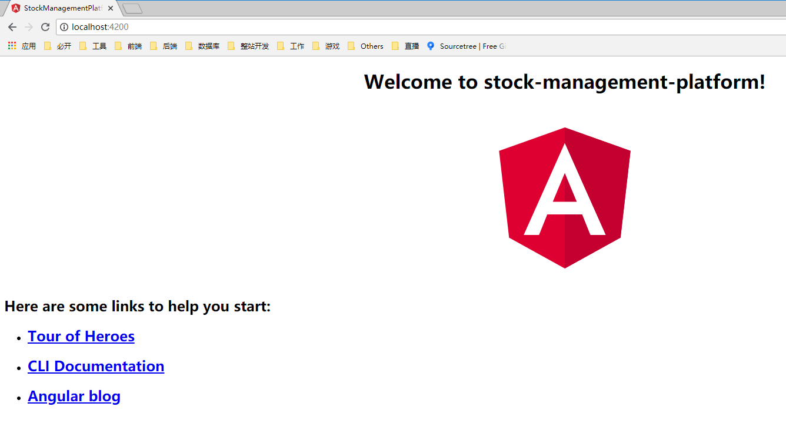
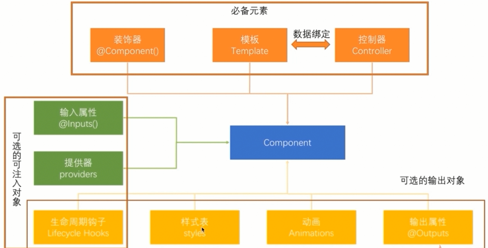

Angular开发手册 - 0 - 前言
===

> create by **jsliang** on **2018年9月5日17:28:51**   
> Recently revised in **2018年9月6日16:47:36**

## 前言

AngularJS 诞生于 2009 年，由 Misko Hevery 等人创建，后为 Google 所收购。是一款优秀的前端 JS 框架，已经被用于 Google 的多款产品当中。

AngularJS 有着诸多特性，最为核心的是：MVVM、模块化、自动化双向数据绑定、语义化标签、依赖注入等等。

## 目录

| 章节名 | 导航                                |
| ------ | ----------------------------------- |
| 第一章 | [介绍](./stock-management-platform-chapter1.md) |
| 第二章 | [开始 Angular 开发](./stock-management-platform-chapter2.md) |
| 第三章 | [路由和导航](./stock-management-platform-chapter3.md) |
| 第四章 | [依赖注入](./stock-management-platform-chapter4.md) |
| 第五章 | [绑定、响应式编程和管道](./stock-management-platform-chapter5.md) |
| 第六章 | [组件间通讯](./stock-management-platform-chapter6.md) |
| 第七章 | [表单处理](./stock-management-platform-chapter7.md) |
| 第八章 | [与服务器通讯](./stock-management-platform-chapter8.md) |
| 第九章 | [构建和部署](./stock-management-platform-chapter9.md) |

## 第一章 - 介绍

Angular 是一个开发平台。它能帮你更轻松的构建 Web 应用。Angular 集声明式模板、依赖注入、端到端工具和一些最佳实践于一身，为你解决开发方面的各种挑战。Angular 为开发者提升构建 Web、手机或桌面应用的能力。

### 1.1 Angular 的优点

* 跨平台
1. 渐进式应用：充分利用现代 Web 平台的各种能力，提供 App 式体验。高性能、离线使用、免安装。
2. 原生：借助来自Ionic、NativeScript和React Native中的技术与思想，构建原生移动应用。
3. 桌面：借助你已经在Web开发中学过的能力，结合访问原生操作系统API的能力，创造能在桌面环境下安装的应用，横跨Mac、Windows和Linux平台。

* 速度与性能
1. 代码生成：Angular会把你的模板转换成代码，针对现代JavaScript虚拟机进行高度优化，轻松获得框架提供的高生产率，同时又能保留所有手写代码的优点。
2. 统一平台：在服务端渲染应用的首屏，像只有HTML和CSS的页面那样几乎瞬间展现，支持 Node.js®、.NET、PHP，以及其它服务器，为通过SEO来优化站点铺平了道路。
3. 代码拆分：借助新的组件路由器，Angular可以实现快速加载。自动代码拆分机制可以让用户仅仅加载那些用于渲染所请求页面的代码。

* 生产率
1. 模板：通过简单而强大的模板语法，快速创建UI视图。
2. Angular CLI：命令行工具：快速进入构建环节、添加组件和测试，然后立即部署。
3. 各种 IDE：在常用IDE和编辑器中获得智能代码补全、实时错误反馈及其它反馈等特性。

* 完整开发故事
1. 测试：使用Karma进行单元测试，让你在每次存盘时都能立即知道是否弄坏了什么。Protractor则让你的场景测试运行得又快又稳定。
2. 动画：通过Angular中直观简便的API创建高性能复杂编排和动画时间线 —— 只要非常少的代码。
3. 可访问性：通过支持ARIA的组件、开发者指南和内置的一体化测试基础设施，创建具有完备可访问性的应用。

### 1.2 AngularJS 架构与 Angular 架构

* AngularJS 的架构：


* 为何 AngularJS 被抛弃
1. 饱受诟病的性能问题。通过检查进行数据更新，当数据不断增加时，检查的效率就不断降低。页面加载速度也会变慢。
2. 落后于当前web发展理念(如组件式的开发)
3. 对手机端的支持不是太友好。由于angularJS是09年诞生的，因此并没有考虑到手机端的适配，首先是性能问题，手机平台的硬件资远远比不上电脑平台。

于是，就有了 Angular 的开发：


* 组件( Component )：是 Angular 应用的基本构建块，可以把一个组件理解为一段带有业务逻辑和数据的HTML
* 服务：用来封装可重用的业务逻辑
* 指令：允许你向 HTML 元素添加自定义行为
* 模块：将应用中不同部分组织成一个 Angular 框架可以理解的单页。

## 第二章 - 开始 Angular 开发

### 2.1 安装 Angular

* 安装 Angular-cli ：`npm i @angular/cli -g`
* 新建 Angular 项目：`ng new project`
* 安装 Node 依赖：`npm i`
* 运行 Angular 项目：`npm run start`



### 2.2 Angular-CLI 目录介绍

```
+ e2e —— 自动化配置文件及用例 demo，自动测试使用
+ node_modules —— 安装依赖包
+ src —— 项目文件目录
    + app —— 应用组件和模块
        - app.component.css —— 根组件样式
        - app.component.html —— 根组件页面
        - app.component.spec.ts —— 测试用例的例子
        - app.component.ts —— 根组件
        - app.module.ts —— 根模块
    + assets —— 静态文件目录，图片、第三方库等
        - .gitkeep —— assets 目录用于存放图片等静态资源文件，构建时会拷贝到发布包里。新创建时一般为空，由于 git 会忽略空文件夹，放置 .gitkeep 这个空文件可以保证目录得到管理
    + environments —— 开发模式和生产模式的配置文件，可以将接口的路径写在这里
        - environment.prod.ts —— 生产环境
        - environment.ts —— 开发环境
    - browserslist —— 该项目的浏览器兼容情况
    - favicon.ico —— 项目页面迷你小图标
    - index.html —— 启动页
    - karma.conf.js —— karma 是单元测试的执行器，karma.conf.js 是 karma 的配置文件
    - main.ts —— 入口文件
    - polyfills.ts —— 兼容性，可以根据需要开放兼容 IE10 和 ES6、 ES7 的语法
    - style.css —— 全局样式
    - test.ts —— 测试用例
    - tsconfig.app.json —— typescript 配置文件
    - tsconfig.spec.json —— typescript 配置文件
    - tslint.json —— tslint 语法校验配置文件
- .editorconfig —— editorconfig 配置文件，规范开发用的
- .gitignore —— git 忽略文件，配置 .gitignore 可以忽略诸如 node_modules 此类的包
- angular.json —— angular 配置文件
- package.json —— 项目依赖配置文件，npm 根据该文件安装依赖包
- README.md —— 初始化新手教程，其实就是官方的 readMe
- tsconfig.json —— typescript 配置文件
- tslint.json —— tslint 语法校验配置文件
```

### 2.3 Angular 运行流程

在我们启动 `npm run start` 的过程中，Angular 做了什么事呢？这边我们讲解下：

1. 首先，Angular-CLI 根据 `npm run start`，打开 **package.json** 这个文件：

> package.json

```
{
  "name": "stock-management-platform",
  "version": "0.0.0",
  "scripts": {
    "ng": "ng",
    "start": "ng serve",
    "build": "ng build",
    "test": "ng test",
    "lint": "ng lint",
    "e2e": "ng e2e"
  },
  "private": true,
  "dependencies": {
    "@angular/animations": "^6.1.0",
    "@angular/common": "^6.1.0",
    "@angular/compiler": "^6.1.0",
    "@angular/core": "^6.1.0",
    "@angular/forms": "^6.1.0",
    "@angular/http": "^6.1.0",
    "@angular/platform-browser": "^6.1.0",
    "@angular/platform-browser-dynamic": "^6.1.0",
    "@angular/router": "^6.1.0",
    "core-js": "^2.5.4",
    "rxjs": "^6.0.0",
    "zone.js": "~0.8.26"
  },
  "devDependencies": {
    "@angular-devkit/build-angular": "~0.7.0",
    "@angular/cli": "~6.1.5",
    "@angular/compiler-cli": "^6.1.0",
    "@angular/language-service": "^6.1.0",
    "@types/jasmine": "~2.8.6",
    "@types/jasminewd2": "~2.0.3",
    "@types/node": "~8.9.4",
    "codelyzer": "~4.2.1",
    "jasmine-core": "~2.99.1",
    "jasmine-spec-reporter": "~4.2.1",
    "karma": "~1.7.1",
    "karma-chrome-launcher": "~2.2.0",
    "karma-coverage-istanbul-reporter": "~2.0.0",
    "karma-jasmine": "~1.1.1",
    "karma-jasmine-html-reporter": "^0.2.2",
    "protractor": "~5.4.0",
    "ts-node": "~5.0.1",
    "tslint": "~5.9.1",
    "typescript": "~2.7.2"
  }
}

```   

然后发现这文件告诉 Angular-CLI，执行 `ng serve`，即 `npm run start` === `ng serve`。然后，它定义了主入口为 **main.js**，那么，我们以此寻找，发现有个 **main.ts**，可以想到是 TypeScript 编译成 JavaScript，所以我们首先打开 **main.ts** 进行查看。

2. 在 **main.ts** 中：

> main.ts

```
// 关闭 Angular 的开发模式
import { enableProdMode } from '@angular/core';
// 使用哪个模块来启动应用
import { platformBrowserDynamic } from '@angular/platform-browser-dynamic';
// 导入主模块
import { AppModule } from './app/app.module';
// 导入环境配置
import { environment } from './environments/environment';

// 如果是生产环境，就调用下面方法
if (environment.production) {
  enableProdMode();
}

// 设置启动模块为 AppModule
platformBrowserDynamic().bootstrapModule(AppModule)
  .catch(err => console.log(err));
```

我们可以看到，它设置了启动模块为 APPModule ，所以，我们通过路径 src/app/app.module 找到 **app.module.ts** 这个文件。

3. 我们打开 **app.module.ts** ：

```
// 这是 Angular 的模块文件

import { BrowserModule } from '@angular/platform-browser';
import { NgModule } from '@angular/core';

import { AppComponent } from './app.component';

@NgModule({
  // 声明模块、指令以及管道
  declarations: [
    // 模块组件： AppComponent
    AppComponent
  ],
  // 导入的模块
  imports: [
    // 浏览器模块
    BrowserModule
  ],
  // 模块中提供的服务
  providers: [],
  // 声明模块主组件
  bootstrap: [AppComponent]
})

export class AppModule { }
```

在这里，我们可以看到它的主组件为 AppComponent ，所以我们找到 AppComponent 的路径为 src/app/app.component.ts ，因此我们打开该文件。

4. 我们打开 **app.component.ts** ：

```
// 从 angular 核心中引用 Component 这个装饰器
import { Component } from '@angular/core';

// 定义装饰器
@Component({
  selector: 'app-root', // 挂载 dom 节点
  templateUrl: './app.component.html', // 模板 html 文件
  styleUrls: ['./app.component.css'] // 模板 css 样式文件
})

// 控制器
export class AppComponent {
  title = '股票管理平台'; // AppComponent 控制器有个 title 值
}
```

OK，从装饰器中我们可以看到，我们这个组件，挂载到 **index.html** 的 app-root 这个节点中，而且其模板文件由 **app.component.html** 与 **app.component.css** 这两个文件形成。

5. 由此，我们知道，通过编写 **app.component.html** 和 **app.component.css** ，我们形成了一个 app 的组件(可以看成为一块 HTML 片段，而 index.html 是一个页面)，挂载到 **index.html** 中。这样，我们就能够编写SPA模式的页面了。

> 模拟的 index.html

```
<!doctype html>
<html lang="en">
<head>
  <meta charset="utf-8">
  <title>股票管理平台</title>
  <base href="/">
  <meta name="viewport" content="width=device-width, initial-scale=1">
</head>
<body>
  <!-- <app-root></app-root> -->
  <!-- 替换为 app.component.html 这个文件 -->
  <div style="text-align:center">
    <h1>
        <!-- 下面使用了 app.component.ts 中控制器返回的值，这里使用插值表达式进行了数据绑定 -->
        欢迎来到{{ title }}!
    </h1>
    
  </div>
  <!-- app.component.css 样式写到 app.component.html 中 -->
  <!-- style.css 样式写到 index.html 中 -->
</body>
</html>
```

### 2.4 Angular 组件




> <a rel="license" href="http://creativecommons.org/licenses/by-nc-sa/4.0/"></a><br /><span xmlns:dct="http://purl.org/dc/terms/" property="dct:title">jsliang的文档库</span> 由 <a xmlns:cc="http://creativecommons.org/ns#" href="https://github.com/LiangJunrong/document-library" property="cc:attributionName" rel="cc:attributionURL">梁峻荣</a> 采用 <a rel="license" href="http://creativecommons.org/licenses/by-nc-sa/4.0/">知识共享 署名-非商业性使用-相同方式共享 4.0 国际 许可协议</a>进行许可。<br />基于<a xmlns:dct="http://purl.org/dc/terms/" href="https://github.com/LiangJunrong/document-library" rel="dct:source">https://github.com/LiangJunrong/document-library</a>上的作品创作。<br />本许可协议授权之外的使用权限可以从 <a xmlns:cc="http://creativecommons.org/ns#" href="https://creativecommons.org/licenses/by-nc-sa/2.5/cn/" rel="cc:morePermissions">https://creativecommons.org/licenses/by-nc-sa/2.5/cn/</a> 处获得。