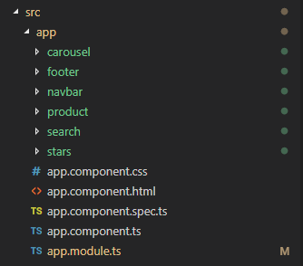

# Angular开发手册 - 3 - 开发准备
> create by **jsliang** on **2018年9月5日17:37:31**  
> Recently revised in **2018年9月7日10:18:32**

## 开发准备

## 3.1 安装依赖
1. 安装引用 jquery 和 bootstrap：
```
<!doctype html>
<html lang="en">
<head>
  <meta charset="utf-8">
  <title>股票管理平台</title>
  <base href="/">
  <meta name="viewport" content="width=device-width, initial-scale=1">
  <link href="https://cdn.bootcss.com/bootstrap/4.1.1/css/bootstrap.min.css" rel="stylesheet">
</head>
<body>
  <app-root></app-root>

  <script src="https://cdn.bootcss.com/jquery/3.3.1/jquery.min.js"></script>
  <script src="https://cdn.bootcss.com/bootstrap/4.1.1/js/bootstrap.min.js"></script>
</body>
</html>
```
2. 安装 TS 类型描述文件： `npm i @types/jquery @types/bootstrap -D` (由于 TypeScript 中不支持 $ ，所以我们需要先安装类型描述文件，让 TypeScript 认识 jQuery 和 Bootstrap ，以免它报错)

### 3.2 新建组件
1. 新建导航栏组件： `ng g component navbar`
2. 新建尾部组件： `ng g component footer`
3. 查询表单组件： `ng g component search`
4. 新建轮播图组件： `ng g component carousel`
5. 新建产品信息组件： `ng g component product`
6. 新建星级评价组件： `ng g component stars`
7. 查看是否有生成新的组件：



8. 此时，发现 **app.module.ts** 变为：
```
// 这是 Angular 的模块文件

import { BrowserModule } from '@angular/platform-browser';
import { NgModule } from '@angular/core';

import { AppComponent } from './app.component';
import { NavbarComponent } from './navbar/navbar.component';
import { FooterComponent } from './footer/footer.component';
import { SearchComponent } from './search/search.component';
import { CarouselComponent } from './carousel/carousel.component';
import { ProductComponent } from './product/product.component';
import { StarsComponent } from './stars/stars.component';

@NgModule({
  // 声明模块、指令以及管道
  declarations: [
    //,
    NavbarComponent,
    FooterComponent,
    SearchComponent,
    CarouselComponent,
    ProductComponent,
    StarsComponent,
    AppComponent
  ],
  // 导入的模块
  imports: [
    // 浏览器模块
    BrowserModule
  ],
  // 模块中提供的服务
  providers: [],
  // 声明模块主组件
  bootstrap: [AppComponent]
})

export class AppModule { }
```

### 开始开发
> app.component.html
```
<app-navbar></app-navbar>
<div class="container">
  <div class="row">
    <div class="col-md-3">
      <app-search></app-search>
    </div>
    <div class="col-md-9">
      <div class="row">
        <app-carousel></app-carousel>
      </div>
      <div class="row">
        <app-product></app-product>
      </div>
    </div>
  </div>
</div>
<app-footer></app-footer>
```

<br>

> <a rel="license" href="http://creativecommons.org/licenses/by-nc-sa/4.0/"></a><br /><span xmlns:dct="http://purl.org/dc/terms/" property="dct:title">jsliang的文档库</span> 由 <a xmlns:cc="http://creativecommons.org/ns#" href="https://github.com/LiangJunrong/document-library" property="cc:attributionName" rel="cc:attributionURL">梁峻荣</a> 采用 <a rel="license" href="http://creativecommons.org/licenses/by-nc-sa/4.0/">知识共享 署名-非商业性使用-相同方式共享 4.0 国际 许可协议</a>进行许可。<br />基于<a xmlns:dct="http://purl.org/dc/terms/" href="https://github.com/LiangJunrong/document-library" rel="dct:source">https://github.com/LiangJunrong/document-library</a>上的作品创作。<br />本许可协议授权之外的使用权限可以从 <a xmlns:cc="http://creativecommons.org/ns#" href="https://creativecommons.org/licenses/by-nc-sa/2.5/cn/" rel="cc:morePermissions">https://creativecommons.org/licenses/by-nc-sa/2.5/cn/</a> 处获得。