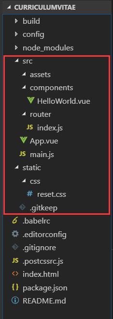
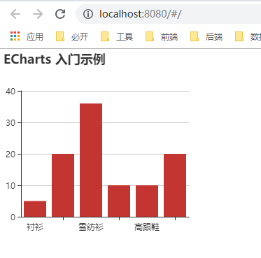
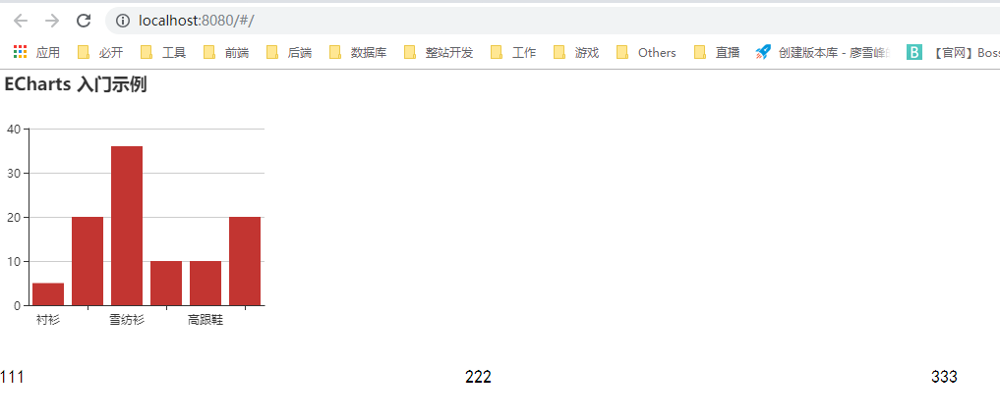
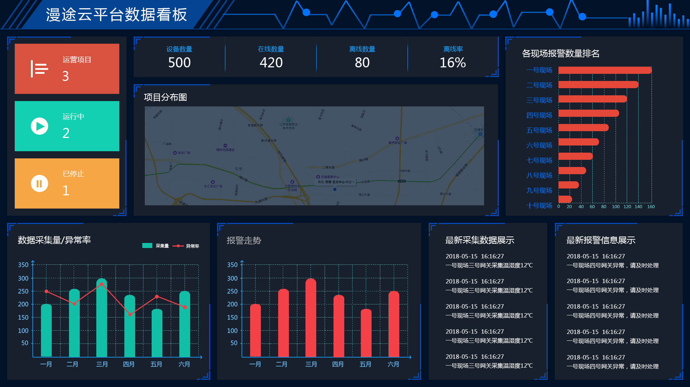

ECharts 打造在线个人简历
===

> Create by **jsliang** on **2018-12-5 11:48:56**  
> Recently revised in **2018-12-5 15:34:20**

<br>

&emsp;**Hello 小伙伴们，如果觉得本文还不错，记得点个赞或者给个 star，你们的赞和 star 是我编写更多更精彩文章的动力！[GitHub 地址](https://github.com/LiangJunrong/document-library/blob/master/JavaScript-library/ECharts/CurriculumVitae.md)**

<br>

&emsp;互联网冬天？裁员？跳槽？  
&emsp;最近频繁听到身边朋友跳槽的声音，然后帮忙改了几份简历，结果嘛，enmmm......  
&emsp;咱使用 Vue + ECharts + ElementUI 来打造份在线个人简历吧！  
&emsp;涉及技术：

* Vue
* Vue-Router
* ECharts
* ElementUI
* HTML/HTML5
* CSS/CSS3
* JS/ES6

<br>

# <a name="chapter-one" id="chapter-one">一 目录</a>

&emsp;**不折腾的前端，和咸鱼有什么区别**

| 目录 |                                                                             
| --- | 
| [一 目录](#chapter-one) | 
| <a name="catalog-chapter-two" id="catalog-chapter-two"></a>[二 前言](#chapter-two) |
| <a name="catalog-chapter-three" id="catalog-chapter-three"></a>[三 整体搭建](#chapter-three) |
| &emsp;<a name="catalog-chapter-three-one" id="catalog-chapter-three-one"></a>[3.1 基础配置](#chapter-three-one) |
| &emsp;<a name="catalog-chapter-three-two" id="catalog-chapter-three-two"></a>[3.2 安装 ECharts](#chapter-three-two) |
| &emsp;<a name="catalog-chapter-three-three" id="catalog-chapter-three-three"></a>[3.3 安装 ElementUI](#chapter-three-three) |
| &emsp;<a name="catalog-chapter-three-four" id="catalog-chapter-three-four"></a>[3.4 总体配置](#chapter-three-four) |
| <a name="catalog-chapter-four" id="catalog-chapter-four"></a>[四 分步实现](#chapter-four) |
| &emsp;<a name="catalog-chapter-four-one" id="catalog-chapter-four-one"></a>[4.1 part1 - 基本信息](#chapter-four-one) |
| &emsp;<a name="catalog-chapter-four-two" id="catalog-chapter-four-two"></a>[4.2 part2 - 好友分布](#chapter-four-two) |
| &emsp;<a name="catalog-chapter-four-three" id="catalog-chapter-four-three"></a>[4.3 part3 - 技能特长](#chapter-four-three) |
| &emsp;<a name="catalog-chapter-four-four" id="catalog-chapter-four-four"></a>[4.4 part4 - 工作经验](#chapter-four-four) |
| &emsp;<a name="catalog-chapter-four-five" id="catalog-chapter-four-five"></a>[4.5 part5 - 前端研发](#chapter-four-five) |
| &emsp;<a name="catalog-chapter-four-six" id="catalog-chapter-four-six"></a>[4.6 part6 - 自学旅途](#chapter-four-six) |
| &emsp;<a name="catalog-chapter-four-seven" id="catalog-chapter-four-seven"></a>[4.7 part7 - 求职意向](#chapter-four-seven) |

<br>

# <a name="chapter-two" id="chapter-two">二 前言</a>

> [返回目录](#catalog-chapter-two)

<br>

&emsp;在使用 Vue + ECharts 编写公司报表项目的时候，突如其来，想到可以写个在线简历。  
&emsp;**于是，就去做了。**  
&emsp;文章中的见解仅代表个人观点，不代表 “最优想法”，请文明评论、科学参考。  
&emsp;如有更好建议，可加 **jsliang** 的文档库 QQ 群：`798961601`。  
&emsp;谢谢~

<br>

# <a name="chapter-three" id="chapter-three">三 整体搭建</a>

> [返回目录](#catalog-chapter-three)

<br>

&emsp;工欲善其事，必先利其器。  
&emsp;在我们进行愉快折腾之前，我们需要将代码的环境搭建好，才能如鱼得水更好地开发。

<br>

## <a name="chapter-three-one" id="chapter-three-one">3.1 基础配置</a>

> [返回目录](#catalog-chapter-three-one)

<br>

&emsp;首先，我们在指定目录下，通过控制台（终端）新建一个 `Vue-Cli` 项目：

* `vue init webpack`


&emsp;然后，我们使用 `npm i` 安装 `Vue-Cli` 的依赖，生成 `node_modules` 文件夹。  
&emsp;最后，我们引入 `CSS reset`，并清理下红框内文件，之后项目变为如下所示：



&emsp;此刻我们的一些文件发生了变动：

> HelloWorld.vue

```
<template>
  <div class="hello">
    
  </div>
</template>

<script>
export default {
  name: 'HelloWorld',
  data () {
    return {
      
    }
  }
}
</script>

<style scoped>

</style>
```

<br>

> App.vue

```
<template>
  <div id="app">
    <router-view/>
  </div>
</template>

<script>
export default {
  name: 'App'
}
</script>

<style>

</style>
```

<br>

> main.js

```
import Vue from 'vue'
import App from './App'
import router from './router'

Vue.config.productionTip = false

// 引入样式重置
import '../static/css/reset.css'

new Vue({
  el: '#app',
  router,
  components: { App },
  template: '<App/>'
})
```

<br>

> reset.css

```
/* 
  * reset 的目的不是让默认样式在所有浏览器下一致，而是减少默认样式有可能带来的问题。
  * The purpose of reset is not to allow default styles to be consistent across all browsers, but to reduce the potential problems of default styles.
  * create by jsliang
*/

/** 清除内外边距 - clearance of inner and outer margins **/
body, h1, h2, h3, h4, h5, h6, hr, p, blockquote, /* 结构元素 - structural elements */
dl, dt, dd, ul, ol, li, /* 列表元素 - list elements */
pre, /* 文本格式元素 - text formatting elements */
form, fieldset, legend, button, input, textarea, /* 表单元素 - from elements */
th, td /* 表格元素 - table elements */ {
  margin: 0;
  padding: 0;
}

/** 设置默认字体 - setting the default font **/
body, button, input, select, textarea {
  font: 18px/1.5 '黑体', Helvetica, sans-serif;
}
h1, h2, h3, h4, h5, h6, button, input, select, textarea { font-size: 100%; }

/** 重置列表元素 - reset the list element **/
ul, ol { list-style: none; }

/** 重置文本格式元素 - reset the text format element **/
a, a:hover { text-decoration: none; }

/** 重置表单元素 - reset the form element **/
button { cursor: pointer; }
input { font-size: 18px; outline: none; }

/** 重置表格元素 - reset the table element **/
table { border-collapse: collapse; border-spacing: 0; }

/** 图片自适应 - image responsize **/
img { border: 0; display: inline-block; width: 100%; max-width: 100%; height: auto; vertical-align: middle; }

/* 
    * 默认box-sizing是content-box，该属性导致padding会撑大div，使用border-box可以解决该问题
    * set border-box for box-sizing when you use div, it solve the problem when you add padding and don't want to make the div width bigger
*/
div, input { box-sizing: border-box; }

/** 清除浮动 - clear float **/
.jsliang-clear:after, .clear:after {
  content: '\20';
  display: block;
  height: 0;
  clear: both;
}
.jsliang-clear, .clear {
  *zoom: 1;
}

/** 设置input的placeholder - set input placeholder **/
input::-webkit-input-placeholder { color: #919191; font-size: .26rem } /* Webkit browsers */
input::-moz-placeholder { color: #919191; font-size: .26rem } /* Mozilla Firefox */
input::-ms-input-placeholder { color: #919191; font-size: .26rem } /* Internet Explorer */
```

&emsp;当然，怕小伙伴们嫌麻烦，直接上传了基础代码：  
&emsp;[ECharts 打造在线个人简历分支 - 基础配置](https://github.com/LiangJunrong/CurriculumVitae/tree/basic-configuration)

<br>

## <a name="chapter-three-two" id="chapter-three-two">3.2 安装 ECharts</a>

> [返回目录](#catalog-chapter-three-two)

<br>

&emsp;**首先**，我们在项目中安装 ECharts 依赖：

```
npm i echarts -S
```

&emsp;**然后**，你可以选择按需引用还是全局引用（个人建议使用按需引用）：

1. **全局引用**

&emsp;ECharts 初始化应在钩子函数 `mounted()` 中，这个钩子函数是在 `el` 被新创建的 `vm.$el` 替换，并挂载到实例上去之后调用。

> 项目/src/main.js

```
import Vue from 'vue'
import App from './App'
import router from './router'

// 引入echarts
import echarts from 'echarts'
Vue.prototype.$echarts = echarts

Vue.config.productionTip = false

new Vue({
  el: '#app',
  router,
  components: { App },
  template: '<App/>'
})
```

<br>

> 项目/src/components/HelloWorld.vue

```
<template>
  <div>
    <div id="myChart" :style="{width: '300px', height: '300px'}"></div>
  </div>
</template>

<script>
export default {
  name: 'hello',
  data () {
    return {
      msg: 'Welcome to Your Vue.js App'
    }
  },
  mounted(){
    this.drawLine();
  },
  methods: {
    drawLine(){
        // 基于准备好的dom，初始化echarts实例
        let myChart = this.$echarts.init(document.getElementById('myChart'))
        // 绘制图表
        myChart.setOption({
            title: { text: '在Vue中使用echarts' },
            tooltip: {},
            xAxis: {
                data: ["衬衫","羊毛衫","雪纺衫","裤子","高跟鞋","袜子"]
            },
            yAxis: {},
            series: [{
                name: '销量',
                type: 'bar',
                data: [5, 20, 36, 10, 10, 20]
            }]
        });
    }
  }
}
</script>

<style scoped>

</style>
```

<br>

2. **按需引用**

&emsp;如果我们使用全局引用。将 ECharts 图表打包，会导致体积过大，所以项目中最好按需引入。  
&emsp;在这里我们使用 `requrie` 引用而不是 `import`，是因为 `import` 必须写全路径，比较麻烦。

> 项目/src/components/HelloWorld.vue

```
<template>
  <div>
    <div id="myChart" :style="{width: '300px', height: '300px'}"></div>
  </div>
</template>

<script>
  // 引入基本模板
  let echarts = require("echarts/lib/echarts");
  // 引入柱状图组件
  require("echarts/lib/chart/bar");
  // 引入提示框和title组件
  require("echarts/lib/component/tooltip");
  require("echarts/lib/component/title");
  export default {
    name: 'hello',
    data() {
      return {
        msg: 'Welcome to Your Vue.js App'
      }
    },
    mounted() {
      this.drawLine();
    },
    methods: {
      drawLine() {
        // 基于准备好的dom，初始化echarts实例
        let myChart = echarts.init(document.getElementById('myChart'))
        // 绘制图表
        myChart.setOption({
          title: { text: 'ECharts 入门示例' },
          tooltip: {},
          xAxis: {
            data: ["衬衫", "羊毛衫", "雪纺衫", "裤子", "高跟鞋", "袜子"]
          },
          yAxis: {},
          series: [{
            name: '销量',
            type: 'bar',
            data: [5, 20, 36, 10, 10, 20]
          }]
        });
      }
    }
  };
</script>

<style scoped>

</style>
```

<br>

&emsp;**最后**，我们只需要 `npm run dev` 启动项目，打开 `localhost:8080` 即可：



<br>

## <a name="chapter-three-three" id="chapter-three-three">3.3 安装 ElementUI</a>

> [返回目录](#catalog-chapter-three-three)

<br>

&emsp;考虑到 UI 是我，开发还是我。  
&emsp;那么，尽情使用 UI 框架吧！这里偷懒用 ElementUI 咯。  
&emsp;然后，为了使项目尽可能小巧，**jsliang** 打算按需引入 ElementUI：

1. 安装 ElementUI：`npm i element-ui -S`
2. 安装 babel-plugin-component：`npm i babel-plugin-component -D`
3. 修改 .babelrc：

> .babelrc

```
{
  "presets": [
    ["env", {
      "modules": false,
      "targets": {
        "browsers": ["> 1%", "last 2 versions", "not ie <= 8"]
      }
    }],
    "stage-2"
  ],
  "plugins": [
    "transform-vue-jsx", 
    "transform-runtime",
    [
      "component",
      {
        "libraryName": "element-ui",
        "styleLibraryName": "theme-chalk"
      }
    ]
  ]
}
```

4. 按需引入 `Row` 与 `Col`：

> main.js

```
import Vue from 'vue'
import App from './App'
import router from './router'

Vue.config.productionTip = false

// 引入样式重置
import '../static/css/reset.css'

// 引入及使用 ElementUI
import {Row, Col} from 'element-ui';
Vue.use(Row).use(Col);

new Vue({
  el: '#app',
  router,
  components: { App },
  template: '<App/>'
})
```

&emsp;这样，就可以在项目中使用这两个组件了：

> 项目/src/components/HelloWorld.vue 代码片段

```
<template>
  <div>
    <div id="myChart" :style="{width: '300px', height: '300px'}"></div>
    <el-row>
      <el-col :span="8">111</el-col>
      <el-col :span="8">222</el-col>
      <el-col :span="8">333</el-col>
    </el-row>
  </div>
</template>
```



<br>

## <a name="chapter-three-four" id="chapter-three-four">3.4 总体配置</a>

> [返回目录](#catalog-chapter-three-four)

<br>

&emsp;该需要的东东，都准备好了。  
&emsp;那么，我们的简历，长啥样呢？



&emsp;如图，这是 **jsliang** 下载下来的一个 ECharts 图。  
&emsp;然后，怕小伙伴们难以理解，我用 PS 修改下吧：


&emsp;很好，总体环境一目了然了：简历分为 7 个部分。  
&emsp;下面我们开始切图仔工作：


<br>

# <a name="chapter-four" id="chapter-four">四 分步实现</a>

> [返回目录](#catalog-chapter-four)

<br>

&emsp;**提问**：简历一般有什么内容？  
&emsp;**回答**：

1. 基本信息：姓名、工作年限、学历、格言、年龄、联系电话、电子邮箱、GitHub、掘金……
2. 求职意向：职位、城市、薪资、入职时间……
3. 工作经验：……
4. 个人技能：熟悉 HTML5、CSS3、JavaScript……
5. 教育背景/荣誉证书（没有出彩的话，**jsliang** 就建议忽略不写了）

&emsp;所以，我们就着这几方面来编写我们的简历。

<br>

## <a name="chapter-four-one" id="chapter-four-one">4.1 part1 - 基本信息</a>

> [返回目录](#catalog-chapter-four-one)

<br>

&emsp;

<br>

## <a name="chapter-four-two" id="chapter-four-two">4.2 part2 - 好友分布</a>

> [返回目录](#catalog-chapter-four-two)

<br>

&emsp;

<br>

## <a name="chapter-four-three" id="chapter-four-three">4.3 part3 - 技能特长</a>

> [返回目录](#catalog-chapter-four-three)

<br>

&emsp;

<br>

## <a name="chapter-four-four" id="chapter-four-four">4.4 part4 - 工作经验</a>

> [返回目录](#catalog-chapter-four-four)

<br>

&emsp;

<br>

## <a name="chapter-four-five" id="chapter-four-five">4.5 part5 - 前端研发</a>

> [返回目录](#catalog-chapter-four-five)

<br>

&emsp;

<br>

## <a name="chapter-four-six" id="chapter-four-six">4.6 part6 - 自学旅途</a>

> [返回目录](#catalog-chapter-four-six)

<br>

&emsp;

<br>

## <a name="chapter-four-seven" id="chapter-four-seven">4.7 part7 - 求职意向</a>

> [返回目录](#catalog-chapter-four-seven)

<br>

&emsp;

<br>

# 四 打赏
  
&emsp;撰文不易，如果文章对小伙伴有帮助，希望小伙伴们给勤劳敲代码、辛苦撰文的 **jsliang** 进行微信/支付宝打赏，你们的每一次打赏都是最好的鼓励，谢谢~


<br>

> <a rel="license" href="http://creativecommons.org/licenses/by-nc-sa/4.0/"></a><br /><span xmlns:dct="http://purl.org/dc/terms/" property="dct:title">jsliang 的文档库</span> 由 <a xmlns:cc="http://creativecommons.org/ns#" href="https://github.com/LiangJunrong/document-library" property="cc:attributionName" rel="cc:attributionURL">梁峻荣</a> 采用 <a rel="license" href="http://creativecommons.org/licenses/by-nc-sa/4.0/">知识共享 署名-非商业性使用-相同方式共享 4.0 国际 许可协议</a>进行许可。<br />基于<a xmlns:dct="http://purl.org/dc/terms/" href="https://github.com/LiangJunrong/document-library" rel="dct:source">https://github.com/LiangJunrong/document-library</a>上的作品创作。<br />本许可协议授权之外的使用权限可以从 <a xmlns:cc="http://creativecommons.org/ns#" href="https://creativecommons.org/licenses/by-nc-sa/2.5/cn/" rel="cc:morePermissions">https://creativecommons.org/licenses/by-nc-sa/2.5/cn/</a> 处获得。
