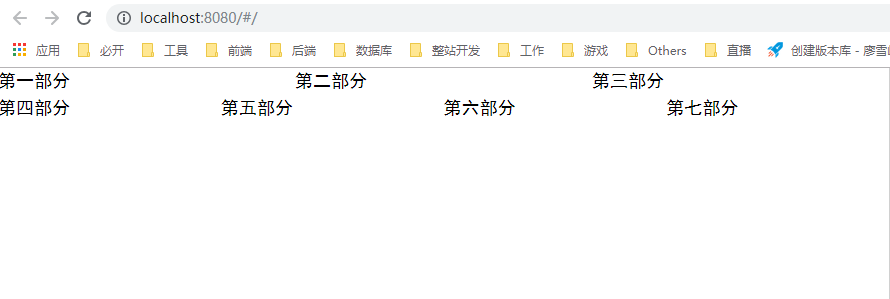
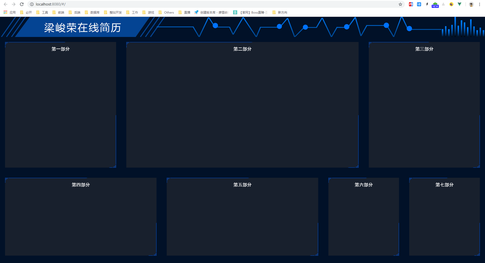
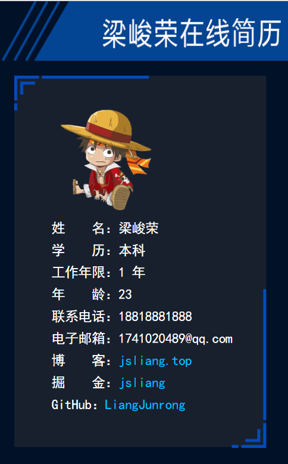
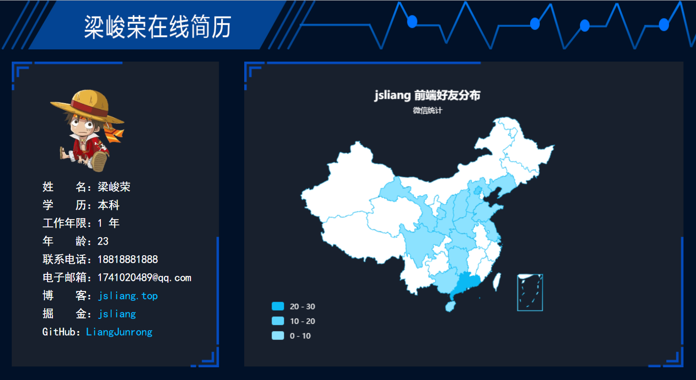
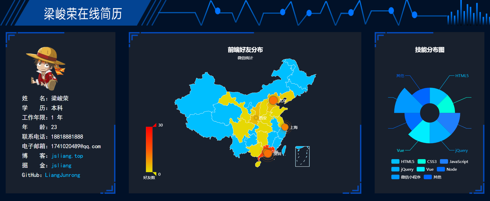
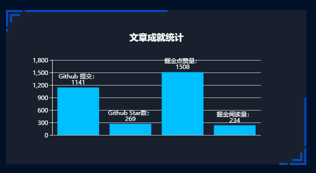
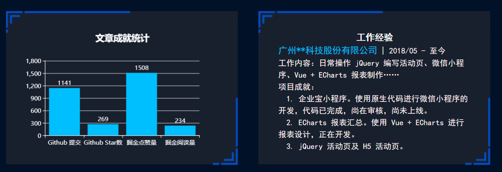

ECharts 打造在线个人简历
===

> Create by **jsliang** on **2018-12-5 11:48:56**  
> Recently revised in **2018-12-7 10:36:24**

<br>

&emsp;**Hello 小伙伴们，如果觉得本文还不错，记得点个赞或者给个 star，你们的赞和 star 是我编写更多更精彩文章的动力！[GitHub 地址](https://github.com/LiangJunrong/document-library/blob/master/JavaScript-library/ECharts/CurriculumVitae.md)**

<br>

&emsp;互联网冬天？裁员？跳槽？  
&emsp;最近频繁听身边朋友说公司裁员、员工跳槽的事情，然后帮几个还没毕业的小师弟修改了几份简历，结果嘛，enmmm......  
&emsp;咱使用 Vue + ECharts + ElementUI 来打造份在线个人简历吧！  


&emsp;涉及技术：

* Vue
* Vue-Router
* ECharts
* ElementUI
* HTML/HTML5
* CSS/CSS3
* JavaScript/ES6

<br>

# <a name="chapter-one" id="chapter-one">一 目录</a>

&emsp;**不折腾的前端，和咸鱼有什么区别**

| 目录 |                                                                             
| --- | 
| [一 目录](#chapter-one) | 
| <a name="catalog-chapter-two" id="catalog-chapter-two"></a>[二 前言](#chapter-two) |
| <a name="catalog-chapter-three" id="catalog-chapter-three"></a>[三 整体搭建](#chapter-three) |
| &emsp;<a name="catalog-chapter-three-one" id="catalog-chapter-three-one"></a>[3.1 基础配置](#chapter-three-one) |
| &emsp;<a name="catalog-chapter-three-two" id="catalog-chapter-three-two"></a>[3.2 安装 ECharts](#chapter-three-two) |
| &emsp;<a name="catalog-chapter-three-three" id="catalog-chapter-three-three"></a>[3.3 安装 ElementUI](#chapter-three-three) |
| &emsp;<a name="catalog-chapter-three-four" id="catalog-chapter-three-four"></a>[3.4 总体配置](#chapter-three-four) |
| <a name="catalog-chapter-four" id="catalog-chapter-four"></a>[四 分步实现](#chapter-four) |
| &emsp;<a name="catalog-chapter-four-one" id="catalog-chapter-four-one"></a>[4.1 part1 - 基本信息](#chapter-four-one) |
| &emsp;<a name="catalog-chapter-four-two" id="catalog-chapter-four-two"></a>[4.2 part2 - 好友分布](#chapter-four-two) |
| &emsp;<a name="catalog-chapter-four-three" id="catalog-chapter-four-three"></a>[4.3 part3 - 技能特长](#chapter-four-three) |
| &emsp;<a name="catalog-chapter-four-four" id="catalog-chapter-four-four"></a>[4.4 part4 - 文章成就](#chapter-four-four) |
| &emsp;<a name="catalog-chapter-four-five" id="catalog-chapter-four-five"></a>[4.5 part5 - 工作经验](#chapter-four-five) |
| &emsp;<a name="catalog-chapter-four-six" id="catalog-chapter-four-six"></a>[4.6 part6 - 编程技能](#chapter-four-six) |
| &emsp;<a name="catalog-chapter-four-seven" id="catalog-chapter-four-seven"></a>[4.7 part7 - 求职意向](#chapter-four-seven) |
| <a name="catalog-chapter-five" id="catalog-chapter-five"></a>[五 总结](#chapter-five) |

<br>

# <a name="chapter-two" id="chapter-two">二 前言</a>

> [返回目录](#catalog-chapter-two)

<br>

&emsp;在使用 Vue + ECharts 编写公司报表项目的时候，突如其来有个 idea，想到好像可以写个在线简历。  
&emsp;**于是，就去做了。**  
&emsp;文章中的见解仅代表个人观点，不代表 “最优想法”，请文明评论、科学参考。  
&emsp;如有更好建议，可加 **jsliang** 的文档库 QQ 群讨论：`798961601`。  
&emsp;谢谢~

<br>

# <a name="chapter-three" id="chapter-three">三 整体搭建</a>

> [返回目录](#catalog-chapter-three)

<br>

&emsp;工欲善其事，必先利其器。  
&emsp;在我们进行愉快折腾之前，我们需要将代码的环境搭建好，才能如鱼得水，更好地开发。

<br>

## <a name="chapter-three-one" id="chapter-three-one">3.1 基础配置</a>

> [返回目录](#catalog-chapter-three-one)

<br>

&emsp;首先，我们在指定目录下，通过控制台（终端）新建一个 `Vue-Cli` 项目：

* `vue init webpack`


&emsp;然后，我们使用 `npm i` 安装 `Vue-Cli` 的依赖，生成 `node_modules` 文件夹。  
&emsp;最后，我们引入 `CSS reset`，并清理下红框内文件，之后项目变为如下所示：


&emsp;此刻我们的一些文件发生了变动：

> HelloWorld.vue

```
<template>
  <div class="hello">
    
  </div>
</template>

<script>
export default {
  name: 'HelloWorld',
  data () {
    return {
      
    }
  }
}
</script>

<style scoped>

</style>
```

<br>

> App.vue

```
<template>
  <div id="app">
    <router-view/>
  </div>
</template>

<script>
export default {
  name: 'App'
}
</script>

<style>

</style>
```

<br>

> main.js

```
import Vue from 'vue'
import App from './App'
import router from './router'

Vue.config.productionTip = false

// 引入样式重置
import '../static/css/reset.css'

new Vue({
  el: '#app',
  router,
  components: { App },
  template: '<App/>'
})
```

<br>

> reset.css

```
/* 
  * reset 的目的不是让默认样式在所有浏览器下一致，而是减少默认样式有可能带来的问题。
  * The purpose of reset is not to allow default styles to be consistent across all browsers, but to reduce the potential problems of default styles.
  * create by jsliang
*/

/** 清除内外边距 - clearance of inner and outer margins **/
body, h1, h2, h3, h4, h5, h6, hr, p, blockquote, /* 结构元素 - structural elements */
dl, dt, dd, ul, ol, li, /* 列表元素 - list elements */
pre, /* 文本格式元素 - text formatting elements */
form, fieldset, legend, button, input, textarea, /* 表单元素 - from elements */
th, td /* 表格元素 - table elements */ {
  margin: 0;
  padding: 0;
}

/** 设置默认字体 - setting the default font **/
body, button, input, select, textarea {
  font: 18px/1.5 '黑体', Helvetica, sans-serif;
}
h1, h2, h3, h4, h5, h6, button, input, select, textarea { font-size: 100%; }

/** 重置列表元素 - reset the list element **/
ul, ol { list-style: none; }

/** 重置文本格式元素 - reset the text format element **/
a, a:hover { text-decoration: none; }

/** 重置表单元素 - reset the form element **/
button { cursor: pointer; }
input { font-size: 18px; outline: none; }

/** 重置表格元素 - reset the table element **/
table { border-collapse: collapse; border-spacing: 0; }

/** 图片自适应 - image responsize **/
img { border: 0; display: inline-block; width: 100%; max-width: 100%; height: auto; vertical-align: middle; }

/* 
    * 默认box-sizing是content-box，该属性导致padding会撑大div，使用border-box可以解决该问题
    * set border-box for box-sizing when you use div, it solve the problem when you add padding and don't want to make the div width bigger
*/
div, input { box-sizing: border-box; }

/** 清除浮动 - clear float **/
.jsliang-clear:after, .clear:after {
  content: '\20';
  display: block;
  height: 0;
  clear: both;
}
.jsliang-clear, .clear {
  *zoom: 1;
}

/** 设置input的placeholder - set input placeholder **/
input::-webkit-input-placeholder { color: #919191; font-size: .26rem } /* Webkit browsers */
input::-moz-placeholder { color: #919191; font-size: .26rem } /* Mozilla Firefox */
input::-ms-input-placeholder { color: #919191; font-size: .26rem } /* Internet Explorer */
```

&emsp;当然，怕小伙伴们嫌麻烦，不想敲代码。  
&emsp;所以 **jsliang** 直接上传了基础代码，需要的小伙伴直接下载即可： 

&emsp;[ECharts 打造在线个人简历分支 - 基础配置](https://github.com/LiangJunrong/CurriculumVitae/tree/basic-configuration)

<br>

## <a name="chapter-three-two" id="chapter-three-two">3.2 安装 ECharts</a>

> [返回目录](#catalog-chapter-three-two)

<br>

&emsp;既然说了用 ECharts 来写，那么，我们肯定要搞下 ECharts 的安装啦~

&emsp;**首先**，我们在项目中安装 ECharts 依赖：

```
npm i echarts -S
```

&emsp;**然后**，你可以选择按需引用还是全局引用（个人建议使用按需引用）：

1. **全局引用**

&emsp;ECharts 初始化应在钩子函数 `mounted()` 中，这个钩子函数是在 `el` 被新创建的 `vm.$el` 替换，并挂载到实例上去之后调用。

> 项目/src/main.js

```
import Vue from 'vue'
import App from './App'
import router from './router'

// 引入echarts
import echarts from 'echarts'
Vue.prototype.$echarts = echarts

Vue.config.productionTip = false

new Vue({
  el: '#app',
  router,
  components: { App },
  template: '<App/>'
})
```

<br>

> 项目/src/components/HelloWorld.vue

```
<template>
  <div>
    <div id="myChart" :style="{width: '300px', height: '300px'}"></div>
  </div>
</template>

<script>
export default {
  name: 'hello',
  data () {
    return {
      msg: 'Welcome to Your Vue.js App'
    }
  },
  mounted(){
    this.drawLine();
  },
  methods: {
    drawLine(){
        // 基于准备好的dom，初始化echarts实例
        let myChart = this.$echarts.init(document.getElementById('myChart'))
        // 绘制图表
        myChart.setOption({
            title: { text: '在Vue中使用echarts' },
            tooltip: {},
            xAxis: {
                data: ["衬衫","羊毛衫","雪纺衫","裤子","高跟鞋","袜子"]
            },
            yAxis: {},
            series: [{
                name: '销量',
                type: 'bar',
                data: [5, 20, 36, 10, 10, 20]
            }]
        });
    }
  }
}
</script>

<style scoped>

</style>
```

<br>

2. **按需引用**

&emsp;如果我们使用全局引用。将 ECharts 图表打包，会导致体积过大，所以项目中最好按需引入。  
&emsp;在这里我们使用 `requrie` 引用而不是 `import`，是因为 `import` 必须写全路径，比较麻烦。

> 项目/src/components/HelloWorld.vue

```
<template>
  <div>
    <div id="myChart" :style="{width: '300px', height: '300px'}"></div>
  </div>
</template>

<script>
  // 引入基本模板
  let echarts = require("echarts/lib/echarts");
  // 引入柱状图组件
  require("echarts/lib/chart/bar");
  // 引入提示框和title组件
  require("echarts/lib/component/tooltip");
  require("echarts/lib/component/title");
  export default {
    name: 'hello',
    data() {
      return {
        msg: 'Welcome to Your Vue.js App'
      }
    },
    mounted() {
      this.drawLine();
    },
    methods: {
      drawLine() {
        // 基于准备好的dom，初始化echarts实例
        let myChart = echarts.init(document.getElementById('myChart'))
        // 绘制图表
        myChart.setOption({
          title: { text: 'ECharts 入门示例' },
          tooltip: {},
          xAxis: {
            data: ["衬衫", "羊毛衫", "雪纺衫", "裤子", "高跟鞋", "袜子"]
          },
          yAxis: {},
          series: [{
            name: '销量',
            type: 'bar',
            data: [5, 20, 36, 10, 10, 20]
          }]
        });
      }
    }
  };
</script>

<style scoped>

</style>
```

<br>

&emsp;**最后**，我们只需要 `npm run dev` 启动项目，打开 `localhost:8080` 即可：


&emsp;当然，仅仅带进门，可能小伙伴们还可能会感觉懵逼：下一步我要怎么做？  
&emsp;所以，**jsliang** 顺带讲讲 ECharts 如何上手：

1. 照着上面案例敲一遍
2. 过一遍它的上手文档：[5 分钟上手 ECharts](http://www.echartsjs.com/tutorial.html#5%20%E5%88%86%E9%92%9F%E4%B8%8A%E6%89%8B%20ECharts)
3. 查看它的各种实例，并从自己要做的简单的图做起
4. 在步骤 3 中，碰到不懂的属性值，记得随时查看文档：[文档 - 配置项手册](http://www.echartsjs.com/option.html#title)

&emsp;如此，小伙伴们就可以更好上手 ECharts 啦~

<br>

## <a name="chapter-three-three" id="chapter-three-three">3.3 安装 ElementUI</a>

> [返回目录](#catalog-chapter-three-three)

<br>

&emsp;考虑到 UI 是我，开发还是我。  
&emsp;那么，尽情使用 UI 框架吧！这里偷懒用 ElementUI 咯。  
&emsp;然后，为了使项目尽可能小巧，**jsliang** 打算按需引入 ElementUI：

1. 安装 ElementUI：`npm i element-ui -S`
2. 安装 babel-plugin-component：`npm i babel-plugin-component -D`
3. 修改 .babelrc：

> .babelrc

```
{
  "presets": [
    ["env", {
      "modules": false,
      "targets": {
        "browsers": ["> 1%", "last 2 versions", "not ie <= 8"]
      }
    }],
    "stage-2"
  ],
  "plugins": [
    "transform-vue-jsx", 
    "transform-runtime",
    [
      "component",
      {
        "libraryName": "element-ui",
        "styleLibraryName": "theme-chalk"
      }
    ]
  ]
}
```

4. 按需引入 `Row` 与 `Col`：

> main.js

```
import Vue from 'vue'
import App from './App'
import router from './router'

Vue.config.productionTip = false

// 引入样式重置
import '../static/css/reset.css'

// 引入及使用 ElementUI
import {Row, Col} from 'element-ui';
Vue.use(Row).use(Col);

new Vue({
  el: '#app',
  router,
  components: { App },
  template: '<App/>'
})
```

&emsp;这样，就可以在项目中使用这两个组件了：

> 项目/src/components/HelloWorld.vue 代码片段

```
<template>
  <div>
    <div id="myChart" :style="{width: '300px', height: '300px'}"></div>
    <el-row>
      <el-col :span="8">111</el-col>
      <el-col :span="8">222</el-col>
      <el-col :span="8">333</el-col>
    </el-row>
  </div>
</template>
```


<br>

## <a name="chapter-three-four" id="chapter-three-four">3.4 总体配置</a>

> [返回目录](#catalog-chapter-three-four)

<br>

&emsp;该需要的东东，都差不多准备好了。  
&emsp;那么，我们的简历，长啥样呢？  
&emsp;由于手里木有成品 “参考” 和 “借鉴”，所以去网上看看别人的 ECharts 都长啥样吧：


&emsp;如图，**jsliang** 觉得这图的布局不错，所以下载下来了它的 png 版本和 psd 版本。  
&emsp;然后，怕小伙伴们难以想象要怎么操作，我用 PS 修改下它的 psd 吧：


&emsp;很好，这个在线个人简历要怎么做就一目了然了。  

&emsp;下面我们开始切图仔工作：

&emsp;**首先**，创建 7 个 `components`，并删除 `HelloWorld.vue`：


&emsp;**jsliang** 太懒，名字就懒得想了，从左到右，从上到下，依次命名 7 个框的名字为 `PartOne` 到 `PartSeven` 吧。

> PartOne.vue 代码示例

```
<template>
  <div>
    <p>第一部分</p>
  </div>
</template>

<script>
  export default {
    
  }
</script>

<style scoped>

</style>
```

> 说到这里，有的小伙伴可能觉得复制粘贴或者手写 Vue-Cli 代码特别烦，所以这里推荐使用 VS Code 的插件：`Vue VSCode Snippets`。通过在页面上敲：`vbase`，就可以快速生成 Vue-Cli 的基础代码了。

<br>

&emsp;**然后**，我们在 `index.js` 中定义这些文件，并在 `App.vue` 引用它们：

> 项目/src/router/index.js

```
import Vue from 'vue'
import Router from 'vue-router'
import PartOne from '@/components/PartOne'
import PartTwo from '@/components/PartTwo'
import PartThree from '@/components/PartThree'
import PartFour from '@/components/PartFour'
import PartFive from '@/components/PartFive'
import PartSix from '@/components/PartSix'
import PartSeven from '@/components/PartSeven'

Vue.use(Router)

export default new Router({
  routes: [
    {
      path: '/',
      components: {
        PartOne: PartOne,
        PartTwo: PartTwo,
        PartThree: PartThree,
        PartFour: PartFour,
        PartFive: PartFive,
        PartSix: PartSix,
        PartSeven: PartSeven
      }
    },
    {
      path: '/PartOne',
      name: 'PartOne',
      component: PartOne
    },
    {
      path: '/PartTwo',
      name: 'PartTwo',
      component: PartTwo
    },
    {
      path: '/PartThree',
      name: 'PartThree',
      component: PartThree
    },
    {
      path: '/PartFour',
      name: 'PartFour',
      component: PartFour
    },
    {
      path: '/PartFive',
      name: 'PartFive',
      component: PartFive
    },
    {
      path: '/PartSix',
      name: 'PartSix',
      component: PartSix
    },
    {
      path: '/PartSeven',
      name: 'PartSeven',
      component: PartSeven
    },
  ]
})
```

<br>

> 项目/src/App.vue

```
<template>
  <div class="app" id="app">
    <!-- 第一行 -->
    <el-row>
      <el-col :xs="24" :sm="24" :md="6" :lg="6" :xl="6" class="part">
        <router-view name="PartOne"/>
      </el-col>
      <el-col :xs="24" :sm="24" :md="12" :lg="12" :xl="12" class="part">
        <router-view name="PartTwo"/>
      </el-col>
      <el-col :xs="24" :sm="24" :md="6" :lg="6" :xl="6" class="part">
        <router-view name="PartThree"/>
      </el-col>
    </el-row>
    <!-- 第二行 -->
    <el-row>
      <el-col :xs="24" :sm="24" :md="8" :lg="8" :xl="8" class="part">
        <router-view name="PartFour"/>
      </el-col>
      <el-col :xs="24" :sm="24" :md="8" :lg="8" :xl="8" class="part">
        <router-view name="PartFive"/>
      </el-col>
      <el-col :xs="24" :sm="24" :md="4" :lg="4" :xl="4" class="part">
        <router-view name="PartSix"/>
      </el-col>
      <el-col :xs="24" :sm="24" :md="4" :lg="4" :xl="4" class="part">
        <router-view name="PartSeven"/>
      </el-col>
    </el-row>
  </div>
</template>

<script>
export default {
  name: 'App'
}
</script>

<style>

</style>
```

<br>

&emsp;此时，通过 `npm run dev`，我们可以在 `localhost:8080/#/` 中可以看到我们已成功进行了布局：



<br>

&emsp;**最后**，我们通过 CSS 的渲染，成功实现我们的总体布局：

> 此刻的项目结构图：


> App.vue

```
<template>
  <div class="app" id="app">
    <div class="banner">
      
      
      
    </div>
    <!-- 第一行 -->
    <el-row>
      <el-col :xs="24" :sm="24" :md="6" :lg="6" :xl="6" class="part">
        <router-view name="PartOne"/>
      </el-col>
      <el-col :xs="24" :sm="24" :md="12" :lg="12" :xl="12" class="part">
        <router-view name="PartTwo"/>
      </el-col>
      <el-col :xs="24" :sm="24" :md="6" :lg="6" :xl="6" class="part">
        <router-view name="PartThree"/>
      </el-col>
    </el-row>
    <!-- 第二行 -->
    <el-row>
      <el-col :xs="24" :sm="24" :md="8" :lg="8" :xl="8" class="part">
        <router-view name="PartFour"/>
      </el-col>
      <el-col :xs="24" :sm="24" :md="8" :lg="8" :xl="8" class="part">
        <router-view name="PartFive"/>
      </el-col>
      <el-col :xs="24" :sm="24" :md="4" :lg="4" :xl="4" class="part">
        <router-view name="PartSix"/>
      </el-col>
      <el-col :xs="24" :sm="24" :md="4" :lg="4" :xl="4" class="part">
        <router-view name="PartSeven"/>
      </el-col>
    </el-row>
  </div>
</template>

<script>
export default {
  name: "App",
  data() {
    return {
      bannerXSSM: require("./assets/img/banner_640.png"),
      bannerMD: require("./assets/img/banner_1000.png"),
      bannerLGXL: require("./assets/img/banner.png"),
    };
  }
};
</script>

<style>
body {
  background: #011128;
  color: #fff;
}
.app {
  width: 100%;
}
.part {
  padding: 20px;
}
.banner img {
  width: 100%;
  height: 80px;
}
p {
  text-align: center;
}
</style>
```

<br>

> main.js

```
import Vue from 'vue'
import App from './App'
import router from './router'

Vue.config.productionTip = false

// 引入样式重置
import '../static/css/reset.css'

// 引入 ElementUI 响应式断点
import 'element-ui/lib/theme-chalk/display.css';

// 引入及使用 ElementUI
import {Row, Col} from 'element-ui';
Vue.use(Row).use(Col);

new Vue({
  el: '#app',
  router,
  components: { App },
  template: '<App/>'
})
```

<br>

> PartOne.vue ( PartTwo 及其他 6 个文件雷同)

```
<template>
  <div class="part-one">
    <p>第一部分</p>
  </div>
</template>

<script>
export default {
  name: "partOne"
};
</script>

<style scoped>
.part-one {
  width: 100%;
  height: 500px;
  border: 15px solid transparent;
  border-image: url("~@/./assets/img/border_image.png") 30 30 stretch;
  background: #18202d;
}
</style>
```

<br>

&emsp;这样，我们就成功完成了高尚的切图仔工作，可以继续下一步咯：



&emsp;为了防止小伙伴们晕乎，保险起见 **jsliang** 将总体配置的代码提交到了分支，需要的小伙伴直接下载即可：

&emsp;[ECharts 打造在线个人简历分支 - 完整配置](https://github.com/LiangJunrong/CurriculumVitae/tree/overall-configuration)

<br>

# <a name="chapter-four" id="chapter-four">四 分步实现</a>

> [返回目录](#catalog-chapter-four)

<br>

&emsp;**提问**：简历一般有什么内容？  
&emsp;**回答**：

1. 基本信息：姓名、工作年限、学历、格言、年龄、联系电话、电子邮箱、GitHub、掘金……
2. 求职意向：职位、城市、薪资、准备入职时间……
3. 工作经验：……
4. 个人技能：熟悉 HTML5、CSS3、JavaScript……
5. 教育背景/荣誉证书（这两样没有很出彩的地方的话，**jsliang** 建议就忽略不写了）

&emsp;所以，我们就着这几方面来编写我们的简历吧~

<br>

## <a name="chapter-four-one" id="chapter-four-one">4.1 part1 - 基本信息</a>

> [返回目录](#catalog-chapter-four-one)

<br>

&emsp;话不多说，先上代码：

> PartOne.vue

```
<template>
  <div class="part-one">
    
    <p>姓&emsp;&emsp;名：梁峻荣</p>
    <p>学&emsp;&emsp;历：本科</p>
    <p>工作年限：1 年</p>
    <p>年&emsp;&emsp;龄：23</p>
    <p>联系电话：18818881888</p>
    <p>电子邮箱：1741020489@qq.com</p>
    <p>博&emsp;&emsp;客：<a href="http://jsliang.top">jsliang.top</a></p>
    <p>掘&emsp;&emsp;金：<a href="https://juejin.im/user/584613ba128fe10058b3cf68">jsliang</a></p>
    <p>GitHub：<a href="https://github.com/LiangJunrong">LiangJunrong</a></p>
  </div>
</template>

<script>
export default {
  name: "partOne",
  data() {
    return {
      headImage: require('../assets/img/head_image.png')
    }
  }
};
</script>

<style scoped>
a {
  color: deepskyblue;
}
a:hover {
  color: rgb(118, 190, 248);
}
p {
  line-height: 30px;
}
.part-one {
  width: 100%;
  height: 500px;
  border: 40px solid transparent;
  border-image: url("~@/./assets/img/border_image.png") 30 30 stretch;
  background: #18202d;
  padding-left: 10px;
}
.part-one-image {
  width: 150px;
  height: 150px;
}
</style>
```

&emsp;实现效果：



&emsp;如上，这只是个简单的信息填充，就不多说了。

<br>

## <a name="chapter-four-two" id="chapter-four-two">4.2 part2 - 好友分布</a>

> [返回目录](#catalog-chapter-four-two)

<br>

&emsp;话不多说，先上代码：

> PartTwo.vue

```
<template>
  <div class="part-two" id="part-two"></div>
</template>

<script>
// 引入基本模板
let echarts = require("echarts/lib/echarts");

// 引用中国地图
require("echarts/map/js/china.js");

export default {
  name: "partTwo",
  data() {
    return {};
  },
  mounted() {
    this.drawECharts();
  },
  methods: {
    drawECharts() {

      // 基于准备好的dom，初始化echarts实例
      let myChart = echarts.init(document.getElementById("part-two"));

      // 排行前五城市
      let myFirendCity = [
        { name: "广州", value: ["113.23", "23.16", "9"] },
        { name: "深圳", value: ["114.07", "22.62", "12"] },
        { name: "上海", value: ["121.48", "31.22", "10"] },
        { name: "西安", value: ["108.95", "34.27", "4"] },
        { name: "北京", value: ["116.46", "39.92", "12"] },
      ];

      // 好友分布省份
      let myFriendProvince = [
        { name: "山东", value: 1 },
        { name: "四川", value: 1 },
        { name: "广东", value: 21 },
        { name: "广西", value: 1 },
        { name: "北京", value: 12 },
        { name: "甘肃", value: 1 },
        { name: "上海", value: 10 },
        { name: "陕西", value: 4 },
        { name: "湖北", value: 1 },
        { name: "湖南", value: 1 },
        { name: "山西", value: 1 },
        { name: "辽宁", value: 2 },
        { name: "江苏", value: 1 },
        { name: "河北", value: 3 },
        { name: "海南", value: 1 },
        { name: "河南", value: 1 }
      ];

      myChart.setOption({
        // 标题
        title: {
          text: "前端好友分布",
          textStyle: {
            color: "#fff"
          },
          subtext: "微信统计",
          subtextStyle: {
            color: "#fff"
          },
          x: "center"
        },
        // 移动显示
        tooltip: {
          trigger: "item",
          // 鼠标移动过去显示
          formatter: function(params) {
            if (params.value[2] == undefined) {
              if(!params.name) {
                return "该地区暂无好友";
              } else {
                return params.name + " : " + params.value;
              }
            } else {
              return params.name + " : " + params.value[2];
            }
          }
        },
        // 左边注记
        visualMap: {
          text: ["", "好友数"],
          min: 0,
          max: 30,
          // 是否能通过手柄显示
          calculable: true,
          inRange: {
            color: ["#e4e004", "#ff5506", "#ff0000"]
          },
          textStyle: {
            color: "#fff"
          }
        },
        // geo
        geo: {
          map: "china"
        },
        // 数据
        series: [
          // 排行前五城市
          {
            name: "排行前五",
            type: "effectScatter",
            coordinateSystem: "geo",
            symbolSize: function(val) {
              return val[2] * 2;
            },
            showEffectOn: "render",
            rippleEffect: {
              brushType: "stroke"
            },
            hoverAnimation: true,
            label: {
              normal: {
                formatter: "{b}",
                position: "right",
                show: true,
                color: "#fff"
              }
            },
            itemStyle: {
              normal: {
                color: "#ddb926",
                shadowBlur: 10,
                shadowColor: "#333"
              }
            },
            // 类似于 z-index
            zlevel: 1,
            data: myFirendCity,
          },
          // 好友分布省份
          {
            name: "好友数",
            type: "map",
            mapType: "china",
            // 是否允许缩放
            roam: false,
            label: {
              // 显示省份标签
              normal: {
                formatter: myFirendCity,
                show: false,
                textStyle: {
                  color: "#fff"
                }
              },
              // 对应的鼠标悬浮效果
              emphasis: {
                show: false
              }
            },
            itemStyle: {
              normal: {
                borderWidth: 0.5, // 区域边框宽度
                borderColor: "#fff", // 区域边框颜色
                areaColor: "deepskyblue" // 区域颜色
              },
              // 对应的鼠标悬浮效果
              emphasis: {
                borderWidth: 1,
                borderColor: "#fff",
                areaColor: "#00aeff"
              }
            },
            // 数据
            data: myFriendProvince
          }
        ]
      });
    }
  }
};
</script>

<style scoped>
.part-two {
  width: 100%;
  height: 500px;
  border: 40px solid transparent;
  border-image: url("~@/./assets/img/border_image.png") 30 30 stretch;
  background: #18202d;
}
</style>
```

&emsp;实现效果：



&emsp;**首先**，我们引用了 ECharts 及它的中国地图：

```
let echarts = require("echarts/lib/echarts");

require("echarts/map/js/china.js");
```

&emsp;**然后**，我们初始化 DOM 和数据：

```
let myChart = echarts.init(document.getElementById("part-two"));

let myFriendData = [
  { name: "山东", value: 1 },
  { name: "四川", value: 1 },
  { name: "广东", value: 21 },
  { name: "广西", value: 1 },
  { name: "北京", value: 12 },
  { name: "甘肃", value: 1 },
  { name: "上海", value: 5 },
  { name: "陕西", value: 4 },
  { name: "湖北", value: 1 },
  { name: "湖南", value: 1 },
  { name: "山西", value: 1 },
  { name: "辽宁", value: 2 },
  { name: "江苏", value: 1 },
  { name: "河北", value: 3 },
  { name: "海南", value: 1 },
  { name: "河南", value: 1 }
];
```

&emsp;**最后**，我们通过 `setOption` 实现了地图的描绘，上面配置仅是个人配置方法，详细的方法请参考：[ECharts 配置](http://www.echartsjs.com/option.html#title)。

<br>

## <a name="chapter-four-three" id="chapter-four-three">4.3 part3 - 技能特长</a>

> [返回目录](#catalog-chapter-four-three)

<br>

&emsp;说到简历，还记得之前看过一份，印象特深，因为人家就是用 Word 中用图表展示的。所以，咱也试试：

> PartThree.vue

```
<template>
  <div class="part-three" id="part-three"></div>
</template>

<script>

// 引入基本模板
let echarts = require("echarts/lib/echarts");

export default {
  name: "partThree",
  data() {
    return {};
  },
  mounted() {
    this.drawECharts();
  },
  methods: {
    drawECharts() {
      // 基于准备好的dom，初始化echarts实例
      let myChart = echarts.init(document.getElementById("part-three"));

      myChart.setOption({
        // 标题
        title: {
          // 标题文本
          text: "技能分布图",
          // 标题样式
          textStyle: {
            color: "#fff"
          },
          // 标题位置
          x: "center"
        },
        // 移动显示
        tooltip: {
          trigger: "item",
          // 显示文字样式
          formatter: "{a} <br/>{b} : {d}%"
        },
        // 注记
        legend: {
          x: "center",
          y: "bottom",
          textStyle: {
            color: "#fff"
          },
          data: [ "HTML5", "CSS3", "JavaScript", "jQuery", "Vue", "Node", "微信小程序", "其他" ]
        },
        // 注记显示手柄
        calculable: true,
        // 图形系列
        series: [
          {
            name: "技能分布",
            type: "pie",
            radius: [30, 110],
            roseType: "area",
            data: [
              { value: 15, name: "HTML5" },
              { value: 15, name: "CSS3" },
              { value: 20, name: "JavaScript" },
              { value: 20, name: "jQuery" },
              { value: 20, name: "Vue" },
              { value: 15, name: "Node" },
              { value: 25, name: "微信小程序" },
              { value: 15, name: "其他" }
            ]
          }
        ],
        // 颜色调整
        color: ['#00bfff', '#00ffdd', '#207ffc', '#00aeff', "#00eeff", "#006eff", "#0099ff", "#0066ff"]
      });
    }
  }
};
</script>

<style scoped>
.part-three {
  width: 100%;
  height: 500px;
  border: 40px solid transparent;
  border-image: url("~@/./assets/img/border_image.png") 30 30 stretch;
  background: #18202d;
}
</style>
```

&emsp;如上，我们就设置好了：



<br>

## <a name="chapter-four-four" id="chapter-four-four">4.4 part4 - 文章成就</a>

> [返回目录](#catalog-chapter-four-four)

<br>

&emsp;有时候就是想偷懒，也想不起自己还有啥好吹水的了，于是贴个自己的前端文档库的成就吧：

> PartFour.vue

```
<template>
  <div class="part-four" id="part-four"></div>
</template>

<script>
// 引入基本模板
let echarts = require("echarts/lib/echarts");

export default {
  name: "partFour",
  data() {
    return {};
  },
  mounted() {
    this.drawECharts();
  },
  methods: {
    drawECharts() {
      // 基于准备好的dom，初始化echarts实例
      let myChart = echarts.init(document.getElementById("part-four"));

      myChart.setOption({
        // 标题
        title: {
          // 标题文本
          text: "文章成就统计",
          // 标题文本样式
          textStyle: {
            color: "#fff"
          },
          // 标题位置
          x: "center"
        },
        // 图形布局
        grid: {
          // 距离底部高度
          bottom: "20"
        },
        // 横轴
        xAxis: {
          show: false,
          type: "category",
          data: ["Github 提交：\n1141", "Github Star数：\n269", "掘金点赞量：\n1508", "掘金阅读量：\n234"],
          axisLine: {
            lineStyle: {
              color: "#fff"
            }
          },
          axisLabel: {
            // 横轴信息全部显示
            interval: 0
          }
        },
        // 纵轴
        yAxis: {
          type: "value",
          axisLine: {
            lineStyle: {
              color: "#fff"
            }
          },
          axisLabel: {
            // 横轴信息全部显示
            interval: 0
          }
        },
        // 图形系列
        series: [
          {
            // 图类型
            type: "bar",
            // 数据
            data: [1141, 269, 1508, 234],
            // 文本
            label: {
              show: true,
              position: "top",
              color: "#fff",
              formatter: "{b}"
            },
            // 柱条样式
            itemStyle: {
              color: "deepskyblue"
            },
            zlevel: 1
          }
        ]
      });
    }
  }
};
</script>

<style scoped>
.part-four {
  width: 100%;
  height: 310px;
  border: 40px solid transparent;
  border-image: url("~@/./assets/img/border_image.png") 30 30 stretch;
  background: #18202d;
}
</style>
```



<br>

## <a name="chapter-four-five" id="chapter-four-five">4.5 part5 - 前端研发</a>

> [返回目录](#catalog-chapter-four-five)

<br>

&emsp;简历一大重点，就是工作经验啦：

> PartFive.vue

```
<template>
  <div :class="partFive">
    <h3 class="text-center text-top">工作经验</h3>
    <p>
      <a href="javascript:void(0)">广州**科技股份有限公司</a>
      <span class="text-small">| 2018/05 - 至今</span>
    </p>
    <p class="text-small">工作内容：日常操作 jQuery 编写活动页、微信小程序、Vue + ECharts 报表制作……</p>
    <p class="text-small">项目成就：</p>
    <p class="text-small">&emsp;1. 企业宝小程序。使用原生代码进行微信小程序的开发，代码已完成，尚在审核，尚未上线。</p>
    <p class="text-small">&emsp;2. ECharts 报表汇总。使用 Vue + ECharts 进行报表设计，正在开发。</p>
    <p class="text-small">&emsp;3. jQuery 活动页及 H5 活动页。</p>
  </div>
</template>

<script>
export default {
  name: "partFive",
  data() {
    return {
      partFive: "part-five",
      curWidth: 0
    };
  },
  beforeMount() {
    this.curWidth = document.documentElement.clientWidth || document.body.clientWidth;
    if(this.curWidth < 1000) {
      this.partFive = "part-five-responsive"
    }
  }
};
</script>

<style scoped>
a {
  color: deepskyblue;
}
a:hover {
  color: rgb(118, 190, 248);
}
.part-five {
  width: 100%;
  height: 310px;
  border: 40px solid transparent;
  border-image: url("~@/./assets/img/border_image.png") 30 30 stretch;
  background: #18202d;
}
.part-five-responsive {
  width: 100%;
  border: 40px solid transparent;
  border-image: url("~@/./assets/img/border_image.png") 30 30 stretch;
  background: #18202d;
}
.text-center {
  text-align: center;
}
.text-small {
  font-size: 0.9em;
  color: rgb(253, 239, 239);
}
</style>
```

&emsp;结果显示为：



<br>

## <a name="chapter-four-six" id="chapter-four-six">4.6 part6 - 编程技能</a>

> [返回目录](#catalog-chapter-four-six)

<br>

&emsp;除了工作经验，我们还需要 show 一下我们的编程技能都有什么：

> PartSix.vue

```
<template>
  <div :class="partSix">
    <h3 class="text-center">编程技能</h3>
    <p class="font-small"><span class="font-bold">前端：</span>HTML/HTML5、CSS/CSS3、JS/ES6、jQuery、Vue、微信小程序……</p>
    <p class="font-small"><span class="font-bold">后端：</span>Node、PHP</p>
    <p class="font-small"><span class="font-bold">其他：</span>MongoDB、MySQL、Sqlserver</p>
  </div>
</template>

<script>
export default {
  name: "partSix",
  data() {
    return {
      partSix: "part-six",
      curWidth: 0
    };
  },
  beforeMount() {
    this.curWidth = document.documentElement.clientWidth || document.body.clientWidth;
    if(this.curWidth < 1000) {
      this.partSix = "part-six-responsive"
    }
  }
};
</script>

<style scoped>
.part-six {
  width: 100%;
  height: 310px;
  border: 40px solid transparent;
  border-image: url("~@/./assets/img/border_image.png") 30 30 stretch;
  background: #18202d;
}
.part-six-responsive {
  width: 100%;
  border: 40px solid transparent;
  border-image: url("~@/./assets/img/border_image.png") 30 30 stretch;
  background: #18202d;
}
.text-center {
  text-align: center;
}
.font-small {
  font-size: .9em;
}
.font-bold {
  font-weight: bold;
  color: deepskyblue;
}
</style>
```

<br>

&emsp;成果如下图所示：


<br>

## <a name="chapter-four-seven" id="chapter-four-seven">4.7 part7 - 求职意向</a>

> [返回目录](#catalog-chapter-four-seven)

<br>

&emsp;最后，当然要表明我们的求职意向，好让 HR 小姐姐知道我们想要什么啦~

> PartSeven.vue

```
<template>
  <div :class="partSeven">
    <h3 class="text-center">求职意向</h3>
    <p class="text-small"><span class="font-bold">期望职位：</span>前端工程师</p>
    <p class="text-small"><span class="font-bold">工作技能：</span>Vue</p>
    <p class="text-small"><span class="font-bold">目标城市：</span>广州、深圳、杭州、上海</p>
    <p class="text-small"><span class="font-bold">期望薪资：</span>10K - 15K</p>
    <p class="text-small"><span class="font-bold">入职时间：</span>随时入职</p>
  </div>
</template>

<script>
export default {
  name: "partSeven",
  data() {
    return {
      partSeven: "part-seven",
      curWidth: 0
    };
  },
  beforeMount() {
    this.curWidth = document.documentElement.clientWidth || document.body.clientWidth;
    if(this.curWidth < 1000) {
      this.partSeven = "part-sevev-responsive"
    }
  }
};
</script>

<style scoped>
.part-seven {
  width: 100%;
  height: 310px;
  border: 40px solid transparent;
  border-image: url("~@/./assets/img/border_image.png") 30 30 stretch;
  background: #18202d;
}
.part-sevev-responsive {
  width: 100%;
  border: 40px solid transparent;
  border-image: url("~@/./assets/img/border_image.png") 30 30 stretch;
  background: #18202d; 
}
.text-center {
  text-align: center;
}
.text-small {
  font-size: .9em;
}
.font-bold {
  text-align: center;
  color: deepskyblue;
}
</style>
```

<br>

&emsp;结果如下图所示：


<br>


# <a name="chapter-five" id="chapter-five">五 总结</a>

> [返回目录](#catalog-chapter-five)

<br>

&emsp;**不折腾的前端，和咸鱼有什么区别！**  

&emsp;最后再看下我们的最终成品：


&emsp;OK，到这里，也是时候该结束这篇文章啦！  
&emsp;当然，**jsliang** 已经 **预** **感** **到** **了**：  

&emsp;**你的好友喷子小哥已经上线！**
* “哇，这样用 ECharts 的吗？还能不能更 low 点？！”
* “哇，Vue 这样写的吗？你懂不懂 Vue？”
* “哇，……”

&emsp;enm......所以我一般都不会回复喷子滴，哈哈~

&emsp;**最后，在此祝小伙伴们找到更好的工作~**

* **小伙伴们如果觉得本文还不错，记得点个赞或者给个 star，你们的赞和 star 是我编写更多更精彩文章的动力！[GitHub 地址](https://github.com/LiangJunrong/document-library/blob/master/JavaScript-library/ECharts/CurriculumVitae.md)**
  
* **撰文不易，如果文章对小伙伴有帮助，希望小伙伴们给勤劳敲代码、辛苦撰文的 jsliang 进行微信/支付宝打赏，你们的每一次打赏都是最好的鼓励，谢谢~**


<br>

> <a rel="license" href="http://creativecommons.org/licenses/by-nc-sa/4.0/"></a><br /><span xmlns:dct="http://purl.org/dc/terms/" property="dct:title">jsliang 的文档库</span> 由 <a xmlns:cc="http://creativecommons.org/ns#" href="https://github.com/LiangJunrong/document-library" property="cc:attributionName" rel="cc:attributionURL">梁峻荣</a> 采用 <a rel="license" href="http://creativecommons.org/licenses/by-nc-sa/4.0/">知识共享 署名-非商业性使用-相同方式共享 4.0 国际 许可协议</a>进行许可。<br />基于<a xmlns:dct="http://purl.org/dc/terms/" href="https://github.com/LiangJunrong/document-library" rel="dct:source">https://github.com/LiangJunrong/document-library</a>上的作品创作。<br />本许可协议授权之外的使用权限可以从 <a xmlns:cc="http://creativecommons.org/ns#" href="https://creativecommons.org/licenses/by-nc-sa/2.5/cn/" rel="cc:morePermissions">https://creativecommons.org/licenses/by-nc-sa/2.5/cn/</a> 处获得。