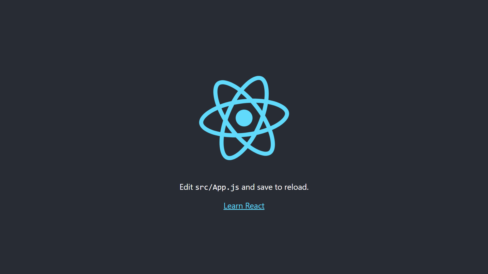

React Demo One - 仿简书项目
===

> Create by **jsliang** on **2019-3-18 08:37:10**  
> Recently revised in **2019-3-18 09:03:24**

**Hello 小伙伴们，如果觉得本文还不错，记得给个 **star** ， 小伙伴们的 **star** 是我持续更新的动力！[GitHub 地址](https://github.com/LiangJunrong/document-library/blob/master/other-library/Interview/PersonalExperience/2019-InterviewPreparation.md)**

## <a name="chapter-one" id="chapter-one">一 目录</a>

**不折腾的前端，和咸鱼有什么区别**

| 目录 |
| --- | 
| [一 目录](#chapter-one) | 
| [二 前言](#chapter-two) |
| [三 课程结构](#chapter-three) |

## <a name="chapter-two" id="chapter-two">二 前言</a>

> [返回目录](#catalog-chapter-two)

关于 React，**jsliang** 从 `2018-9-5` 就开始折腾了，中途因为工作调动，没有成功继续折腾下去。最近因为新公司工作需求，从头开始继续折腾 React，希望我的文章能对没学过 React 的小伙伴有所帮助。

本文参考来自慕课网的 [《React 16.4 开发简书项目
从零基础入门到实战》](https://coding.imooc.com/class/229.html) 教程，掺杂个人对编程的理解，如有错误，望多多指正。

## <a name="chapter-three" id="chapter-three">三 课程结构</a>

> [返回目录](#catalog-chapter-three)

* **课程结构**：

1. 基础内容 -> 环境搭建 -> 基础语法 -> 原理进阶 -> 动画
2. Redux -> Redux 进阶
3. 实战项目 -> 环境搭建 -> Header -> 首页 -> 详情页
4. 登录校验 -> 上线

* **前置知识**：

1. ES5/ES6
2. webpack
3. npm

* **知识点**：

1. create-react-app
2. 组件化思维
3. JSX
4. 开发调试工具
5. 虚拟 DOM
6. 生命周期
7. React-transition-group
8. Redux
9. Antd
10. UI、容器组件
11. 无状态组件
12. redux-thunk
13. redux-saga
14. styled-components
15. immutable.js
16. redux-immutable
17. axios

* **开始准备**：

1. 下载 Node.js
2. 安装 React 脚手架：
   1. `npm i create-react-app -g`
   2. `create-react-app todolist`
   3. `cd todolist`
   4. `npm start`
3. 查看 `localhost:3000`：

---

> **jsliang** 广告推送：  
> 也许小伙伴想了解下云服务器  
> 或者小伙伴想买一台云服务器  
> 或者小伙伴需要续费云服务器  
> 欢迎点击 **[云服务器推广](https://github.com/LiangJunrong/document-library/blob/master/other-library/Monologue/%E7%A8%B3%E9%A3%9F%E8%89%B0%E9%9A%BE.md)** 查看！

>  jsliang 的文档库 由 <a xmlns:cc="http://creativecommons.org/ns#" href="https://github.com/LiangJunrong/document-library" property="cc:attributionName" rel="cc:attributionURL">梁峻荣</a> 采用 <a rel="license" href="http://creativecommons.org/licenses/by-nc-sa/4.0/">知识共享 署名-非商业性使用-相同方式共享 4.0 国际 许可协议</a>进行许可。 基于<a xmlns:dct="http://purl.org/dc/terms/" href="https://github.com/LiangJunrong/document-library" rel="dct:source">https://github.com/LiangJunrong/document-library</a>上的作品创作。 本许可协议授权之外的使用权限可以从 <a xmlns:cc="http://creativecommons.org/ns#" href="https://creativecommons.org/licenses/by-nc-sa/2.5/cn/" rel="cc:morePermissions">https://creativecommons.org/licenses/by-nc-sa/2.5/cn/</a> 处获得。