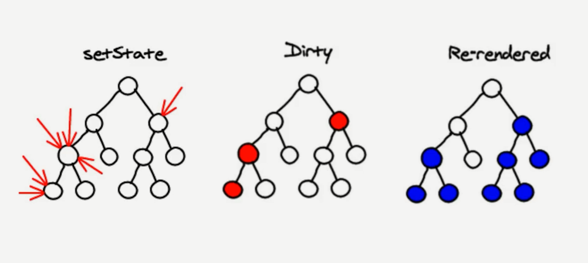
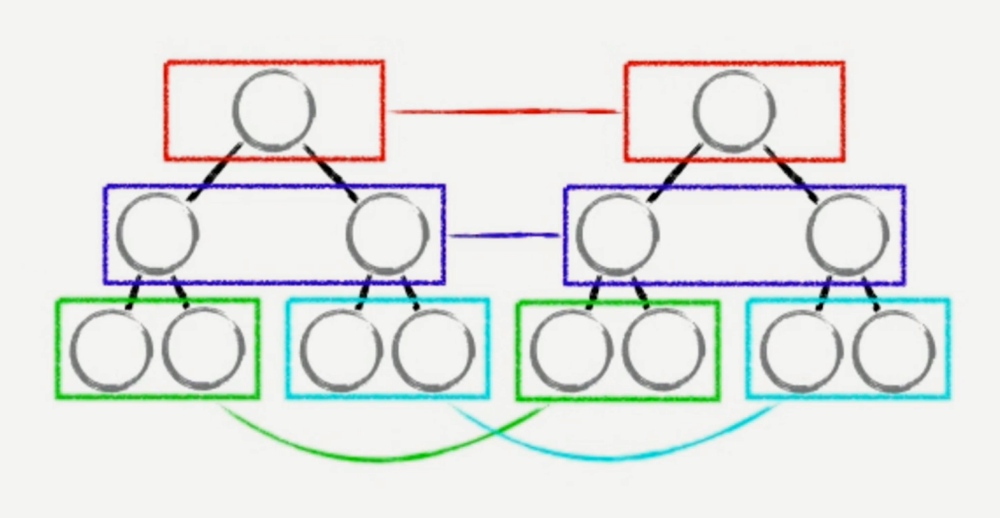
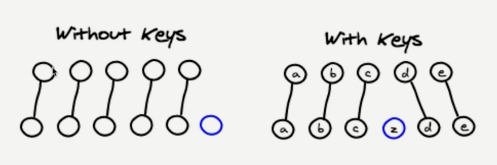

React Demo Two - 简书
===

> Create by **jsliang** on **2019-3-22 12:47:51**  
> Recently revised in **2019-3-22 12:47:56**

**Hello 小伙伴们，如果觉得本文还不错，记得给个 **star** ， 小伙伴们的 **star** 是我持续更新的动力！[GitHub 地址](https://github.com/LiangJunrong/document-library/blob/master/JavaScript-library/React/ReactDemoTwo-JianShu.md)**

* [React 系列源码地址](https://github.com/LiangJunrong/React)

## <a name="chapter-one" id="chapter-one">一 目录</a>

**不折腾的前端，和咸鱼有什么区别**

| 目录 |
| --- | 
| [一 目录](#chapter-one) | 
| <a name="catalog-chapter-two" id="catalog-chapter-two"></a>[二 前言](#chapter-two) |
| <a name="catalog-chapter-three" id="catalog-chapter-three"></a>[三 正文](#chapter-three) |
| <a name="catalog-chapter-four" id="catalog-chapter-four"></a>[四 总结](#chapter-four) |
| <a name="catalog-chapter-five" id="catalog-chapter-five"></a>[五 参考文献](#chapter-five) |

## <a name="chapter-two" id="chapter-two">二 前言</a>

> [返回目录](#chapter-one)

* **调试工具**：

* [React Development Tools 介绍](http://www.cnplugins.com/zhuanti/how-to-use-react-tools.html)
* [React Development Tools 下载地址](https://pan.baidu.com/s/1ND_HsvDMnWDPo332UDLZPQ)


* **子组件接受数据校验及默认设置**

```js
// 引用类型校验
import PropTypes from 'prop-types'

class TodoItem extends React {
  // ...省略
}

// 使用类型校验
TodoItem.protoTypes = {
  test: PropTypes.string.isRequired,
  content: PropTypes.arrayOf(PropTypes.number, PropTypes.string),
  deleteItem: PropTypes.func,
  index: PropTypes.number
}

// 使用字段默认值
TodoItem.defaultProps = {
  test: 'Hello World!'
}

export default TodoItem;
```

* **`poops`、`state` 以及 `render` 函数的关系**

当组件的 `state` 或者 `props` 发生改变的时候，`render` 函数就会重新执行。

当父组件的 `render` 函数被运行时，它的子组件的 `render` 都将被重新运行一次。

* **React 的 DOM 操作**

**首先**，尝试模仿下 React 的数据更新：

1. `state` 数据
2. `JSX` 模板
3. 数据 + 模板结合，生成真实的 DOM，来显示
4. `state` 发生改变
5. 数据 + 模板结合，生成真实的 DOM，替换原始的 DOM

**然后**，我们分析下缺陷：

1. 第一次生成了一个完整的 DOM 片段
2. 第二次生成了一个完整的 DOM 片段
3. 第二次的 DOM 替换第一次的 DOM，非常耗性能

**接着**，我们尝试优化下思路：

1. `state` 数据
2. `JSX` 模板
3. 数据 + 模板结合，生成真实的 DOM，来显示
4. `state` 发生改变
5. 数据 + 模板结合，生成真实的 DOM，并不直接替换原始的 DOM
6. 新的 DOM（Document Fragment）与原始的 DOM 作对比，找差异
7. 找出 `input` 框发生了什么变化
8. 只用新的 DOM 中的 `input` 元素，替换掉老的 DOM 中的 `input` 元素

**再来**，我们再次分析下缺陷：

1. 性能的提升并不明显

**然后**，我们进一步优化提升：

1. `state` 数据
2. `JSX` 模板
3. 数据 + 模板生成虚拟 DOM（虚拟 DOM 就是一个 JS 对象，用来描述真实 DOM）（损耗了性能）

```js
['div', {id: 'abc'}, [
  'span', {}, 'Hello World!'
]]
```

4. 用虚拟 DOM 的解构生成真实的 DOM，来显示

```html
<div id='abc'>
  <span>Hello World!</span>
</div>
```

5. `state` 发生变化
6. 数据 + 模板生成新的虚拟 DOM（极大提升了性能）

```js
['div', {id: 'abc'}, [
  'span', {}, 'Hello jsliang!'
]]
```

7. 比较原始虚拟 DOM 和新的虚拟 DOM 的区别，找到区别是 `span` 中内容（极大提升了性能）
8. 直接操作 DOM，改变 `span` 中的内容

**最后**，我们分析下现在优点：

1. 性能提升了
2. 它使得跨端应用得以实现。React Native（网页上生成 DOM 标签，手机上生成原生应用代码）

> 在 JSX 中，JSX -> createElemnt -> 虚拟 DOM（JS 对象） -> 真实的 DOM：  
> `return <div><span>item</span></div>`  
> 可以被下面语句替换：  
> `return React.createElement('div', {}, React.createElement('span', {}, 'item'))`

* **虚拟 DOM 中的 diff 算法**：

比较原生虚拟 DOM 和新的虚拟 DOM 的区别，使用 Diff（different）算法



如上图，在 React 中，对于 `setState`，它采用异步操作，统一对 `state` 中的数据进行更改。

---



**首先**，比对第一层的 DOM 节点，如果它相同，则往下继续对比；如果它不同，则停止对比，更新第一层及以下的 DOM 节点。

**然后**，比对第二次的 DOM 节点……

**最后**，形成一种比对算法。



---

关于 React 中的 key 值：

1. 如果我们没有在 `for` 遍历中，给节点赋值上相应的 `key` 值，那么，React 的查找就像上图左侧一样，毫无目的，很难进行比较。
2. 当我们使用了相应的 `key` 值时，我们就可以快速找到不同的地方，进行对比，从而方便进行渲染。

现在可以解释，为啥不要使用 `index` 作为 `for` 循环的 `key` 值。

1. 第一次我们添加了：`a - 0、b - 1、 c - 2`
2. 当我们删除了 `a` 之后：`b - 0、c - 1`

这时候，我们对应的 `key` 值就变了，我们就需要重新渲染整个 DOM 节点了。

---

> **jsliang** 广告推送：  
> 也许小伙伴想了解下云服务器  
> 或者小伙伴想买一台云服务器  
> 或者小伙伴需要续费云服务器  
> 欢迎点击 **[云服务器推广](https://github.com/LiangJunrong/document-library/blob/master/other-library/Monologue/%E7%A8%B3%E9%A3%9F%E8%89%B0%E9%9A%BE.md)** 查看！

[](https://promotion.aliyun.com/ntms/act/qwbk.html?userCode=w7hismrh)
[](https://cloud.tencent.com/redirect.php?redirect=1014&cps_key=49f647c99fce1a9f0b4e1eeb1be484c9&from=console)

> <a rel="license" href="http://creativecommons.org/licenses/by-nc-sa/4.0/"></a><br /><span xmlns:dct="http://purl.org/dc/terms/" property="dct:title">jsliang 的文档库</span> 由 <a xmlns:cc="http://creativecommons.org/ns#" href="https://github.com/LiangJunrong/document-library" property="cc:attributionName" rel="cc:attributionURL">梁峻荣</a> 采用 <a rel="license" href="http://creativecommons.org/licenses/by-nc-sa/4.0/">知识共享 署名-非商业性使用-相同方式共享 4.0 国际 许可协议</a>进行许可。<br />基于<a xmlns:dct="http://purl.org/dc/terms/" href="https://github.com/LiangJunrong/document-library" rel="dct:source">https://github.com/LiangJunrong/document-library</a>上的作品创作。<br />本许可协议授权之外的使用权限可以从 <a xmlns:cc="http://creativecommons.org/ns#" href="https://creativecommons.org/licenses/by-nc-sa/2.5/cn/" rel="cc:morePermissions">https://creativecommons.org/licenses/by-nc-sa/2.5/cn/</a> 处获得。