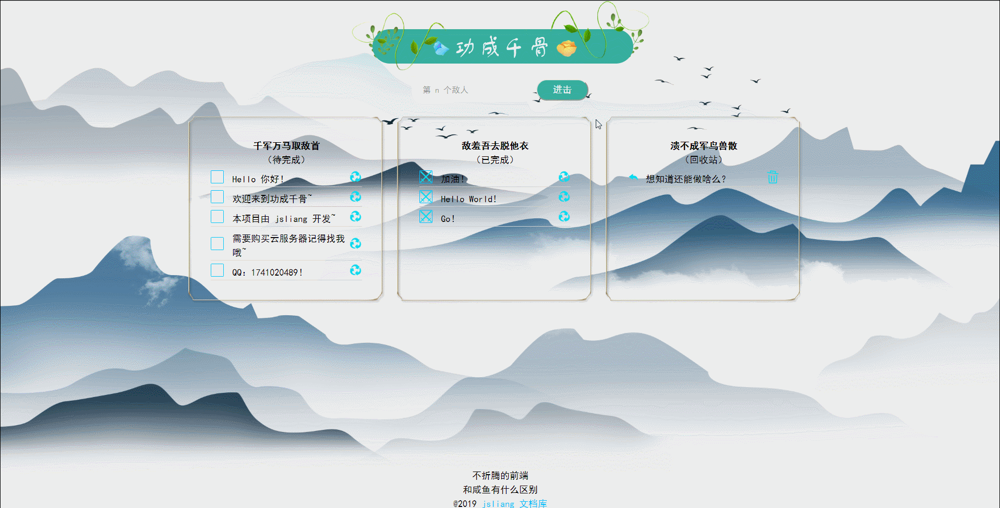
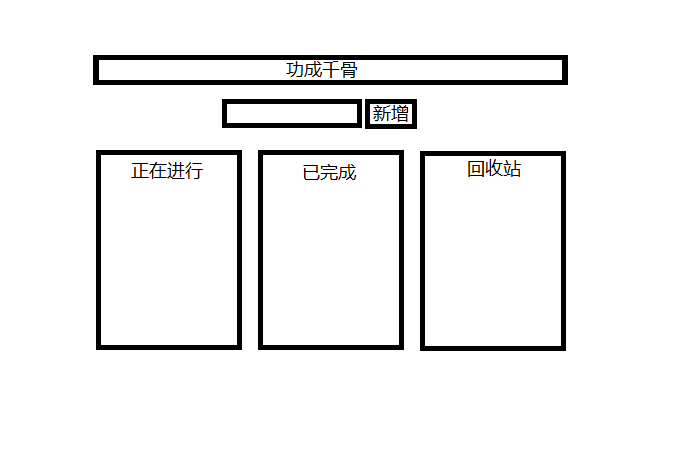
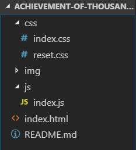
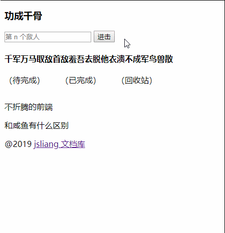
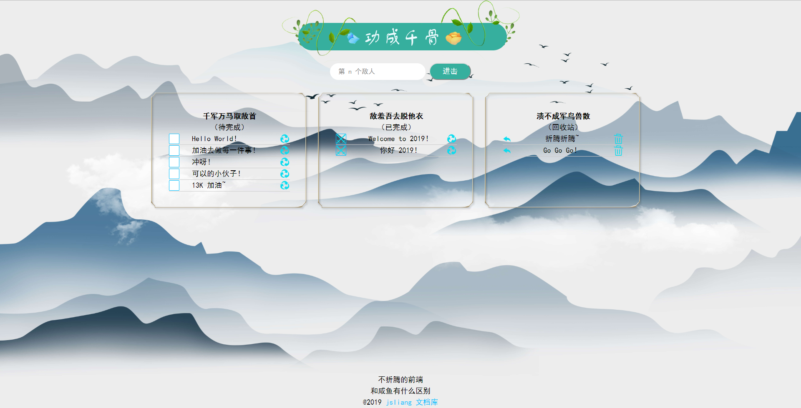

# Vue Demo - 功成千骨

> Create by **jsliang** on **2019-1-2 08:46:46**  
> Recently revised in **2019-1-7 21:26:34**

**Hello 小伙伴们，如果觉得本文还不错，记得给个 **star** ， 你们的 **star** 是我学习的动力！[GitHub 地址](https://github.com/LiangJunrong/document-library/blob/master/JavaScript-library/Vue/VueDemoOne.md)**

抛开 Vue-Cli，使用最简单原始的方式开发一个 TodoList 并不断完善，完成正在进行、完成列表、回收站这三个功能模块，并实现下面这些功能：

- 新增任务
- 改变状态
- 修改任务
- 删除任务

成品展示：



## <a name="chapter-one" id="chapter-one">一 目录</a>

**不折腾的前端，和咸鱼有什么区别**

| 目录                                      |
| ----------------------------------------- |
| [一 目录](#chapter-one)                   |
| [二 前言](#chapter-two)                   |
| [三 项目解析](#chapter-three)             |
| [四 骨架 - HTML](#chapter-four)           |
| [五 功能 - JS](#chapter-five)             |
| &emsp;[5.1 页面数据化](#chapter-five-one) |
| &emsp;[5.2 数据简化](#chapter-five-two)   |
| &emsp;[5.3 添加数据](#chapter-five-three) |
| &emsp;[5.4 改变状态](#chapter-five-four)  |
| &emsp;[5.5 修改内容](#chapter-five-five)  |
| &emsp;[5.6 数据回收](#chapter-five-six)   |
| &emsp;[5.7 彻底删除](#chapter-five-seven) |
| [六 皮肤 - CSS](#chapter-six)             |
| [七 总结](#chapter-seven)                 |

## <a name="chapter-two" id="chapter-two">二 前言</a>

> [返回目录](#chapter-one)

经过系列的折腾，并且参照不同大佬的“新人作” - TodoList 的各种写法，综合起来，从 0 到 1 不依赖 Vue-Cli 打造一个属于自己的 TodoList，后期加以 Node 的框架 Koa 连接 MySQL 提供接口，从而实现面向大众的 TodoList！

## <a name="chapter-three" id="chapter-three">三 项目解析</a>

> [返回目录](#chapter-one)

在我们平时的工作中，我们应该在拿到 PSD 设计稿或者原型设计的时候，我们应该对我们的功能进行划分，对 HTML、CSS、JS 进行划分，以便于后期的维护制作，下面我们先看一下我们的 UI：



好吧惨不忍睹，我们使用 PS 稍微完善下：



OK，下面我们就可以开始切图仔的工作啦！

## <a name="chapter-four" id="chapter-four">四 骨架 - HTML</a>

> [返回目录](#chapter-one)

> index.html

```
<!DOCTYPE html>
<html lang="en">
<head>
  <meta charset="UTF-8">
  <meta name="viewport" content="width=device-width,initial-scale=1.0,maximum-scale=1.0,user-scalable=no">
  <meta http-equiv="X-UA-Compatible" content="ie=edge">
  <link rel="shortcut icon" href="./img/favicon.ico" type="image/x-icon">
  <title>功成千骨</title>

  <!-- css 区 -->
  <link rel="stylesheet" href="./css/index.css">

</head>
<body>
  <!-- html 区 -->
  <div class="main-container">
    <!-- 头部标题 -->
    <div class="header">
      <h3>功成千骨</h3>
    </div>
    <!-- 内容区 -->
    <div class="content">
      <!-- 输入区 -->
      <div class="content-input-todo">
        <input type="text" placeholder="第 n 个敌人">
        <button>进击</button>
      </div>
      <!-- 列表区 -->
      <div class="content-list">
        <!-- 未完成 -->
        <div class="content-list-todo">
          <h4>千军万马取敌首</h4>
          <ul>
            <li>
              <input type="checkbox">
              <span>敌军 1</span>
              <span>×</span>
            </li>
            <li>
              <input type="checkbox">
              <span>敌军 2</span>
              <span>×</span>
            </li>
            <li>
              <input type="checkbox">
              <span>敌军 3</span>
              <span>×</span>
            </li>
          </ul>
        </div>
        <!-- 已完成 -->
        <div class="content-list-finish">
          <h4>敌羞吾去脱他衣</h4>
          <ul>
            <li>
              <input type="checkbox">
              <span>亡军 1</span>
              <span>×</span>
            </li>
            <li>
              <input type="checkbox">
              <span>亡军 2</span>
              <span>×</span>
            </li>
            <li>
              <input type="checkbox">
              <span>亡军 3</span>
              <span>×</span>
            </li>
          </ul>
        </div>
        <!-- 回收站 -->
        <div class="content-list-recycle">
          <h4>溃不成军鸟兽散</h4>
          <ul>
            <li>
              <input type="checkbox">
              <span>逃军 1</span>
              <span>×</span>
            </li>
            <li>
              <input type="checkbox">
              <span>逃军 2</span>
              <span>×</span>
            </li>
            <li>
              <input type="checkbox">
              <span>逃军 3</span>
              <span>×</span>
            </li>
          </ul>
        </div>
      </div>
      <!--  -->
    </div>
    <!-- 底部信息 -->
    <div class="footer">
      <p>不折腾的前端</p>
      <p>和咸鱼有什么区别</p>
      <p>@2019 <a href="" target="_blank">jsliang 文档库</a></p>
    </div>
  </div>

  <!-- js 区 -->
  <script src="https://cdn.bootcss.com/vue/2.5.21/vue.js"></script>
  <script src="./js/index.js"></script>

</body>
</html>
```

> 此时，`index.css` 和 `index.js` 这两个文件，可以是空的，因为我们先架好骨架，再进行 CSS 的渲染以及 JS 的事件。


## <a name="chapter-five" id="chapter-five">五 功能 - JS</a>

> [返回目录](#chapter-one)

## <a name="chapter-five-one" id="chapter-five-one">5.1 页面数据化</a>

> [返回目录](#chapter-one)

现在，我们进行页面的数据化，我们需要考虑有哪几块是需要变成数据的：**输入的内容**、**todo 项**、**完成项**、**未完成项**。

那么，我们先进行简单抽取：

> index.html 代码片段

```
<!-- 内容区 -->
<div class="content">
  <!-- 输入区 -->
  <div class="content-input-todo">
    <input type="text" placeholder="第 n 个敌人" v-model="todo">
    <button>进击</button>
  </div>
  <!-- 列表区 -->
  <div class="content-list">
    <!-- 未完成 -->
    <div class="content-list-todo">
      <p>千军万马取敌首</p>
      <ul>
        <li v-for="todoItem in todoInfos" :key="todoItem.id">
          <input type="checkbox" v-model="todoItem.isChecked">
          <span v-text="todoItem.todoTitle"></span>
          <span>×</span>
        </li>
      </ul>
    </div>
    <!-- 已完成 -->
    <div class="content-list-finish">
      <p>敌羞吾去脱他衣</p>
      <ul>
        <li v-for="finishItem in finishInfos" :key="finishItem.id">
          <input type="checkbox" v-model="finishItem.isChecked">
          <span v-text="finishItem.todoTitle"></span>
          <span>×</span>
        </li>
      </ul>
    </div>
    <!-- 回收站 -->
    <div class="content-list-recycle">
      <p>溃不成军鸟兽散</p>
      <ul>
        <li v-for="recycleItem in recycleInfos" :key="recycleItem.id">
          <input type="checkbox" v-model="recycleItem.isChecked">
          <span v-text="recycleItem.todoTitle"></span>
          <span>×</span>
        </li>
      </ul>
    </div>
  </div>
</div>
```

在这里，我们将页面数据化了，然后我们编写 `index.js` 的内容：

> index.js

```
var app = new Vue({
  el: "#app",
  data: {
    id: 1,
    todo: '',
    todoInfos: [
      {
        id: 7,
        isChecked: false,
        todoTitle: "敌军 1",
      },
      {
        id: 8,
        isChecked: false,
        todoTitle: "敌军 2",
      },
      {
        id: 9,
        isChecked: false,
        todoTitle: "敌军 3",
      },
    ],
    finishInfos: [
      {
        id: 1,
        isChecked: true,
        todoTitle: "亡军 1",
      },
      {
        id: 2,
        isChecked: true,
        todoTitle: "亡军 2",
      },
      {
        id: 3,
        isChecked: true,
        todoTitle: "亡军 3",
      },
    ],
    recycleInfos: [
      {
        id: 4,
        isChecked: false,
        todoTitle: "逃军 1",
      },
      {
        id: 5,
        isChecked: false,
        todoTitle: "逃军 2",
      },
      {
        id: 6,
        isChecked: false,
        todoTitle: "逃军 3",
      },
    ]
  }
})
```

## <a name="chapter-five-two" id="chapter-five-two">5.2 数据简化</a>

> [返回目录](#chapter-one)

在这里，我们观察下 `todoInfos`、`finishInfos`、`recycleInfos` 这三个数组，发现它们都是差不多的结构。那么，我们干脆将它合并？

> index.js

```
var app = new Vue({
  el: "#app",
  data: {
    id: 1, // 自增，确保能快速找到数据
    todo: '', // 双向绑定输入框
    todoInfos: [
      {
        id: 10, // id 唯一且自增
        isChecked: false, // 未完成和放弃为 false，完成为 true
        todoTitle: "敌军 1", // todo 标题
        state: 0, // 0 - 未完成，1 - 完成，2 - 放弃完成
      },
    ]
  },
})
```

这样一来，我们就可以通过 `state` 来区分这三块的数据：

> index.html 代码片段

```
<!-- 内容区 -->
<div class="content">
  <!-- 输入区 -->
  <div class="content-input-todo">
    <input type="text" placeholder="第 n 个敌人" v-model="todo">
    <button>进击</button>
  </div>
  <!-- 列表区 -->
  <div class="content-list">
    <!-- 未完成 -->
    <div class="content-list-todo">
      <h4>千军万马取敌首</h4>
      <ul>
        <li v-for="todoItem in todoInfos" :key="todoItem.id" v-if="todoItem.state == 0">
          <input type="checkbox" v-model="todoItem.isChecked">
          <span v-text="todoItem.todoTitle"></span>
          <span>×</span>
        </li>
      </ul>
    </div>
    <!-- 已完成 -->
    <div class="content-list-finish">
      <h4>敌羞吾去脱他衣</h4>
      <ul>
        <li v-for="finishItem in todoInfos" :key="finishItem.id" v-if="finishItem.state == 1">
          <input type="checkbox" v-model="finishItem.isChecked">
          <span v-text="finishItem.todoTitle"></span>
          <span>×</span>
        </li>
      </ul>
    </div>
    <!-- 回收站 -->
    <div class="content-list-recycle">
      <h4>溃不成军鸟兽散</h4>
      <ul>
        <li v-for="recycleItem in todoInfos" :key="recycleItem.id" v-if="recycleItem.state == 2">
          <input type="checkbox" v-model="recycleItem.isChecked">
          <span v-text="recycleItem.todoTitle"></span>
          <span>×</span>
        </li>
      </ul>
    </div>
  </div>
</div>
```


此时，我们的页面还是如修改之前一般。下面我们开始写方法。

## <a name="chapter-five-three" id="chapter-five-three">5.3 添加数据</a>

> [返回目录](#chapter-one)

首先，我们往 HTML 中添加点击事件：

> index.html 代码片段

```
<!-- 输入区 -->
<div class="content-input-todo">
  <input type="text" placeholder="第 n 个敌人" v-model="todo">
  <button @click="addTodoItem">进击</button>
</div>
```

然后，我们往 JS 中添加点击方法：

> index.js

```
var app = new Vue({
  el: "#app",
  data: {
    id: 1, // 自增，确保能快速找到数据
    todo: '', // 双向绑定输入框
    todoInfos: [
      // 已不需要，注释掉
      // {
      //   id: 10, // id 唯一且自增
      //   isChecked: false, // 未完成和放弃为 false，完成为 true
      //   isEdit: false, // 是否在编辑
      //   todoTitle: "敌军 1", // todo 标题
      //   state: 0, // 0 - 未完成，1 - 完成，2 - 放弃完成
      // },
    ]
  },
  methods: {
    addTodoItem() {
      // 每次点击，往数组中添加一组数据
      this.todoInfos.push({
        id: this.id,
        isChecked: false,
        isEdit: false, // 是否在编辑
        todoTitle: this.todo,
        state: 0
      })
      // id 自增
      this.id++;
    }
  }
})
```

最后，我们查看下新增功能是否实现：


## <a name="chapter-five-four" id="chapter-five-four">5.4 改变状态</a>

> [返回目录](#chapter-one)

下面我们进行 `isChecked` 与 `state` 的改变，从而让数据在这三种状态中变化：

| 栏目 | 状态 |
| --- | --- |
| 未完成 | `isChecked: false`、`state: 0` |
| 已完成 | `isChecked: true`、`state: 1` |
| 回收站 | `isChecked: false`、`state: 2` |

首先，我们实现 **未完成** -> **已完成** 的转变，这里只需要修改下 HTML 代码即可：

> index.html 代码片段

```
<!-- 未完成 -->
<div class="content-list-todo">
  <h4>千军万马取敌首</h4>
  <ul>
    <li v-for="todoItem in todoInfos" :key="todoItem.id" v-if="todoItem.state == 0">
      <input type="checkbox" v-model="todoItem.isChecked" @change="todoItem.state = 1">
      <span v-text="todoItem.todoTitle"></span>
      <span>×</span>
    </li>
  </ul>
</div>
<!-- 已完成 -->
<div class="content-list-finish">
  <h4>敌羞吾去脱他衣</h4>
  <ul>
    <li v-for="finishItem in todoInfos" :key="finishItem.id" v-if="finishItem.state == 1">
      <input type="checkbox" v-model="finishItem.isChecked" @change="finishItem.state = 0">
      <span v-text="finishItem.todoTitle"></span>
      <span>×</span>
    </li>
  </ul>
</div>
```

我们可以查看下结果：


## <a name="chapter-five-five" id="chapter-five-five">5.5 修改内容</a>

> [返回目录](#chapter-one)

现在，我们实现点击 `todoTitle`，变成修改模式，修改完后点击其他地方，或者按下回车按钮，从而实现数据的修改：

> index.html 代码片段

```
<!-- 待完成 -->
<div class="content-list-todo">
  <h4>千军万马取敌首</h4>
  <ul>
    <li v-for="todoItem in todoInfos" :key="todoItem.id" v-if="todoItem.state == 0">
      <input type="checkbox" v-model="todoItem.isChecked" @change="todoItem.state = 1">
      <span v-if="!todoItem.isEdit" v-text="todoItem.todoTitle" @click="todoItem.isEdit = true"></span>
      <input v-if="todoItem.isEdit" @blur="todoItem.isEdit = false" type="text" v-model="todoItem.todoTitle">
      <span @click="todoItem.state = 2">×</span>
    </li>
  </ul>
</div>
<!-- 已完成 -->
<div class="content-list-finish">
  <h4>敌羞吾去脱他衣</h4>
  <ul>
    <li v-for="finishItem in todoInfos" :key="finishItem.id" v-if="finishItem.state == 1">
      <input type="checkbox" v-model="finishItem.isChecked" @change="finishItem.state = 0">
      <span v-if="!finishItem.isEdit" v-text="finishItem.todoTitle" @click="finishItem.isEdit = true"></span>
      <input v-if="finishItem.isEdit" @blur="finishItem.isEdit = false" v-model="finishItem.todoTitle" type="text">
      <span @click="finishItem.state = 2">×</span>
    </li>
  </ul>
</div>
<!-- 回收站 -->
<div class="content-list-recycle">
  <h4>溃不成军鸟兽散</h4>
  <ul>
    <li v-for="recycleItem in todoInfos" :key="recycleItem.id" v-if="recycleItem.state == 2">
      <span @click="recycleItem.state = 0; recycleItem.isChecked = false">返回</span>
      <span v-if="!recycleItem.isEdit" v-text="recycleItem.todoTitle" @click="recycleItem.isEdit = true"></span>
      <input v-if="recycleItem.isEdit" type="text" @blur="recycleItem.isEdit = false" v-model="recycleItem.todoTitle">
      <span @click="deleteInfo(recycleItem)">×</span>
    </li>
  </ul>
</div>
```

在这里，我们仅需要改变下 `isEdit` 的状态，即可以实现数据的修改。

最后，我们查看下实现情况：


## <a name="chapter-five-six" id="chapter-five-six">5.6 数据回收</a>

> [返回目录](#chapter-one)

> index.html 代码片段

```
<!-- 待完成 -->
<div class="content-list-todo">
  <h4>千军万马取敌首</h4>
  <ul>
    <li v-for="todoItem in todoInfos" :key="todoItem.id" v-if="todoItem.state == 0">
      <input type="checkbox" v-model="todoItem.isChecked" @change="todoItem.state = 1">
      <span v-text="todoItem.todoTitle"></span>
      <span @click="todoItem.state = 2">×</span>
    </li>
  </ul>
</div>
<!-- 已完成 -->
<div class="content-list-finish">
  <h4>敌羞吾去脱他衣</h4>
  <ul>
    <li v-for="finishItem in todoInfos" :key="finishItem.id" v-if="finishItem.state == 1">
      <input type="checkbox" v-model="finishItem.isChecked" @change="finishItem.state = 0">
      <span v-text="finishItem.todoTitle"></span>
      <span @click="finishItem.state = 2">×</span>
    </li>
  </ul>
</div>
```



## <a name="chapter-five-seven" id="chapter-five-seven">5.7 彻底删除</a>

> [返回目录](#chapter-one)

> index.html 代码片段

```
<!-- 回收站 -->
<div class="content-list-recycle">
  <h4>溃不成军鸟兽散</h4>
  <ul>
    <li v-for="recycleItem in todoInfos" :key="recycleItem.id" v-if="recycleItem.state == 2">
      <span @click="recycleItem.state = 0; recycleItem.isChecked = false">返回</span>
      <span v-text="recycleItem.todoTitle"></span>
      <span @click="deleteInfo(recycleItem)">×</span>
    </li>
  </ul>
</div>
```

然后，我们通过编写 `deleteInfo` 来删除 `todoInfos` 中的数据：

> index.js 代码片段

```
/**
 * 这里使用了三种写法
 * 1. map + splice
 * 2. splice + findIndex
 * 3. filter
 */
// // 1. map + splice 写法
// deleteInfo(recycleItem) {
//   this.todoInfos.map((item, index) => {
//     if(item.id == recycleItem.id) {
//       this.todoInfos.splice(index, 1);
//     }
//   })
// },
// // 2. splice + findIndex 写法
// deleteInfo(recycleItem) {
//   this.todoInfos.splice( this.todoInfos.findIndex( v => v.id === recycleItem.id), 1);
// },
// 3. filter 写法
deleteInfo(recycleItem) {
  this.todoInfos = this.todoInfos.filter( (x) => {
    return x.id != recycleItem.id;
  })
}
```

兴致突来，想起 **茴字的四种写法**，于是，这里也奉上删除数据的三种写法，哪种喜欢用哪种吧，这里不估算性能损耗了。

此时完成功能如下所示：


## <a name="chapter-six" id="chapter-six">六 皮肤 - CSS</a>

> [返回目录](#chapter-one)

那么我们回来我们的大难题，就是给这个页面增加皮肤。

我们网上盗个皮肤下来吧：


很好，然后我们对着修改下 CSS：

> index.css

```

```

大功告成，看下我们的成品：



## <a name="chapter-seven" id="chapter-seven">七 总结</a>

> [返回目录](#chapter-one)

到此，我们就写完了这个简单的小 Demo 啦~

> [](http://creativecommons.org/licenses/by-nc-sa/4.0/)  
> **jsliang** 的文档库</a> 由 [梁峻荣](https://github.com/LiangJunrong/document-library) 采用 [知识共享 署名-非商业性使用-相同方式共享 4.0 国际 许可协议](http://creativecommons.org/licenses/by-nc-sa/4.0/) 进行许可。  
> 基于 [https://github.om/LiangJunrong/document-library](https://github.om/LiangJunrong/document-library) 上的作品创作。  
> 本许可协议授权之外的使用权限可以从 [https://creativecommons.org/licenses/by-nc-sa/2.5/cn/](https://creativecommons.org/licenses/by-nc-sa/2.5/cn/) 处获得。
