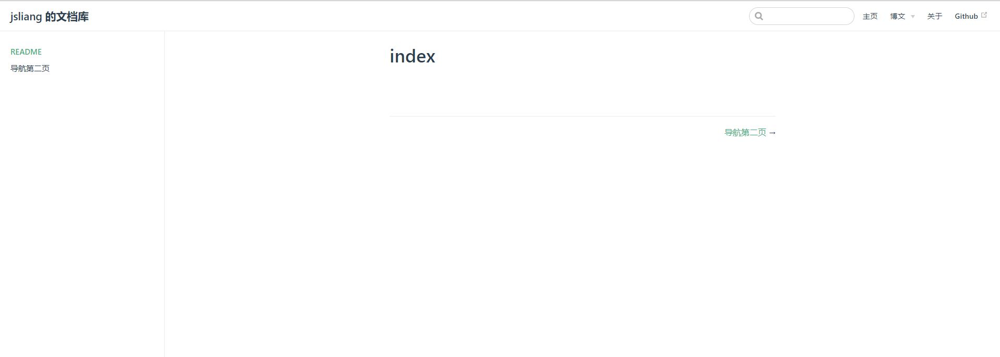

使用 GitHub Pages 和 VuePress 搭建网站
===

> Create by **jsliang** on **2018-10-20 10:34:39**  
> Recently revised in **2018-10-23 08:06:35**

<br>

&emsp;**Hello 小伙伴们，如果觉得本文还不错，记得给个 **star** ， 你们的 **star** 是我学习的动力！[GitHub 地址](https://github.com/LiangJunrong/document-library/blob/master/other-library/GithubPages/GithubPages.md)**

<br>

# <a name="chapter-one" id="chapter-one">前端：写在前面</a>

&emsp;**最终效果：**

&emsp;**效果1：**


<br>

&emsp;**效果2：**



<br>

&emsp;一般的网站，大体由三部分组成：域名、服务器部署环境以及部署代码。  

* GitHub Pages，由 GitHub 网站服务，为众多 GitHub 用户提供了良好的服务器部署环境以及域名的好工具。[【Github Pages 官网】](https://pages.github.com/)  
* VuePress，是以 Vue 为驱动的主题系统的简约静态网站生成工具 balabala……它是咱尤雨溪大神折腾出来的一个工具，初始目的是为了方便他使用 Markdown 语法来写文档，然后生成 HTML 代码，部署到服务器上即可。在众多网友的修改下，它可以拿来写静态网站，也就是可以拿来发布我们编写的博文。[【VuePress 官网】](http://caibaojian.com/vuepress/)  

&emsp;说到这里，小伙伴们大概懂了我们要讲什么了~  
&emsp;但是，如果这只是一篇关于如何入门 GitHub Pages 和 VuePress 的文档，我会觉得毫无意义。所以，**jsliang** 希望这篇文章能够整合网上的 GitHub Pages 和 VuePress 资料，并且比它们丰富一丢丢，加入 **jsliang** 使用心得，让小伙伴们看完无需翻阅大量文章也能快速做好自己的个人文档库/博客。那样，我就心满意足了。因为……  

&emsp;**不折腾的前端，跟咸鱼有什么区别！**  


&emsp;本文涉及的技术点：

* GitHub
* Git
* Markdown

&emsp;如果你熟悉且了解上面的技术，请点击下面的目录前往 → [老手：五分钟速成](#chapter-two)。  
&emsp;如果你不是很了解，请前往 → [菜鸟：最完美攻略](#chapter-three)，**jsliang** 在里面写了最全攻略，带你搞定自己的文档库~

&emsp;快速前往：

* [老手：五分钟速成](#chapter-two) 
* [菜鸟：最完美攻略](#chapter-three) 

<br>

# <a name="chapter-two" id="chapter-two">老手：五分钟速成</a>

<br>

# <a name="chapter-three" id="chapter-three">菜鸟：最完美攻略</a>

<br>

# <a name="chapter-one" id="chapter-one">GitHub Pages</a>

&emsp;参考文章：[地址1-GitHub Pages]()  


1. 新建仓库( New repository )，在仓库名( Repository name )中输入 `用户名.github.io`，然后点击 Create repository 即可创建一个部署好的环境。（如果你观察力很好，你会发现左边的 Owner 名字就是你的用户名）


<br>

2. Clone 你的 GitHub Pages 仓库地址


<br>

3. 新建 README.md 和 index.html，内容如下：


> README.md

```
Hello Github Pages
===

&emsp;这是我的 GitHub Pages 初始目录
```

<br>

> index.html

```
<!DOCTYPE html>
<html lang="en">
<head>
    <meta charset="UTF-8">
    <meta name="viewport" content="width=device-width,initial-scale=1.0,maximum-scale=1.0,user-scalable=no">
    <meta http-equiv="X-UA-Compatible" content="ie=edge">
    <title>Hello Github Pages</title>
    <style>
        .container {
            margin-top: 300px;
            text-align: center;
        }
    </style>
</head>
<body>
    <h1 class="container">Hello Github Pages</h1>
</body>
</html>
```

<br>

4. 在终端执行 

```
git add .
git commit -m "第一次提交"
git push
```

<br>

5. 查看 `LiangJunrong.github.io`，这里用户名替换为个人的用户名（注意：用户名.github.io 这个仓库虽然更新了。但是，因为 GitHub 本身存在点缓存，所以最好在自己检查页面显示无误后，再提交到 用户名.github.io）


<br>

# <a name="chapter-one" id="chapter-one">VuePress</a>

&emsp;参考地址：[地址1-使用vuepress搭建静态博客](https://blog.csdn.net/weixin_38318244/article/details/80162782)


<br>

## <a name="chapter-one" id="chapter-one">step1-安装 VuePress</a>

&emsp;在你需要存放的目录中，通过终端命令行安装 VuePress：`npm i vuepress -D`


<br>

## <a name="chapter-one" id="chapter-one">step2-创建目录及部署代码</a>


1. 编辑 `package.json`：

> package.json

```
{
  "scripts": {
    "dev": "vuepress dev docs",
    "build": "vuepress build docs"
  },
  "devDependencies": {
    "vuepress": "^0.14.4"
  }
}
```

<br>

2. 然后创建 docs 文件夹，并在 docs 文件夹下创建 README.md 文件

> README.md

```
Hello VuePress
===
```

<br>

3. 在终端执行命令 `npm run dev`，并打开 `http://localhost:8080`，得到初步配置界面如下：


## <a name="chapter-one" id="chapter-one">step3-进一步配置及优化代码</a>

<br>

> <a rel="license" href="http://creativecommons.org/licenses/by-nc-sa/4.0/"></a><br /><a xmlns:dct="http://purl.org/dc/terms/" property="dct:title">**jsliang** 的文档库</a> 由 <a xmlns:cc="http://creativecommons.org/ns#" href="https://github.com/LiangJunrong/document-library" property="cc:attributionName" rel="cc:attributionURL">梁峻荣</a> 采用 <a rel="license" href="http://creativecommons.org/licenses/by-nc-sa/4.0/">知识共享 署名-非商业性使用-相同方式共享 4.0 国际 许可协议</a>进行许可。<br />基于<a xmlns:dct="http://purl.org/dc/terms/" href="https://github.com/LiangJunrong/document-library" rel="dct:source">https://github.com/LiangJunrong/document-library</a>上的作品创作。<br />本许可协议授权之外的使用权限可以从 <a xmlns:cc="http://creativecommons.org/ns#" href="https://creativecommons.org/licenses/by-nc-sa/2.5/cn/" rel="cc:morePermissions">https://creativecommons.org/licenses/by-nc-sa/2.5/cn/</a> 处获得。