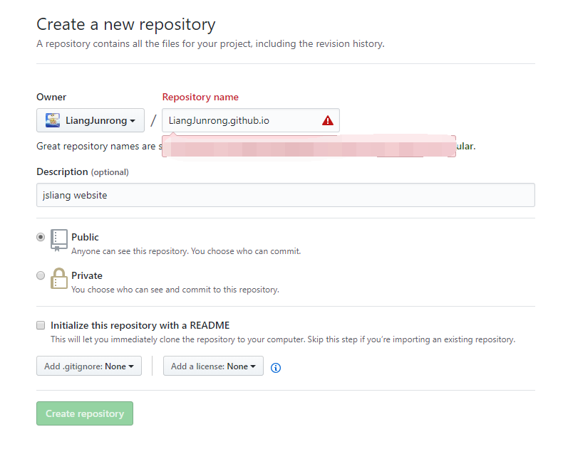
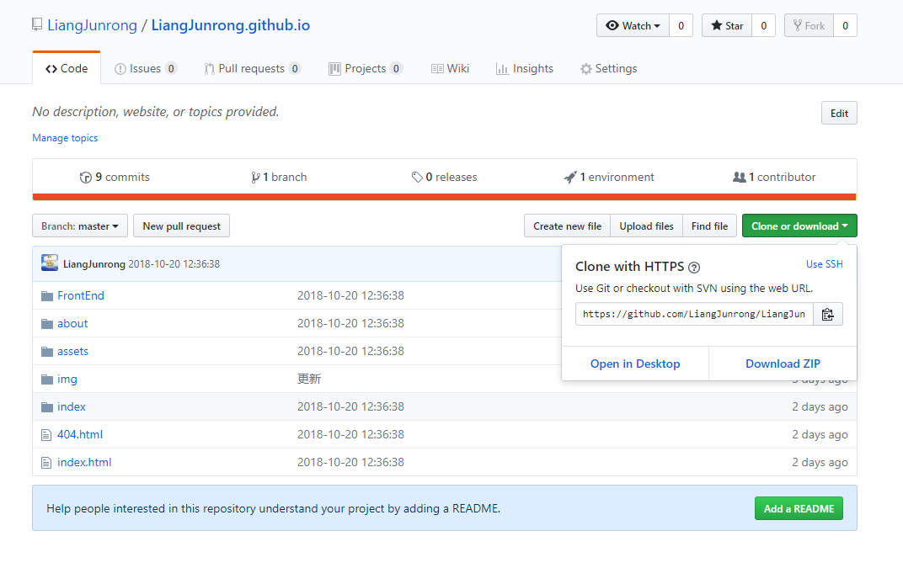
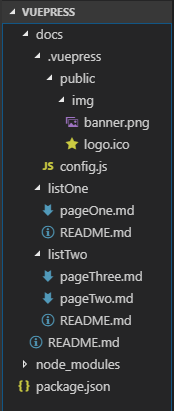

使用 GitHub Pages 和 VuePress 搭建网站
===

> Create by **jsliang** on **2018-10-20 10:34:39**  
> Recently revised in **2018-10-23 21:56:00**

<br>

&emsp;**Hello 小伙伴们，如果觉得本文还不错，记得给个 **star** ， 你们的 **star** 是我学习的动力！[GitHub 地址](https://github.com/LiangJunrong/document-library/blob/master/other-library/GithubPages/GithubPages.md)**

<br>

# <a name="chapter-one" id="chapter-one">一 目录</a>

| 目录名 |
| --- |
| <a name="catalog-chapter-one" id="catalog-chapter-one"></a>[一 目录](#chapter-one) |
| <a name="catalog-chapter-two" id="catalog-chapter-two"></a>[二 前言](#chapter-two) |
| <a name="catalog-chapter-three" id="catalog-chapter-three"></a>[三 基础配置](#chapter-three) |
| <a name="catalog-chapter-three" id="catalog-chapter-three"></a>[四 配置进阶](#chapter-four) |

<br>

# <a name="chapter-one" id="chapter-one">二 前言</a>

&emsp;**目前效果：**


<br>

&emsp;一般的网站，大体由三部分组成：域名、服务器部署环境以及部署代码。  

* GitHub Pages，由 GitHub 网站服务，为众多 GitHub 用户提供了良好的服务器部署环境以及域名的好工具。[【Github Pages 官网】](https://pages.github.com/)  
* VuePress，是以 Vue 为驱动的主题系统的简约静态网站生成工具 balabala……它是咱尤雨溪大神折腾出来的一个工具，初始目的是为了方便他使用 Markdown 语法来写文档，然后生成 HTML 代码，部署到服务器上即可。在众多网友的修改下，它可以拿来写静态网站，也就是可以拿来发布我们编写的博文。[【VuePress 官网】](http://caibaojian.com/vuepress/)  

&emsp;说到这里，小伙伴们大概懂了我们要讲什么了~  
&emsp;但是，如果这只是一篇关于如何入门 GitHub Pages 和 VuePress 的文档，我会觉得毫无意义。所以，**jsliang** 希望这篇文章能够整合网上的 GitHub Pages 和 VuePress 资料，并且比它们丰富一丢丢，加入 **jsliang** 使用心得，让小伙伴们看完无需翻阅大量文章也能快速做好自己的个人文档库/博客。那样，我就心满意足了。因为……  

&emsp;**不折腾的前端，跟咸鱼有什么区别！**  


&emsp;本文涉及的技术点：

* GitHub
* Git
* Markdown

&emsp;如果你熟悉且了解上面的技术，请点击下面的目录前往 → [老手：五分钟速成](#chapter-two)。  
&emsp;如果你不是很了解，请前往 → [菜鸟：最完美攻略](#chapter-three)，**jsliang** 在里面写了最全攻略，带你搞定自己的文档库~

&emsp;快速前往：

* [老手：五分钟速成](#chapter-two) 
* [菜鸟：最完美攻略](#chapter-three) 

<br>

# <a name="chapter-two" id="chapter-two">二、老手：五分钟速成</a>

&emsp;菜鸟攻略尚在准备，请拭目以待~

&emsp;参考文章：[地址1-GitHub Pages](https://pages.github.com/)  

&emsp;参考地址：[地址1-使用vuepress搭建静态博客](https://blog.csdn.net/weixin_38318244/article/details/80162782)

<br>

## <a name="chapter-two-one" id="chapter-two-one">2.1 搭建 GitHub Pages</a>

> [返回目录](#chapter-one)

<br>

1. 新建仓库( New repository )，在仓库名( Repository name )中输入 `用户名.github.io`，例如我的就是：`LiangJunrong.github.io`，然后点击 Create repository 即可创建一个部署好的环境。



<br>

2. Clone 项目至电脑，并新增 `README.md` 和 `index.html`：



<br>


<br>


<br>

> README.md

```
Hello Github Pages
===

&emsp;这是我的 GitHub Pages 初始目录
```

<br>

> index.html

```
<!DOCTYPE html>
<html lang="en">
<head>
    <meta charset="UTF-8">
    <meta name="viewport" content="width=device-width,initial-scale=1.0,maximum-scale=1.0,user-scalable=no">
    <meta http-equiv="X-UA-Compatible" content="ie=edge">
    <title>Hello Github Pages</title>
    <style>
        .container {
            margin-top: 300px;
            text-align: center;
        }
    </style>
</head>
<body>
    <h1 class="container">Hello Github Pages</h1>
</body>
</html>
```

<br>

3. 上传到 GitHub：

```
git add .
git commit -m "Github Pages"
git push
```

<br>

4. 打开 `用户名.github.io`：


<br>

## <a name="chapter-two-two" id="chapter-two-two">2.2 搭建 VuePages</a>

> [返回目录](#chapter-one)

<br>

1. 安装 VuePress

&emsp;在你需要存放的目录中，通过终端命令行安装 VuePress：`npm i vuepress -D`


<br>

2. 创建目录及部署代码


&emsp;编辑 `package.json`：

> package.json

```
{
  "scripts": {
    "dev": "vuepress dev docs",
    "build": "vuepress build docs"
  },
  "devDependencies": {
    "vuepress": "^0.14.4"
  }
}
```

<br>

&emsp;然后创建 docs 文件夹，并在 docs 文件夹下创建 README.md 文件

> README.md

```
Hello VuePress
===
```

<br>

&emsp;最后在终端执行命令 `npm run dev`，并打开 `http://localhost:8080`，得到初步配置界面如下：


<br>

3. 完善配置

* 配置导航条

&emsp;首先，搭建目录如下：



&emsp;其中，.vuepress 是 VuePress 的配置文件，其架构为：

```
- .vuepress             - VuePress 配置目录
 - public               - 共用文件存储目录
  - img                 - 共用图片
   - banner.png         - 首页 banner
   - logo.ico           - 网页小图标
 - config.js            - 配置 js 文件
```

<br>

&emsp;然后，填写 `config.js` 中的配置代码：

> config.js

```
module.exports = {
    // 左上角标题
    title: 'jsliang 的文档库',
    // 描述
    description: '前端工程师 jsliang 的文档库',
    // 头部部署，右上角小图标
    head: [
        // ico 配置
        ['link', {
            rel: 'icon',
            href: '/img/logo.ico'
        }]
    ],
    // 主题部署
    themeConfig: {
        /** 
         * 右侧导航条
         * text - 显示字段
         * link - 链接：注意前后带 / 符号
         */
        nav: [
            {
                text: '主页',
                link: '/'
            },
            /**
             * 多级菜单
             * 开头 text 为一级标题
             * 数组内 text 为二级标题
             * link 为链接，注意带 /
             */
            {
                text: '博文',
                items: [
                    {
                        text: '微信小程序 bug 集中营',
                        link: 'https://github.com/LiangJunrong/document-library/blob/master/other-library/WeChatApplet/WeChatAppletBug.md'
                    },
                    {
                        text: '使用 GitHub Pages 和 VuePress 搭建网站',
                        link: 'https://github.com/LiangJunrong/document-library/blob/master/other-library/GithubPages/GithubPages.md'
                    }
                ]
            },
            {
                text: '关于',
                link: '/about/'
            },
            // 链接到网站
            {
                text: 'Github',
                link: 'https://www.github.com/LiangJunrong'
            },
        ]
    }
}
```

&emsp;最后，参照代码注释和下面的成果图，小伙伴应该懂得一些基本部署了。


<br>

* 配置简单侧边栏

&emsp;首先，目录结构如下：


<br>

&emsp;然后，配置我们的代码：

> .vuepress/config.js

```
module.exports = {
    title: 'jsliang 的文档库',
    description: '前端工程师 jsliang 的文档库',
    head: [
        // ...省略，可参考上面    
    ],
    // 主题部署
    themeConfig: {
        nav: [
            // ...省略，可参考上面
        ],
        /**
         * 侧边栏配置：数组形式
         */ 
        sidebar: [
            
            // 这种写法会跳转至首页
            ['/', '首页'],

            // 这种写法会跳转至该目录下的 README.md
            ['/about/', '关于'],
            
            ['/index/', '导航页']
        ],
        // 这是嵌套标题链接，自动显示当前激活（导航）页面标题的链接，即显示深度（h1-h6的深度）
        sidebarDepth: 1
    }
}
```

<br>

&emsp;最后，生成目录如下：


<br>

* 配置侧边栏组

&emsp;首先，目录结构如下：


> .vuepress/config.js

```
module.exports = {
    title: 'jsliang 的文档库',
    description: '前端工程师 jsliang 的文档库',
    head: [
        // ... 省略，配置可参考上面
    ],
    // 主题部署
    themeConfig: {
        nav: [
            // ...省略，配置可参考上面
        ],
        /**
         * 侧边栏配置：侧边栏组
         */
        sidebar: [
            {
                title: '导航组',
                children: [
                    ['/index/', '导航首页'],
                    ['/index/indexTwo', '导航第二页']
                ]
            },
            {
                title: '关于组',
                children: [ 
                    '/about/',
                    '/about/GithubPages',
                ]
            }
        ]
    }
}
```

<br>

* 配置分页侧边栏

&emsp;有些时候，我们想根据不同的目录，配置不同的侧边栏，这时候，我们只需要在 `config.js` 中设置一下，即可完美搞定：

> .vuepress/config.js

```
module.exports = {
    title: 'jsliang 的文档库',
    description: '前端工程师 jsliang 的文档库',
    head: [
        // ... 省略，配置可参考上面
    ],
    // 主题部署
    themeConfig: {
        nav: [
            // ...省略，配置可参考上面
        ],
        /**
         * 侧边栏配置：侧边栏组
         */
        sidebar: {

            // 侧边栏在 /index/ 【主页】目录上
            '/index/': [
                ['', 'README'],
                ['indexTwo', '导航第二页']
            ],

            // 侧边栏在 /about/ 【关于】目录上
            '/about/': [
                ['', 'README'],
                ['GithubPages', 'GithubPages'],
                ['VuePress', 'VuePress']
            ]
        }
    }
}
```

<br>

> <a rel="license" href="http://creativecommons.org/licenses/by-nc-sa/4.0/"></a><br /><a xmlns:dct="http://purl.org/dc/terms/" property="dct:title">**jsliang** 的文档库</a> 由 <a xmlns:cc="http://creativecommons.org/ns#" href="https://github.com/LiangJunrong/document-library" property="cc:attributionName" rel="cc:attributionURL">梁峻荣</a> 采用 <a rel="license" href="http://creativecommons.org/licenses/by-nc-sa/4.0/">知识共享 署名-非商业性使用-相同方式共享 4.0 国际 许可协议</a>进行许可。<br />基于<a xmlns:dct="http://purl.org/dc/terms/" href="https://github.com/LiangJunrong/document-library" rel="dct:source">https://github.com/LiangJunrong/document-library</a>上的作品创作。<br />本许可协议授权之外的使用权限可以从 <a xmlns:cc="http://creativecommons.org/ns#" href="https://creativecommons.org/licenses/by-nc-sa/2.5/cn/" rel="cc:morePermissions">https://creativecommons.org/licenses/by-nc-sa/2.5/cn/</a> 处获得。