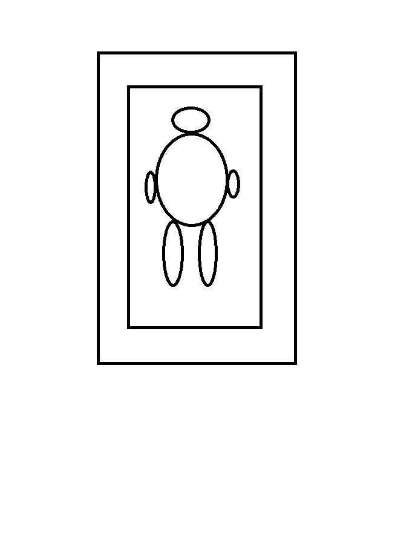

2019 面试准备 - Round Two
===

> Create by **jsliang** on **2019-3-7 22:26:08**  
> Recently revised in **2019-3-8 19:43:06**

**Hello 小伙伴们，如果觉得本文还不错，记得给 jsliang 的文档库点个 **star** ， 你们的 **star** 是我学习折腾的动力！[GitHub 地址](https://github.com/LiangJunrong/document-library/blob/master/other-library/Interview/KnowledgePoints/%E9%9D%A2%E8%AF%95-RoundTwo.md)**

并不是只有特定的季节才能跑路，只因为人跑得多了，这条路就定下来了。

金三银四跑路季，**jsliang** 进行了第二回合的面试，并写下这篇文章。

## <a name="chapter-one" id="chapter-one">一 目录</a>

**不折腾的前端，和咸鱼有什么区别**

| 目录 |
| --- | 
| [一 目录](#chapter-one) | 
| <a name="catalog-chapter-two" id="catalog-chapter-two"></a>[二 前言](#chapter-two) |
| <a name="catalog-chapter-three" id="catalog-chapter-three"></a>[三 早上 09:30](#chapter-three) |
| &emsp;[3.1 Job Description](#chapter-three-one) |
| &emsp;[3.2 技术一面 - 机密试题考查](#chapter-three-two) |
| &emsp;[3.3 技术二面 - 男女混合双打](#chapter-three-three) |
| &emsp;[3.4 个人三面 - 研发总监考查](#chapter-three-four) |
| &emsp;[3.5 个人四面 - 撩人事小姐姐](#chapter-three-five) |
| &emsp;[3.6 个人五面 - 惊人智商考查](#chapter-three-six) |
| <a name="catalog-chapter-four" id="catalog-chapter-four"></a>[四 下午 15:00](#chapter-four) |
| &emsp;[4.1 Job Description](#chapter-four-one) |
| &emsp;[4.2 Block chain](#chapter-four-two) |
| &emsp;[4.3 Just chat](#chapter-four-three) |
| <a name="catalog-chapter-five" id="catalog-chapter-five"></a>[五 总结](#chapter-five) |

## <a name="chapter-two" id="chapter-two">二 前言</a>

> [返回目录](#chapter-one)

**请时刻准备好自己的简历，不管是互联网经济不佳面临裁员，还是因为公司内部斗争严重想换份工作，还是因为厌倦了目前的一切……只有随时更新自己，把自己的简历准备好，你才知道哪一刻跑路是最佳选择。**

* **时间**：2019-3-7
* **地点**：广州
* **年限**：一年工作经验
* **薪酬要求**：9K - 15K
* **场次**：上午一场，下午一场
* **感想**：背着电脑负重 10 斤前行 13000 步，放下电脑轻松上阵，没人能在我的 BGM 里……

## <a name="chapter-three" id="chapter-three">三 早上 09:30</a>

> [返回目录](#chapter-one)

1. **公司规模**：员工 3000 +
2. **行业**：计算机软件
3. **面试前**：人生最可怕的噩梦，就是面对广州死亡三号线 + 中途会被要求下站的六号线！**jsliang** 于 7:15 分出发，在漫长的等地铁之后，终于在 8:15 分抵达目的地。出地铁一瞅，好家伙：山清水秀鸟语花香（黑云压城城欲摧）。撑开伞，雨中漫步一会，去大门登记，进入并等待面试。

### <a name="chapter-three-one" id="chapter-three-one">3.1 Job Description</a>

> [返回目录](#chapter-one)

```
岗位职责： 
1、负责前端页面开发和维护，并根据需求优化产品性能、用户体验、交互效果及各种主流浏览器的兼容适配工作； 
2、对Web前端新技术进行预研，掌握业内主流技术，保持公司前端开发技术的先进性； 
3、优化与重构前端代码，并整理出可重用的代码模块； 
4、配合产品经理和UI设计师，通过各种前端技术手段，提高用户体验并满足性能要求。 

岗位要求： 
1、2年以上前端开发工作经验。 
2、精通JavaScript、JQuery、AJAX、HTML5、DIV+CSS等Web前端开发技术
3、至少熟悉主流JS库或框架如:Bootstrap、AngularJS、backbone、React、Vue等中的一种； 
4、熟悉Grunt，Gulp，Webpack等前端自动化构建工具； 
5、熟悉模块化开发（Requirejs、Seajs、Commonjs），并具有相关项目经验；
6、熟悉Web Components 标准，并能够独立设计、开发web组件；
7、熟悉各种Web前端技术、深刻理解Web标准，对浏览器兼容性问题有丰富经验； 
8、对用户体验、交互操作流程、及用户需求有深入理解；
9、热爱前端，热爱设计，对新鲜事物充满好奇心。
10、主动了解最新前端技术动态，对HTML5技术领域、Web发展趋势具有良好的洞察力和关注度，求知欲强。
```

### <a name="chapter-three-two" id="chapter-three-two">3.2 技术一面 - 笔试题考查</a>

> [返回目录](#chapter-one)

人事小姐姐将我带到了一个空旷的厅子，交给我一份试卷，开始答题：

---

一、选择题：

1. 下面哪些属性不会让 div 脱离文档流？

```
A. position: absolute;
B. position: fixed;
C. position: relative;
D. float: left;
```

2. 下面有关 HTML 的 Doctype 和严格模式与混杂模式的描述，错误的是？

```
A. 声明位于文档中的最前面，处于 <html> 标签之前。告诉浏览器的解析器，用什么文档类型规范来解析这个文档。
B. 在标准模式下，浏览器根据规范呈现页面，在混合模式中，页面以一种比较宽松的向后兼容的形式解析这个文档。
C. DOCTYPE 不存在或格式不正确会导致文档以标准模式呈现。
D. 浏览器根据 DOCTYPE 是否存在以及使用哪种 DTD 来选择要使用的呈现方法。
```

3. 元素的 alt 和 title 有什么异同，选出正确的说法？

```
A. 不同的浏览器，表现一样。
B. alt 和 title 同时设置的时候，alt 作为图片的替代文字出现，title 是图片的解释文字。
C. alt 和 title 同时设置的时候，title 作为图片的替代文字出现，alt 是图片的解释文字。
D. 以上说法都不正确。
```

4. 下面可以让 div 水平居中的 css 设置是？

```
A. { margin: 0 auto; }
B. { margin: auto auto; }
C. { margin: auto 0; }
D. { margin: 0 0; }
```

5. 以下全部属于行内元素的是？

```
A. <div><p><input><span>
B. <div><h1><p><dl>
C. <select><button><label><a>
D. <div><p><form><ul><li>
```

6. 下述有关 CSS 属性 postion 的属性值的描述，说法错误的是？

```
……………………
……………………
……………………
……………………
```

**选择题就到此结束了。**

因为 **jsliang** 就坐在一个毫无屏障的大厅上答题。人来人往的，并且试题标明需要关闭电子设备，为了不被赶出去，为了能进入之后的环节，所以俺怂了~只在答完题后，假装找人事小姐姐，乘机拍了张前五题的，哈哈。不过下面的问答题还好我记得，下面咱一起瞅瞅！

二、问答题

1. 请看下面代码：

```js
function foo() {
  var i = 1;
  return function() {
    i++;
    console.log(i);
  }
}

var a = foo(), b = foo();
a();
a();
b();
```

请写出上面代码的输出结果。

> 这题考查的是闭包，小伙伴可以先自己想想答案，然后复制代码到控制台看看结果。

2. 请看下面代码：

`<div></div>`

请按照上面代码的格式，实现该图片的近似垂直居中和完全垂直居中。

> 一开始表示 jsliang 是懵逼的，不按套路出牌啊，不都是水平垂直居中么？不管了，我直接用 less 格式写下了 position 和 flex 的垂直居中方式，然后备注下如果要加上水平居中要怎么搞。

3. 下面有个页面，左边块宽 100px，高 120px，中间 10px 缝隙，右边宽度占剩余页面的 100%，高度占整个页面高度的 100%，请写出相关代码（HTML + CSS）。


> 很经典的一个布局，注意右边高度 100% 要设置好喔~

---

**总结**：

面试题要求 45 分钟写完，**jsliang** 30 分钟左右搞定了。总体来说在 **jsliang** 的面经文章上（即将发布）都有出现，个人觉得难度 5 颗星是最高难度的话，那这份题卷顶多 2 颗半星，当然后面知道 15 道选择题我还是错了 2 道。

不过，看到我的字，enm...我是觉得……**程序猿写的字不好看就不好看了吧！I dont care!**……安慰一波受伤的心灵。

这里不会给答案的哈，毕竟 **jsliang** 觉得，如果给了答案，小伙伴们的思维就被我的思路限制住了，或者我给出的是错误答案，就更引导错误了！所以还不如让小伙伴们自己敲一遍体验更深刻！

### <a name="chapter-three-three" id="chapter-three-three">3.3 技术二面 - 男女混合双打</a>

> [返回目录](#chapter-one)

笔试题做完之后，微信上呼叫人事小姐姐收了卷，然后坐等 5 分钟左右，便来了两个人 —— 一男一女。

一开始我还以为那个女的是人事小姐姐，男的就是接下来我要应付的面试官了。但是当他们自我介绍完，我才知道，卧槽那个姐姐也是前端的啊，接下来就更有趣了……

---

* **前端小姐姐**：“你好，我叫 A，旁边这位叫 B。”
* **短发小哥**：“你好。”
* **我**：“你好。”
* **前端小姐姐**：“你先自我介绍一下。”
* **我**：噼里啪啦介绍一通（如果小伙伴对我的经历感兴趣，请关注下一篇文章：《jsliang 的 2019 面试准备》）
* 中间面试官让 **jsliang** 介绍了下对三大框架的理解，并让我对比了下 Vue 和 微信小程序 以及 Vue 和 jQuery，这点在我之前的文章有提及，详情可见：[《》]()，在此不进行额外累述。
* **前端小姐姐**：“能讲下 Vue 实现双向数据绑定的原理吗？”
* **我**：“Vue 2.0 通过 `Object.defineProperty()` 进行数据劫持。而 Vue 3.0 使用的是 `Proxy`。”
* **前端小姐姐**：“能讲讲具体的实现思路吗？”
* **我**：（囧）（忘记具体实现了）“不好意思，我就听过，但是具体的没看过。”
* **前端小姐姐**：（沉默）有没有用 Node 写过后台。
* **我**：“我用了 Node + Vue + MongoDB 写过毕设，用了原生 Node 写过一个仿企业建站，提供简单的 API 给 jQuery 使用。”
* **前端小姐姐**：（翻简历）“你这项目还挺多的啊！”
* **我**：“是的。”
* **前端小姐姐**：“开发周期长不长？”
* **我**：“像微信小程序的话就两个月，jQuery + jQueryUI 打造的那个可视化拖拽系统就一个半月左右。”
* **前端小姐姐**：“你这些项目是独立开发还是团队开发？”
* **我**：“独立开发。”
* **前端小姐姐**：“你这还有个 Angular + ECharts？”
* **我**：“Angular + ECharts 这个没写完，因为折腾到一半的时候，我被流放到电信驻点去了。”
* **前端小姐姐**：“那你把你做的项目里面，比较有成就感的拿出来讲讲。”
* **我**：“整个微信小程序的开发过程是最有成就感的。因为我被安排到电信驻点的时候，还不知道电信需要开发微信小程序，然后我就拿了一套 PSD 图，边看官方文档边折腾，最终在自己说的期限内（两个月）写完了。”
* **前端小姐姐**：“那你觉得项目模块中，哪个比较复杂？”
* **我**：“在微信小程序中有个通讯录模块，这个通讯录模块就跟我们手机的通讯录一样。其中有个新增和修改功能，就像我们手机的新增和修改，当我们新增后，页面会滚动到相应的位置，修改也是。然后，我在自己做通讯录模块的时候，想了一下，想用二分法来实现这查找功能。不过后来因为时间不够的缘故，就没有具体写完了。”（详情可见我的文章：[《》]()）
* **前端小姐姐**：“你说你搞过 ES6 这方面的知识，那你知道 ES6 这方面的兼容性吗？”
* **我**：“没有。”
* **前端小姐姐**：“那你面向的用户是哪些人群？”
* **我**：“第一是电信内部人员吧，第二就是 H5 活动页会通过短信形式发送到电信用户手上，所以要考虑手机端的兼容，常见的就是 IPhone 和微信的兼容。”
* **前端小姐姐**：“好的，enm...那我出道题吧。”
* （震惊！前端小姐姐开始手写代码~）

1. 题目：一个机构树的快速定位，快速找到目标树的 Id：

```js
var tree = [
  {
    parentTreeId: 1,
    nodeOne: **,
    nodeTwo: **
  },
  {
    parentTreeId: 2,
    nodeOne: **,
    nodeTwo: **,
    childNode: 1
  }, 
  {
    childTreeId: 1
    parentId: 2
    childNodeOne: **
  }
  ……
]
```

> 由于记忆不太清晰，这里尽力模仿了小姐姐的代码。

请问我要如何快速找到某 Id 对应的节点。

> **jsliang** 使用了 for in + 递归 的形式进行了查找，不过因为 **jsliang** 也不确定，所以感兴趣的小伙伴，赶紧行动起来，查找一番吧~

* （经过一段时间的写代码以及和前端小姐姐的讨论……）
* **前端小姐姐**：“好的，树节点问题咱就讨论到这，下面我再问一个问题，有关定位的。”

2. 题目：假设我有一个页面，页面上有一张图，大致就是：



> 代码结构如下：

```html
<body>
  
</body>
```

当我点击这张图片中的某个位置（不仅是人身体，其他空白地方也可以），就会显示一个 input 框，输入一些信息后，点击其他地方会关闭，然后当你鼠标移动过去后，就会显示刚才输入的信息，请问这你会怎么实现？

> **jsliang** 觉得这是个有趣的问题，小伙伴们可以自己试试哈~

> tips：获取设备宽高，获取相对于图片的点击位置，定位新 input 的位置，定义 input 的 hover……

* （又经过一段时间的写代码以及和前端小姐姐的讨论……）
* **前端小姐姐**：“好的，我们接着下一个问题。”

3. 题目：现在，我有四个接口：A、B、C、D，首先我要查询 A 接口，查询 A 接口之后才能根据 A 接口返回的数据查询 B、C、D 三个接口，请问有没有比较好点的做法？

> **jsliang** 的思路是链式调用 + 异步调用，回答问题的时候用了 Promise，小伙伴们可以想想自己会怎么解决吧~

* （又又经过一段时间的写代码以及和前端小姐姐的讨论……）
* **前端小姐姐**：“好的，大致清楚了，那么你能讲讲你离职的原因和对下一家公司的期望么？”
* **我**：“是的，因为我觉得平台太小，个人提升有限，因为电信这边一直使用 jQuery 开发的；同时，因为一个人开发，总感觉缺少点什么，可能我比较希望找个团队一起折腾，共同分享，共同进步。**①**”

> **①**：关于离职原因，钱当然是个原因，但是你不能这么说，要不然你面试的公司会觉得你市侩。当然，我这里说平台小也是个原因，因为之前公司，不管是总部，还是驻点电信，都是一个人开发项目，这样子你代码写起来是随意了，但是总想和别人合作的，毕竟大的项目，都不是一人搞定的。

* **前端小姐姐**：“好的，那你对我们这边还有什么问题要问的吗？”
* **我**：“我想知道如果我进来这公司，大概是做什么？”
* **前端小姐姐**：“如果你进来的话，大概是 ……**②**。然后，平时开发的话，是采用组件化开发形式，分工合作的。接着，我们需要进行兼容到 IE8，以及我们使用的技术是 Angular 1，团队是 30 多个人，前端 10 多个。最后，我们可能会涉及的有 ECharts 报表以及地图之类的开发。”

> **②**：这部分就不能讲了，因为跟某些地方牵扯上关系的，**jsliang** 还是有所顾忌的。

* **我**：“好的，谢谢，我大致了解了。”
* （前端小姐姐询问特短发大哥还有啥需要询问的。）
* **特短发大哥**：“你是觉得自己基础部分比较好还是应用部分比较好？”
* **我**：“我觉得我应用部分用的比较多，但是我更希望自己能补充下我的基础部分，因为我 18 年 8 月的时候开始写文档库，就是想查漏补缺，将自己的知识体系进行完善。当你的知识体系完善的时候，你的综合水平就上去了。”
* **特短发大哥**：“你觉得你的文档库中，哪个部分比较容易写？”
* **我**：“我觉得我的文档库中，比较容易写的地方，就是那些直接调用 API 的地方，这些地方很少考虑基础，直接调用 API 即可，完全靠你的使用次数和熟练度。”
* **特短发大哥**：“好的，那最后你给我写个 1 分钟倒计时吧。”
* **我**：（拿起纸笔写了起来）
* **特短发大哥**：“好的，那你稍等下，我们合计下并找下人事。”
* **我**：“好的，谢谢。”

---

**总结**：

这一面大概是总体面试流程中较有难度，并且比较有趣的环节了，毕竟手写代码还是挺有趣的，虽然短发大哥不咋说话，但是咋看大哥就是传说中的背后 Boss，全程观看我跟姐姐的对话，而且接下来他的举动，可以看出他还是个有趣的人。

### <a name="chapter-three-four" id="chapter-three-four">3.4 个人三面 - 研发总监考查</a>

> [返回目录](#chapter-one)

再次经过 5 分钟的等待后，短发大哥带我去办公室，期间跟我聊了下，询问我平时玩不玩游戏，还是平时有其他活动啥的……最后将我带到了研发总监的办公室。

> 深刻记住他这句话！因为他可能知道我会走到五面，然后他知道五面是啥玩意，特此调侃下我！

---

* **研发总监**：“你好。”
* **我**：“你好。”
* **研发总监**：“能说下最近工作项目么？”
* **我**：“在开发一个 Vue + ElementUI 的后台管理项目。”
* **研发总监**：“噢噢，能讲下 JavaScript 的闭包么？”
* **我**：“简单来说，有个函数 A 以及一个函数 B，函数 A 里面包含了 函数 B，而 函数 B 里面使用了 函数 A 的变量，那么 函数 B 被称为闭包。”
* **研发总监**：“那闭包会产生什么问题？”
* **我**：“闭包会造成大量的局部变量，会造成内存消耗过大，从而造成网页的性能问题。不过我特地就闭包询问了一些前端前辈，他们说目前浏览器引擎都基于 V8，而 V8 引擎有个 gc 回收机制，不用太过担心变量不会被回收。”
* **研发总监**：“那你有遇到过这种内存泄漏的问题吗？能举个例子吗？”
* **我**：“记得我有次在 for 循环里面，写了个 setTimeout，然后因为数据量过大，从而导致页面卡住，最后浏览器都崩溃了。”
* **研发总监**：“那你是怎么解决这个问题的？”
* **我**：“一般在 for 中使用 let 变量了，因为 let 会产生块级作用域，从而减少产生闭包的可能。”
* **研发总监**：“能讲讲谷歌的盒子模型和 IE 的盒子模型的区别吗？”
* **我**：（尴尬）“这个具体不太清楚，但我可以给你讲个类似的，叫 `box-sizing`。”
* **研发总监**：“那你讲讲这个。”
* **我**：“在 `box-sizing` 中，大致有两种情况，一种是：`box-sizing: border-box`，这种情况下，盒子宽 = padding + border + margin；还有一种情况是 `box-sizing: content-box`，这种情况下，盒子宽不包括这些，最终可能因为盒子宽 + border + margin 从而冲破页面。”
* **研发总监**：“能讲讲 Vue 和 jQuery 的区别？”
* **我**：（这里就不罗列了，上面提到过了）
* **研发总监**：“能讲讲 Vue 的数据绑定原理吗？”
* **我**：“不能，但是我知道 Vue 2.0 版本使用的是 ` Object.defineProperty()` 进行数据劫持。而 Vue 3.0 使用的是 `Proxy`。”
* **研发总监**：“知道为什么 3.0 使用 `Proxy`，而 2.0 使用 `Object.defineProperty()` 吗？”
* **我**：“不知道，看文章介绍说是 `Object.defineProperty()` 有的功能 `Proxy` 都有，而且比它更丰富。”
* **研发总监**：“你离职的原因是什么？”
* **我**：（能是什么，跟上面一样再吐槽一遍呗~）
* **研发总监**：“对于薪资你有什么要求？”
* **我**：（这里省略啦~没啥好说的，小伙伴面试想要多少就直接提多少，市场讨价还价还是要有的）
* （最后聊了下其他杂七杂八的东西，例如调薪啦，培训啦，工作时间啦，加班啦，加班怎么算啦等等……）

---

**总结**：

看过我第一回合面试文章的小伙伴都知道，到了这个环节，只要你不作死，一般都没什么问题的了，毕竟这面面的不全是技术，主要是看你在将来工作上可能有的表现，以及跟人的沟通能力。

### <a name="chapter-three-five" id="chapter-three-five">3.5 个人四面 - 撩人事小姐姐</a>

> [返回目录](#chapter-one)

又又经过 5 分钟的等待后，人事小姐姐带我去了会议室，跟我聊了一下：

---

* **人事小姐姐**：“经过两轮面试，感觉如何？”
* **我**：“还好吧~”
* **人事小姐姐**：“住哪啊？”
* **我**：……
* **人事小姐姐**：“哇，那你过来就有点早了~”
* **我**：……
* **人事小姐姐**：“感觉这边如何？”
* **我**：……
* **人事小姐姐**：……
* **我**：…………
* **人事小姐姐**：“嗯，因为我们公司机制，今晚你可能还需要做两套题，一套呢，是岗位匹配度的题目；另一套呢，是智商测试题。你做完这两套，合格的话第二天我就可以给你发 offer 了。”
* **我**：（呆）“能不能不做？”
* **人事小姐姐**：（笑）“不能。”
* **我**：（囧）“好的吧。”
* **人事小姐姐**：“嗯嗯，好的，也到饭点了，你要不要跟我下去吃个饭，你也可以体验下未来的饭堂。”
* **我**：（愣）“不了不了，我还有事。”
* **人事小姐姐**：“嗯，好的吧，那我送你到电梯口。”
* **我**：“好地，谢谢~”

---

**总结**：

日常到了这环节，要不就是人事小姐姐会让你回去静等消息，要不就是人事小姐姐会让你回去等 offer 邮件，要不就是……人事小姐姐让你回去做职位匹配与智商测试题！过了才给 offer ！！！

### <a name="chapter-three-six" id="chapter-three-six">3.6 个人五面 - 惊人智商考查</a>

> [返回目录](#chapter-one)

在人事小姐姐的告知下，想要 offer 还要做两份测试题，然后晚上回去我真的收到了两份邮件，开始了痛苦的五面。

---

* **岗位匹配度测试**

|  | 研发类岗位匹配度测试 |  |
| --- | --- | --- |
| 第一部分 | 题量 114 题 | 不限时（约需 11 分钟） |
| 第二部分 | 题量 51 题 | 不限时（约需 9 分钟） |
| 第三部分 | 题量 6 题 | 6 分钟 |
| 第四部分 | 题量 6 题 | 6 分钟 |
| 第五部分 | 题量 6 题 | 6 分钟 |
| 第六部分 | 题量 13 题 | 10 分钟 |

* **智商题测试**

|  | 能力倾向 CATA 测评 |  |
| --- | --- | --- |
| 第一部分 | 题量约 10 题 | 限时（约需 10 分钟） |
| 第二部分 | 题量约 10 题 | 限时（约需 10 分钟） |
| 第三部分 | 题量约 10 题 | 限时（约需 10 分钟） |

---

**总结**：

1. 感觉自从高中毕业后，对于刷题很反感，尤其是像岗位匹配度测试这种，是考情商的吧？不是哪个好就选哪个或者选对自己影响较好的那个么，没有老老实实根据实际情况真实选答的吧？
2. 我的智商可能真不过关，答题完后第二天，人事小姐姐就电话通知我，我的智商题测试差了 3 分及格，并说已经重发邮件给我了，让我再做一遍……

还好不是再让我做一遍 **岗位匹配度测试**，要不然我真的会崩溃，至此上午的面试就完结啦！

## <a name="chapter-four" id="chapter-four">四 下午 15:00</a>

> [返回目录](#chapter-one)

1. **公司规模**：员工 1-20 人
2. **行业**：区块链
3. **面试前**：在经过上午的折腾过后，中午吃了个“特贵”的“营养蒸饭”，看下时间还有一个钟，等不急了，早点搞定早点回去休息。又是一番折腾下（讲真要进个大厦还是挺麻烦的，可能为了大厦安全着想），终于进入面试等待状态。

### <a name="chapter-four-one" id="chapter-four-one">4.1 Job Description</a>

> [返回目录](#chapter-one)

```
岗位职责： 
1.负责互联网产品的前端开发工作，不断优化用户体验，提升产品的兼容性和易用性； 
2.根据产品需求，分析并给出最优的页面前端架构解决方案； 
3.与产品经理，设计师和后端工程师紧密合作，实现产品交互流程和视觉界面的开发需求； 
4.把控代码质量，定期维护并更新前端开发规范； 
5.创新能力强，善于学习并总结、分享新技术；
6.具备良好的服务意识、责任心、较强的学习能力、团队沟通与协作能力；
需要掌握技能 

岗位要求： 
1.熟练掌握JS、HTML5、CSS3等前端技术
2.熟练使用jQuery等主流Javascript库/框架
3.熟练使用Ajax进行交互开发
4.熟练使用Photoshop对设计图进行切割和导出
5.熟悉各种浏览器兼容处理
```

### <a name="chapter-four-two" id="chapter-four-two">4.2 Block chain</a>

> [返回目录](#chapter-one)

在介绍这份工作之前，咱们还是讲讲区块链吧，毕竟一开始我也不是很懂区块链这块，面试完回去后特地进行了查资料，同样不懂的小伙伴可以跟着一起了解了解。

* 什么是区块链？

* 区块链目前发展？

* 区块链将来预测？

* More……

### <a name="chapter-four-three" id="chapter-four-three">4.3 Just chat</a>

> [返回目录](#chapter-one)

最后就是面试场景啦~

……-_ -||

……-_ -|| …… -_ -||

…… -_ -|| …… -_ -|| …… -_ -||

这里真的就没什么好讲的了，毕竟两位面试官都不懂技术，然后让我过来面试的主要原因，是因为：

1. 我的参与项目比较多，尤其是 PC 端、手机端、ECharts、微信小程序等都有所涉及。
2. 我是计算机相关专业毕业。
3. 我是比较活跃的，了解过我的小伙伴都知道，我 GitHub 快破 800 star 了，然后掘金也是挺活跃的。

所以，enm...碰上不懂技术的面试官，该怎么讲就怎么讲咯：**我工作最怕的不是不能做出来，是你给我的时间不够~**

> 最后面试官在 Boss 直聘上给了 offer 以及详细薪酬，让我回去考虑要不要过去。

## <a name="chapter-five" id="chapter-five">五 总结</a>

> [返回目录](#chapter-one)

至此，**jsliang** 的第二轮面试就结束啦~

**首先**，还是那句话，面试不一定造火箭，有可能是人家项目中真实存在这个情况，就好比上午二面的小姐姐的问题，你说她是自己想出来的，我看不尽然，说不定就是真实上线的案例中抽取出来的。

**然后**，面试可以给你更多的 idea，从而根据面试过程中出现的一些点，去扩宽自己知识面。面试第一目的肯定是拿到 offer，但是每次面试请尝试记住面试过程及面试题目，面试后总结出来，针对自己的不足进行知识拓展。

**最后**，**jsliang** 在这里祝小伙伴们面试成功，在金三银四的季节找到更适合自己的职位！

---

> **jsliang** 广告推送：  
> 也许小伙伴想了解下云服务器  
> 或者小伙伴想买一台云服务器  
> 或者小伙伴需要续费云服务器  
> 欢迎点击 **[云服务器推广](https://github.com/LiangJunrong/document-library/blob/master/other-library/Monologue/%E7%A8%B3%E9%A3%9F%E8%89%B0%E9%9A%BE.md)** 查看！

[](https://promotion.aliyun.com/ntms/act/qwbk.html?userCode=w7hismrh)
[](https://cloud.tencent.com/redirect.php?redirect=1014&cps_key=49f647c99fce1a9f0b4e1eeb1be484c9&from=console)

> <a rel="license" href="http://creativecommons.org/licenses/by-nc-sa/4.0/"></a><br /><span xmlns:dct="http://purl.org/dc/terms/" property="dct:title">jsliang 的文档库</span> 由 <a xmlns:cc="http://creativecommons.org/ns#" href="https://github.com/LiangJunrong/document-library" property="cc:attributionName" rel="cc:attributionURL">梁峻荣</a> 采用 <a rel="license" href="http://creativecommons.org/licenses/by-nc-sa/4.0/">知识共享 署名-非商业性使用-相同方式共享 4.0 国际 许可协议</a>进行许可。<br />基于<a xmlns:dct="http://purl.org/dc/terms/" href="https://github.com/LiangJunrong/document-library" rel="dct:source">https://github.com/LiangJunrong/document-library</a>上的作品创作。<br />本许可协议授权之外的使用权限可以从 <a xmlns:cc="http://creativecommons.org/ns#" href="https://creativecommons.org/licenses/by-nc-sa/2.5/cn/" rel="cc:morePermissions">https://creativecommons.org/licenses/by-nc-sa/2.5/cn/</a> 处获得。