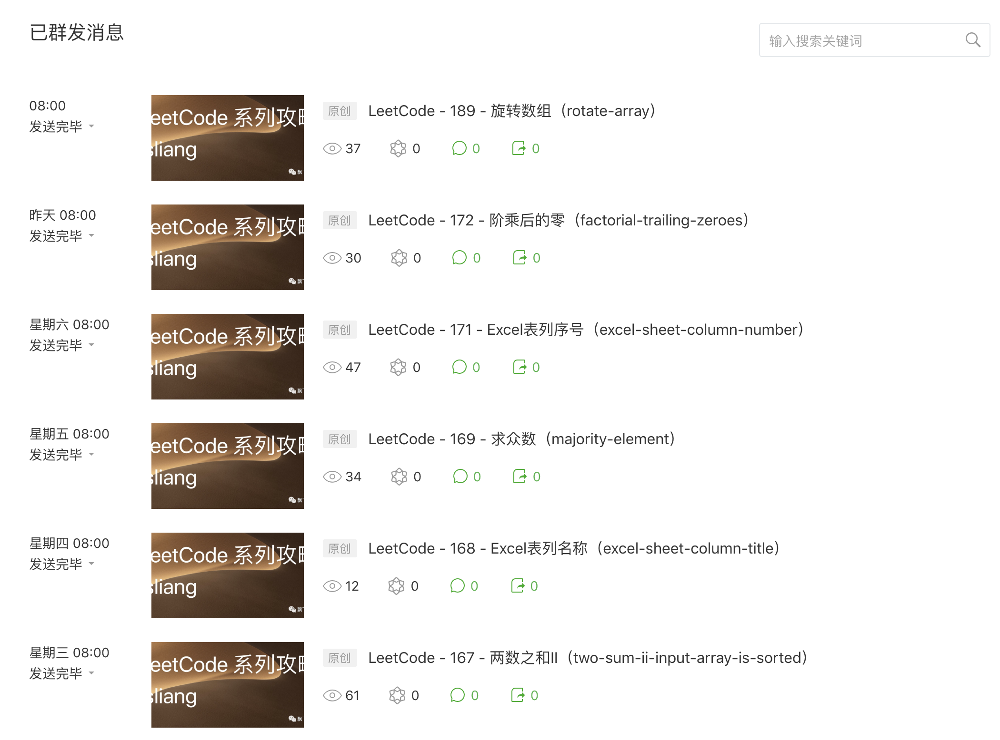
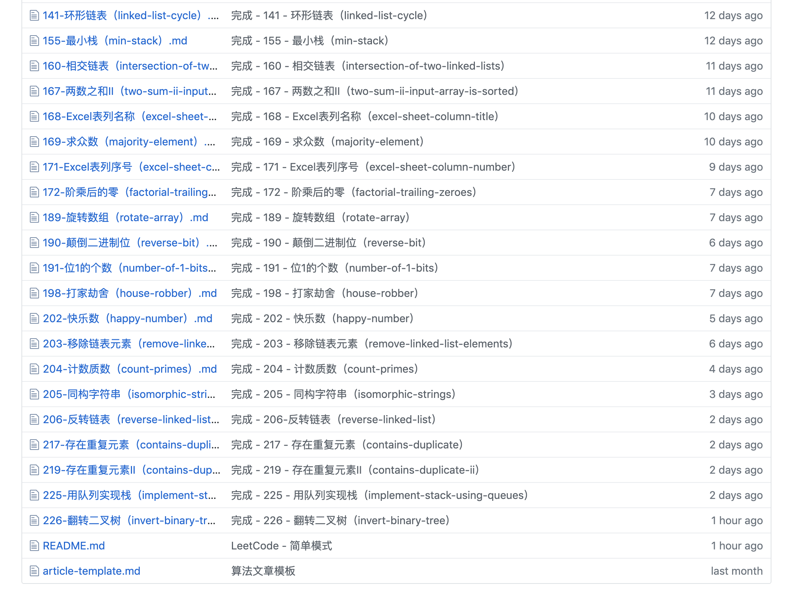

LeetCode 汇总 - 2019/07/30
===

> Create by **jsliang** on **2019-07-30 16:15:37**  
> Recently revised in **2019-07-30 16:38:33**

## <a name="chapter-one" id="chapter-one">一 目录</a>

**不折腾的前端，和咸鱼有什么区别**

| 目录 |
| --- | 
| [一 目录](#chapter-one) | 
| [二 前言](#chapter-two) |
| [三 汇总](#chapter-three) |
| &emsp;[3.1 LeetCode 已攻略](#chapter-three-one) |
| &emsp;[3.2 Function & Object](#chapter-three-two) |
| [四 总结](#chapter-four) |

## <a name="chapter-two" id="chapter-two">二 前言</a>

> [返回目录](#chapter-one)

自 `2019-05-16` 开始，**jsliang** 每天折腾一道及以上 LeetCode 题目，并将其解题思路记录成文章，发布到 GitHub 和 微信公众号。

* 微信公众号记录截图：

* GitHub 记录截图：

目前关于这块 LeetCode（算法与数据结构） 的安排：

1. （完成）`2019/08/15` 前。LeetCode 简单难度题目 - 完成 100 道简单 LeetCode 题目的题解。
2. （准备开始）`2019/08/15` - `2019/09/15`。初步钻研算法与数据结构。
3. 时间未知。LeetCode 中等难度题目 - 完成 50 道中等 LeetCode 题目的题解。
4. 时间未知。进一步钻研算法与数据结构。
5. 时间未知。LeetCode 困难难度题目 - 完成 20 道困难 LeetCode 题目的题解。
6. 时间未知。完善算法与数据结构。

截至目前为止，**jsliang** 在攻略 LeetCode 中的收获：

* JS 基础：ES5、ES6 等的 API，以及它们的应用……
* 解题思维：碰到难点，会先分析这道题的破解方法，然后进一步讲解优化思路……
* 算法与数据结构：双指针、动态规划、链表、二叉树……

所以，如果小伙伴跟 **jsliang** 一样，希望提升下对于原生 JS API 的理解及使用，熟悉算法与数据结构，可以跟紧 **jsliang** 的公众号以及 GitHub：

* 公众号：

* GitHub：[jsliang 的文档库](https://github.com/LiangJunrong/document-library/tree/master/other-library/LeetCode)

## <a name="chapter-three" id="chapter-three">三 汇总</a>

> [返回目录](#chapter-one)

相比于 **jsliang** 的 LeetCode 6 月和 7 月中旬汇总：

* [LeetCode 6 月汇总 - GitHub](https://github.com/LiangJunrong/document-library/blob/master/other-library/LeetCode/LeetCode-summary/2019-06.md)
* [LeetCode 7 月中旬汇总 - GitHub](https://github.com/LiangJunrong/document-library/blob/master/other-library/LeetCode/LeetCode-summary/2019-07-15.md)

* [LeetCode 6 月汇总 - 掘金](https://juejin.im/post/5d15b7d55188255d95141f52)
* [LeetCode 7 月中旬汇总 - 掘金](https://juejin.im/post/5d2c19f45188252d1d5f9307)

LeetCode 由 1114 道题变成了 1134 道题，增加了 20 道题。

**jsliang** 在 LeetCode 简单难度的题解，由 55 道题变成 100 道题，增加了 45 道题的题解。

**jsliang** 在 JavaScript 的基础知识上，增加了几篇基础文章。

### <a name="chapter-three-one" id="chapter-three-one">3.1 LeetCode 已攻略</a>

> [返回目录](#chapter-one)

**jsliang** 目前已攻略 100 道 LeetCode。

如果小伙伴们在攻略 LeetCode 的过程中，想出一些优秀题解，欢迎提交到 Issue，或者直接在 **jsliang** 的小册留言：

* [document.jsliang.top](http://document.jsliang.top/)。

**jsliang** 会根据题解以及留言内容，进行补充，并添加上提供题解的小伙伴的 GitHub 昵称和地址。

那么，话不多说，放列表：

* [001 - 两数之和（two-sum） ✔](https://github.com/LiangJunrong/document-library/blob/master/other-library/LeetCode/easy/001-%E4%B8%A4%E6%95%B0%E4%B9%8B%E5%92%8C%EF%BC%88two-sum%EF%BC%89.md)
* [007 - 整数反转（reverse-integer） ✔](https://github.com/LiangJunrong/document-library/blob/master/other-library/LeetCode/easy/007-%E6%95%B4%E6%95%B0%E5%8F%8D%E8%BD%AC%EF%BC%88reverse-integer%EF%BC%89.md)
* [009 - 回文数（palindrome-number） ✔](https://github.com/LiangJunrong/document-library/blob/master/other-library/LeetCode/easy/009-%E5%9B%9E%E6%96%87%E6%95%B0%EF%BC%88palindrome-number%EF%BC%89.md)
* [013 - 罗马数字转整数（roman-to-integer） ✔](https://github.com/LiangJunrong/document-library/blob/master/other-library/LeetCode/easy/013-%E7%BD%97%E9%A9%AC%E6%95%B0%E5%AD%97%E8%BD%AC%E6%95%B4%E6%95%B0%EF%BC%88roman-to-integer%EF%BC%89.md)
* [014 - 最长公共前缀（longest-common-prefix） ✔](https://github.com/LiangJunrong/document-library/blob/master/other-library/LeetCode/easy/014-%E6%9C%80%E9%95%BF%E5%85%AC%E5%85%B1%E5%89%8D%E7%BC%80%EF%BC%88longest-common-prefix%EF%BC%89.md)
* [020 - 有效的括号（valid-parentheses） ✔](https://github.com/LiangJunrong/document-library/blob/master/other-library/LeetCode/easy/020-%E6%9C%89%E6%95%88%E7%9A%84%E6%8B%AC%E5%8F%B7%EF%BC%88valid-parentheses%EF%BC%89.md)
* [021 - 合并两个有序链表（merge-two-sorted-lists） ✔](https://github.com/LiangJunrong/document-library/blob/master/other-library/LeetCode/easy/021-%E5%90%88%E5%B9%B6%E4%B8%A4%E4%B8%AA%E6%9C%89%E5%BA%8F%E9%93%BE%E8%A1%A8%EF%BC%88merge-two-sorted-lists%EF%BC%89.md)
* [026 - 删除排序数组中的重复项（remove-duplicates-from-sorted-array） ✔](https://github.com/LiangJunrong/document-library/blob/master/other-library/LeetCode/easy/026-%E5%88%A0%E9%99%A4%E6%8E%92%E5%BA%8F%E6%95%B0%E7%BB%84%E4%B8%AD%E7%9A%84%E9%87%8D%E5%A4%8D%E9%A1%B9%EF%BC%88remove-duplicates-from-sorted-array%EF%BC%89.md)
* [027 - 移除元素（remove-element） ✔](https://github.com/LiangJunrong/document-library/blob/master/other-library/LeetCode/easy/027-%E7%A7%BB%E9%99%A4%E5%85%83%E7%B4%A0%EF%BC%88remove-element%EF%BC%89.md)
* [028 - 实现strStr（implement-strstr） ✔](https://github.com/LiangJunrong/document-library/blob/master/other-library/LeetCode/easy/028-%E5%AE%9E%E7%8E%B0strStr%EF%BC%88implement-strstr%EF%BC%89.md)
* [029 - 搜索插入位置（search-insert-position） ✔](https://github.com/LiangJunrong/document-library/blob/master/other-library/LeetCode/easy/029-%E6%90%9C%E7%B4%A2%E6%8F%92%E5%85%A5%E4%BD%8D%E7%BD%AE%EF%BC%88search-insert-position%EF%BC%89.md)
* [038 - 报数（count-and-say） ✔](https://github.com/LiangJunrong/document-library/blob/master/other-library/LeetCode/easy/038-%E6%8A%A5%E6%95%B0%EF%BC%88count-and-say%EF%BC%89.md)
* [053 - 最大子序和（maximum-subarray） ✔](https://github.com/LiangJunrong/document-library/blob/master/other-library/LeetCode/easy/053-%E6%9C%80%E5%A4%A7%E5%AD%90%E5%BA%8F%E5%92%8C%EF%BC%88maximum-subarray%EF%BC%89.md)
* [058 - 最后一个单词的长度（length-of-last-word） ✔](https://github.com/LiangJunrong/document-library/blob/master/other-library/LeetCode/easy/058-%E6%9C%80%E5%90%8E%E4%B8%80%E4%B8%AA%E5%8D%95%E8%AF%8D%E7%9A%84%E9%95%BF%E5%BA%A6%EF%BC%88length-of-last-word%EF%BC%89.md)
* [066 - 加一（plus-one） ✔](https://github.com/LiangJunrong/document-library/blob/master/other-library/LeetCode/easy/066-%E5%8A%A0%E4%B8%80%EF%BC%88plus-one%EF%BC%89.md)
* [067 - 二进制求和（add-binary） ✔](https://github.com/LiangJunrong/document-library/blob/master/other-library/LeetCode/easy/067-%E4%BA%8C%E8%BF%9B%E5%88%B6%E6%B1%82%E5%92%8C%EF%BC%88add-binary%EF%BC%89.md)
* [069 - x 的平方根（sqrtx） ✔](https://github.com/LiangJunrong/document-library/blob/master/other-library/LeetCode/easy/069-x%E7%9A%84%E5%B9%B3%E6%96%B9%E6%A0%B9%EF%BC%88sqrtx%EF%BC%89.md)
* [070 - 爬楼梯（climbing-stairs） ✔]([./other-library/LeetCode/easy/070-爬楼梯（climbing-stairs）.md](https://github.com/LiangJunrong/document-library/blob/master/other-library/LeetCode/easy/070-%E7%88%AC%E6%A5%BC%E6%A2%AF%EF%BC%88climbing-stairs%EF%BC%89.md))
* [083 - 删除排序链表中的重复元素（remove-duplicates-from-sorted-list） ✔](https://github.com/LiangJunrong/document-library/blob/master/other-library/LeetCode/easy/083-%E5%88%A0%E9%99%A4%E6%8E%92%E5%BA%8F%E9%93%BE%E8%A1%A8%E4%B8%AD%E7%9A%84%E9%87%8D%E5%A4%8D%E5%85%83%E7%B4%A0%EF%BC%88remove-duplicates-from-sorted-list%EF%BC%89.md)
* [088 - 合并两个有序数组（merge-sorted-array） ✔](https://github.com/LiangJunrong/document-library/blob/master/other-library/LeetCode/easy/088-%E5%90%88%E5%B9%B6%E4%B8%A4%E4%B8%AA%E6%9C%89%E5%BA%8F%E6%95%B0%E7%BB%84%EF%BC%88merge-sorted-array%EF%BC%89.md)
* [100 - 相同的树（same-tree） ✔]([./other-library/LeetCode/easy/100-相同的树（same-tree）.md](https://github.com/LiangJunrong/document-library/blob/master/other-library/LeetCode/easy/100-%E7%9B%B8%E5%90%8C%E7%9A%84%E6%A0%91%EF%BC%88same-tree%EF%BC%89.md))
* [101 - 对称二叉树（symmetric-tree） ✔](https://github.com/LiangJunrong/document-library/blob/master/other-library/LeetCode/easy/101-%E5%AF%B9%E7%A7%B0%E4%BA%8C%E5%8F%89%E6%A0%91%EF%BC%88symmetric-tree%EF%BC%89.md)
* [104 - 二叉树的最大深度（maximum-depth-of-binary-tree） ✔](https://github.com/LiangJunrong/document-library/blob/master/other-library/LeetCode/easy/104-%E4%BA%8C%E5%8F%89%E6%A0%91%E7%9A%84%E6%9C%80%E5%A4%A7%E6%B7%B1%E5%BA%A6%EF%BC%88maximum-depth-of-binary-tree%EF%BC%89.md)
* [107 - 二叉树的层次遍历 II（binary-tree-level-order-traversal-ii） ✔](https://github.com/LiangJunrong/document-library/blob/master/other-library/LeetCode/easy/107-%E4%BA%8C%E5%8F%89%E6%A0%91%E7%9A%84%E5%B1%82%E6%AC%A1%E9%81%8D%E5%8E%86II%EF%BC%88binary-tree-level-order-traversal-ii%EF%BC%89.md)
* [108 - 将有序数组转换为二叉搜索树（convert-sorted-array-to-binary-search-tree） ✔](https://github.com/LiangJunrong/document-library/blob/master/other-library/LeetCode/easy/108-%E5%B0%86%E6%9C%89%E5%BA%8F%E6%95%B0%E7%BB%84%E8%BD%AC%E6%8D%A2%E4%B8%BA%E4%BA%8C%E5%8F%89%E6%90%9C%E7%B4%A2%E6%A0%91%EF%BC%88convert-sorted-array-to-binary-search-tree%EF%BC%89.md)
* [110 - 平衡二叉树（balanced-binary-tree） ✔](https://github.com/LiangJunrong/document-library/blob/master/other-library/LeetCode/easy/110-%E5%B9%B3%E8%A1%A1%E4%BA%8C%E5%8F%89%E6%A0%91%EF%BC%88balanced-binary-tree%EF%BC%89.md)
* [111 - 二叉树的最小深度（minimum-depth-of-binary-tree） ✔](https://github.com/LiangJunrong/document-library/blob/master/other-library/LeetCode/easy/111-%E4%BA%8C%E5%8F%89%E6%A0%91%E7%9A%84%E6%9C%80%E5%B0%8F%E6%B7%B1%E5%BA%A6%EF%BC%88minimum-depth-of-binary-tree%EF%BC%89.md)
* [112 - 路径总和（path-sum） ✔](https://github.com/LiangJunrong/document-library/blob/master/other-library/LeetCode/easy/112-%E8%B7%AF%E5%BE%84%E6%80%BB%E5%92%8C%EF%BC%88path-sum%EF%BC%89.md)
* [118 - 杨辉三角（pascals-triangle） ✔](https://github.com/LiangJunrong/document-library/blob/master/other-library/LeetCode/easy/118-%E6%9D%A8%E8%BE%89%E4%B8%89%E8%A7%92%EF%BC%88pascals-triangle%EF%BC%89.md)
* [119 - 杨辉三角II（pascals-triangle-ii） ✔](https://github.com/LiangJunrong/document-library/blob/master/other-library/LeetCode/easy/119-%E6%9D%A8%E8%BE%89%E4%B8%89%E8%A7%92II%EF%BC%88pascals-triangle-ii%EF%BC%89.md)
* [121 - 买卖股票的最佳时机（best-time-to-buy-and-sell-stock） ✔](https://github.com/LiangJunrong/document-library/blob/master/other-library/LeetCode/easy/121-%E4%B9%B0%E5%8D%96%E8%82%A1%E7%A5%A8%E7%9A%84%E6%9C%80%E4%BD%B3%E6%97%B6%E6%9C%BA%EF%BC%88best-time-to-buy-and-sell-stock%EF%BC%89.md)
* [122 - 买卖股票的最佳时机II（best-time-to-buy-and-sell-stock-ii） ✔](https://github.com/LiangJunrong/document-library/blob/master/other-library/LeetCode/easy/122-%E4%B9%B0%E5%8D%96%E8%82%A1%E7%A5%A8%E7%9A%84%E6%9C%80%E4%BD%B3%E6%97%B6%E6%9C%BAII%EF%BC%88best-time-to-buy-and-sell-stock-ii%EF%BC%89.md)
* [125 - 验证回文串（valid-palindrome） ✔](https://github.com/LiangJunrong/document-library/blob/master/other-library/LeetCode/easy/125-%E9%AA%8C%E8%AF%81%E5%9B%9E%E6%96%87%E4%B8%B2%EF%BC%88valid-palindrome%EF%BC%89.md)
* [136 - 只出现一次的数字（single-number） ✔](https://github.com/LiangJunrong/document-library/blob/master/other-library/LeetCode/easy/136-%E5%8F%AA%E5%87%BA%E7%8E%B0%E4%B8%80%E6%AC%A1%E7%9A%84%E6%95%B0%E5%AD%97%EF%BC%88single-number%EF%BC%89.md)
* [141 - 环形链表（linked-list-cycle） ✔](https://github.com/LiangJunrong/document-library/blob/master/other-library/LeetCode/easy/141-%E7%8E%AF%E5%BD%A2%E9%93%BE%E8%A1%A8%EF%BC%88linked-list-cycle%EF%BC%89.md)
* [155 - 最小栈（min-stack） ✔](https://github.com/LiangJunrong/document-library/blob/master/other-library/LeetCode/easy/155-%E6%9C%80%E5%B0%8F%E6%A0%88%EF%BC%88min-stack%EF%BC%89.md)
* [160 - 相交链表（intersection-of-two-linked-lists） ✔](https://github.com/LiangJunrong/document-library/blob/master/other-library/LeetCode/easy/160-%E7%9B%B8%E4%BA%A4%E9%93%BE%E8%A1%A8%EF%BC%88intersection-of-two-linked-lists%EF%BC%89.md)
* [167 - 两数之和II（two-sum-ii-input-array-is-sorted） ✔](https://github.com/LiangJunrong/document-library/blob/master/other-library/LeetCode/easy/167-%E4%B8%A4%E6%95%B0%E4%B9%8B%E5%92%8CII%EF%BC%88two-sum-ii-input-array-is-sorted%EF%BC%89.md)
* [168 - Excel表列名称（excel-sheet-column-title） ✔](https://github.com/LiangJunrong/document-library/blob/master/other-library/LeetCode/easy/168-Excel%E8%A1%A8%E5%88%97%E5%90%8D%E7%A7%B0%EF%BC%88excel-sheet-column-title%EF%BC%89.md)
* [169 - 求众数（majority-element） ✔](https://github.com/LiangJunrong/document-library/blob/master/other-library/LeetCode/easy/169-%E6%B1%82%E4%BC%97%E6%95%B0%EF%BC%88majority-element%EF%BC%89.md)
* [171 - Excel表列序号（excel-sheet-column-number） ✔](https://github.com/LiangJunrong/document-library/blob/master/other-library/LeetCode/easy/171-Excel%E8%A1%A8%E5%88%97%E5%BA%8F%E5%8F%B7%EF%BC%88excel-sheet-column-number%EF%BC%89.md)
* [172 - 阶乘后的零（factorial-trailing-zeroes） ✔](https://github.com/LiangJunrong/document-library/blob/master/other-library/LeetCode/easy/172-%E9%98%B6%E4%B9%98%E5%90%8E%E7%9A%84%E9%9B%B6%EF%BC%88factorial-trailing-zeroes%EF%BC%89.md)
* [189 - 旋转数组（rotate-array） ✔](https://github.com/LiangJunrong/document-library/blob/master/other-library/LeetCode/easy/189-%E6%97%8B%E8%BD%AC%E6%95%B0%E7%BB%84%EF%BC%88rotate-array%EF%BC%89.md)
* [190 - 颠倒二进制位（reverse-bit） ✔](https://github.com/LiangJunrong/document-library/blob/master/other-library/LeetCode/easy/190-%E9%A2%A0%E5%80%92%E4%BA%8C%E8%BF%9B%E5%88%B6%E4%BD%8D%EF%BC%88reverse-bit%EF%BC%89.md)
* [191 - 位1的个数（number-of-1-bits） ✔](https://github.com/LiangJunrong/document-library/blob/master/other-library/LeetCode/easy/191-%E4%BD%8D1%E7%9A%84%E4%B8%AA%E6%95%B0%EF%BC%88number-of-1-bits%EF%BC%89.md)
* [198 - 打家劫舍（house-robber） ✔](https://github.com/LiangJunrong/document-library/blob/master/other-library/LeetCode/easy/198-%E6%89%93%E5%AE%B6%E5%8A%AB%E8%88%8D%EF%BC%88house-robber%EF%BC%89.md)
* [202 - 快乐数（happy-number） ✔](https://github.com/LiangJunrong/document-library/blob/master/other-library/LeetCode/easy/202-%E5%BF%AB%E4%B9%90%E6%95%B0%EF%BC%88happy-number%EF%BC%89.md)
* [203 - 移除链表元素（remove-linked-list-elements） ✔](https://github.com/LiangJunrong/document-library/blob/master/other-library/LeetCode/easy/203-%E7%A7%BB%E9%99%A4%E9%93%BE%E8%A1%A8%E5%85%83%E7%B4%A0%EF%BC%88remove-linked-list-elements%EF%BC%89.md)
* [204 - 计数质数（count-primes） ✔](https://github.com/LiangJunrong/document-library/blob/master/other-library/LeetCode/easy/204-%E8%AE%A1%E6%95%B0%E8%B4%A8%E6%95%B0%EF%BC%88count-primes%EF%BC%89.md)
* [205 - 同构字符串（isomorphic-strings） ✔](https://github.com/LiangJunrong/document-library/blob/master/other-library/LeetCode/easy/205-%E5%90%8C%E6%9E%84%E5%AD%97%E7%AC%A6%E4%B8%B2%EF%BC%88isomorphic-strings%EF%BC%89.md)
* [206 - 反转链表（reverse-linked-list） ✔](https://github.com/LiangJunrong/document-library/blob/master/other-library/LeetCode/easy/206-%E5%8F%8D%E8%BD%AC%E9%93%BE%E8%A1%A8%EF%BC%88reverse-linked-list%EF%BC%89.md)
* [217 - 存在重复元素（contains-duplicate） ✔](https://github.com/LiangJunrong/document-library/blob/master/other-library/LeetCode/easy/217-%E5%AD%98%E5%9C%A8%E9%87%8D%E5%A4%8D%E5%85%83%E7%B4%A0%EF%BC%88contains-duplicate%EF%BC%89.md)
* [219 - 存在重复元素II（contains-duplicate-ii） ✔](https://github.com/LiangJunrong/document-library/blob/master/other-library/LeetCode/easy/219-%E5%AD%98%E5%9C%A8%E9%87%8D%E5%A4%8D%E5%85%83%E7%B4%A0II%EF%BC%88contains-duplicate-ii%EF%BC%89.md)
* [225 - 用队列实现栈（implement-stack-using-queues） ✔](https://github.com/LiangJunrong/document-library/blob/master/other-library/LeetCode/easy/225-%E7%94%A8%E9%98%9F%E5%88%97%E5%AE%9E%E7%8E%B0%E6%A0%88%EF%BC%88implement-stack-using-queues%EF%BC%89.md)
* [226 - 翻转二叉树（invert-binary-tree） ✔](https://github.com/LiangJunrong/document-library/blob/master/other-library/LeetCode/easy/226-%E7%BF%BB%E8%BD%AC%E4%BA%8C%E5%8F%89%E6%A0%91%EF%BC%88invert-binary-tree%EF%BC%89.md)
* [231 - 2的幂（power-of-two） ✔](https://github.com/LiangJunrong/document-library/blob/master/other-library/LeetCode/easy/231-2%E7%9A%84%E5%B9%82%EF%BC%88power-of-two%EF%BC%89.md)
* [232 - 用栈实现队列（implement-queue-using-stacks） ✔](https://github.com/LiangJunrong/document-library/blob/master/other-library/LeetCode/easy/232-%E7%94%A8%E6%A0%88%E5%AE%9E%E7%8E%B0%E9%98%9F%E5%88%97%EF%BC%88implement-queue-using-stacks%EF%BC%89.md)
* [234 - 回文链表（palindrome-linked-list） ✔](https://github.com/LiangJunrong/document-library/blob/master/other-library/LeetCode/easy/234-%E5%9B%9E%E6%96%87%E9%93%BE%E8%A1%A8%EF%BC%88palindrome-linked-list%EF%BC%89.md)
* [二叉树的最近公共祖先（lowest-common-ancestor-of-a-binary-search-tree） ✔](https://github.com/LiangJunrong/document-library/blob/master/other-library/LeetCode/easy/235-%E4%BA%8C%E5%8F%89%E6%A0%91%E7%9A%84%E6%9C%80%E8%BF%91%E5%85%AC%E5%85%B1%E7%A5%96%E5%85%88%EF%BC%88lowest-common-ancestor-of-a-binary-search-tree%EF%BC%89.md)
* [237 - 删除链表中的节点（delete-node-in-a-linked-list） ✔](https://github.com/LiangJunrong/document-library/blob/master/other-library/LeetCode/easy/237-%E5%88%A0%E9%99%A4%E9%93%BE%E8%A1%A8%E4%B8%AD%E7%9A%84%E8%8A%82%E7%82%B9%EF%BC%88delete-node-in-a-linked-list%EF%BC%89.md)
* [242 - 有效的字母异位词（valid-anagram） ✔](https://github.com/LiangJunrong/document-library/blob/master/other-library/LeetCode/easy/242-%E6%9C%89%E6%95%88%E7%9A%84%E5%AD%97%E6%AF%8D%E5%BC%82%E4%BD%8D%E8%AF%8D%EF%BC%88valid-anagram%EF%BC%89.md)
* [257 - 二叉树的所有路径（binary-tree-paths） ✔](https://github.com/LiangJunrong/document-library/blob/master/other-library/LeetCode/easy/257-%E4%BA%8C%E5%8F%89%E6%A0%91%E7%9A%84%E6%89%80%E6%9C%89%E8%B7%AF%E5%BE%84%EF%BC%88binary-tree-paths%EF%BC%89.md)
* [258 - 各位相加（add-digits） ✔](https://github.com/LiangJunrong/document-library/blob/master/other-library/LeetCode/easy/258-%E5%90%84%E4%BD%8D%E7%9B%B8%E5%8A%A0%EF%BC%88add-digits%EF%BC%89.md)
* [263 - 丑数（ugly-number） ✔](https://github.com/LiangJunrong/document-library/blob/master/other-library/LeetCode/easy/263-%E4%B8%91%E6%95%B0%EF%BC%88ugly-number%EF%BC%89.md)
* [268 - 缺失数字（missing-number） ✔](https://github.com/LiangJunrong/document-library/blob/master/other-library/LeetCode/easy/268-%E7%BC%BA%E5%A4%B1%E6%95%B0%E5%AD%97%EF%BC%88missing-number%EF%BC%89.md)
* [278 - 第一个错误的版本（first-bad-version） ✔](https://github.com/LiangJunrong/document-library/blob/master/other-library/LeetCode/easy/278-%E7%AC%AC%E4%B8%80%E4%B8%AA%E9%94%99%E8%AF%AF%E7%9A%84%E7%89%88%E6%9C%AC%EF%BC%88first-bad-version%EF%BC%89.md)
* [283 - 移动零（move-zeroes） ✔](https://github.com/LiangJunrong/document-library/blob/master/other-library/LeetCode/easy/283-%E7%A7%BB%E5%8A%A8%E9%9B%B6%EF%BC%88move-zeroes%EF%BC%89.md)
* [290 - 单词规律（word-pattern） ✔](https://github.com/LiangJunrong/document-library/blob/master/other-library/LeetCode/easy/290-%E5%8D%95%E8%AF%8D%E8%A7%84%E5%BE%8B%EF%BC%88word-pattern%EF%BC%89.md)
* [292 - Nim游戏（nim-game） ✔](https://github.com/LiangJunrong/document-library/blob/master/other-library/LeetCode/easy/292-Nim%E6%B8%B8%E6%88%8F%EF%BC%88nim-game%EF%BC%89.md)
* [303 - 区域和检索之数组不可变（range-sum-query-immutable） ✔](https://github.com/LiangJunrong/document-library/blob/master/other-library/LeetCode/easy/303-%E5%8C%BA%E5%9F%9F%E5%92%8C%E6%A3%80%E7%B4%A2%E4%B9%8B%E6%95%B0%E7%BB%84%E4%B8%8D%E5%8F%AF%E5%8F%98%EF%BC%88range-sum-query-immutable%EF%BC%89.md)
* [326 - 3的幂（power-of-three） ✔](https://github.com/LiangJunrong/document-library/blob/master/other-library/LeetCode/easy/326-3%E7%9A%84%E5%B9%82%EF%BC%88power-of-three%EF%BC%89.md)
* [342 - 4的幂（power-of-four） ✔](https://github.com/LiangJunrong/document-library/blob/master/other-library/LeetCode/easy/342-4%E7%9A%84%E5%B9%82%EF%BC%88power-of-four%EF%BC%89.md)
* [344 - 反转字符串（reverse-string） ✔](https://github.com/LiangJunrong/document-library/blob/master/other-library/LeetCode/easy/344-%E5%8F%8D%E8%BD%AC%E5%AD%97%E7%AC%A6%E4%B8%B2%EF%BC%88reverse-string%EF%BC%89.md)
* [345 - 反转字符串中的元音字母（reverse-vowels-of-a-string） ✔](https://github.com/LiangJunrong/document-library/blob/master/other-library/LeetCode/easy/345-%E5%8F%8D%E8%BD%AC%E5%AD%97%E7%AC%A6%E4%B8%B2%E4%B8%AD%E7%9A%84%E5%85%83%E9%9F%B3%E5%AD%97%E6%AF%8D%EF%BC%88reverse-vowels-of-a-string%EF%BC%89.md)
* [349 - 两个数组的交集（intersection-of-two-arrays） ✔](https://github.com/LiangJunrong/document-library/blob/master/other-library/LeetCode/easy/349-%E4%B8%A4%E4%B8%AA%E6%95%B0%E7%BB%84%E7%9A%84%E4%BA%A4%E9%9B%86%EF%BC%88intersection-of-two-arrays%EF%BC%89.md)
* [350 - 两个数组的交集II（intersection-of-two-arrays-ii） ✔](https://github.com/LiangJunrong/document-library/blob/master/other-library/LeetCode/easy/350-%E4%B8%A4%E4%B8%AA%E6%95%B0%E7%BB%84%E7%9A%84%E4%BA%A4%E9%9B%86II%EF%BC%88intersection-of-two-arrays-ii%EF%BC%89.md)
* [367 - 有效的完全平方数（valid-perfect-square） ✔](https://github.com/LiangJunrong/document-library/blob/master/other-library/LeetCode/easy/367-%E6%9C%89%E6%95%88%E7%9A%84%E5%AE%8C%E5%85%A8%E5%B9%B3%E6%96%B9%E6%95%B0%EF%BC%88valid-perfect-square%EF%BC%89.md)
* [371 - 两整数之和（sum-of-two-integers） ✔](https://github.com/LiangJunrong/document-library/blob/master/other-library/LeetCode/easy/371-%E4%B8%A4%E6%95%B4%E6%95%B0%E4%B9%8B%E5%92%8C%EF%BC%88sum-of-two-integers%EF%BC%89.md)
* [383 - 赎金信（ransom-note） ✔](https://github.com/LiangJunrong/document-library/blob/master/other-library/LeetCode/easy/383-%E8%B5%8E%E9%87%91%E4%BF%A1%EF%BC%88ransom-note%EF%BC%89.md)
* [387 - 字符串中的第一个唯一字符（first-unique-character-in-a-string） ✔](https://github.com/LiangJunrong/document-library/blob/master/other-library/LeetCode/easy/387-%E5%AD%97%E7%AC%A6%E4%B8%B2%E4%B8%AD%E7%9A%84%E7%AC%AC%E4%B8%80%E4%B8%AA%E5%94%AF%E4%B8%80%E5%AD%97%E7%AC%A6%EF%BC%88first-unique-character-in-a-string%EF%BC%89.md)
* [389 - 找不同（find-the-difference） ✔](https://github.com/LiangJunrong/document-library/blob/master/other-library/LeetCode/easy/389-%E6%89%BE%E4%B8%8D%E5%90%8C%EF%BC%88find-the-difference%EF%BC%89.md)
* [400 - 第N个数字（nth-digit） ✔](https://github.com/LiangJunrong/document-library/blob/master/other-library/LeetCode/easy/400-%E7%AC%ACN%E4%B8%AA%E6%95%B0%E5%AD%97%EF%BC%88nth-digit%EF%BC%89.md)
* [401 - 二进制手表（binary-watch） ✔](https://github.com/LiangJunrong/document-library/blob/master/other-library/LeetCode/easy/401-%E4%BA%8C%E8%BF%9B%E5%88%B6%E6%89%8B%E8%A1%A8%EF%BC%88binary-watch%EF%BC%89.md)
* [404 - 左叶子之和（sum-of-left-leaves） ✔](https://github.com/LiangJunrong/document-library/blob/master/other-library/LeetCode/easy/404-%E5%B7%A6%E5%8F%B6%E5%AD%90%E4%B9%8B%E5%92%8C%EF%BC%88sum-of-left-leaves%EF%BC%89.md)
* [405 - 数字转换为十六进制（convert-a-number-to-hexadecimal） ✔](https://github.com/LiangJunrong/document-library/blob/master/other-library/LeetCode/easy/405-%E6%95%B0%E5%AD%97%E8%BD%AC%E6%8D%A2%E4%B8%BA%E5%8D%81%E5%85%AD%E8%BF%9B%E5%88%B6%EF%BC%88convert-a-number-to-hexadecimal%EF%BC%89.md)
* [409 - 最长回文串（longest-palindrome） ✔](https://github.com/LiangJunrong/document-library/blob/master/other-library/LeetCode/easy/409-%E6%9C%80%E9%95%BF%E5%9B%9E%E6%96%87%E4%B8%B2%EF%BC%88longest-palindrome%EF%BC%89.md)
* [412 - FizzBuzz（fizz-buzz） ✔](https://github.com/LiangJunrong/document-library/blob/master/other-library/LeetCode/easy/412-FizzBuzz%EF%BC%88fizz-buzz%EF%BC%89.md)
* [414 - 第三大的数（third-maximum-number） ✔](https://github.com/LiangJunrong/document-library/blob/master/other-library/LeetCode/easy/414-%E7%AC%AC%E4%B8%89%E5%A4%A7%E7%9A%84%E6%95%B0%EF%BC%88third-maximum-number%EF%BC%89.md)
* [415 - 字符串相加（add-strings） ✔](https://github.com/LiangJunrong/document-library/blob/master/other-library/LeetCode/easy/415-%E5%AD%97%E7%AC%A6%E4%B8%B2%E7%9B%B8%E5%8A%A0%EF%BC%88add-strings%EF%BC%89.md)
* [429 - n叉树的层序遍历（n-ary-tree-level-order-traversal） ✔](https://github.com/LiangJunrong/document-library/blob/master/other-library/LeetCode/easy/429-n%E5%8F%89%E6%A0%91%E7%9A%84%E5%B1%82%E5%BA%8F%E9%81%8D%E5%8E%86%EF%BC%88n-ary-tree-level-order-traversal%EF%BC%89.md)
* [434 - 字符串中的单词数（number-of-segments-in-a-string） ✔](https://github.com/LiangJunrong/document-library/blob/master/other-library/LeetCode/easy/434-%E5%AD%97%E7%AC%A6%E4%B8%B2%E4%B8%AD%E7%9A%84%E5%8D%95%E8%AF%8D%E6%95%B0%EF%BC%88number-of-segments-in-a-string%EF%BC%89.md)
* [437 - 路径总和III（path-sum-iii） ✔](https://github.com/LiangJunrong/document-library/blob/master/other-library/LeetCode/easy/437-%E8%B7%AF%E5%BE%84%E6%80%BB%E5%92%8CIII%EF%BC%88path-sum-iii%EF%BC%89.md)
* [438 - 找到字符串中所有字母异位词（find-all-anagrams-in-a-string） ✔](https://github.com/LiangJunrong/document-library/blob/master/other-library/LeetCode/easy/438-%E6%89%BE%E5%88%B0%E5%AD%97%E7%AC%A6%E4%B8%B2%E4%B8%AD%E6%89%80%E6%9C%89%E5%AD%97%E6%AF%8D%E5%BC%82%E4%BD%8D%E8%AF%8D%EF%BC%88find-all-anagrams-in-a-string%EF%BC%89.md)
* [441 - 排列硬币（arranging-coins） ✔](https://github.com/LiangJunrong/document-library/blob/master/other-library/LeetCode/easy/441-%E6%8E%92%E5%88%97%E7%A1%AC%E5%B8%81%EF%BC%88arranging-coins%EF%BC%89.md)
* [443 - 压缩字符串（string-compression） ✔](https://github.com/LiangJunrong/document-library/blob/master/other-library/LeetCode/easy/443-%E5%8E%8B%E7%BC%A9%E5%AD%97%E7%AC%A6%E4%B8%B2%EF%BC%88string-compression%EF%BC%89.md)
* [447 - 回旋镖的数量（number-of-boomerangs） ✔](https://github.com/LiangJunrong/document-library/blob/master/other-library/LeetCode/easy/447-%E5%9B%9E%E6%97%8B%E9%95%96%E7%9A%84%E6%95%B0%E9%87%8F%EF%BC%88number-of-boomerangs%EF%BC%89.md)
* [448 - 找出所有数组中消失的数字（find-all-numbers-disappeared-in-an-array） ✔](https://github.com/LiangJunrong/document-library/blob/master/other-library/LeetCode/easy/448-%E6%89%BE%E5%87%BA%E6%89%80%E6%9C%89%E6%95%B0%E7%BB%84%E4%B8%AD%E6%B6%88%E5%A4%B1%E7%9A%84%E6%95%B0%E5%AD%97%EF%BC%88find-all-numbers-disappeared-in-an-array%EF%BC%89.md)
* [453 - 最小移动次数使数组元素相等（minimum-moves-to-equal-array-elements） ✔](https://github.com/LiangJunrong/document-library/blob/master/other-library/LeetCode/easy/453-%E6%9C%80%E5%B0%8F%E7%A7%BB%E5%8A%A8%E6%AC%A1%E6%95%B0%E4%BD%BF%E6%95%B0%E7%BB%84%E5%85%83%E7%B4%A0%E7%9B%B8%E7%AD%89%EF%BC%88minimum-moves-to-equal-array-elements%EF%BC%89.md)
* [455 - 分发饼干（assign-cookies） ✔](https://github.com/LiangJunrong/document-library/blob/master/other-library/LeetCode/easy/455-%E5%88%86%E5%8F%91%E9%A5%BC%E5%B9%B2%EF%BC%88assign-cookies%EF%BC%89.md)
* [459 - 重复的字符串（repeated-substring-pattern） ✔](https://github.com/LiangJunrong/document-library/blob/master/other-library/LeetCode/easy/459-%E9%87%8D%E5%A4%8D%E7%9A%84%E5%AD%97%E7%AC%A6%E4%B8%B2%EF%BC%88repeated-substring-pattern%EF%BC%89.md)

### <a name="chapter-three-two" id="chapter-three-two">3.2 Function & Object</a>

> [返回目录](#chapter-one)

在刷 LeetCode 的过程中，接触了原生 JS 的一些方法和对象，推荐小伙伴们结合 LeetCode 的题解进行食用，毕竟：

* **没用上的知识点，都是脑中的垃圾**

#### Function - 方法

* [方法 - charCodeAt()](https://github.com/LiangJunrong/document-library/blob/master/JavaScript-library/JavaScript/Function/charCodeAt.md)
* [方法 - filter()](https://github.com/LiangJunrong/document-library/blob/master/JavaScript-library/JavaScript/Function/filter.md)
* [方法 - forEach()](https://github.com/LiangJunrong/document-library/blob/master/JavaScript-library/JavaScript/Function/forEach.md)
* [方法 - fromCharCode()](https://github.com/LiangJunrong/document-library/blob/master/JavaScript-library/JavaScript/Function/fromCharCode.md)
* [方法 - indexOf()](https://github.com/LiangJunrong/document-library/blob/master/JavaScript-library/JavaScript/Function/indexOf.md)
* [方法 - join()](https://github.com/LiangJunrong/document-library/blob/master/JavaScript-library/JavaScript/Function/join.md)
* [方法 - map()](https://github.com/LiangJunrong/document-library/blob/master/JavaScript-library/JavaScript/Function/map.md)
* [方法 - padStart()](https://github.com/LiangJunrong/document-library/blob/master/JavaScript-library/JavaScript/Function/padStart.md)
* [方法 - parseInt()](https://github.com/LiangJunrong/document-library/blob/master/JavaScript-library/JavaScript/Function/parseInt.md)
* [方法 - pop()](https://github.com/LiangJunrong/document-library/blob/master/JavaScript-library/JavaScript/Function/pop.md)
* [方法 - push()](https://github.com/LiangJunrong/document-library/blob/master/JavaScript-library/JavaScript/Function/push.md)
* [方法 - reduce()](https://github.com/LiangJunrong/document-library/blob/master/JavaScript-library/JavaScript/Function/reduce.md)
* [方法 - reverse()](https://github.com/LiangJunrong/document-library/blob/master/JavaScript-library/JavaScript/Function/reverse.md)
* [方法 - shift()](https://github.com/LiangJunrong/document-library/blob/master/JavaScript-library/JavaScript/Function/shift.md)
* [方法 - slice()](https://github.com/LiangJunrong/document-library/blob/master/JavaScript-library/JavaScript/Function/slice.md)
* [方法 - sort()](https://github.com/LiangJunrong/document-library/blob/master/JavaScript-library/JavaScript/Function/sort.md)
* [方法 - splice()](https://github.com/LiangJunrong/document-library/blob/master/JavaScript-library/JavaScript/Function/splice.md)
* [方法 - split()](https://github.com/LiangJunrong/document-library/blob/master/JavaScript-library/JavaScript/Function/split.md)
* [方法 - substring()](https://github.com/LiangJunrong/document-library/blob/master/JavaScript-library/JavaScript/Function/substring.md)
* [方法 - toLocaleLowerCase()](https://github.com/LiangJunrong/document-library/blob/master/JavaScript-library/JavaScript/Function/toLocaleLowerCase.md)
* [方法 - toString()](https://github.com/LiangJunrong/document-library/blob/master/JavaScript-library/JavaScript/Function/toString.md)
* [方法 - unshift()](https://github.com/LiangJunrong/document-library/blob/master/JavaScript-library/JavaScript/Function/unshift.md)

#### Object - 对象

* [对象 - Map](https://github.com/LiangJunrong/document-library/blob/master/JavaScript-library/JavaScript/Object/Map.md)
* [对象 - Math](https://github.com/LiangJunrong/document-library/blob/master/JavaScript-library/JavaScript/Object/Math.md)
* [对象 - Number](https://github.com/LiangJunrong/document-library/blob/master/JavaScript-library/JavaScript/Object/Number.md)
* [对象 - RegExp](https://github.com/LiangJunrong/document-library/blob/master/JavaScript-library/JavaScript/Object/RegExp.md)
* [对象 - Set](https://github.com/LiangJunrong/document-library/blob/master/JavaScript-library/JavaScript/Object/Set.md)
* [对象 - String](https://github.com/LiangJunrong/document-library/blob/master/JavaScript-library/JavaScript/Object/String.md)

## <a name="chapter-four" id="chapter-four">四 总结</a>

> [返回目录](#chapter-one)

知识的增加并非一朝一夕的事，**jsliang** 在今天以前，每天早上 `7:30 - 9:00` 会攻略一道简单难度的 LeetCode，并将自己的思路，通过文章的形式记录下来。

至于之后中等难度、高级难度的规划，会循序渐进地攻略，感兴趣的小伙伴们可以持续关注我的 GitHub、掘金、公众号：

* [GitHub - jsliang 的文档库](https://github.com/LiangJunrong/document-library)
* [掘金 - jsliang](https://juejin.im/user/584613ba128fe10058b3cf68/posts)
* 公众号 - 飘飞的心灵

同时，欢迎小伙伴们加 **jsliang** 微信一起探讨：

> 默认会拉你进微信群，并且推荐公众号给小伙伴

最后，**jsliang** 会吸取身边一些小伙伴的优秀文章，跟小伙伴们一起学习折腾。

如果你感觉自己的文章也不错，欢迎分享：

【推荐】[前端面试每日3+1](https://github.com/haizlin/fe-interview)，以面试题来驱动学习，坚持每天学习与思考，每天进步一点！

* [Vue 220+ 个知识点（面试题）为你保驾护航](https://juejin.im/post/5d153267e51d4510624f9809)
* [前端面试每日3+1（周汇总2019.07.14）](https://juejin.im/post/5d2a4692e51d4576bc1a0e9a)
* [前端面试每日3+1（周汇总2019.07.28）](https://juejin.im/post/5d3d57d7f265da1b80208ec2)

>  jsliang 的文档库 由 <a xmlns:cc="http://creativecommons.org/ns#" href="https://github.com/LiangJunrong/document-library" property="cc:attributionName" rel="cc:attributionURL">梁峻荣</a> 采用 <a rel="license" href="http://creativecommons.org/licenses/by-nc-sa/4.0/">知识共享 署名-非商业性使用-相同方式共享 4.0 国际 许可协议</a>进行许可。 基于<a xmlns:dct="http://purl.org/dc/terms/" href="https://github.com/LiangJunrong/document-library" rel="dct:source">https://github.com/LiangJunrong/document-library</a>上的作品创作。 本许可协议授权之外的使用权限可以从 <a xmlns:cc="http://creativecommons.org/ns#" href="https://creativecommons.org/licenses/by-nc-sa/2.5/cn/" rel="cc:morePermissions">https://creativecommons.org/licenses/by-nc-sa/2.5/cn/</a> 处获得。