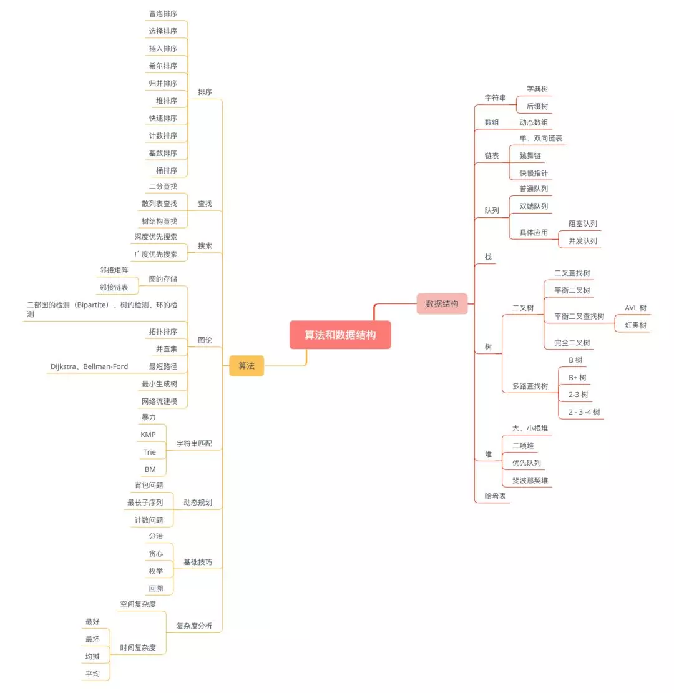

算法与数据结构
===

> Create by **jsliang** on **2019-06-13 09:00:29**  
> Recently revised in **2020-3-22 18:15:48**

## <a name="chapter-one" id="chapter-one">一 目录</a>

**不折腾的前端，和咸鱼有什么区别**

| 目录 |
| --- | 
| [一 目录](#chapter-one) | 
| [二 前言](#chapter-two) |
| [三 算法与数据结构](#chapter-three) |
| &emsp;[3.1 算法](#chapter-three-one) |
| &emsp;[3.2 数据结构](#chapter-three-two) |
| [四 系列探索目录](#chapter-four) |

## <a name="chapter-two" id="chapter-two">二 前言</a>

> [返回目录](#chapter-one)

Hello 小伙伴们上午好、中午好、下午好、晚上好，我是 **jsliang**，因为目前主要搞前端，所以全称 **JavaScriptLiang**，本系列文章讲解的是【算法与数据结构】，阅读当中如发现有出错，请留言/评论指出。

如果你是前端新人，**jsliang** 并不建议你过早接触算法与数据结构，而是先自己从 产品、UI、前端、后端、数据库、运营 的角度写一个网站/小程序/App（尽量将这些职位体验一下）。

如果你是前端老人，那么建议你先过一遍 LeetCode，将【简单】难度的前面 100 题刷一下，期间记得做笔记，将碰到的知识点记录下来，然后再看本系列文章，你会恍然大悟：原来是这么回事。

## <a name="chapter-three" id="chapter-three">三 算法与数据结构</a>

> [返回目录](#chapter-one)

开篇点题：什么是算法与数据结构？

回答：这是两个词，**算法**，以及 **数据结构**。

### <a name="chapter-three-one" id="chapter-three-one">3.1 算法</a>

> [返回目录](#chapter-one)

什么是算法？

算法（Algorithm）是指解题方案的准确而完整的描述，是一系列解决问题的清晰指令，算法代表着用系统的方法描述解决问题的策略机制。也就是说，能够对一定规范的输入，在有限时间内获得所要求的输出。如果一个算法有缺陷，或不适合于某个问题，执行这个算法将不会解决这个问题。【百度百科】

当然，如果面试的时候你这么对面试官说，面试官第一句回复可能就是让你回去等通知了。

那么，怎么简单描述呢？**jsliang** 认为：

* 针对某一个问题，实现的一种便捷有效的解法，就是算法。

例如我们要给一组数字从小到大排序，那么我们可能会使用冒泡算法，将数字两两比较，然后将小的放在前面。

又比如，我们有一串排序好的数字，`[1, 4, 8, 10, 20, 30……]`，我们需要插入某个值，例如 15，那么我们可能会使用二分搜索法，通过 **折半** 数据来快读定位。

当然，这些都是基础算法，如果非要让你显得牛 B 一点的话，你可以跟面试官或者朋友讨论下 **阿尔法狗（AlphaGo）** 的 **蒙特卡洛树搜索（Monte Carlo tree search）**。

### <a name="chapter-three-two" id="chapter-three-two">3.2 数据结构</a>

> [返回目录](#chapter-one)

什么是数据结构？

数据结构是计算机存储、组织数据的方式。数据结构是指相互之间存在一种或多种特定关系的数据元素的集合。通常情况下，精心选择的数据结构可以带来更高的运行或者存储效率。数据结构往往同高效的检索算法和索引技术有关。【百度百科】

当然，这里还是不建议强行背下这段定义，可以看看我的观点。**jsliang** 认为：

* 为适应某种情形，在计算机中使用不同的结构来表示某个数据，就是数据结构。

比如，你想跟你女票表达爱意，你可能会发个短信给她：`'I love you'`。很好，字符串。

又比如，你想展示一周的天气，你可能会发上：`[26, 27, 24, 25, 26]`。很好，数组。

就好比写篇文章你可能用 Word，写个报表你会用 Excel，我们在面对不同的内容的时候，也会选择不同的数据结构，从而达到最优的存储方式。

## <a name="chapter-four" id="chapter-four">四 系列探索目录</a>

> [返回目录](#chapter-one)

当然，在上面，我们仅提到算法和数据结构是什么，并没有提到它们有什么用。

虽然我很想说他们在普通前端日常工作中可能没什么 luan 用，但是，总还是有用的：

* 算法：前端制作游戏、实现某些复杂的逻辑等都会使用到，好处在于提升性能，优化逻辑 bug。
* 数据结构：减少业务性能的浪费，明明可以用字符串 `'a'` 来便捷表示，你非要起个数组 `['a']`，然后用 `arr[0]` 来表示，那……也是可以的。

很好，讲到这里，我们应该清楚，这系列文章可以给你带来什么：打打算法怪，怼怼数据结构 Boss，提升自身脑力，解决逻辑问题，让代码世界畅通无阻。（讲真一些培训课是不是这么吹的，好奇）

下面是推荐学习顺序表：

> **jsliang** 没有明确规定不能先看第 09 篇再看第 01 篇，所以请随意探索，以下仅为建议。

| 数据结构 |
| --- |
| [01 - 字符串](./数据结构-字符串.md) |
| [02 - 数组](./数据结构-数组.md) |
| [03 - 栈](./数据结构-栈.md) |
| [04 - 队列](./数据结构-队列.md) |
| [05 - 链表](./数据结构-链表.md) |
| [06 - 集合](./数据结构-集合.md) |
| [07 - 字典和散列表](./数据结构-字典和散列表.md) |
| [08 - 树](./数据结构-树.md) |
| [09 - 图](./数据结构-图.md) |
---

| 算法 |
| --- |
| [01 - 排序 - 冒泡排序](./算法-排序-冒泡排序.md) |
| [02 - 排序 - 选择排序](./算法-排序-选择排序.md) |
| [03 - 排序 - 插入排序](./算法-排序-插入排序.md) |
| [04 - 排序 - 归并排序](./算法-排序-归并排序.md) |
| [05 - 排序 - 快速排序](./算法-排序-归并排序.md) |
| [06 - 排序 - 堆排序](./算法-排序-堆排序.md) |
| [07 - 排序 - 分布式排序](./算法-排序-分布式排序.md) |
| [08 - 搜索 - 顺序搜索](./算法-搜索-顺序搜索.md) |
| [09 - 搜索 - 二分搜索](./算法-搜索-二分搜索.md) |
| [10 - 模式 - 递归](./算法-模式-递归.md) |
| [11 - 模式 - 动态规划](./算法-模式-动态规划.md) |
| [12 - 模式 - 贪心算法](./算法-模式-贪心算法.md) |
| [13 - 排序 - 睡眠算法](./算法-排序-睡眠算法.md) |

最后推荐下一些在学习中碰到的觉得不错的文献：

* 【重】[原创算法文章 - labuladong](https://labuladong.gitbook.io/algo/)
* [『多图警告』手撕排序算法 - 前端进阶必备 - 陈大鱼头](https://segmentfault.com/a/1190000019832018)

## 补充；2020-3-22 18:11:18

说实话，我有点后悔写这个系列了。简单难度来说，你随便百度就有一堆资料，困难难度来说，对于一个工作经验 3 年不到的前端来写，是挺耗费时间的。

刷题 + 写这系列的文章，断断续续一年有余。

这些时间如果用来刷面试题，搞 Demo，说不定我现在能拿到 20k+ 的深圳 offer 了。

但是很荣幸的是，我发现了一个乐趣，就是刷题。这是一个可以长期进行的事情，它可以保持你对代码的兴奋，让你始终 excited。

当然，做都做了，后悔无意义，只能选择将它硬啃下来，无悔这一年吧！

---

**不折腾的前端，和咸鱼有什么区别！**

**jsliang** 会每天更新一道 LeetCode 题解，从而帮助小伙伴们夯实原生 JS 基础，了解与学习算法与数据结构。

扫描上方二维码，关注 **jsliang** 的公众号，让我们一起折腾！

>  jsliang 的文档库 由 <a xmlns:cc="http://creativecommons.org/ns#" href="https://github.com/LiangJunrong/document-library" property="cc:attributionName" rel="cc:attributionURL">梁峻荣</a> 采用 <a rel="license" href="http://creativecommons.org/licenses/by-nc-sa/4.0/">知识共享 署名-非商业性使用-相同方式共享 4.0 国际 许可协议</a>进行许可。 基于<a xmlns:dct="http://purl.org/dc/terms/" href="https://github.com/LiangJunrong/document-library" rel="dct:source">https://github.com/LiangJunrong/document-library</a>上的作品创作。 本许可协议授权之外的使用权限可以从 <a xmlns:cc="http://creativecommons.org/ns#" href="https://creativecommons.org/licenses/by-nc-sa/2.5/cn/" rel="cc:morePermissions">https://creativecommons.org/licenses/by-nc-sa/2.5/cn/</a> 处获得。