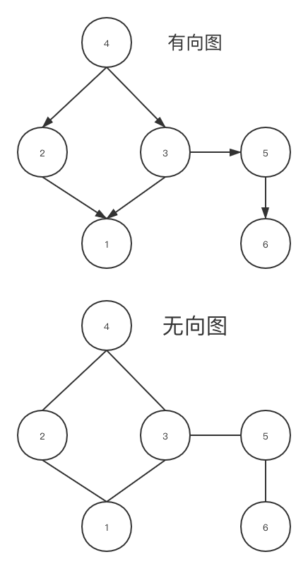
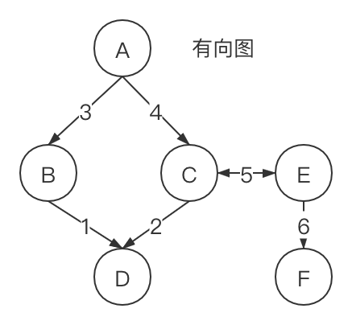

数据结构 - 图
===

> Create by **jsliang** on **2019-09-05 11:10:09**  
> Recently revised in **2020-04-03 14:00:57**

## <a name="chapter-one" id="chapter-one">一 目录</a>

**不折腾的前端，和咸鱼有什么区别**

| 目录 |
| --- | 
| [一 目录](#chapter-one) | 
| [二 前言](#chapter-two) |

## <a name="chapter-two" id="chapter-two">二 前言</a>

> [返回目录](#chapter-one)

图是一个庞大的主题，深入探索图的奇妙世界，足够写一本书。

所以这里，**jsliang** 也怂，但是做一些了解还是有必要的。

## <a name="chapter-three" id="chapter-three">三 图相关术语</a>

> [返回目录](#chapter-one)

说起图，我们应该会想起地图：

* 广州-深圳
* 广州-上海
* 广州-杭州

其中，广州、深圳、上海以及杭州，就是**点**。

而它们的直线路径，就是**边**。

下面我们看一个正经点的图：

图的相关知识点：

* **相邻顶点**：由一条边连接在一起的定点称为相邻顶点。比如 4 和 2，1 和 3，5 和 6 都是相邻顶点。
* **度**：度就是一个定点相邻顶点的数量。例如：4 的度是 2，3 的度是 3。
* **路径**：路径是顶点 V1, V2, ..., Vk 的一个连续序列，其中 Vi 和 Vi+1 是相邻的。在上面图中，路径可以是 `4 -> 3 -> 5 -> 6`，也可以是 `4 -> 2 -> 1`等。
* **简单路径**：简单路径要求不包含重复的顶点。例如 `4 -> 2 -> 1`，**环**也可以是一个简单路径，例如无向图的 `4 -> 3 -> 1 -> 2`。
* **无环图**：如果图中不存在环，则是无环图。
* **有向图**：存在箭头。
* **无向图**：不存在箭头。

然后在有向图，还有两个知识点：

* **强连通的**：在点 C 和 E 中，它们有箭头互相指向，所以它们是强连通的。
* **加权的**：在这个图中，我们看到它们的边被赋予了权值，所以是加权的。而如果像一开始那种没有赋值的，就是未加权的。

---

**不折腾的前端，和咸鱼有什么区别！**

**jsliang** 会每天更新一道 LeetCode 题解，从而帮助小伙伴们夯实原生 JS 基础，了解与学习算法与数据结构。

**浪子神剑** 会每天更新面试题，以面试题为驱动来带动大家学习，坚持每天学习与思考，每天进步一点！

扫描上方二维码，关注 **jsliang** 的公众号（左）和 **浪子神剑** 的公众号（右），让我们一起折腾！

>  jsliang 的文档库 由 <a xmlns:cc="http://creativecommons.org/ns#" href="https://github.com/LiangJunrong/document-library" property="cc:attributionName" rel="cc:attributionURL">梁峻荣</a> 采用 <a rel="license" href="http://creativecommons.org/licenses/by-nc-sa/4.0/">知识共享 署名-非商业性使用-相同方式共享 4.0 国际 许可协议</a>进行许可。 基于<a xmlns:dct="http://purl.org/dc/terms/" href="https://github.com/LiangJunrong/document-library" rel="dct:source">https://github.com/LiangJunrong/document-library</a>上的作品创作。 本许可协议授权之外的使用权限可以从 <a xmlns:cc="http://creativecommons.org/ns#" href="https://creativecommons.org/licenses/by-nc-sa/2.5/cn/" rel="cc:morePermissions">https://creativecommons.org/licenses/by-nc-sa/2.5/cn/</a> 处获得。