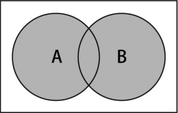

数据结构 - 集合
===

> Create by **jsliang** on **2019-09-05 11:07:17**  
> Recently revised in **2020-3-22 12:07:52**

## <a name="chapter-one" id="chapter-one">一 目录</a>

**不折腾的前端，和咸鱼有什么区别**

| 目录 |
| --- | 
| [一 目录](#chapter-one) | 
| <a name="catalog-chapter-two" id="catalog-chapter-two"></a>[二 前言](#chapter-two) |
| <a name="catalog-chapter-three" id="catalog-chapter-three"></a>[三 JS 仿造 Set](#chapter-three) |
| &emsp;[3.1 has()](#chapter-three-one) |
| &emsp;[3.2 add()、remove()](#chapter-three-two) |
| &emsp;[3.3 clear()、size()、values()](#chapter-three-three) |
| &emsp;[3.4 union()](#chapter-three-four) |
| &emsp;[3.5 intersection()](#chapter-three-five) |
| &emsp;[3.6 difference()](#chapter-three-six) |
| &emsp;[3.7 subset()](#chapter-three-seven) |
| <a name="catalog-chapter-four" id="catalog-chapter-four"></a>[四 ES6 扩展 Set](#chapter-four) |
| <a name="catalog-chapter-five" id="catalog-chapter-five"></a>[五 LeetCode 刷题](#chapter-five) |
| <a name="catalog-chapter-six" id="catalog-chapter-six"></a>[六 总结](#chapter-six) |
| <a name="catalog-chapter-seven" id="catalog-chapter-seven"></a>[七 参考文献](#chapter-seven) |

## <a name="chapter-two" id="chapter-two">二 前言</a>

> [返回目录](#chapter-one)

无论是在 LeetCode 的刷题过程中，疑惑中工作过程中，我们都会使用到 ES6 的 `Set`，使用到这个集合操作。

谈起集合，我们应该会想到：

* 班级
* 种类
* ……

在集合中，它的特点就是 **不允许值重复**。

在班级里，每一个个体都是不同的；在种类中，有各自的特点……

所以，在 JavaScript 中：

* **集合是一种不允许值重复存在的顺序数据结构**。

在这里，我们会学到各种操作：

* 创建集合
* 给集合添加值
* 移除集合中的值
* 搜索集合值是否存在
* 操作集合：并集、交集、差集

那么，Here we go~

## <a name="chapter-three" id="chapter-three">三 创建集合</a>

> [返回目录](#chapter-one)

* 自然数集合：`N = {0, 1, 2, 3, 4, 5, ...}`
* 空集：`N = {}`

我们会实现 ES6 的 `Set`，让大家进一步熟悉了解集合。

> 对象实现

```js
const jsliangSet = function() {
  const items = {};

  // 如果值在集合中，返回 true，否则返回 false
  this.has = function(value) {
    // return value in items;
    return items.hasOwnProperty(value);
  };

  // 向集合添加一个新的项
  this.add = function(value) {
    if (!this.has(value)) {
      items[value] = value;
      return true;
    }
    return false;
  };

  // 从集合移除一个值
  // delete 变量冲突，改为 remove
  this.remove = function(value) {
    if (this.has(value)) {
      delete items[value];
      return true;
    }
    return false;
  };

  // 移除集合中的所有项
  this.clear = function() {
    items = {};
  };

  // 返回集合所包含的元素的数量（length）
  this.size = function() {
    // return Object.keys(items).length; // 兼容性问题
    let count = 0;
    for (let key in items) {
      if (items.hasOwnProperty(key)) {
        count++;
      }
    }
    return count;
  };

  // 返回一个包含集合中所有值的数组
  this.values = function() {
    // 兼容性问题
    // const values = [];
    // for (let i = 0, keys = Object.keys(items); i < keys.length; i++) {
    //   values.push(items[keys[i]]);
    // }
    // return values;

    const values = [];
    for (let key in items) {
      if (items.hasOwnProperty(key)) {
        values.push(items[key]);
      }
    }
    return values;
  };

  // 打印集合
  this.print = function() {
    console.log(items);
  }

  // 获取
  this.getItems = function() {
    return items;
  }

  // 取并集
  this.union = function(otherSet) {
    let unionSet = new jsliangSet();

    let values = this.values();
    for (let i = 0; i < values.length; i++) {
      unionSet.add(values[i]);
    }

    values = otherSet.values();
    for (let i = 0; i < values.length; i++) {
      unionSet.add(values[i]);
    }

    return unionSet;
  }

  // 取交集
  this.intersection = function(otherSet) {
    let intersectionSet = new jsliangSet();

    let values = this.values();
    for (let i = 0; i < values.length; i++) {
      if (otherSet.has(values[i])) {
        intersectionSet.add(values[i]);
      }
    }

    return intersectionSet;
  }

  // 取差集
  this.difference = function(otherSet) {
    let differenceSet = new jsliangSet();

    let values = this.values();
    for (let i = 0; i < values.length; i++) {
      if (!otherSet.has(values[i])) {
        differenceSet.add(values[i]);
      }
    }

    return differenceSet;
  }

  // 判断子集
  this.subset = function(otherSet) {
    if (this.size() > otherSet.size()) {
      return false;
    } else {
      let values = this.values();
      for (let i = 0; i < values.length; i++) {
        if (!otherSet.has(values[i])) {
          return false;
        }
      }
      return true;
    }
  }
}

const A = new jsliangSet();

// console.log(A.has(1));

// A.add(1);
// console.log(A.size());
// console.log(A.values());

// console.log(A.has(1));

// A.remove(1);

// A.print();

A.add(1);
A.add(2);
A.add(3);

const B = new jsliangSet();

B.add(2);
B.add(3);
B.add(4);

const unionAB = A.union(B);
console.log(unionAB.values());

const intersectionAB = A.intersection(B);
console.log(intersectionAB.values());

const differenceAB = A.difference(B);
console.log(differenceAB.values());

const subsetAB = B.subset(A);
console.log(subsetAB);
```

* **并集**：对于给定的两个集合，返回一个包含两个集合中所有元素的新集合。
* **交集**：对于给定的两个集合，返回一个包含两个集合中共有元素的新集合。
* **差集**：对于给定的两个集合，返回一个包含所有存在于第一个集合且不存在于第二个集合的元素的新集合。
* **子集**：验证一个给定集合是否是另一个集合的子集。




---

**不折腾的前端，和咸鱼有什么区别！**


**jsliang** 会每天更新一道 LeetCode 题解，从而帮助小伙伴们夯实原生 JS 基础，了解与学习算法与数据结构。

**浪子神剑** 会每天更新面试题，以面试题为驱动来带动大家学习，坚持每天学习与思考，每天进步一点！

扫描上方二维码，关注 **jsliang** 的公众号（左）和 **浪子神剑** 的公众号（右），让我们一起折腾！

> <a rel="license" href="http://creativecommons.org/licenses/by-nc-sa/4.0/"></a><br /><span xmlns:dct="http://purl.org/dc/terms/" property="dct:title">jsliang 的文档库</span> 由 <a xmlns:cc="http://creativecommons.org/ns#" href="https://github.com/LiangJunrong/document-library" property="cc:attributionName" rel="cc:attributionURL">梁峻荣</a> 采用 <a rel="license" href="http://creativecommons.org/licenses/by-nc-sa/4.0/">知识共享 署名-非商业性使用-相同方式共享 4.0 国际 许可协议</a>进行许可。<br />基于<a xmlns:dct="http://purl.org/dc/terms/" href="https://github.com/LiangJunrong/document-library" rel="dct:source">https://github.com/LiangJunrong/document-library</a>上的作品创作。<br />本许可协议授权之外的使用权限可以从 <a xmlns:cc="http://creativecommons.org/ns#" href="https://creativecommons.org/licenses/by-nc-sa/2.5/cn/" rel="cc:morePermissions">https://creativecommons.org/licenses/by-nc-sa/2.5/cn/</a> 处获得。