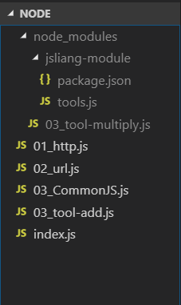
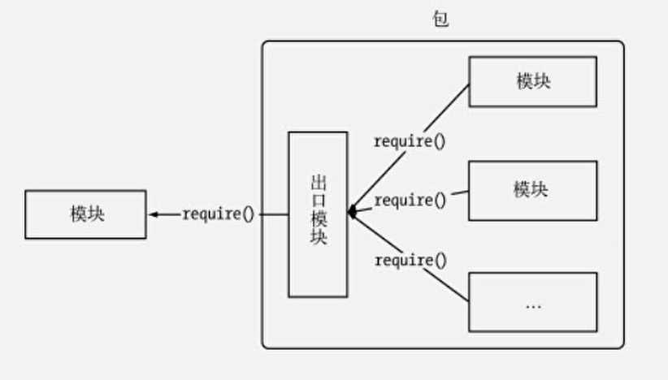
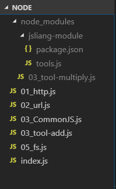

Node 基础
===

> Create by **jsliang** on **2018-11-8 13:42:42**  
> Recently revised in **2018-12-5 22:12:41**

<br>

# <a name="chapter-one" id="chapter-one">一 目录</a>

&emsp;**不折腾的前端，和咸鱼有什么区别**

| 目录 |                                                                             
| --- | 
| [一 目录](#chapter-one) | 
| <a name="catalog-chapter-two" id="catalog-chapter-two"></a>[二 资料整合](#chapter-two) |
| <a name="catalog-chapter-three" id="catalog-chapter-three"></a>[三 基础学习](#chapter-three) |
| &emsp;<a name="catalog-chapter-three-one" id="catalog-chapter-three-one"></a>[3.1 HTTP - 开始 Node 之旅](#chapter-three-one) |
| &emsp;<a name="catalog-chapter-three-two" id="catalog-chapter-three-two"></a>[3.2 URL 模块](#chapter-three-two) |
| &emsp;<a name="catalog-chapter-three-three" id="catalog-chapter-three-three"></a>[3.3 CommonJS](#chapter-three-three) |
| &emsp;<a name="catalog-chapter-three-four" id="catalog-chapter-three-four"></a>[3.4 包与 npm](#chapter-three-four) |
| &emsp;<a name="catalog-chapter-three-five" id="catalog-chapter-three-five"></a>[3.5 fs 文件管理](#chapter-three-five) |
| <a name="catalog-chapter-four" id="catalog-chapter-four"></a>[四 工具整合](#chapter-four) |
| &emsp;<a name="catalog-chapter-four-one" id="catalog-chapter-four-one"></a>[4.1 supervisor - 监听 Node 改动](#chapter-four-one) |

<br>

# <a name="chapter-two" id="chapter-two">二 前言</a>

> [返回目录](#catalog-chapter-two)

<br>

&emsp;本文主要目的：

1. 整合 Node 基础，加深 **jsliang** 对 Node 的学习了解并且方便复习。纯属个人参考，如需疑问还请在 QQ 群：`798961601` 中咨询。  
2. 整合 Node 工具，方便查找在 Node 开发中，有哪些工具比较有利于开发。

&emsp;参考资料：

<br>

# <a name="chapter-three" id="chapter-three">三 基础</a>

> [返回目录](#catalog-chapter-three)

<br>

# <a name="chapter-three-one" id="chapter-three-one">3.1 HTTP - 开始 Node 之旅</a>

> [返回目录](#catalog-chapter-three-one)

<br>

&emsp;话不多说，先上代码：

> 01_http.js

```
// 1. 引入 http 模块
var http = require("http");

// 2. 用 http 模块创建服务
/**
 * req 获取 url 信息 (request)
 * res 浏览器返回响应信息 (response)
 */
http.createServer(function (req, res) {
  // 设置 HTTP 头部，状态码是 200，文件类型是 html，字符集是 utf8
  res.writeHead(200, {
    "Content-Type": "text/html;charset=UTF-8"
  });

  // 往页面打印值
  res.write('<h1 style="text-align:center">Hello NodeJS</h1>');

  // 结束响应
  res.end();

}).listen(3000); // 监听的端口
```

<br>

&emsp;那么，上面代码，我们要怎么用呢？

&emsp;**首先**，将上面的代码复制粘贴到 `01_http.js` 中。  
&emsp;**然后**，启动 VS Code 终端：`Ctrl + ~`。  
&emsp;**接着**，输入 `node 01_http.js` 并回车。  
&emsp;**最后**，打开 `localhost:3000`：


<br>

&emsp;OK，搞定完事，现在我们一一讲解上面代码：

1. **首先**，我们需要先开启仙人模式。哦，不是，是 HTTP 模式。我们都知道，像 PHP 这类老牌子的后端语言，需要 Apache 或者 Nginx 开启 HTTP 服务。然而我们的 Node 不需要：

```
var http = require("http");
```

2. **然后**，开启 HTTP 服务，并设置开启的端口：

```
/**
 * req 获取 url 信息 (request)
 * res 浏览器返回响应信息 (response)
 */
http.createServer(function (req, res) {
  // ... 步骤 3 代码
}).listen(3000); // 监听的端口
```

3. **接着**，我们设置 HTTP 头部，并往页面打印值，最后结束响应：

```
// 设置 HTTP 头部，状态码是 200，文件类型是 html，字符集是 utf8
res.writeHead(200, {
  "Content-Type": "text/html;charset=UTF-8"
});

// 往页面打印值
res.write('<h1 style="text-align:center">Hello NodeJS</h1>');

// 结束响应 
res.end();
```

4. **最后**，我们往浏览器输入 `http://localhost:3000/`，将访问到我们开启的 Node 服务，从而往页面渲染页面。

&emsp;至此，小伙伴们是不是也开启了自己的 Node 之旅？

<br>

# <a name="chapter-three-two" id="chapter-three-two">3.2 URL 模块</a>

> [返回目录](#catalog-chapter-three-two)

<br>

&emsp;URL 模块是什么呢？  
&emsp;我们在控制台（终端）开启 Node 模式，并打印出 `url` 来看一下：


&emsp;好家伙，它有 `Url`、`parse`、`resolve`、`resolveObject`、`format`、`URL`、`URLSearchParams`、`domainToASCII`、`domainToUnicode` 这几个模块。  
&emsp;那么，这些模块都有什么用呢？

&emsp;话不多说，先上代码：

> 02_url.js

```
// 1. 引入 url 模块
var url = require("url");

// 2. 引入 http 模块
var http = require("http");

// 3. 用 http 模块创建服务
/**
 * req 获取 url 信息 (request)
 * res 浏览器返回响应信息 (response)
 */
http.createServer(function (req, res) {

  // 4. 获取服务器请求
  /**
   * 访问地址是：http://localhost:3000/?userName=jsliang&userAge=23
   * 如果你执行 console.log(req.url)，它将执行两次，分别返回下面的信息：
   * /  ?userName=jsliang&userAge=23
   * /  /favicon.ico
   * 这里为了防止重复执行，所以排除 req.url == /favicon.ico 的情况
   */
  if(req.url != "/favicon.ico") {
    
    // 5. 使用 url 的 parse 方法
    /**
     * parse 方法需要两个参数：
     * 第一个参数是地址
     * 第二个参数是 true 的话表示把 get 传值转换成对象
     */ 
    var result = url.parse(req.url, true);
    console.log(result);
    /**
     * Url {
     *   protocol: null,
     *   slashes: null,
     *   auth: null,
     *   host: null,
     *   port: null,
     *   hostname: null,
     *   hash: null,
     *   search: '?userName=jsliang&userAge=23',
     *   query: { userName: 'jsliang', userAge: '23' },
     *   pathname: '/',
     *   path: '/?userName=jsliang&userAge=23',
     *   href: '/?userName=jsliang&userAge=23' }
     */

    console.log(result.query.userName); // jsliang

    console.log(result.query.userAge); // 23
  }

  // 设置 HTTP 头部，状态码是 200，文件类型是 html，字符集是 utf8
  res.writeHead(200, {
    "Content-Type": "text/html;charset=UTF-8"
  });

  // 往页面打印值
  res.write('<h1 style="text-align:center">Hello NodeJS</h1>');

  // 结束响应
  res.end();

}).listen(3000);
```

<br>

&emsp;在上面的代码中：

&emsp;**首先**，我们引入该章节的主角 `url` 模块：

```
// 1. 引入 url 模块
var url = require("url");
```

&emsp;**然后**，我们引入 `http` 模块：

```
// 2. 引入 http 模块
var http = require("http");
```

&emsp;**接着**，我们创建 `http` 模块，因为 `url` 的监听，需要 `http` 模块的开启：

```
// 3. 用 http 模块创建服务
/**
 * req 获取 url 信息 (request)
 * res 浏览器返回响应信息 (response)
 */
http.createServer(function (req, res) {
  // ... 第 4 步、第 5 步代码

  // 设置 HTTP 头部，状态码是 200，文件类型是 html，字符集是 utf8
  res.writeHead(200, {
    "Content-Type": "text/html;charset=UTF-8"
  });

  // 往页面打印值
  res.write('<h1 style="text-align:center">Hello NodeJS</h1>');

  // 结束响应
  res.end();
}).listen(3000);
```

&emsp;**最后**，我们访问我们给出的地址：`http://localhost:3000/?userName=jsliang&userAge=23`，并通过它查看 `url` 的 `parse` 模块怎么用，输出啥：

```
// 4. 获取服务器请求
/**
  * 访问地址是：http://localhost:3000/?userName=jsliang&userAge=23
  * 如果你执行 console.log(req.url)，它将执行两次，分别返回下面的信息：
  * /  ?userName=jsliang&userAge=23
  * /  /favicon.ico
  * 这里为了防止重复执行，所以排除 req.url == /favicon.ico 的情况
  */
if(req.url != "/favicon.ico") {
  
  // 5. 使用 url 的 parse 方法
  /**
    * parse 方法需要两个参数：
    * 第一个参数是地址
    * 第二个参数是 true 的话表示把 get 传值转换成对象
    */ 
  var result = url.parse(req.url, true);
  console.log(result);
  /**
    * Url {
    *   protocol: null,
    *   slashes: null,
    *   auth: null,
    *   host: null,
    *   port: null,
    *   hostname: null,
    *   hash: null,
    *   search: '?userName=jsliang&userAge=23',
    *   query: { userName: 'jsliang', userAge: '23' },
    *   pathname: '/',
    *   path: '/?userName=jsliang&userAge=23',
    *   href: '/?userName=jsliang&userAge=23' }
    */

  console.log(result.query.userName); // jsliang

  console.log(result.query.userAge); // 23
}
```

&emsp;从中，我们可以看出，我们可以通过 `query`，获取到我们想要的路径字段。

<br>

&emsp;当然，上面只讲解了 `parse` 的用法，我们可以将上面代码中 `if` 语句里面的代码全部清空。然后，输入下面的内容，去学习 `url` 模块更多的内容：

1. url 模块所有内容：

```
console.log(url);

/**
 * Console：
 { 
   Url: [Function: Url],
    parse: [Function: urlParse], // 获取地址信息
    resolve: [Function: urlResolve], // 追加或者替换地址
    resolveObject: [Function: urlResolveObject],
    format: [Function: urlFormat], // 逆向 parse，根据地址信息获取原 url 信息
    URL: [Function: URL],
    URLSearchParams: [Function: URLSearchParams],
    domainToASCII: [Function: domainToASCII],
    domainToUnicode: [Function: domainToUnicode] 
  }
 */
```

<br>

2. parse 如何使用

```
console.log(url.parse("http://www.baidu.com"));

/**
 * Console：
  Url {
    protocol: 'http:',
    slashes: true,
    auth: null,
    host: 'www.baidu.com',
    port: null,
    hostname: 'www.baidu.com',
    hash: null,
    search: null,
    query: null,
    pathname: '/',
    path: '/',
    href: 'http://www.baidu.com/' 
  }
 */
```

<br>

3. parse 带参数：

```
console.log(url.parse("http://www.baidu.com/new?name=zhangsan"));

/**
 * Console：
  Url {
    protocol: 'http:',
    slashes: true,
    auth: null,
    host: 'www.baidu.com',
    port: null,
    hostname: 'www.baidu.com',
    hash: null,
    search: '?name=zhangsan',
    query: 'name=zhangsan',
    pathname: '/new',
    path: '/new?name=zhangsan',
    href: 'http://www.baidu.com/new?name=zhangsan' 
  }
 */
```

<br>

4. `format` 的使用：

```
console.log(url.format({
  protocol: 'http:',
  slashes: true,
  auth: null,
  host: 'www.baidu.com',
  port: null,
  hostname: 'www.baidu.com',
  hash: null,
  search: '?name=zhangsan',
  query: 'name=zhangsan',
  pathname: '/new',
  path: '/new?name=zhangsan',
  href: 'http://www.baidu.com/new?name=zhangsan' 
}))

// Console：
// http://www.baidu.com/new?name=zhangsan
```

<br>

5. `resolve` 的使用：

```
console.log(url.resolve("http://www.baidu.com/jsliang", "梁峻荣"));

// Console：
// http://www.baidu.com/梁峻荣
```

&emsp;当然，`url` 这里我们只讲解了个入门，更多的还请看官网 API：[url | Node.js v10.14.1 文档](http://nodejs.cn/api/url.html#url_class_url)

<br>

# <a name="chapter-three-three" id="chapter-three-three">3.3 CommonJS</a>

> [返回目录](#catalog-chapter-three-three)

<br>

* 什么是 CommonJS？

&emsp;CommonJS 就是为 JS 的表现来制定规范，因为 JS 没有模块系统、标准库较少、缺乏包管理工具，所以 CommonJS 应运而生，它希望 JS 可以在任何地方运行，而不只是在浏览器中，从而达到 Java、C#、PHP 这些后端语言具备开发大型应用的能力。

<br>

* CommonJS 的应用？

1. 服务器端 JavaScript 应用程序。（Node.js）
2. 命令行工具
3. 桌面图形界面应用程序。

<br>

* CommonJS 与 Node.js 的关系？

&emsp;CommonJS 就是模块化的标准，Node.js 就是 CommonJS（模块化）的实现。

<br>

* Node.js 中的模块化？

1. 在 Node 中，模块分为两类：一是 Node 提供的模块，称为核心模块；二是用户编写的模块，成为文件模块。核心模块在 Node 源代码的编译过程中，编译进了二进制执行文件，所以它的加载速度是最快的，例如：HTTP 模块、URL 模块、FS 模块；文件模块是在运行时动态加载的，需要完整的路劲分析、文件定位、编译执行过程等……所以它的速度相对核心模块来说会更慢一些。
2. 我们可以将公共的功能抽离出一个单独的 JS 文件存放，然后在需要的情况下，通过 exports 或者 module.exports 将模块导出，并通过 require 引入这些模块。

<br>

&emsp;现在，我们通过三种使用方式，来讲解下 Node 中的模块化及 exports/require 的使用。

&emsp;我们先查看下目录：



<br>

&emsp;**方法一**：

&emsp;首先，我们新建 `03_CommonJS.js`、`03_tool-add.js`、`node_modules/03_tool-multiply.js`、`node_modules/jsliang-module/tools.js` 这 4 个文件/文件夹。  
&emsp;其中 `package.json` 我们暂且不理会，稍后会讲解它如何自动生成。

&emsp;在 `03_tool-add.js` 中：

> 03_tool-add.js

```
// 1. 假设我们文件其中有个工具模块
var tools = {
  add: (...numbers) => {
    let sum = 0;
    for (let number in numbers) {
      sum += numbers[number];
    }
    return sum;
  }
}

/**
 * 2. 暴露模块
 * exports.str = str;
 * module.exports = str;
 * 区别：
 * module.exports 是真正的接口
 * exports 是一个辅助工具
 * 如果 module.exports 为空，那么所有的 exports 收集到的属性和方法，都赋值给了 module.exports
 * 如果 module.exports 具有任何属性和方法，则 exports 会被忽略
 */

// exports 使用方法
// var str = "jsliang is very good!";
// exports.str = str; // { str: 'jsliang is very good!' }

// module.exports 使用方法
module.exports = tools;
```

<br>

&emsp;那么，上面的代码有啥含义呢？  
&emsp;第一步，我们定义了个工具库 `tools`。  
&emsp;第二步，我们通过 `modules.exports` 将 `tools` 进行了导出。  
&emsp;所以，我们在 `03_CommonJS.js` 可以通过 `require` 导入使用：

```
var http = require("http");

var tools1 = require('./03_tool-add');

http.createServer(function (req, res) {

  res.writeHead(200, {
    "Content-Type": "text/html;charset=UTF-8"
  });

  res.write('<h1 style="text-align:center">Hello NodeJS</h1>');
  
  console.log(tools1.add(1, 2, 3));
  /**
   * Console：
   * 6
   * 6
   * 这里要记得 Node 运行过程中，它请求了两次，
   * http://localhost:3000/ 为一次，
   * http://localhost:3000/favicon.ico 为第二次
   */
  
  res.end();

}).listen(3000);
```

<br>

&emsp;这样，我们就完成了 `exports` 与 `require` 的初次使用。

<br>

&emsp;**方法二**：

&emsp;当我们模块文件过多的时候，应该需要有个存放这些模块的目录，Node 就很靠谱，它规范我们可以将这些文件都放在 `node_modules` 目录中（大家都放在这个目录上，就不会有其他乱七八糟的命名了）。  

&emsp;所以，我们在 `node_modules` 中新建一个 `03_tool-multiply.js` 文件，其内容如下：

> 03_tool-multiply.js

```
var tools = {
  multiply: (...numbers) => {
    let sum = numbers[0];
    for (let number in numbers) {
      sum = sum * numbers[number];
    }
    return sum;
  }
}

module.exports = tools;
```

&emsp;在引用方面，我们只需要通过：
```
// 如果 Node 在当前目录没找到 tool.js 文件，则会去 node_modules 里面去查找
var tools2 = require('03_tool-multiply');

console.log(tools2.multiply(1, 2, 3, 4));
```

&emsp;这样，就可以成功导入 `03_tool-multiply.js` 文件了。

<br>

&emsp;**方法三**：

&emsp;如果全部单个文件丢在 `node_modules` 上，它会显得杂乱无章，所以我们应该定义个自己的模块：`jsliang-module`，然后将我们的 `tools.js` 存放在该目录中：

> jsliang-module/tools.js

```
var tools = {
  add: (...numbers) => {
    let sum = 0;
    for (let number in numbers) {
      sum += numbers[number];
    }
    return sum;
  },
  multiply: (...numbers) => {
    let sum = numbers[0];
    for (let number in numbers) {
      sum = sum * numbers[number];
    }
    return sum;
  }
}

module.exports = tools;
```

<br>

&emsp;这样，我们就定义好了自己的工具库。  
&emsp;但是，如果我们通过 `var tools3 = require('jsliang-module');` 去导入，会发现它报 `error` 了，所以，我们应该在 `jsliang-module` 目录下，通过下面命令行生成一个 `package.json`

> PS E:\MyWeb\node_modules\jsliang-module> npm init --yes

&emsp;这样，在 `jsliang-module` 中就有了 `package.json`。  
&emsp;而我们在 `03_CommonJS.js` 就可以引用它了：

> 03_CommonJS.js

```
var http = require("http");

var tools1 = require('./03_tool-add');

// 如果 Node 在当前目录没找到 tool.js 文件，则会去 node_modules 里面去查找
var tools2 = require('03_tool-multiply');

/**
 * 通过 package.json 来引用文件
 * 1. 通过在 jsliang-module 中 npm init --yes 来生成 package.json 文件
 * 2. package.json 文件中告诉了程序入口文件为 ："main": "tools.js",
 * 3. Node 通过 require 查找 jsliang-module，发现它有个 package.json
 * 4. Node 执行 tools.js 文件
 */
var tools3 = require('jsliang-module');

http.createServer(function (req, res) {

  res.writeHead(200, {
    "Content-Type": "text/html;charset=UTF-8"
  });

  res.write('<h1 style="text-align:center">Hello NodeJS</h1>');
  
  console.log(tools1.add(1, 2, 3));
  console.log(tools2.multiply(1, 2, 3, 4));
  console.log(tools3.add(4, 5, 6));
  /**
   * Console：
   * 6
   * 24
   * 15
   * 6
   * 24
   * 15
   * 这里要记得 Node 运行过程中，它请求了两次，
   * http://localhost:3000/ 为一次，
   * http://localhost:3000/favicon.ico 为第二次
   */
  
  res.end();

}).listen(3000);
```

<br>

&emsp;到此，我们就通过三种方法，了解了各种 `exports` 和 `require` 的姿势以及 Node 模块化的概念啦~

<br>

&emsp;参考文献：

* [CommonJS 规范 | 博客园 - Little Bird](https://www.cnblogs.com/littlebirdlbw/p/5670633.html)
* [js模块化编程之彻底弄懂CommonJS和AMD/CMD！ | 博客园 - 方便以后复习](http://www.cnblogs.com/chenguangliang/p/5856701.html)
* [[js高手之路] es6系列教程 - 不定参数与展开运算符(...) | 博客园 - ghostwu](https://www.cnblogs.com/ghostwu/p/7298462.html)

<br>

# <a name="chapter-three-four" id="chapter-three-four">3.4 包与 npm</a>

> [返回目录](#catalog-chapter-three-four)

<br>

&emsp;Node 中除了它自己提供的核心模块之外，还可以自定义模块，以及使用 **第三方模块**。  
&emsp;Node 中第三方模块由包组成，可以通过包来对一组具有相互依赖关系的模块进行统一管理。



&emsp;那么，假如我们需要使用一些第三方模块，应该去哪找呢？

1. [百度](https://www.baidu.com)。百度查找你需要安装的第三方模块的对应内容。
2. [npm 官网](https://www.npmjs.com/)。如果你已经知道包的名字或者包的作用。那么，直接在 npm 官网上搜索，想必会更快找到想要安装的包。

&emsp;那么，npm 是啥？  
&emsp;npm 是世界上最大的开放源代码的生态系统。我们可以通过 npm 下载各种各样的包。  
&emsp;在我们安装 Node 的时候，它默认会顺带给你安装 npm。

* `npm -v`：查看 npm 版本。
* `npm list`：查看当前目录下都安装了哪些 npm 包。
* `npm info 模块`：查看该模块的版本及内容。
* `npm i 模块@版本号`：安装该模块的指定版本。

&emsp;在平时使用 npm 安装包的过程中，你可能需要知道一些 npm 基本知识：

* `i`/`install`：安装。使用 `install` 或者它的简写 `i`，都表明你想要下载这个包。
* `uninstall`：卸载。如果你发现这个模块你已经不使用了，那么可以通过 `uninstall` 卸载它。
* `g`：全局安装。表明这个包将安装到你的计算机中，你可以在计算机任何一个位置使用它。
* `--save`/`-S`：通过该种方式安装的包的名称及版本号会出现在 `package.json` 中的 `dependencies` 中。`dependencies` 是需要发布在生成环境的。例如：`ElementUI` 是部署后还需要的，所以通过 `-S` 形式来安装。
* `--save-dev`/`-D`：通过该种方式安装的包的名称及版本号会出现在 `package.json` 中的 `devDependencies` 中。`devDependencies` 只在开发环境使用。例如：`gulp` 只是用来压缩代码、打包的工具，程序运行时并不需要，所以通过 `-D` 形式来安装。

&emsp;例子：

* `cnpm i webpack-cli -D`
* `npm install element-ui -S`

&emsp;那么，这么多的 npm 包，我们通过什么管理呢？  
&emsp;答案是 `package.json`。  
&emsp;如果我们需要创建 `package.json`，那么我们只需要在指定的包管理目录（例如 `node_modules`）中通过以下命名进行生成：

* `npm init`：按步骤创建 `package.json`。
* `npm init --yes`：快速创建 `package.json`

&emsp;当然，因为国内网络环境的原因，有些时候通过 npm 下载包，可能会很慢或者直接卡断，这时候就要安装淘宝的 npm 镜像：cnpm

* `npm install -g cnpm --registry=https://registry.npm.taobao.org`

<br>

# <a name="chapter-three-five" id="chapter-three-five">3.5 fs 文件管理</a>

> [返回目录](#catalog-chapter-three-five)

<br>

&emsp;本章节我们讲解下 fs 文件管理：

1. `fs.stat` 检测是文件还是目录
2. `fs.mkdir` 创建目录
3. `fs.writeFile` 创建写入文件
4. `fs.appendFile` 追加文件
5. `fs.readFile` 读取文件
6. `fs.readdir` 读取目录
7. `fs.rename` 重命名
8. `fs.rmdir` 删除目录
9. `fs.unlink` 删除文件

<br>

> 此章节文件目录：



&emsp;**首先**，我们通过 `fs.stat` 检查一个读取的是文件还是目录：

> 05_fs.js

```
/**
 * 1. fs.stat 检测是文件还是目录
 * 2. fs.mkdir 创建目录
 * 3. fs.writeFile 创建写入文件
 * 4. fs.appendFile 追加文件
 * 5. fs.readFile 读取文件
 * 6. fs.readdir 读取目录
 * 7. fs.rename 重命名
 * 8. fs.rmdir 删除目录
 * 9. fs.unlink 删除文件
 */

//  1. fs.stat
let fs = require('fs');
fs.stat('index.js', (error, stats) => {
  if(error) {
    console.log(error);
    return false;
  } else {
    console.log(stats);
    /**
     * Console：
     * Stats {
     *  dev: 886875,
     *  mode: 33206,
     *  nlink: 1,
     *  uid: 0,
     *  gid: 0,
     *  rdev: 0,
     *  blksize: undefined,
     *  ino: 844424931461390,
     *  size: 284,
     *  blocks: undefined,
     *  atimeMs: 1542847157494,
     *  mtimeMs: 1543887546361.2158,
     *  ctimeMs: 1543887546361.2158,
     *  birthtimeMs: 1542847157493.663,
     *  atime: 2018-11-22T00:39:17.494Z,
     *  mtime: 2018-12-04T01:39:06.361Z,
     *  ctime: 2018-12-04T01:39:06.361Z,
     *  birthtime: 2018-11-22T00:39:17.494Z }
     */

    console.log(`文件：${stats.isFile()}`); 
    // Console：文件：true
    
    console.log(`目录：${stats.isDirectory()}`); 
    // Console：目录：false

    return false;
  }
})
```

&emsp;通过 `Console` 打印出来的信息，我们基础掌握了 `fs.stat` 的作用。

<br>

&emsp;**然后**，我们尝试通过 `fs.mkdir` 创建目录：

> 05_fs.js

```
/**
 * 1. fs.stat 检测是文件还是目录
 * 2. fs.mkdir 创建目录
 * 3. fs.writeFile 创建写入文件
 * 4. fs.appendFile 追加文件
 * 5. fs.readFile 读取文件
 * 6. fs.readdir 读取目录
 * 7. fs.rename 重命名
 * 8. fs.rmdir 删除目录
 * 9. fs.unlink 删除文件
 */

//  2. fs.mkdir
let fs = require('fs');

/**
 * 接收参数
 * path - 将创建的目录路径
 * mode - 目录权限（读写权限），默认 0777
 * callback - 回调，传递异常参数 err
 */
fs.mkdir('css', (err) => {
  if(err) {
    console.log(err);
    return false;
  } else {
    console.log("创建目录成功！");
    // Console：创建目录成功！
  }
})
```

&emsp;通过 `node 05_fs.js`，我们发现目录中多了一个 `css` 文件夹。

<br>

&emsp;**那么**，有创建就有删除，创建的目录如何删除呢？这里讲解下 `fs.rmdir`：

> 05_fs.js

```
/**
 * 1. fs.stat 检测是文件还是目录
 * 2. fs.mkdir 创建目录
 * 3. fs.writeFile 创建写入文件
 * 4. fs.appendFile 追加文件
 * 5. fs.readFile 读取文件
 * 6. fs.readdir 读取目录
 * 7. fs.rename 重命名
 * 8. fs.rmdir 删除目录
 * 9. fs.unlink 删除文件
 */

//  8. fs.rmdir
let fs = require('fs');

/**
 * 接收参数
 * path - 将创建的目录路径
 * mode - 目录权限（读写权限），默认 0777
 * callback - 回调，传递异常参数 err
 */
fs.rmdir('css', (err) => {
  if(err) {
    console.log(err);
    return false;
  } else {
    console.log("创建目录成功！");
    // Console：创建目录成功！
  }
})
```

&emsp;通过 `node 05_fs.js`，我们发现目录中的 `css` 文件夹被删除了。

<br>

# <a name="chapter-four" id="chapter-four">四 工具整合</a>

> [返回目录](#catalog-chapter-four)

<br>

&emsp;工欲善其事，必先利其器。  
&emsp;掌控好了工具，可以方便你更快地进行开发。

<br>

# <a name="chapter-four-one" id="chapter-four-one">4.1 supervisor - 监听 Node 改动</a>

> [返回目录](#catalog-chapter-four-one)

<br>

* [supervisor 官网](http://www.supervisord.org/)

&emsp;正如其官网所说，它是一个进行控制系统：

1. 安装插件：`npm i supervisor -g`
2. 运行文件：`supervisor app.js`
3. 查看运行：`localhost:3000`

&emsp;平时，我们 `node app.js` 后，当我们修改了 `app.js` 的内容，就需要关闭 node 命令行再执行 `node app.js`。  
&emsp;而我们使用 `supervisor` 后，我们修改了 `app.js` 中的内容，只要点击保存，即可生效保存后的代码，实现实时监听 node 代码的变动。  

&emsp;关于这个工具，网上更详细的攻略有：

* [详细版：用Supervisor守护你的Node.js进程 | 简书 - Mike的读书季](https://www.jianshu.com/p/6d84e5efe99d)

<br>

> <a rel="license" href="http://creativecommons.org/licenses/by-nc-sa/4.0/"></a><br /><a xmlns:dct="http://purl.org/dc/terms/" property="dct:title">**jsliang** 的文档库</a> 由 <a xmlns:cc="http://creativecommons.org/ns#" href="https://github.com/LiangJunrong/document-library" property="cc:attributionName" rel="cc:attributionURL">梁峻荣</a> 采用 <a rel="license" href="http://creativecommons.org/licenses/by-nc-sa/4.0/">知识共享 署名-非商业性使用-相同方式共享 4.0 国际 许可协议</a>进行许可。<br />基于<a xmlns:dct="http://purl.org/dc/terms/" href="https://github.com/LiangJunrong/document-library" rel="dct:source">https://github.om/LiangJunrong/document-library</a>上的作品创作。<br />本许可协议授权之外的使用权限可以从 <a xmlns:cc="http://creativecommons.org/ns#" href="https://creativecommons.org/licenses/by-nc-sa/2.5/cn/" rel="cc:morePermissions">https://creativecommons.org/licenses/by-nc-sa/2.5/cn/</a> 处获得。