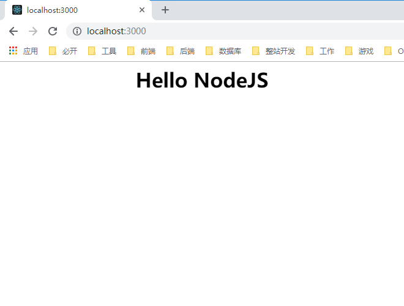
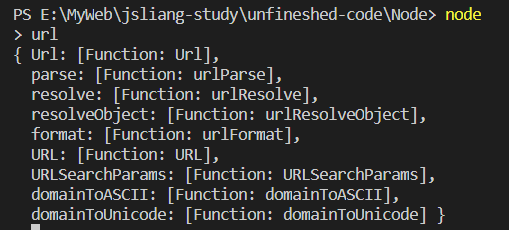
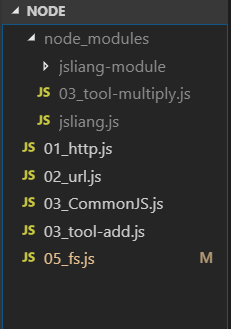
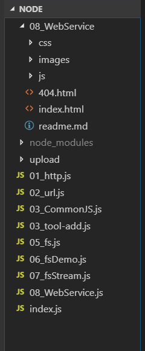
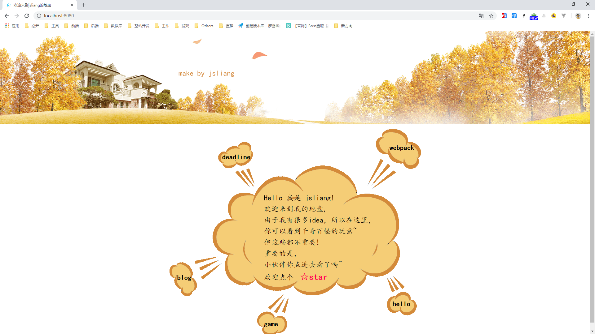
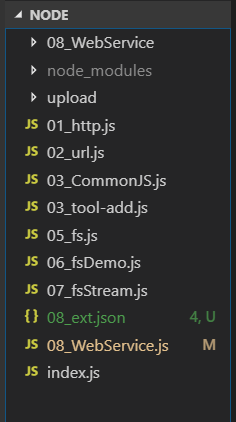
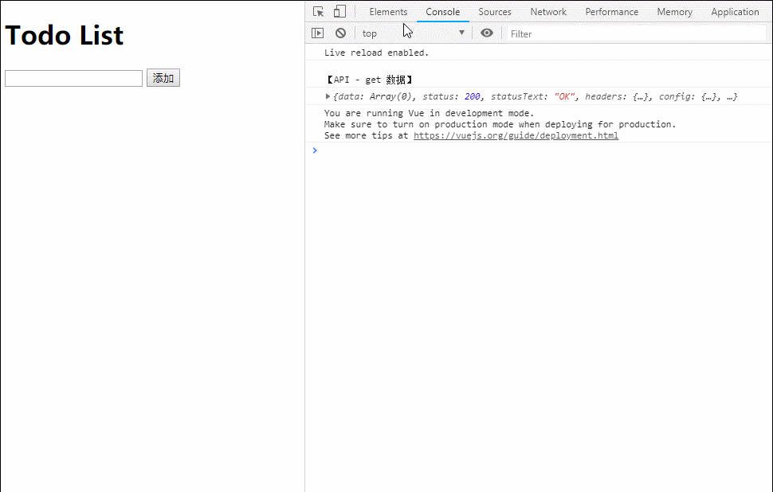
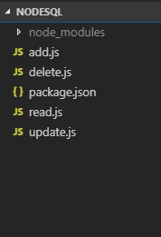

Node 基础
===

> Create by **jsliang** on **2018-11-8 13:42:42**  
> Recently revised in **2018-12-18 08:14:57**

<br>

&emsp;该文章的代码：[Node](https://github.com/LiangJunrong/Node)  
&emsp;该文章的实验成品：[仿企业官网]()

<br>

# <a name="chapter-one" id="chapter-one">一 目录</a>

&emsp;**不折腾的前端，和咸鱼有什么区别**

| 目录 |                                                                             
| --- | 
| [一 目录](#chapter-one) | 
| <a name="catalog-chapter-two" id="catalog-chapter-two"></a>[二 前言](#chapter-two) |
| <a name="catalog-chapter-three" id="catalog-chapter-three"></a>[三 基础学习](#chapter-three) |
| &emsp;<a name="catalog-chapter-three-one" id="catalog-chapter-three-one"></a>[3.1 HTTP - 开始 Node 之旅](#chapter-three-one) |
| &emsp;<a name="catalog-chapter-three-two" id="catalog-chapter-three-two"></a>[3.2 URL 模块](#chapter-three-two) |
| &emsp;<a name="catalog-chapter-three-three" id="catalog-chapter-three-three"></a>[3.3 CommonJS](#chapter-three-three) |
| &emsp;<a name="catalog-chapter-three-four" id="catalog-chapter-three-four"></a>[3.4 包与 npm](#chapter-three-four) |
| &emsp;<a name="catalog-chapter-three-five" id="catalog-chapter-three-five"></a>[3.5 fs 文件管理](#chapter-three-five) |
| &emsp;<a name="catalog-chapter-three-six" id="catalog-chapter-three-six"></a>[3.6 fs 案例](#chapter-three-six) |
| &emsp;<a name="catalog-chapter-three-seven" id="catalog-chapter-three-seven"></a>[3.7 fs 流](#chapter-three-seven) |
| &emsp;<a name="catalog-chapter-three-eight" id="catalog-chapter-three-eight"></a>[3.8 创建 Web 服务器](#chapter-three-eight) |
| &emsp;<a name="catalog-chapter-three-night" id="catalog-chapter-three-night"></a>[3.9 非阻塞 I/O 事件驱动](#chapter-three-night) |
| &emsp;<a name="catalog-chapter-three-ten" id="catalog-chapter-three-ten"></a>[3.10 get 与 post](#chapter-three-ten) |
| &emsp;<a name="catalog-chapter-three-eleven" id="catalog-chapter-three-eleven"></a>[3.11 Node 连接 MySQL](#chapter-three-eleven) |
| <a name="catalog-chapter-four" id="catalog-chapter-four"></a>[四 Web 实战 —— 仿企业官网](#chapter-four) |
| <a name="catalog-chapter-five" id="catalog-chapter-five"></a>[五 工具整合](#chapter-five) |
| &emsp;<a name="catalog-chapter-five-one" id="catalog-chapter-five-one"></a>[5.1 supervisor - 监听 Node 改动](#chapter-five-one) |
| &emsp;<a name="catalog-chapter-five-two" id="catalog-chapter-five-two"></a>[5.2 PM2 - Node 进程管理](#chapter-five-two) |

<br>

# <a name="chapter-two" id="chapter-two">二 前言</a>

> [返回目录](#catalog-chapter-two)

<br>

&emsp;本文主要目的：

1. 整合 Node 基础，加深 **jsliang** 对 Node 的学习了解并且方便复习。纯属个人参考，如需疑问还请在 QQ 群：`798961601` 中咨询。  
2. 整合 Node 工具，方便查找在 Node 开发中，有哪些工具比较有利于开发。

&emsp;参考资料：

1. **经典：该类值得我们研读**

* [API 文档 | Node.js 中文网](http://nodejs.cn/api/)
* [Node.js 教程 | 菜鸟教程](http://www.runoob.com/nodejs/nodejs-tutorial.html)

2. **尝试：该类值得我们参考借鉴**

* [NodeJs 实战——原生 NodeJS 轻仿 Express 框架从需求到实现（一） | 倔强的石头 - 掘金](https://juejin.im/post/5bf227a751882516be2ec124)
* [NodeJs 实战——原生 NodeJS 轻仿 Express 框架从需求到实现（二） | 倔强的石头 - 掘金](https://juejin.im/post/5bf4e46a6fb9a049f153d2ae)

> 上面的两篇文章比较思路比较凌乱，仅建议参考，或者直接 DownLoad 它的 GitHub 代码：[地址](https://github.com/chenshengshui/tiny-express)

<br>

# <a name="chapter-three" id="chapter-three">三 基础</a>

> [返回目录](#catalog-chapter-three)

<br>

&emsp;万丈高楼平地起，地基还得自己起。

<br>

# <a name="chapter-three-one" id="chapter-three-one">3.1 HTTP - 开始 Node 之旅</a>

> [返回目录](#catalog-chapter-three-one)

<br>

&emsp;话不多说，先上代码：

> 01_http.js

```
// 1. 引入 http 模块
var http = require("http");

// 2. 用 http 模块创建服务
/**
 * req 获取 url 信息 (request)
 * res 浏览器返回响应信息 (response)
 */
http.createServer(function (req, res) {
  // 设置 HTTP 头部，状态码是 200，文件类型是 html，字符集是 utf8
  res.writeHead(200, {
    "Content-Type": "text/html;charset=UTF-8"
  });

  // 往页面打印值
  res.write('<h1 style="text-align:center">Hello NodeJS</h1>');

  // 结束响应
  res.end();

}).listen(3000); // 监听的端口
```

<br>

&emsp;那么，上面代码，我们要怎么用呢？

&emsp;**首先**，将上面的代码复制粘贴到 `01_http.js` 中。  
&emsp;**然后**，启动 VS Code 终端：`Ctrl + ~`。  
&emsp;**接着**，输入 `node 01_http.js` 并回车。  
&emsp;**最后**，打开 `localhost:3000`：



<br>

&emsp;OK，搞定完事，现在我们一一讲解上面代码：

1. **首先**，我们需要先开启仙人模式。哦，不是，是 HTTP 模式。我们都知道，像 PHP 这类老牌子的后端语言，需要 Apache 或者 Nginx 开启 HTTP 服务。然而我们的 Node 不需要：

```
var http = require("http");
```

2. **然后**，开启 HTTP 服务，并设置开启的端口：

```
/**
 * req 获取 url 信息 (request)
 * res 浏览器返回响应信息 (response)
 */
http.createServer(function (req, res) {
  // ... 步骤 3 代码
}).listen(3000); // 监听的端口
```

3. **接着**，我们设置 HTTP 头部，并往页面打印值，最后结束响应：

```
// 设置 HTTP 头部，状态码是 200，文件类型是 html，字符集是 utf8
res.writeHead(200, {
  "Content-Type": "text/html;charset=UTF-8"
});

// 往页面打印值
res.write('<h1 style="text-align:center">Hello NodeJS</h1>');

// 结束响应 
res.end();
```

4. **最后**，我们往浏览器输入 `http://localhost:3000/`，将访问到我们开启的 Node 服务，从而往页面渲染页面。

&emsp;至此，小伙伴们是不是也开启了自己的 Node 之旅？

<br>

# <a name="chapter-three-two" id="chapter-three-two">3.2 URL 模块</a>

> [返回目录](#catalog-chapter-three-two)

<br>

&emsp;URL 模块是什么呢？  
&emsp;我们在控制台（终端）开启 Node 模式，并打印出 `url` 来看一下：



&emsp;好家伙，它有 `Url`、`parse`、`resolve`、`resolveObject`、`format`、`URL`、`URLSearchParams`、`domainToASCII`、`domainToUnicode` 这几个模块。  
&emsp;那么，这些模块都有什么用呢？

&emsp;话不多说，先上代码：

> 02_url.js

```
// 1. 引入 url 模块
var url = require("url");

// 2. 引入 http 模块
var http = require("http");

// 3. 用 http 模块创建服务
/**
 * req 获取 url 信息 (request)
 * res 浏览器返回响应信息 (response)
 */
http.createServer(function (req, res) {

  // 4. 获取服务器请求
  /**
   * 访问地址是：http://localhost:3000/?userName=jsliang&userAge=23
   * 如果你执行 console.log(req.url)，它将执行两次，分别返回下面的信息：
   * /  ?userName=jsliang&userAge=23
   * /  /favicon.ico
   * 这里为了防止重复执行，所以排除 req.url == /favicon.ico 的情况
   */
  if(req.url != "/favicon.ico") {
    
    // 5. 使用 url 的 parse 方法
    /**
     * parse 方法需要两个参数：
     * 第一个参数是地址
     * 第二个参数是 true 的话表示把 get 传值转换成对象
     */ 
    var result = url.parse(req.url, true);
    console.log(result);
    /**
     * Url {
     *   protocol: null,
     *   slashes: null,
     *   auth: null,
     *   host: null,
     *   port: null,
     *   hostname: null,
     *   hash: null,
     *   search: '?userName=jsliang&userAge=23',
     *   query: { userName: 'jsliang', userAge: '23' },
     *   pathname: '/',
     *   path: '/?userName=jsliang&userAge=23',
     *   href: '/?userName=jsliang&userAge=23' }
     */

    console.log(result.query.userName); // jsliang

    console.log(result.query.userAge); // 23
  }

  // 设置 HTTP 头部，状态码是 200，文件类型是 html，字符集是 utf8
  res.writeHead(200, {
    "Content-Type": "text/html;charset=UTF-8"
  });

  // 往页面打印值
  res.write('<h1 style="text-align:center">Hello NodeJS</h1>');

  // 结束响应
  res.end();

}).listen(3000);
```

<br>

&emsp;在上面的代码中：

&emsp;**首先**，我们引入该章节的主角 `url` 模块：

```
// 1. 引入 url 模块
var url = require("url");
```

&emsp;**然后**，我们引入 `http` 模块：

```
// 2. 引入 http 模块
var http = require("http");
```

&emsp;**接着**，我们创建 `http` 模块，因为 `url` 的监听，需要 `http` 模块的开启：

```
// 3. 用 http 模块创建服务
/**
 * req 获取 url 信息 (request)
 * res 浏览器返回响应信息 (response)
 */
http.createServer(function (req, res) {
  // ... 第 4 步、第 5 步代码

  // 设置 HTTP 头部，状态码是 200，文件类型是 html，字符集是 utf8
  res.writeHead(200, {
    "Content-Type": "text/html;charset=UTF-8"
  });

  // 往页面打印值
  res.write('<h1 style="text-align:center">Hello NodeJS</h1>');

  // 结束响应
  res.end();
}).listen(3000);
```

&emsp;**最后**，我们访问我们给出的地址：`http://localhost:3000/?userName=jsliang&userAge=23`，并通过它查看 `url` 的 `parse` 模块怎么用，输出啥：

```
// 4. 获取服务器请求
/**
  * 访问地址是：http://localhost:3000/?userName=jsliang&userAge=23
  * 如果你执行 console.log(req.url)，它将执行两次，分别返回下面的信息：
  * /  ?userName=jsliang&userAge=23
  * /  /favicon.ico
  * 这里为了防止重复执行，所以排除 req.url == /favicon.ico 的情况
  */
if(req.url != "/favicon.ico") {
  
  // 5. 使用 url 的 parse 方法
  /**
    * parse 方法需要两个参数：
    * 第一个参数是地址
    * 第二个参数是 true 的话表示把 get 传值转换成对象
    */ 
  var result = url.parse(req.url, true);
  console.log(result);
  /**
    * Url {
    *   protocol: null,
    *   slashes: null,
    *   auth: null,
    *   host: null,
    *   port: null,
    *   hostname: null,
    *   hash: null,
    *   search: '?userName=jsliang&userAge=23',
    *   query: { userName: 'jsliang', userAge: '23' },
    *   pathname: '/',
    *   path: '/?userName=jsliang&userAge=23',
    *   href: '/?userName=jsliang&userAge=23' }
    */

  console.log(result.query.userName); // jsliang

  console.log(result.query.userAge); // 23
}
```

&emsp;从中，我们可以看出，我们可以通过 `query`，获取到我们想要的路径字段。

<br>

&emsp;当然，上面只讲解了 `parse` 的用法，我们可以将上面代码中 `if` 语句里面的代码全部清空。然后，输入下面的内容，去学习 `url` 模块更多的内容：

1. url 模块所有内容：

```
console.log(url);

/**
 * Console：
 { 
   Url: [Function: Url],
    parse: [Function: urlParse], // 获取地址信息
    resolve: [Function: urlResolve], // 追加或者替换地址
    resolveObject: [Function: urlResolveObject],
    format: [Function: urlFormat], // 逆向 parse，根据地址信息获取原 url 信息
    URL: [Function: URL],
    URLSearchParams: [Function: URLSearchParams],
    domainToASCII: [Function: domainToASCII],
    domainToUnicode: [Function: domainToUnicode] 
  }
 */
```

<br>

2. parse 如何使用

```
console.log(url.parse("http://www.baidu.com"));

/**
 * Console：
  Url {
    protocol: 'http:',
    slashes: true,
    auth: null,
    host: 'www.baidu.com',
    port: null,
    hostname: 'www.baidu.com',
    hash: null,
    search: null,
    query: null,
    pathname: '/',
    path: '/',
    href: 'http://www.baidu.com/' 
  }
 */
```

<br>

3. parse 带参数：

```
console.log(url.parse("http://www.baidu.com/new?name=zhangsan"));

/**
 * Console：
  Url {
    protocol: 'http:',
    slashes: true,
    auth: null,
    host: 'www.baidu.com',
    port: null,
    hostname: 'www.baidu.com',
    hash: null,
    search: '?name=zhangsan',
    query: 'name=zhangsan',
    pathname: '/new',
    path: '/new?name=zhangsan',
    href: 'http://www.baidu.com/new?name=zhangsan' 
  }
 */
```

<br>

4. `format` 的使用：

```
console.log(url.format({
  protocol: 'http:',
  slashes: true,
  auth: null,
  host: 'www.baidu.com',
  port: null,
  hostname: 'www.baidu.com',
  hash: null,
  search: '?name=zhangsan',
  query: 'name=zhangsan',
  pathname: '/new',
  path: '/new?name=zhangsan',
  href: 'http://www.baidu.com/new?name=zhangsan' 
}))

// Console：
// http://www.baidu.com/new?name=zhangsan
```

<br>

5. `resolve` 的使用：

```
console.log(url.resolve("http://www.baidu.com/jsliang", "梁峻荣"));

// Console：
// http://www.baidu.com/梁峻荣
```

&emsp;当然，`url` 这里我们只讲解了个入门，更多的还请看官网 API：[url | Node.js v10.14.1 文档](http://nodejs.cn/api/url.html#url_class_url)

<br>

# <a name="chapter-three-three" id="chapter-three-three">3.3 CommonJS</a>

> [返回目录](#catalog-chapter-three-three)

<br>

* 什么是 CommonJS？

&emsp;CommonJS 就是为 JS 的表现来制定规范，因为 JS 没有模块系统、标准库较少、缺乏包管理工具，所以 CommonJS 应运而生，它希望 JS 可以在任何地方运行，而不只是在浏览器中，从而达到 Java、C#、PHP 这些后端语言具备开发大型应用的能力。

<br>

* CommonJS 的应用？

1. 服务器端 JavaScript 应用程序。（Node.js）
2. 命令行工具
3. 桌面图形界面应用程序。

<br>

* CommonJS 与 Node.js 的关系？

&emsp;CommonJS 就是模块化的标准，Node.js 就是 CommonJS（模块化）的实现。

<br>

* Node.js 中的模块化？

1. 在 Node 中，模块分为两类：一是 Node 提供的模块，称为核心模块；二是用户编写的模块，成为文件模块。核心模块在 Node 源代码的编译过程中，编译进了二进制执行文件，所以它的加载速度是最快的，例如：HTTP 模块、URL 模块、FS 模块；文件模块是在运行时动态加载的，需要完整的路劲分析、文件定位、编译执行过程等……所以它的速度相对核心模块来说会更慢一些。
2. 我们可以将公共的功能抽离出一个单独的 JS 文件存放，然后在需要的情况下，通过 exports 或者 module.exports 将模块导出，并通过 require 引入这些模块。

<br>

&emsp;现在，我们通过三种使用方式，来讲解下 Node 中的模块化及 exports/require 的使用。

&emsp;我们先查看下目录：


<br>

&emsp;**方法一**：

&emsp;首先，我们新建 `03_CommonJS.js`、`03_tool-add.js`、`node_modules/03_tool-multiply.js`、`node_modules/jsliang-module/tools.js` 这 4 个文件/文件夹。  
&emsp;其中 `package.json` 我们暂且不理会，稍后会讲解它如何自动生成。

&emsp;在 `03_tool-add.js` 中：

> 03_tool-add.js

```
// 1. 假设我们文件其中有个工具模块
var tools = {
  add: (...numbers) => {
    let sum = 0;
    for (let number in numbers) {
      sum += numbers[number];
    }
    return sum;
  }
}

/**
 * 2. 暴露模块
 * exports.str = str;
 * module.exports = str;
 * 区别：
 * module.exports 是真正的接口
 * exports 是一个辅助工具
 * 如果 module.exports 为空，那么所有的 exports 收集到的属性和方法，都赋值给了 module.exports
 * 如果 module.exports 具有任何属性和方法，则 exports 会被忽略
 */

// exports 使用方法
// var str = "jsliang is very good!";
// exports.str = str; // { str: 'jsliang is very good!' }

// module.exports 使用方法
module.exports = tools;
```

<br>

&emsp;那么，上面的代码有啥含义呢？  
&emsp;第一步，我们定义了个工具库 `tools`。  
&emsp;第二步，我们通过 `modules.exports` 将 `tools` 进行了导出。  
&emsp;所以，我们在 `03_CommonJS.js` 可以通过 `require` 导入使用：

```
var http = require("http");

var tools1 = require('./03_tool-add');

http.createServer(function (req, res) {

  res.writeHead(200, {
    "Content-Type": "text/html;charset=UTF-8"
  });

  res.write('<h1 style="text-align:center">Hello NodeJS</h1>');
  
  console.log(tools1.add(1, 2, 3));
  /**
   * Console：
   * 6
   * 6
   * 这里要记得 Node 运行过程中，它请求了两次，
   * http://localhost:3000/ 为一次，
   * http://localhost:3000/favicon.ico 为第二次
   */
  
  res.end();

}).listen(3000);
```

<br>

&emsp;这样，我们就完成了 `exports` 与 `require` 的初次使用。

<br>

&emsp;**方法二**：

&emsp;当我们模块文件过多的时候，应该需要有个存放这些模块的目录，Node 就很靠谱，它规范我们可以将这些文件都放在 `node_modules` 目录中（大家都放在这个目录上，就不会有其他乱七八糟的命名了）。  

&emsp;所以，我们在 `node_modules` 中新建一个 `03_tool-multiply.js` 文件，其内容如下：

> 03_tool-multiply.js

```
var tools = {
  multiply: (...numbers) => {
    let sum = numbers[0];
    for (let number in numbers) {
      sum = sum * numbers[number];
    }
    return sum;
  }
}

module.exports = tools;
```

&emsp;在引用方面，我们只需要通过：
```
// 如果 Node 在当前目录没找到 tool.js 文件，则会去 node_modules 里面去查找
var tools2 = require('03_tool-multiply');

console.log(tools2.multiply(1, 2, 3, 4));
```

&emsp;这样，就可以成功导入 `03_tool-multiply.js` 文件了。

<br>

&emsp;**方法三**：

&emsp;如果全部单个文件丢在 `node_modules` 上，它会显得杂乱无章，所以我们应该定义个自己的模块：`jsliang-module`，然后将我们的 `tools.js` 存放在该目录中：

> jsliang-module/tools.js

```
var tools = {
  add: (...numbers) => {
    let sum = 0;
    for (let number in numbers) {
      sum += numbers[number];
    }
    return sum;
  },
  multiply: (...numbers) => {
    let sum = numbers[0];
    for (let number in numbers) {
      sum = sum * numbers[number];
    }
    return sum;
  }
}

module.exports = tools;
```

<br>

&emsp;这样，我们就定义好了自己的工具库。  
&emsp;但是，如果我们通过 `var tools3 = require('jsliang-module');` 去导入，会发现它报 `error` 了，所以，我们应该在 `jsliang-module` 目录下，通过下面命令行生成一个 `package.json`

> PS E:\MyWeb\node_modules\jsliang-module> npm init --yes

&emsp;这样，在 `jsliang-module` 中就有了 `package.json`。  
&emsp;而我们在 `03_CommonJS.js` 就可以引用它了：

> 03_CommonJS.js

```
var http = require("http");

var tools1 = require('./03_tool-add');

// 如果 Node 在当前目录没找到 tool.js 文件，则会去 node_modules 里面去查找
var tools2 = require('03_tool-multiply');

/**
 * 通过 package.json 来引用文件
 * 1. 通过在 jsliang-module 中 npm init --yes 来生成 package.json 文件
 * 2. package.json 文件中告诉了程序入口文件为 ："main": "tools.js",
 * 3. Node 通过 require 查找 jsliang-module，发现它有个 package.json
 * 4. Node 执行 tools.js 文件
 */
var tools3 = require('jsliang-module');

http.createServer(function (req, res) {

  res.writeHead(200, {
    "Content-Type": "text/html;charset=UTF-8"
  });

  res.write('<h1 style="text-align:center">Hello NodeJS</h1>');
  
  console.log(tools1.add(1, 2, 3));
  console.log(tools2.multiply(1, 2, 3, 4));
  console.log(tools3.add(4, 5, 6));
  /**
   * Console：
   * 6
   * 24
   * 15
   * 6
   * 24
   * 15
   * 这里要记得 Node 运行过程中，它请求了两次，
   * http://localhost:3000/ 为一次，
   * http://localhost:3000/favicon.ico 为第二次
   */
  
  res.end();

}).listen(3000);
```

<br>

&emsp;到此，我们就通过三种方法，了解了各种 `exports` 和 `require` 的姿势以及 Node 模块化的概念啦~

<br>

&emsp;参考文献：

* [CommonJS 规范 | 博客园 - Little Bird](https://www.cnblogs.com/littlebirdlbw/p/5670633.html)
* [js模块化编程之彻底弄懂CommonJS和AMD/CMD！ | 博客园 - 方便以后复习](http://www.cnblogs.com/chenguangliang/p/5856701.html)
* [[js高手之路] es6系列教程 - 不定参数与展开运算符(...) | 博客园 - ghostwu](https://www.cnblogs.com/ghostwu/p/7298462.html)

<br>

# <a name="chapter-three-four" id="chapter-three-four">3.4 包与 npm</a>

> [返回目录](#catalog-chapter-three-four)

<br>

&emsp;Node 中除了它自己提供的核心模块之外，还可以自定义模块，以及使用 **第三方模块**。  
&emsp;Node 中第三方模块由包组成，可以通过包来对一组具有相互依赖关系的模块进行统一管理。


&emsp;那么，假如我们需要使用一些第三方模块，应该去哪找呢？

1. [百度](https://www.baidu.com)。百度查找你需要安装的第三方模块的对应内容。
2. [npm 官网](https://www.npmjs.com/)。如果你已经知道包的名字或者包的作用。那么，直接在 npm 官网上搜索，想必会更快找到想要安装的包。

&emsp;那么，npm 是啥？  
&emsp;npm 是世界上最大的开放源代码的生态系统。我们可以通过 npm 下载各种各样的包。  
&emsp;在我们安装 Node 的时候，它默认会顺带给你安装 npm。

* `npm -v`：查看 npm 版本。
* `npm list`：查看当前目录下都安装了哪些 npm 包。
* `npm info 模块`：查看该模块的版本及内容。
* `npm i 模块@版本号`：安装该模块的指定版本。

&emsp;在平时使用 npm 安装包的过程中，你可能需要知道一些 npm 基本知识：

* `i`/`install`：安装。使用 `install` 或者它的简写 `i`，都表明你想要下载这个包。
* `uninstall`：卸载。如果你发现这个模块你已经不使用了，那么可以通过 `uninstall` 卸载它。
* `g`：全局安装。表明这个包将安装到你的计算机中，你可以在计算机任何一个位置使用它。
* `--save`/`-S`：通过该种方式安装的包的名称及版本号会出现在 `package.json` 中的 `dependencies` 中。`dependencies` 是需要发布在生成环境的。例如：`ElementUI` 是部署后还需要的，所以通过 `-S` 形式来安装。
* `--save-dev`/`-D`：通过该种方式安装的包的名称及版本号会出现在 `package.json` 中的 `devDependencies` 中。`devDependencies` 只在开发环境使用。例如：`gulp` 只是用来压缩代码、打包的工具，程序运行时并不需要，所以通过 `-D` 形式来安装。

&emsp;例子：

* `cnpm i webpack-cli -D`
* `npm install element-ui -S`

&emsp;那么，这么多的 npm 包，我们通过什么管理呢？  
&emsp;答案是 `package.json`。  
&emsp;如果我们需要创建 `package.json`，那么我们只需要在指定的包管理目录（例如 `node_modules`）中通过以下命名进行生成：

* `npm init`：按步骤创建 `package.json`。
* `npm init --yes`：快速创建 `package.json`

&emsp;当然，因为国内网络环境的原因，有些时候通过 npm 下载包，可能会很慢或者直接卡断，这时候就要安装淘宝的 npm 镜像：cnpm

* `npm install -g cnpm --registry=https://registry.npm.taobao.org`

<br>

# <a name="chapter-three-five" id="chapter-three-five">3.5 fs 文件管理</a>

> [返回目录](#catalog-chapter-three-five)

<br>

&emsp;本章节我们讲解下 fs 文件管理：

1. `fs.stat` 检测是文件还是目录
2. `fs.mkdir` 创建目录
3. `fs.writeFile` 创建写入文件
4. `fs.appendFile` 追加文件
5. `fs.readFile` 读取文件
6. `fs.readdir` 读取目录
7. `fs.rename` 重命名
8. `fs.rmdir` 删除目录
9. `fs.unlink` 删除文件

<br>

> 此章节文件目录：


&emsp;**首先**，我们通过 `fs.stat` 检查一个读取的是文件还是目录：

> 05_fs.js

```
//  1. fs.stat
let fs = require('fs');
fs.stat('index.js', (error, stats) => {
  if(error) {
    console.log(error);
    return false;
  } else {
    console.log(stats);
    /**
     * Console：
     * Stats {
     *  dev: 886875,
     *  mode: 33206,
     *  nlink: 1,
     *  uid: 0,
     *  gid: 0,
     *  rdev: 0,
     *  blksize: undefined,
     *  ino: 844424931461390,
     *  size: 284,
     *  blocks: undefined,
     *  atimeMs: 1542847157494,
     *  mtimeMs: 1543887546361.2158,
     *  ctimeMs: 1543887546361.2158,
     *  birthtimeMs: 1542847157493.663,
     *  atime: 2018-11-22T00:39:17.494Z,
     *  mtime: 2018-12-04T01:39:06.361Z,
     *  ctime: 2018-12-04T01:39:06.361Z,
     *  birthtime: 2018-11-22T00:39:17.494Z }
     */

    console.log(`文件：${stats.isFile()}`); 
    // Console：文件：true
    
    console.log(`目录：${stats.isDirectory()}`); 
    // Console：目录：false

    return false;
  }
})
```

&emsp;通过 `Console` 打印出来的信息，我们基础掌握了 `fs.stat` 的作用。

<br>

&emsp;**然后**，我们尝试通过 `fs.mkdir` 创建目录：

> 05_fs.js

```
//  2. fs.mkdir
let fs = require('fs');

/**
 * 接收参数
 * path - 将创建的目录路径
 * mode - 目录权限（读写权限），默认 0777
 * callback - 回调，传递异常参数 err
 */
fs.mkdir('css', (err) => {
  if(err) {
    console.log(err);
    return false;
  } else {
    console.log("创建目录成功！");
    // Console：创建目录成功！
  }
})
```

&emsp;通过 `node 05_fs.js`，我们发现目录中多了一个 `css` 文件夹。

<br>

&emsp;**那么**，有创建就有删除，创建的目录如何删除呢？这里讲解下 `fs.rmdir`：

> 05_fs.js

```
//  8. fs.rmdir
let fs = require('fs');

/**
 * 接收参数
 * path - 将创建的目录路径
 * mode - 目录权限（读写权限），默认 0777
 * callback - 回调，传递异常参数 err
 */
fs.rmdir('css', (err) => {
  if(err) {
    console.log(err);
    return false;
  } else {
    console.log("创建目录成功！");
    // Console：创建目录成功！
  }
})
```

&emsp;通过 `node 05_fs.js`，我们发现目录中的 `css` 文件夹被删除了。

<br>

&emsp;接着，我们通过 `fs.writeFile` 来创建写入文件：

> 05_fs.js

```
//  3. fs.writeFile
let fs = require('fs');

/**
 * filename (String) 文件名称
 * data (String | Buffer) 将要写入的内容，可以是字符串或者 buffer 数据。
 * · encoding (String) 可选。默认 'utf-8'，当 data 是 buffer 时，该值应该为 ignored。
 * · mode (Number) 文件读写权限，默认 438。
 * · flag (String) 默认值 'w'。
 * callback { Function } 回调，传递一个异常参数 err。
 */
fs.writeFile('index.js', 'Hello jsliang', (err) => {
  if(err) {
    console.log(err);
    return false;
  } else {
    console.log('写入成功！');
  }
})
```

&emsp;值得注意的是，这样的写入，是清空原文件中的所有数据，然后添加 `Hello jsliang` 这句话。即：存在即覆盖，不存在即创建。  

&emsp;有创建就有删除，感兴趣的可以使用 `fs.unlink` 进行文件的删除，再次不做过多讲解。

<br>

&emsp;**既然**，上面的是覆盖文件，那么有没有追加文件呢？有的，使用 `fs.appendFile` 吧：

> 05_fs.js

```
//  4. fs.appendFile
let fs = require('fs');

fs.appendFile('index.js', '这段文本是要追加的内容', (err) => {
  if(err) {
    console.log(err);
    return false;
  } else {
    console.log("追加成功");
  }
})
```

&emsp;这样，我们就成功往里面追加了一段话，从而使 `index.js` 变成了：

> index.js

```
Hello jsliang这段文本是要追加的内容
```

<br>

&emsp;**在上面**，我们已经做了：新增、修改、删除操作。那么小伙伴一定很熟悉下一步骤是做什么了：  

* `fs.readFile` 读取文件
* `fs.readdir` 读取目录

> 05_fs.js

```
let fs = require('fs');

// 5. fs.readFile
fs.readFile('index.js', (err, data) => {
  if(err) {
    console.log(err);
    return false;
  } else {
    console.log("读取文件成功！");
    console.log(data);
    // Console：
    // 读取文件成功！
    // <Buffer 48 65 6c 6c 6f 20 6a 73 6c 69 61 6e 67 e8 bf 99 e6 ae b5 e6 96 87 e6 9c ac e6 98 af e8 a6 81 e8 bf bd e5 8a a0 e7 9a 84 e5 86 85 e5 ae b9>
  }
})

// 6. fs.readdir 读取目录
fs.readdir('node_modules', (err, data) => {
  if(err) {
    console.log(err);
    return false;
  } else {
    console.log("读取目录成功！");
    console.log(data);
    // Console：
    // 读取目录成功！
    // [ '03_tool-multiply.js', 'jsliang-module' ]
  }
})
```

&emsp;如上，我们成功做到了读取文件和读取目录。  

&emsp;最后，我们再回顾一开始的目标：

~~1. `fs.stat` 检测是文件还是目录~~  
~~2. `fs.mkdir` 创建目录~~  
~~3. `fs.writeFile` 创建写入文件~~  
~~4. `fs.appendFile` 追加文件~~  
~~5. `fs.readFile` 读取文件~~  
~~6. `fs.readdir` 读取目录~~  
7. `fs.rename` 重命名  
~~8. `fs.rmdir` 删除目录~~  
~~9. `fs.unlink` 删除文件~~

&emsp;很好，我们就剩下重命名了：

> 05_fs.js

```
let fs = require('fs');

// 7. fs.rename 重命名
fs.rename('index.js', 'jsliang.js', (err) => {
  if(err) {
    console.log(err);
    return false;
  } else {
    console.log("重命名成功！");
  }
})
```

&emsp;当然，如果 `fs.rename` 还有更劲爆的功能：剪切

> 05_fs.js

```
let fs = require('fs');

// 7. fs.rename 重命名
fs.rename('jsliang.js', 'node_modules/jsliang.js', (err) => {
  if(err) {
    console.log(err);
    return false;
  } else {
    console.log("剪切成功！");
  }
})
```

&emsp;OK，通通搞定，现在目录变成了：



<br>

# <a name="chapter-three-six" id="chapter-three-six">3.6 fs 案例</a>

> [返回目录](#catalog-chapter-three-six)

<br>

&emsp;在上一章节中，我们了解了 fs 的文件管理。  
&emsp;那么，在这里，我们尝试使用 fs 做点小事情：

> 06_fsDemo.js

```
/**
 * 1. fs.stat 检测是文件还是目录
 * 2. fs.mkdir 创建目录
 * 3. fs.writeFile 创建写入文件
 * 4. fs.appendFile 追加文件
 * 5. fs.readFile 读取文件
 * 6. fs.readdir 读取目录
 * 7. fs.rename 重命名
 * 8. fs.rmdir 删除目录
 * 9. fs.unlink 删除文件
 */
// 1. 判断服务器上面有没有 upload 目录，没有就创建这个目录
// 2. 找出 html 目录下面的所有的目录，然后打印出来

let fs = require('fs');

// 图片上传
fs.stat('upload', (err, stats) => {
  // 判断有没有 upload 目录
  if(err) {
    // 如果没有
    fs.mkdir('upload', (error) => {
      if(error) {
        console.log(error);
        return false;
      } else {
        console.log("创建 upload 目录成功！");
      }
    })
  } else {
    // 如果有
    console.log(stats.isDirectory());
    console.log("有 upload 目录，你可以做更多操作！");
  }
})

// 读取目录全部文件
fs.readdir('node_modules', (err, files) => {
  if(err) {
    console.log(err);
    return false;
  } else {
    // 判断是目录还是文件夹
    console.log(files);

    let filesArr = [];

    (function getFile(i) {
      
      // 循环结束
      if(i == files.length) {
        // 打印出所有目录
        console.log("目录：");
        console.log(filesArr);
        return false;
      }

      // 判断目录是文件还是文件夹
      fs.stat('node_modules/' + files[i], (error, stats) => {

        if(stats.isDirectory()) {
          filesArr.push(files[i]);
        }

        // 递归调用
        getFile(i+1);
        
      })
    })(0)
  }
})

```

<br>

# <a name="chapter-three-seven" id="chapter-three-seven">3.7 fs 流</a>

> [返回目录](#catalog-chapter-three-seven)

<br>

&emsp;话不多说，我们了解下 `fs` 流及其读取：

```
// 新建 fs
const fs = require('fs');
// 流的方式读取文件
let fileReadStream = fs.createReadStream('index.js');
// 读取次数
let count = 0;
// 保存数据
let str = '';
// 开始读取
fileReadStream.on('data', (chunk) => {
  console.log(`${++count} 接收到：${chunk.length}`);
  // Console：1 接收到：30
  str += chunk;
})
// 读取完成
fileReadStream.on('end', () => {
  console.log("——结束——");
  console.log(count);
  console.log(str);

  // Console：——结束——
  // 1
  // console.log("Hello World！");
})
// 读取失败
fileReadStream.on('error', (error) => {
  console.log(error);
})
```

<br>

&emsp;在这里，我们通过 `fs` 模块的 `createReadStream` 创建了读取流，然后读取文件 `index.js`，从而最后在控制台输出了：

```
1 接收到：259
——结束——
1
console.log("尽信书，不如无书；尽看代码，不如删掉这些文件。");
console.log("尽信书，不如无书；尽看代码，不如删掉这些文件。");
console.log("尽信书，不如无书；尽看代码，不如删掉这些文件。");
```

<br>

&emsp;其中 `console.log()` 那三行就是 `index.js` 的文本内容。

<br>

&emsp;然后，我们试下流的存入：

```
let fs = require('fs');
let data = 'console.log("Hello World! 我要存入数据！")';

// 创建一个可以写入的流，写入到文件 index.js 中
let writeStream = fs.createWriteStream('index.js');
// 开始写入
writeStream.write(data, 'utf8');
// 写入完成
writeStream.end();
writeStream.on('finish', () => {
  console.log('写入完成！');
  // Console：写入完成
});
```

&emsp;我们打开 `index.js`，会发现里面的内容变成了 `console.log("Hello World! 我要存入数据！")`，依次，我们通过流的形式进行了读取和写入的操作。

<br>

# <a name="chapter-three-eight" id="chapter-three-eight">3.8 创建 Web 服务器</a>

> [返回目录](#catalog-chapter-three-eight)

<br>

&emsp;在这里，我们利用 http 模块、url 模块、path 模块、fs 模块创建一个 Web 服务器。

&emsp;什么是 Web 服务器？  
&emsp;Web 服务器一般指网站服务器，是指驻留于因特网上某种类型计算机的程序，可以像浏览器等 Web 客户端提供文档，也可以放置网站文件，让全世界浏览；可以放置数据文件，让全世界下载。目前最主流的三个 Web 服务器是 Apache、Nginx、IIS。

&emsp;下面，我们使用 Node 来创建一个 Web 服务：



<br>

> 08_WebService.js

```
// 引入 http 模块
let http = require("http");

// 引入 fs 模块
let fs = require("fs");

http.createServer((req, res) => {
  // 获取响应路径
  let pathName = req.url;

  // 默认加载路径
  if (pathName == "/") {
    // 默认加载的首页
    pathName = "index.html";
  }

  // 过滤 /favicon.ico 的请求
  if (pathName != "/favicon.ico") {
    // 获取 08_WebService 下的 index.html
    fs.readFile("./08_WebService/" + pathName, (err, data) => {
      if (err) {
        
        // 如果不存在这个文件
        
        console.log("404 Not Found!");
        fs.readFile('./08_WebService/404.html', (errorNotFound, dataNotFound) => {
          if(errorNotFound) {
            console.log(errorNotFound);
          } else {
            res.writeHead(200, {
              "Content-Type": "text/html; charset='utf-8'"
            });
            // 读取写入文件
            res.write(dataNotFound);
            // 结束响应
            res.end();
          }
        })
        return;
      } else {

        // 返回这个文件
        
        // 设置请求头
        res.writeHead(200, {
          "Content-Type": "text/html; charset='utf-8'"
        });
        // 读取写入文件
        res.write(data);
        // 结束响应
        res.end();
      }
    });
  }
}).listen(8080);
```

<br>

&emsp;这样，我们在浏览器输入 `localhost:8080` 即可以看到：


<br>

&emsp;好家伙，感情它就加载了整个 `index.html` 文件，连 CSS 这些没引入么？  
&emsp;所以，下一步，我们要动态加载 `html`、`css` 以及 `js`：

> 08_WebService.js

```
// 引入 http 模块
let http = require("http");

// 引入 fs 模块
let fs = require("fs");

// 引入 url 模块
let url = require("url");

// 引入 path 模块
let path = require("path");

http.createServer((req, res) => {
  
  // 获取响应路径
  let pathName = url.parse(req.url).pathname;

  // 默认加载路径
  if (pathName == "/") {
    // 默认加载的首页
    pathName = "index.html";
  }

  // 获取文件的后缀名
  let extName = path.extname(pathName);

  // 过滤 /favicon.ico 的请求
  if (pathName != "/favicon.ico") {
    // 获取 08_WebService 下的 index.html
    fs.readFile("./08_WebService/" + pathName, (err, data) => {
      // 如果不存在这个文件
      if (err) {
        console.log("404 Not Found!");
        fs.readFile(
          "./08_WebService/404.html",
          (errorNotFound, dataNotFound) => {
            if (errorNotFound) {
              console.log(errorNotFound);
            } else {
              res.writeHead(200, {
                "Content-Type": "text/html; charset='utf-8'"
              });
              // 读取写入文件
              res.write(dataNotFound);
              // 结束响应
              res.end();
            }
          }
        );
        return;
      }
      // 返回这个文件
      else {
        // 获取文件类型
        let ext = getExt(extName);

        // 设置请求头
        res.writeHead(200, {
          "Content-Type": ext + "; charset='utf-8'"
        });
        // 读取写入文件
        res.write(data);
        // 结束响应
        res.end();
      }
    });
  }
}).listen(8080);

// 获取后缀名
getExt = (extName) => {
  switch(extName) {
    case '.html': return 'text/html';
    case '.css': return 'text/css';
    case '.js': return 'text/js';
    default: return 'text/html';
  }
}
```

<br>

&emsp;这样，当我们再次请求的时候，浏览器就变成了：



<br>

&emsp;当然，在上面，我们仅仅模拟了 `html`、`css`、`js` 这三种文件类型而已，我们需要模拟更多的文件类型：

> 08_ext.json

```
{ ".323":"text/h323" ,
  ".3gp":"video/3gpp" ,
  ".aab":"application/x-authoware-bin" ,
  ".aam":"application/x-authoware-map" ,
  ".aas":"application/x-authoware-seg" ,
  ".acx":"application/internet-property-stream" ,
  ".ai":"application/postscript" ,
  ".aif":"audio/x-aiff" ,
  ".aifc":"audio/x-aiff" ,
  ".aiff":"audio/x-aiff" ,
  ".als":"audio/X-Alpha5" ,
  ".amc":"application/x-mpeg" ,
  ".ani":"application/octet-stream" ,
  ".apk":"application/vnd.android.package-archive" ,
  ".asc":"text/plain" ,
  ".asd":"application/astound" ,
  ".asf":"video/x-ms-asf" ,
  ".asn":"application/astound" ,
  ".asp":"application/x-asap" ,
  ".asr":"video/x-ms-asf" ,
  ".asx":"video/x-ms-asf" ,
  ".au":"audio/basic" ,
  ".avb":"application/octet-stream" ,
  ".avi":"video/x-msvideo" ,
  ".awb":"audio/amr-wb" ,
  ".axs":"application/olescript" ,
  ".bas":"text/plain" ,
  ".bcpio":"application/x-bcpio" ,
  ".bin ":"application/octet-stream" ,
  ".bld":"application/bld" ,
  ".bld2":"application/bld2" ,
  ".bmp":"image/bmp" ,
  ".bpk":"application/octet-stream" ,
  ".bz2":"application/x-bzip2" ,
  ".c":"text/plain" ,
  ".cal":"image/x-cals" ,
  ".cat":"application/vnd.ms-pkiseccat" ,
  ".ccn":"application/x-cnc" ,
  ".cco":"application/x-cocoa" ,
  ".cdf":"application/x-cdf" ,
  ".cer":"application/x-x509-ca-cert" ,
  ".cgi":"magnus-internal/cgi" ,
  ".chat":"application/x-chat" ,
  ".class":"application/octet-stream" ,
  ".clp":"application/x-msclip" ,
  ".cmx":"image/x-cmx" ,
  ".co":"application/x-cult3d-object" ,
  ".cod":"image/cis-cod" ,
  ".conf":"text/plain" ,
  ".cpio":"application/x-cpio" ,
  ".cpp":"text/plain" ,
  ".cpt":"application/mac-compactpro" ,
  ".crd":"application/x-mscardfile" ,
  ".crl":"application/pkix-crl" ,
  ".crt":"application/x-x509-ca-cert" ,
  ".csh":"application/x-csh" ,
  ".csm":"chemical/x-csml" ,
  ".csml":"chemical/x-csml" ,
  ".css":"text/css" ,
  ".cur":"application/octet-stream" ,
  ".dcm":"x-lml/x-evm" ,
  ".dcr":"application/x-director" ,
  ".dcx":"image/x-dcx" ,
  ".der":"application/x-x509-ca-cert" ,
  ".dhtml":"text/html" ,
  ".dir":"application/x-director" ,
  ".dll":"application/x-msdownload" ,
  ".dmg":"application/octet-stream" ,
  ".dms":"application/octet-stream" ,
  ".doc":"application/msword" ,
  ".docx":"application/vnd.openxmlformats-officedocument.wordprocessingml.document" ,
  ".dot":"application/msword" ,
  ".dvi":"application/x-dvi" ,
  ".dwf":"drawing/x-dwf" ,
  ".dwg":"application/x-autocad" ,
  ".dxf":"application/x-autocad" ,
  ".dxr":"application/x-director" ,
  ".ebk":"application/x-expandedbook" ,
  ".emb":"chemical/x-embl-dl-nucleotide" ,
  ".embl":"chemical/x-embl-dl-nucleotide" ,
  ".eps":"application/postscript" ,
  ".epub":"application/epub+zip" ,
  ".eri":"image/x-eri" ,
  ".es":"audio/echospeech" ,
  ".esl":"audio/echospeech" ,
  ".etc":"application/x-earthtime" ,
  ".etx":"text/x-setext" ,
  ".evm":"x-lml/x-evm" ,
  ".evy":"application/envoy" ,
  ".exe":"application/octet-stream" ,
  ".fh4":"image/x-freehand" ,
  ".fh5":"image/x-freehand" ,
  ".fhc":"image/x-freehand" ,
  ".fif":"application/fractals" ,
  ".flr":"x-world/x-vrml" ,
  ".flv":"flv-application/octet-stream" ,
  ".fm":"application/x-maker" ,
  ".fpx":"image/x-fpx" ,
  ".fvi":"video/isivideo" ,
  ".gau":"chemical/x-gaussian-input" ,
  ".gca":"application/x-gca-compressed" ,
  ".gdb":"x-lml/x-gdb" ,
  ".gif":"image/gif" ,
  ".gps":"application/x-gps" ,
  ".gtar":"application/x-gtar" ,
  ".gz":"application/x-gzip" ,
  ".h":"text/plain" ,
  ".hdf":"application/x-hdf" ,
  ".hdm":"text/x-hdml" ,
  ".hdml":"text/x-hdml" ,
  ".hlp":"application/winhlp" ,
  ".hqx":"application/mac-binhex40" ,
  ".hta":"application/hta" ,
  ".htc":"text/x-component" ,
  ".htm":"text/html" ,
  ".html":"text/html" ,
  ".hts":"text/html" ,
  ".htt":"text/webviewhtml" ,
  ".ice":"x-conference/x-cooltalk" ,
  ".ico":"image/x-icon" ,
  ".ief":"image/ief" ,
  ".ifm":"image/gif" ,
  ".ifs":"image/ifs" ,
  ".iii":"application/x-iphone" ,
  ".imy":"audio/melody" ,
  ".ins":"application/x-internet-signup" ,
  ".ips":"application/x-ipscript" ,
  ".ipx":"application/x-ipix" ,
  ".isp":"application/x-internet-signup" ,
  ".it":"audio/x-mod" ,
  ".itz":"audio/x-mod" ,
  ".ivr":"i-world/i-vrml" ,
  ".j2k":"image/j2k" ,
  ".jad":"text/vnd.sun.j2me.app-descriptor" ,
  ".jam":"application/x-jam" ,
  ".jar":"application/java-archive" ,
  ".java":"text/plain" ,
  ".jfif":"image/pipeg" ,
  ".jnlp":"application/x-java-jnlp-file" ,
  ".jpe":"image/jpeg" ,
  ".jpeg":"image/jpeg" ,
  ".jpg":"image/jpeg" ,
  ".jpz":"image/jpeg" ,
  ".js":"application/x-javascript" ,
  ".jwc":"application/jwc" ,
  ".kjx":"application/x-kjx" ,
  ".lak":"x-lml/x-lak" ,
  ".latex":"application/x-latex" ,
  ".lcc":"application/fastman" ,
  ".lcl":"application/x-digitalloca" ,
  ".lcr":"application/x-digitalloca" ,
  ".lgh":"application/lgh" ,
  ".lha":"application/octet-stream" ,
  ".lml":"x-lml/x-lml" ,
  ".lmlpack":"x-lml/x-lmlpack" ,
  ".log":"text/plain" ,
  ".lsf":"video/x-la-asf" ,
  ".lsx":"video/x-la-asf" ,
  ".lzh":"application/octet-stream" ,
  ".m13":"application/x-msmediaview" ,
  ".m14":"application/x-msmediaview" ,
  ".m15":"audio/x-mod" ,
  ".m3u":"audio/x-mpegurl" ,
  ".m3url":"audio/x-mpegurl" ,
  ".m4a":"audio/mp4a-latm" ,
  ".m4b":"audio/mp4a-latm" ,
  ".m4p":"audio/mp4a-latm" ,
  ".m4u":"video/vnd.mpegurl" ,
  ".m4v":"video/x-m4v" ,
  ".ma1":"audio/ma1" ,
  ".ma2":"audio/ma2" ,
  ".ma3":"audio/ma3" ,
  ".ma5":"audio/ma5" ,
  ".man":"application/x-troff-man" ,
  ".map":"magnus-internal/imagemap" ,
  ".mbd":"application/mbedlet" ,
  ".mct":"application/x-mascot" ,
  ".mdb":"application/x-msaccess" ,
  ".mdz":"audio/x-mod" ,
  ".me":"application/x-troff-me" ,
  ".mel":"text/x-vmel" ,
  ".mht":"message/rfc822" ,
  ".mhtml":"message/rfc822" ,
  ".mi":"application/x-mif" ,
  ".mid":"audio/mid" ,
  ".midi":"audio/midi" ,
  ".mif":"application/x-mif" ,
  ".mil":"image/x-cals" ,
  ".mio":"audio/x-mio" ,
  ".mmf":"application/x-skt-lbs" ,
  ".mng":"video/x-mng" ,
  ".mny":"application/x-msmoney" ,
  ".moc":"application/x-mocha" ,
  ".mocha":"application/x-mocha" ,
  ".mod":"audio/x-mod" ,
  ".mof":"application/x-yumekara" ,
  ".mol":"chemical/x-mdl-molfile" ,
  ".mop":"chemical/x-mopac-input" ,
  ".mov":"video/quicktime" ,
  ".movie":"video/x-sgi-movie" ,
  ".mp2":"video/mpeg" ,
  ".mp3":"audio/mpeg" ,
  ".mp4":"video/mp4" ,
  ".mpa":"video/mpeg" ,
  ".mpc":"application/vnd.mpohun.certificate" ,
  ".mpe":"video/mpeg" ,
  ".mpeg":"video/mpeg" ,
  ".mpg":"video/mpeg" ,
  ".mpg4":"video/mp4" ,
  ".mpga":"audio/mpeg" ,
  ".mpn":"application/vnd.mophun.application" ,
  ".mpp":"application/vnd.ms-project" ,
  ".mps":"application/x-mapserver" ,
  ".mpv2":"video/mpeg" ,
  ".mrl":"text/x-mrml" ,
  ".mrm":"application/x-mrm" ,
  ".ms":"application/x-troff-ms" ,
  ".msg":"application/vnd.ms-outlook" ,
  ".mts":"application/metastream" ,
  ".mtx":"application/metastream" ,
  ".mtz":"application/metastream" ,
  ".mvb":"application/x-msmediaview" ,
  ".mzv":"application/metastream" ,
  ".nar":"application/zip" ,
  ".nbmp":"image/nbmp" ,
  ".nc":"application/x-netcdf" ,
  ".ndb":"x-lml/x-ndb" ,
  ".ndwn":"application/ndwn" ,
  ".nif":"application/x-nif" ,
  ".nmz":"application/x-scream" ,
  ".nokia-op-logo":"image/vnd.nok-oplogo-color" ,
  ".npx":"application/x-netfpx" ,
  ".nsnd":"audio/nsnd" ,
  ".nva":"application/x-neva1" ,
  ".nws":"message/rfc822" ,
  ".oda":"application/oda" ,
  ".ogg":"audio/ogg" ,
  ".oom":"application/x-AtlasMate-Plugin" ,
  ".p10":"application/pkcs10" ,
  ".p12":"application/x-pkcs12" ,
  ".p7b":"application/x-pkcs7-certificates" ,
  ".p7c":"application/x-pkcs7-mime" ,
  ".p7m":"application/x-pkcs7-mime" ,
  ".p7r":"application/x-pkcs7-certreqresp" ,
  ".p7s":"application/x-pkcs7-signature" ,
  ".pac":"audio/x-pac" ,
  ".pae":"audio/x-epac" ,
  ".pan":"application/x-pan" ,
  ".pbm":"image/x-portable-bitmap" ,
  ".pcx":"image/x-pcx" ,
  ".pda":"image/x-pda" ,
  ".pdb":"chemical/x-pdb" ,
  ".pdf":"application/pdf" ,
  ".pfr":"application/font-tdpfr" ,
  ".pfx":"application/x-pkcs12" ,
  ".pgm":"image/x-portable-graymap" ,
  ".pict":"image/x-pict" ,
  ".pko":"application/ynd.ms-pkipko" ,
  ".pm":"application/x-perl" ,
  ".pma":"application/x-perfmon" ,
  ".pmc":"application/x-perfmon" ,
  ".pmd":"application/x-pmd" ,
  ".pml":"application/x-perfmon" ,
  ".pmr":"application/x-perfmon" ,
  ".pmw":"application/x-perfmon" ,
  ".png":"image/png" ,
  ".pnm":"image/x-portable-anymap" ,
  ".pnz":"image/png" ,
  ".pot,":"application/vnd.ms-powerpoint" ,
  ".ppm":"image/x-portable-pixmap" ,
  ".pps":"application/vnd.ms-powerpoint" ,
  ".ppt":"application/vnd.ms-powerpoint" ,
  ".pptx":"application/vnd.openxmlformats-officedocument.presentationml.presentation" ,
  ".pqf":"application/x-cprplayer" ,
  ".pqi":"application/cprplayer" ,
  ".prc":"application/x-prc" ,
  ".prf":"application/pics-rules" ,
  ".prop":"text/plain" ,
  ".proxy":"application/x-ns-proxy-autoconfig" ,
  ".ps":"application/postscript" ,
  ".ptlk":"application/listenup" ,
  ".pub":"application/x-mspublisher" ,
  ".pvx":"video/x-pv-pvx" ,
  ".qcp":"audio/vnd.qcelp" ,
  ".qt":"video/quicktime" ,
  ".qti":"image/x-quicktime" ,
  ".qtif":"image/x-quicktime" ,
  ".r3t":"text/vnd.rn-realtext3d" ,
  ".ra":"audio/x-pn-realaudio" ,
  ".ram":"audio/x-pn-realaudio" ,
  ".rar":"application/octet-stream" ,
  ".ras":"image/x-cmu-raster" ,
  ".rc":"text/plain" ,
  ".rdf":"application/rdf+xml" ,
  ".rf":"image/vnd.rn-realflash" ,
  ".rgb":"image/x-rgb" ,
  ".rlf":"application/x-richlink" ,
  ".rm":"audio/x-pn-realaudio" ,
  ".rmf":"audio/x-rmf" ,
  ".rmi":"audio/mid" ,
  ".rmm":"audio/x-pn-realaudio" ,
  ".rmvb":"audio/x-pn-realaudio" ,
  ".rnx":"application/vnd.rn-realplayer" ,
  ".roff":"application/x-troff" ,
  ".rp":"image/vnd.rn-realpix" ,
  ".rpm":"audio/x-pn-realaudio-plugin" ,
  ".rt":"text/vnd.rn-realtext" ,
  ".rte":"x-lml/x-gps" ,
  ".rtf":"application/rtf" ,
  ".rtg":"application/metastream" ,
  ".rtx":"text/richtext" ,
  ".rv":"video/vnd.rn-realvideo" ,
  ".rwc":"application/x-rogerwilco" ,
  ".s3m":"audio/x-mod" ,
  ".s3z":"audio/x-mod" ,
  ".sca":"application/x-supercard" ,
  ".scd":"application/x-msschedule" ,
  ".sct":"text/scriptlet" ,
  ".sdf":"application/e-score" ,
  ".sea":"application/x-stuffit" ,
  ".setpay":"application/set-payment-initiation" ,
  ".setreg":"application/set-registration-initiation" ,
  ".sgm":"text/x-sgml" ,
  ".sgml":"text/x-sgml" ,
  ".sh":"application/x-sh" ,
  ".shar":"application/x-shar" ,
  ".shtml":"magnus-internal/parsed-html" ,
  ".shw":"application/presentations" ,
  ".si6":"image/si6" ,
  ".si7":"image/vnd.stiwap.sis" ,
  ".si9":"image/vnd.lgtwap.sis" ,
  ".sis":"application/vnd.symbian.install" ,
  ".sit":"application/x-stuffit" ,
  ".skd":"application/x-Koan" ,
  ".skm":"application/x-Koan" ,
  ".skp":"application/x-Koan" ,
  ".skt":"application/x-Koan" ,
  ".slc":"application/x-salsa" ,
  ".smd":"audio/x-smd" ,
  ".smi":"application/smil" ,
  ".smil":"application/smil" ,
  ".smp":"application/studiom" ,
  ".smz":"audio/x-smd" ,
  ".snd":"audio/basic" ,
  ".spc":"application/x-pkcs7-certificates" ,
  ".spl":"application/futuresplash" ,
  ".spr":"application/x-sprite" ,
  ".sprite":"application/x-sprite" ,
  ".sdp":"application/sdp" ,
  ".spt":"application/x-spt" ,
  ".src":"application/x-wais-source" ,
  ".sst":"application/vnd.ms-pkicertstore" ,
  ".stk":"application/hyperstudio" ,
  ".stl":"application/vnd.ms-pkistl" ,
  ".stm":"text/html" ,
  ".svg":"image/svg+xml" ,
  ".sv4cpio":"application/x-sv4cpio" ,
  ".sv4crc":"application/x-sv4crc" ,
  ".svf":"image/vnd" ,
  ".svg":"image/svg+xml" ,
  ".svh":"image/svh" ,
  ".svr":"x-world/x-svr" ,
  ".swf":"application/x-shockwave-flash" ,
  ".swfl":"application/x-shockwave-flash" ,
  ".t":"application/x-troff" ,
  ".tad":"application/octet-stream" ,
  ".talk":"text/x-speech" ,
  ".tar":"application/x-tar" ,
  ".taz":"application/x-tar" ,
  ".tbp":"application/x-timbuktu" ,
  ".tbt":"application/x-timbuktu" ,
  ".tcl":"application/x-tcl" ,
  ".tex":"application/x-tex" ,
  ".texi":"application/x-texinfo" ,
  ".texinfo":"application/x-texinfo" ,
  ".tgz":"application/x-compressed" ,
  ".thm":"application/vnd.eri.thm" ,
  ".tif":"image/tiff" ,
  ".tiff":"image/tiff" ,
  ".tki":"application/x-tkined" ,
  ".tkined":"application/x-tkined" ,
  ".toc":"application/toc" ,
  ".toy":"image/toy" ,
  ".tr":"application/x-troff" ,
  ".trk":"x-lml/x-gps" ,
  ".trm":"application/x-msterminal" ,
  ".tsi":"audio/tsplayer" ,
  ".tsp":"application/dsptype" ,
  ".tsv":"text/tab-separated-values" ,
  ".ttf":"application/octet-stream" ,
  ".ttz":"application/t-time" ,
  ".txt":"text/plain" ,
  ".uls":"text/iuls" ,
  ".ult":"audio/x-mod" ,
  ".ustar":"application/x-ustar" ,
  ".uu":"application/x-uuencode" ,
  ".uue":"application/x-uuencode" ,
  ".vcd":"application/x-cdlink" ,
  ".vcf":"text/x-vcard" ,
  ".vdo":"video/vdo" ,
  ".vib":"audio/vib" ,
  ".viv":"video/vivo" ,
  ".vivo":"video/vivo" ,
  ".vmd":"application/vocaltec-media-desc" ,
  ".vmf":"application/vocaltec-media-file" ,
  ".vmi":"application/x-dreamcast-vms-info" ,
  ".vms":"application/x-dreamcast-vms" ,
  ".vox":"audio/voxware" ,
  ".vqe":"audio/x-twinvq-plugin" ,
  ".vqf":"audio/x-twinvq" ,
  ".vql":"audio/x-twinvq" ,
  ".vre":"x-world/x-vream" ,
  ".vrml":"x-world/x-vrml" ,
  ".vrt":"x-world/x-vrt" ,
  ".vrw":"x-world/x-vream" ,
  ".vts":"workbook/formulaone" ,
  ".wav":"audio/x-wav" ,
  ".wax":"audio/x-ms-wax" ,
  ".wbmp":"image/vnd.wap.wbmp" ,
  ".wcm":"application/vnd.ms-works" ,
  ".wdb":"application/vnd.ms-works" ,
  ".web":"application/vnd.xara" ,
  ".wi":"image/wavelet" ,
  ".wis":"application/x-InstallShield" ,
  ".wks":"application/vnd.ms-works" ,
  ".wm":"video/x-ms-wm" ,
  ".wma":"audio/x-ms-wma" ,
  ".wmd":"application/x-ms-wmd" ,
  ".wmf":"application/x-msmetafile" ,
  ".wml":"text/vnd.wap.wml" ,
  ".wmlc":"application/vnd.wap.wmlc" ,
  ".wmls":"text/vnd.wap.wmlscript" ,
  ".wmlsc":"application/vnd.wap.wmlscriptc" ,
  ".wmlscript":"text/vnd.wap.wmlscript" ,
  ".wmv":"audio/x-ms-wmv" ,
  ".wmx":"video/x-ms-wmx" ,
  ".wmz":"application/x-ms-wmz" ,
  ".wpng":"image/x-up-wpng" ,
  ".wps":"application/vnd.ms-works" ,
  ".wpt":"x-lml/x-gps" ,
  ".wri":"application/x-mswrite" ,
  ".wrl":"x-world/x-vrml" ,
  ".wrz":"x-world/x-vrml" ,
  ".ws":"text/vnd.wap.wmlscript" ,
  ".wsc":"application/vnd.wap.wmlscriptc" ,
  ".wv":"video/wavelet" ,
  ".wvx":"video/x-ms-wvx" ,
  ".wxl":"application/x-wxl" ,
  ".x-gzip":"application/x-gzip" ,
  ".xaf":"x-world/x-vrml" ,
  ".xar":"application/vnd.xara" ,
  ".xbm":"image/x-xbitmap" ,
  ".xdm":"application/x-xdma" ,
  ".xdma":"application/x-xdma" ,
  ".xdw":"application/vnd.fujixerox.docuworks" ,
  ".xht":"application/xhtml+xml" ,
  ".xhtm":"application/xhtml+xml" ,
  ".xhtml":"application/xhtml+xml" ,
  ".xla":"application/vnd.ms-excel" ,
  ".xlc":"application/vnd.ms-excel" ,
  ".xll":"application/x-excel" ,
  ".xlm":"application/vnd.ms-excel" ,
  ".xls":"application/vnd.ms-excel" ,
  ".xlsx":"application/vnd.openxmlformats-officedocument.spreadsheetml.sheet" ,
  ".xlt":"application/vnd.ms-excel" ,
  ".xlw":"application/vnd.ms-excel" ,
  ".xm":"audio/x-mod" ,
  ".xml":"text/plain",
  ".xml":"application/xml",
  ".xmz":"audio/x-mod" ,
  ".xof":"x-world/x-vrml" ,
  ".xpi":"application/x-xpinstall" ,
  ".xpm":"image/x-xpixmap" ,
  ".xsit":"text/xml" ,
  ".xsl":"text/xml" ,
  ".xul":"text/xul" ,
  ".xwd":"image/x-xwindowdump" ,
  ".xyz":"chemical/x-pdb" ,
  ".yz1":"application/x-yz1" ,
  ".z":"application/x-compress" ,
  ".zac":"application/x-zaurus-zac" ,
  ".zip":"application/zip" ,
  ".json":"application/json"
}
```

<br>

&emsp;在上面的 `json` 文件中，我们定义了各种的文件类型，此刻文件目录如下所示：



&emsp;这时候，我们需要修改下我们的 `js` 文件，让它适应多种请求响应了：

> 08_WebService.js

```
// 引入 http 模块
let http = require("http");

// 引入 fs 模块
let fs = require("fs");

// 引入 url 模块
let url = require("url");

// 引入 path 模块
let path = require("path");

http.createServer((req, res) => {
  
  // 获取响应路径
  let pathName = url.parse(req.url).pathname;

  // 默认加载路径
  if (pathName == "/") {
    // 默认加载的首页
    pathName = "index.html";
  }

  // 获取文件的后缀名
  let extName = path.extname(pathName);

  // 过滤 /favicon.ico 的请求
  if (pathName != "/favicon.ico") {
    // 获取 08_WebService 下的 index.html
    fs.readFile("./08_WebService/" + pathName, (err, data) => {
      // 如果不存在这个文件
      if (err) {
        console.log("404 Not Found!");
        fs.readFile(
          "./08_WebService/404.html",
          (errorNotFound, dataNotFound) => {
            if (errorNotFound) {
              console.log(errorNotFound);
            } else {
              res.writeHead(200, {
                "Content-Type": "text/html; charset='utf-8'"
              });
              // 读取写入文件
              res.write(dataNotFound);
              // 结束响应
              res.end();
            }
          }
        );
        return;
      }
      // 返回这个文件
      else {
        // 获取文件类型
        let ext = getExt(extName);
        console.log(ext);

        // 设置请求头
        res.writeHead(200, {
          "Content-Type": ext + "; charset='utf-8'"
        });
        // 读取写入文件
        res.write(data);
        // 结束响应
        res.end();
      }
    });
  }
}).listen(8080);

// 获取后缀名
getExt = (extName) => {
  // readFile 是异步操作，所以需要使用 readFileSync
  let data = fs.readFileSync('./08_ext.json');
  let ext = JSON.parse(data.toString());
  return ext[extName];
}
```

<br>

&emsp;如此，我们做了个简单的 Web 服务器。

<br>

# <a name="chapter-three-night" id="chapter-three-night">3.9 非阻塞 I/O 事件驱动</a>

> [返回目录](#catalog-chapter-three-night)

<br>

&emsp;Java、PHP 或者 .NET 等服务端语言，会为每一个客户端的连接创建一个新的线程。  
&emsp;Node 不会为每一个客户连接创建一个新的线程，而仅仅使用一个线程。  
&emsp;当有用户连接了，就会触发一个内部事件，通过非租塞 I/O、事件驱动机制，让 Node 程序宏观上也是并行的。  
&emsp;使用 Node，一个 8GB 内存的服务器，可以同时处理超过 4 万用户的连接。

&emsp;在这一章节中，主要解决：

1. Node 的非阻塞 I/O 是什么？
2. Node events 模块是什么？

&emsp;首先，在我们正常编程中，我们是希望程序能够一行一行按照我们的意愿编写的：

> 09_io.js

```
console.log("1");

console.log("2");

console.log("3");

/**
 * Console：
 * 1
 * 2
 * 3
 */
```

<br>

&emsp;但是，事与愿违。  
&emsp;我们有时候，会执行一些异步方法（函数）：

> 09_io.js

```
console.log("1");

// console.log("2");
let fs = require('fs');
getExt = () => {
  fs.readFile('08_ext.json', (err, data) => {
    console.log("2");
  })
}
getExt();

console.log("3");

/**
 * Console：
 * 1
 * 3
 * 2
 */
```

<br>

&emsp;在上面代码中，由于 `fs.readFile` 是 Node 的异步函数。所以，程序先执行了 1 和 3，最后才执行 `fs.readFile` 的 2 部分。  

> 在这里，可以看出 Node 不会因为一段代码的逻辑错误，从而导致其他代码无法运行。

&emsp;这样子，就导致了一个问题：步骤 3 可能拿不到步骤 2 的执行结果了！这就是 Node 的非租塞性 I/O 驱动。  
&emsp;那么，我们有没有办法解决这个问题呢？  
&emsp;有的！

1. 通过回调函数
2. 通过 Node 的 `events` 模块

&emsp;首先，我们通过回调函数来解决这个异步问题：

> 09_io.js

```
let fs = require("fs");

getExt = (callback) => {
  fs.readFile('08_ext.json', (err, data) => {
    callback(data);
  })  
}

getExt( (result) => {
  console.log(result.toString());
})
```

<br>

&emsp;通过回调，我们可以将 `getExt` 的数据提取出来。

<br>

&emsp;然后，我们通过 Node 的 `events` 模块来解决这个异步问题：

```
// 引入 fs 模块
let fs = require("fs");

/**
 * Node 事件循环：
 * 1. Node 是单进程单线程应用程序，但是通过事件和回调支持并发，所以性能非常高。
 * 2. Node 的每一个 API 都是异步的，并作为一个独立线程运行，使用异步函数调用，并处理并发。
 * 3. Node 有多个内置的事件，我们可以通过引入 events 模块，并通过实例化 EventEmitter 类来绑定和监听事件。
 */

// 引入 events 模块
let events = require("events");
// 实例化事件对象
let EventEmitter = new events.EventEmitter();

getExt = () => {
  fs.readFile('08_ext.json', (err, data) => {
    // 将 data 广播出去
    EventEmitter.emit('data', data.toString());
  })  
};

getExt();

// 监听 data
EventEmitter.on('data', (ext) => {
  console.log(ext);
});
```

<br>

&emsp;在这里，`EventEmitter.on` 通过监听 `data` 的形式，获取了 `getExt` 内部的执行结果。  
&emsp;如此，我们就了解了 Node 的 I/O 事件及 `events` 模块

<br>

# <a name="chapter-three-ten" id="chapter-three-ten">3.10 get 与 post</a>

> [返回目录](#catalog-chapter-three-ten)

<br>



&emsp;话不多说，先上代码：

> index.js

```
// 加载 http 模块
var http = require('http');

// 虚拟 SQL 读取出来的数据
var items = [];

// 创建 http 服务
http.createServer(function (req, res) {
  
  // 设置跨域的域名，* 代表允许任意域名跨域
  res.setHeader('Access-Control-Allow-Origin', '*');
  // 设置 header 类型
  res.setHeader('Access-Control-Allow-Headers', 'Content-Type');
  // 跨域允许的请求方式
  res.setHeader('Content-Type', 'application/json');

  // 判断请求
  switch (req.method) {
    
    // post 请求时，浏览器会先发一次 options 请求，如果请求通过，则继续发送正式的 post 请求
    case 'OPTIONS':
      res.statusCode = 200;
      res.end();
      break;
    
      // 如果是 get 请求，则直接返回 items 数组
    case 'GET':
      let data = JSON.stringify(items);
      res.write(data);
      res.end();
      break;
      
    // 如果是 post 请求
    case 'POST':
      let item = '';
      // 读取每次发送的数据
      req.on('data', function (chunk) {
        item += chunk;
      });
      // 数据发送完成
      req.on('end', function () {
        // 存入
        item = JSON.parse(item);
        items.push(item.item);
        // 将数据返回到客户端
        let data = JSON.stringify(items);
        res.write(data);
        res.end();
      });
      break;
  }
}).listen(3000)

console.log('http server is start...');
```

<br>

&emsp;**首先**，我们加载了 `http` 模块，并创建了服务。  
&emsp;**然后**，我们设置了跨域的处理方式，允许进行跨域。  
&emsp;**接着**，我们进行了请求的判断处理，由于只做简单演练，故只判断是 `get` 请求还是 `post` 请求。  
&emsp;**最后**，我们将请求的结果返回给客户端。

<br>

&emsp;在上面，我们进行了后端 Node 的部署，那么前端页面要怎么做呢？

> index.html

```
<!DOCTYPE html>
<html lang="en">

<head>
  <meta charset="UTF-8">
  <meta name="viewport" content="width=device-width,initial-scale=1.0,maximum-scale=1.0,user-scalable=no">
  <meta http-equiv="X-UA-Compatible" content="ie=edge">
  <title>Node Web</title>

</head>

<body>

  <div id="app">
    <h1>Todo List</h1>
    <ul>
      <li v-for="(item, index) in items" :key="index">{{ item }}</li>
    </ul>
    <input type="text" v-model="item">
    <button @click="postApi">添加</button>
  </div>

  <!-- cdn 引用：Vue 和 Node -->
  <script src="https://cdn.jsdelivr.net/npm/vue/dist/vue.js"></script>
  <script src="https://unpkg.com/axios/dist/axios.min.js"></script>
  
  <script>
    new Vue({
      el: document.getElementById('app'),
      data: function () {
        return {
          items: [],
          item: '',
        }
      },
      created() {
        // 进入页面请求数据
        axios.get('http://localhost:3000/').then(res => {
          console.log("\n【API - get 数据】");
          console.log(res);
          this.items = res.data;
        }).catch(function (err) {
          console.log(err)
        })
      },
      methods: {
        // 点击按钮提交数据
        postApi() {
          axios.post('http://localhost:3000/', {
            item: this.item
          }).then(res => {
            console.log("\n【API - post 数据】")
            console.log(res);
            this.items = res.data;
          }).catch(function (err) {
            console.log(err)
          })
        }
      }
    })
  </script>
</body>

</html>
```

<br>

&emsp;我们通过 Vue 进行了布局，通过 Axios 进行了接口的请求。从而完成了对数据的操作。

<br>

# <a name="chapter-three-eleven" id="chapter-three-eleven">3.11 Node 连接 MySQL</a>

> [返回目录](#catalog-chapter-three-eleven)

<br>

> 关于 MySQL 的安装，可以查看 **jsliang** 写的：[MySQL 安装及图形化工具](https://github.com/LiangJunrong/document-library/blob/master/other-library/SQL/MySQL.md)

&emsp;**首先**，我们通过可视化工具进行表的设计：

| 名   | 类型    | 长度 | 键   |
| ---- | ------- | ---- | ---- |
| id   | int     | 11   | 主键 |
| name | varchar | 255  |      |
| age  | varchar | 255  |      |

&emsp;**然后**，我们进行表的填充：

| id | name | age |
| --- | --- | --- |
| 1 | jslliang | 23 |
| 2 | 梁峻荣 | 23 |

&emsp;**接着**，我们安装 Node 连接 MySQL 的包：

```
npm i mysql -D
```

&emsp;**再来**，我们编写 Node 的 `index.js`：

> index.js

```
var mysql = require('mysql');
var connection = mysql.createConnection({
  host: 'localhost',
  user: 'root',
  password: '123456',
  database: 'node'
});

connection.connect();

connection.query('SELECT * FROM user', function (error, results, fields) {
  if (error) throw error;
  console.log(results);
});

connection.end();
```

&emsp;**最后**，我们通过 `node index.js`，打开该服务：

```
[ RowDataPacket { id: 1, name: 'jsliang', age: '23' },
  RowDataPacket { id: 2, name: '梁峻荣', age: '23' } ]
```

&emsp;如此，我们便完成了 Node 连接 MySQL。

&emsp;———————华丽分割线———————

&emsp;当然，增删改查是后端的基本操作，所以在这里，我们可以补全基本的增删改查功能。

&emsp;先看目录：



* **新增表字段**

> add.js

```
var mysql = require('mysql');
var connection = mysql.createConnection({
  host: 'localhost',
  user: 'root',
  password: '123456',
  database: 'node'
});

connection.connect();

let addSql = "INSERT INTO user(id,name,age) VALUES(0,?,?)";
let addSqlParams = ["jsliang", "23"];

connection.query(addSql, addSqlParams, function (err, res) {
  if (err) {
    console.log("新增错误：");
    console.log(err);
    return;
  } else {
    console.log("新增成功：");
    console.log(res);
  }
});

connection.end();
```

<br>

&emsp;我们只需要直接 `node add.js`，就能往数据库中新增数据了。

<br>

* **删除表字段**

> delete.js

```
// 连接 MySQL
var mysql = require('mysql');
// MySQL 的连接信息
var connection = mysql.createConnection({
  host: 'localhost',
  user: 'root',
  password: '123456',
  database: 'node'
});

// 开始连接
connection.connect();

// 新增的 SQL 语句及新增的字段信息
var delSql = 'DELETE FROM user where id = 2';

// 连接 SQL 并实施语句
connection.query(delSql, function (err, res) {
  if (err) {
    console.log("删除错误：");
    console.log(err);
    return;
  } else {
    console.log("删除成功：");
    console.log(res);
  }
});

// 终止连接
connection.end();
```

<br>

* **修改表字段**

> update.js

```
// 连接 MySQL
var mysql = require('mysql');
// MySQL 的连接信息
var connection = mysql.createConnection({
  host: 'localhost',
  user: 'root',
  password: '123456',
  database: 'node'
});

// 开始连接
connection.connect();

// 新增的 SQL 语句及新增的字段信息
let updateSql = "UPDATE user SET name = ?,age = ? WHERE Id = ?";
let updateSqlParams = ["LiangJunrong", "23", 1];

// 连接 SQL 并实施语句
connection.query(updateSql, updateSqlParams, function (err, res) {
  if (err) {
    console.log("修改错误：");
    console.log(err);
    return;
  } else {
    console.log("修改成功：");
    console.log(res);
  }
});

// 终止连接
connection.end();
```

<br>

* **查询表字段**

> read.js

```
// 连接 MySQL
var mysql = require('mysql');
// MySQL 的连接信息
var connection = mysql.createConnection({
  host: 'localhost',
  user: 'root',
  password: '123456',
  database: 'node'
});

// 开始连接
connection.connect();

// 新增的 SQL 语句及新增的字段信息
let readSql = "SELECT * FROM user";

// 连接 SQL 并实施语句
connection.query(readSql, function (err, res) {
  if (err) throw err;
  console.log(res);
});

// 终止连接
connection.end();
```

<br>

&emsp;以上，我们打通了 Node 与 MySQL 的壁垒，实现了数据的增删改查。

<br>
 
# <a name="chapter-four" id="chapter-four">四 Web 实战 —— 仿企业官网</a>

> [返回目录](#catalog-chapter-four)

<br>

1. [logo 制作](http://www.uugai.com/logoa/wenzi.php)

<br>
 
# <a name="chapter-five" id="chapter-five">五 工具整合</a>

> [返回目录](#catalog-chapter-five)

<br>

&emsp;工欲善其事，必先利其器。  
&emsp;掌控好了工具，可以方便你更快地进行开发。

<br>

# <a name="chapter-five-one" id="chapter-five-one">5.1 supervisor - 监听 Node 改动</a>

> [返回目录](#catalog-chapter-five-one)

<br>

* [supervisor 官网](http://www.supervisord.org/)

&emsp;正如其官网所说，它是一个进行控制系统：

1. 安装插件：`npm i supervisor -g`
2. 运行文件：`supervisor app.js`
3. 查看运行：`localhost:3000`

&emsp;平时，我们 `node app.js` 后，当我们修改了 `app.js` 的内容，就需要关闭 node 命令行再执行 `node app.js`。  
&emsp;而我们使用 `supervisor` 后，我们修改了 `app.js` 中的内容，只要点击保存，即可生效保存后的代码，实现实时监听 node 代码的变动。  

&emsp;关于这个工具，网上更详细的攻略有：

* [详细版：用Supervisor守护你的Node.js进程 | 简书 - Mike的读书季](https://www.jianshu.com/p/6d84e5efe99d)

<br>

# <a name="chapter-five-two" id="chapter-five-two">5.2 PM2 - Node 进程管理</a>

> [返回目录](#catalog-chapter-five-two)

<br>

* [PM2 - npm](https://www.npmjs.com/package/pm2)

&emsp;PM2 是 Node 进程管理工具，可以利用它来简化很多 Node 应用管理的繁琐任务，如性能监控、自动重启、负载均衡等，而且使用非常简单。

&emsp;下面就对 PM2 进行入门性的介绍，基本涵盖了 PM2 的常用的功能和配置：

1. 全局安装 PM2：`npm i pm2 -g`
2. 监听应用：`pm2 start index.js`
3. 查看所有进程：`pm2 list`
4. 查看某个进程：`pm2 describe App name/id`
5. 停止某个进程：`pm2 stop App name/id`。例如：

> 先通过 `pm2 list` 查看：

| App name | id | status |
| --- | --- | --- |
| index | 0 | online |

&emsp;只需要执行 `pm2 stop index` 或者 `pm2 stop 0` 即可。

6. 停止所有进程：`pm2 stop all`
7. 重启某个进程：`pm2 restart App name/id`
8. 删除某个进程：`pm2 delete App name/id`

&emsp;如上，如果说我们的 `supervisor` 是监听单个进程的话，那么 `PM2` 就是监听多个进程。

&emsp;更多攻略：

* [PM2 官网](https://pm2.io/doc/en/runtime/quick-start/?utm_source=pm2&utm_medium=website&utm_campaign=rebranding)
* [PM2 用法简介 | 简书 - LeavesLife](https://www.jianshu.com/p/f640450bd120)
* [PM2实用入门指南 | 博客园 - 程序猿小卡](http://www.cnblogs.com/chyingp/p/pm2-documentation.html)

<br>

> <a rel="license" href="http://creativecommons.org/licenses/by-nc-sa/4.0/"></a><br /><a xmlns:dct="http://purl.org/dc/terms/" property="dct:title">**jsliang** 的文档库</a> 由 <a xmlns:cc="http://creativecommons.org/ns#" href="https://github.com/LiangJunrong/document-library" property="cc:attributionName" rel="cc:attributionURL">梁峻荣</a> 采用 <a rel="license" href="http://creativecommons.org/licenses/by-nc-sa/4.0/">知识共享 署名-非商业性使用-相同方式共享 4.0 国际 许可协议</a>进行许可。<br />基于<a xmlns:dct="http://purl.org/dc/terms/" href="https://github.com/LiangJunrong/document-library" rel="dct:source">https://github.om/LiangJunrong/document-library</a>上的作品创作。<br />本许可协议授权之外的使用权限可以从 <a xmlns:cc="http://creativecommons.org/ns#" href="https://creativecommons.org/licenses/by-nc-sa/2.5/cn/" rel="cc:morePermissions">https://creativecommons.org/licenses/by-nc-sa/2.5/cn/</a> 处获得。