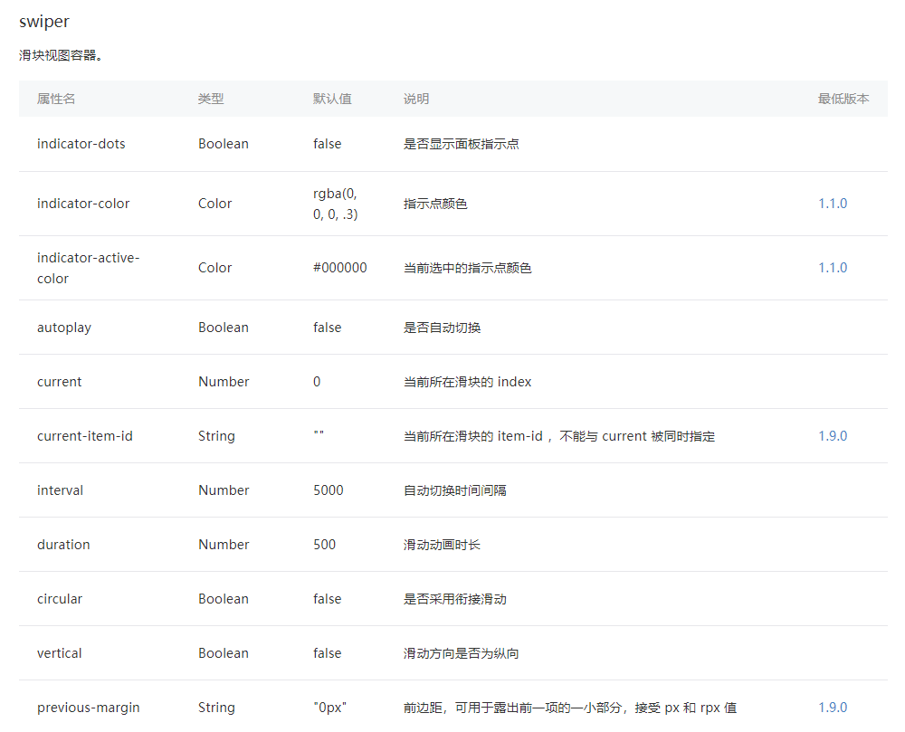
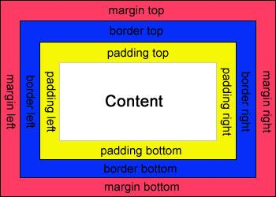
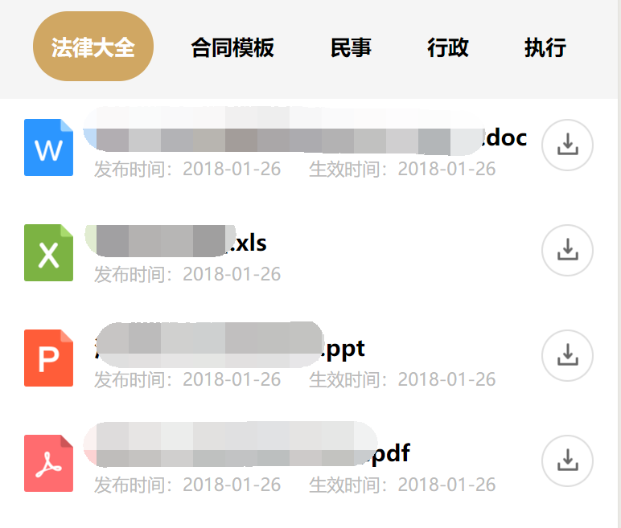
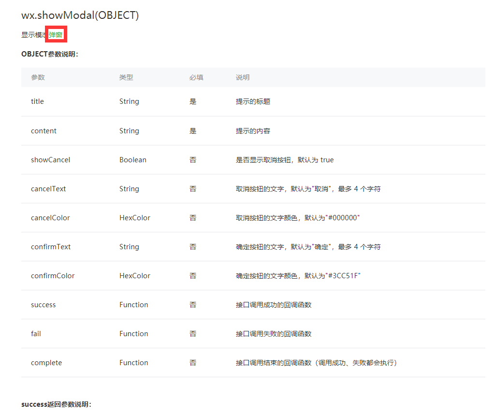
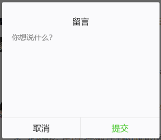

# 微信小程序 100 坑

> create by **jsliang** on **2018-9-17 17:58:56**  
> Recently revised in **2018-9-27 10:53:27**

<br>

## 写在前面

&emsp;**这里有微信小程序开发中遇到的所有坑，以及在填坑过程中的一些个人经验。**  

&emsp;**请结合 《目录》 和 《返回目录》 这两个按钮进行跳转，获得更好的阅读体验。**
  
&emsp;**如果你觉得本文还不错，记得给个 **star** ， 你的 **star** 是我学习的动力！[地址](https://github.com/LiangJunrong/document-library/blob/master/other-library/WeChatApplet/WeChatAppletBug.md)**

&emsp;本文技术支持：**Ansen江**

&emsp;**注1：由于更新频繁，而且掘金传图有点诡异，获取最新资料请前往 GitHub：[地址](https://github.com/LiangJunrong/document-library/blob/master/other-library/WeChatApplet/WeChatAppletBug.md)**

&emsp;**注2：现在有个 bug ，就是下面的目录，在 VS Code 这个软件中是可以跳转的，但是在 掘金 或者 GitHub 都没法点击了，掘金的可以使用右下角自动生成的目录，但是 GitHub 的就有点难受了，正在寻找原因。**

<br>

## <span id="1">一 目录<span>

| 目录                                                  | 坑  |
| ----------------------------------------------------- | --- |
| [一 前言](#1)                                         |     |
| [二 目录](#2)                                         |     |
| [三 前端挖掘机](#3)                                   |     |
| &emsp;[3.1 swiper 轮播图](#3-1)                       | 4   |
| &emsp;&emsp;[3.1.1 行内样式无效](#3-1-1)              |     |
| &emsp;&emsp;[3.1.2 swiper 属性值设置](#3-1-2)         |     |
| &emsp;&emsp;[3.1.3 轮播图图片跳转](#3-1-3)            |     |
| &emsp;&emsp;[3.1.4 wx:key](#3-1-4)                    |     |
| &emsp;[3.2 tabBar 与 switchTab](#3-2)                 | 2   |
| &emsp;&emsp;[3.2.1 底部导航跳转](#3-2-1)              |     |
| &emsp;&emsp;[3.2.2 自定义底部导航](#3-2-2)            |     |
| &emsp;[3.3 px、rem 与 rpx](#3-3)                      | 1   |
| &emsp;[3.4 微信 web 开发者工具](#3-4)                 | 1   |
| &emsp;[3.5 组件与 API](#3-5)                          | 1   |
| &emsp;[3.6 flex 布局](#3-6)                           | 2   |
| &emsp;&emsp;[3.6.1 左右布局](#3-6-1)                  |     |
| &emsp;&emsp;[3.6.2 混合布局](#3-6-2)                  |     |
| &emsp;[3.7 background-image 套用本地图片无效](#3-7)   | 1   |
| &emsp;[3.8 \<block\> 与 \<view\>](#3-8)               | 1   |
| &emsp;[3.9 margin-top 无法上浮](#3-9)                 | 1   |
| &emsp;[3.10 微信小程序分享](#3-10)                    | 1   |
| &emsp;[3.11 border-box 设置](#3-11)                   | 1   |
| &emsp;[3.12 自定义导航条](#3-12)                      | 5   |
| &emsp;&emsp;[3.12.1 自定义选项卡效果与实现](#3-12-1)  |     |
| &emsp;&emsp;[3.12.2 绑定事件如何传递数据](#3-12-2)    |     |
| &emsp;&emsp;[3.12.3 不允许驼峰](#3-12-3)              |     |
| &emsp;&emsp;[3.12.4 获取 data 数据](#3-12-4)          |     |
| &emsp;&emsp;[3.12.5 实现文字省略](#3-12-5)            |     |
| &emsp;[3.13 黑科技：\<modal\>](#3-13)                 | 2   |
| &emsp;&emsp;[3.13.1 被遗弃的 \<modal\>](#3-13-1)      |     |
| &emsp;&emsp;[3.13.2 四种弹窗写法](#3-13-2)            |     |
| &emsp;[3.14 小程序解析 HTML](#3-14)                   | 3   |
| &emsp;[3.15 诡异的 open-type](#3-15)                  | 1   |
| &emsp;[3.16 \<button\>去样式及其内嵌\<image\>](#3-16) | 1   |

&emsp;目前已有 **28** 个坑。

<br>

## <span id="2">二 前言</span>

&emsp;[返回目录](#1)

&emsp;微信小程序的开发教程，或许写出来是非常受欢迎的。  
&emsp;但是，第一，微信小程序是国内的，有[中文文档](https://developers.weixin.qq.com/miniprogram/dev/index.html)，虽然它的文档说明有点坑，但好歹有文档，阅读理解不是问题。第二， **jsliang** 的文笔并没有想象中的那么好，想想我带你们走了一遍小程序开发，然后你们以为是一条平坦路，结果碰到一堆坑坑洼洼，咋办？最后的锅，会不会到我背啊，可怕！  
&emsp;所以，在这里， **jsliang** 结合 **“日常躺坑”** ，先为你解决小程序的 100 个坑！虽然现在可能还不够，但是第一天我就碰到 4/5 个了，我想我可以帮你们躺完 100 个的！！！  
&emsp;现在的微信开发者工具显示的开发版本是：`"libVersion": "2.0.4"`  
&emsp;如果你开发的版本已经解决了这个 bug ，或者你觉得这个 bug 还有其他解决方法，或者你觉得这个玩意还有其他 bug ，请告诉我，我会补充到这篇文档上，顺带记上您的大名，谢谢！  
&emsp;QQ： 1741020489  

<br>

## <span id="3">三 内部组件坑</span>

&emsp;[返回目录](#1)

> 本坑来源于微信自带的开发文档：[小程序开发文档](https://developers.weixin.qq.com/miniprogram/dev/component/)。  

> 在文档中，你会发现很多的乐趣！毕竟，你不知道什么时候中文成为了你的语言障碍~

<br>

### <span id="3-1">3.1 swiper 轮播图</span>

&emsp;[返回目录](#1)

> 本组件目前已有4个坑，有兴趣的小伙伴可以详看。

<br>

代码来源于该地址：[微信组件 swiper](https://developers.weixin.qq.com/miniprogram/dev/component/swiper.html) 。为方便小伙伴查看，下面贴出原版代码：
> demo.wxml
```
<swiper indicator-dots="{{indicatorDots}}"
  autoplay="{{autoplay}}" interval="{{interval}}" duration="{{duration}}">
  <block wx:for="{{imgUrls}}">
    <swiper-item>
      <image src="{{item}}" class="slide-image" width="355" height="150"/>
    </swiper-item>
  </block>
</swiper>
<button bindtap="changeIndicatorDots"> indicator-dots </button>
<button bindtap="changeAutoplay"> autoplay </button>
<slider bindchange="intervalChange" show-value min="500" max="2000"/> interval
<slider bindchange="durationChange" show-value min="1000" max="10000"/> duration
```

<br>

> demo.js
```
Page({
  data: {
    imgUrls: [
      'http://img02.tooopen.com/images/20150928/tooopen_sy_143912755726.jpg',
      'http://img06.tooopen.com/images/20160818/tooopen_sy_175866434296.jpg',
      'http://img06.tooopen.com/images/20160818/tooopen_sy_175833047715.jpg'
    ],
    indicatorDots: false,
    autoplay: false,
    interval: 5000,
    duration: 1000
  },
  changeIndicatorDots: function(e) {
    this.setData({
      indicatorDots: !this.data.indicatorDots
    })
  },
  changeAutoplay: function(e) {
    this.setData({
      autoplay: !this.data.autoplay
    })
  },
  intervalChange: function(e) {
    this.setData({
      interval: e.detail.value
    })
  },
  durationChange: function(e) {
    this.setData({
      duration: e.detail.value
    })
  }
})
```
<br>

&emsp;好的，上面就是微信官方文档的演示代码，如果你跟着走了一遍碰到疑问的话，看看这里我挖的土是不是能填好你的坑：

<br>

#### <span id="3-1-1">3.1.1 行内样式无效</span>

&emsp;[返回目录](#1)

&emsp;`demo.wxml` 中出现的 `<image src="{{item}}" class="slide-image" width="355" height="150"/>` 这行， `width` 和 `height` 的行内属性是忽悠老百姓的，**它并没卵用** ！我们需要在 `slide-image` 这个 `class` 类中修改 `width` 和 `height`。简而言之，行内样式都是骗人的，乖，我们还是去 `demo.wxss` 写样式吧~

<br>

#### <span id="3-1-2">3.1.2 swiper 属性值设置</span>

&emsp;[返回目录](#1)

&emsp;`swiper` 属性值。官方文档说明：

&emsp;虽然，它的属性名和属性值是这么说的。但是，用的时候，首先你需要在 `demo.wxml` 中的 `swiper` 绑定这个属性名，然后在 `demo.js` 中设置其属性值。值得注意的是，它的绑定值，稍微不同于 `Vue`， 需要设置 `{{}}` 形式。如果文字描述你看得不是很清楚，可以参照下面的代码进行理解。

<br>

#### <span id="3-1-3">3.1.3 轮播图图片跳转</span>

&emsp;[返回目录](#1)

&emsp;关于轮播图的地址跳转，在微信小程序的官网是没用提及的，也是 **jsliang** 去百度查看了下，才知道怎么设置（可能是我一开始就挑战的难度太高了么 -_-|| ），在下面 **jsliang** 贴出来代码~想知道怎么解决的可以去看看：首先，在 `data` 中设置 `link` ；然后，设置 `navigator` 导航遍历 `item.link` 。

<br>

#### <span id="3-1-4">3.1.4 wx:key</span>

&emsp;[返回目录](#1)

&emsp;关于 `wx:key` ， `wx:key` 的作用是：当数据改变触发渲染层重新渲染的时候，会校正带有 key 的组件，框架会确保他们被重新排序，而不是重新创建，以确保使组件保持自身的状态，并且提高列表渲染时的效率。但是，在其 `swiper` 中，小程序本身是没有写的，所以它会带有 `warning` ，这里也是个小坑， **jsliang** 也是百度了下也知道这件事：[点我了解](https://www.sohu.com/a/207728111_99897596)。

<br>

&emsp;下面给出 **jsliang** 的解决代码，如有不对，尽情指出：

> index.wxml
```
<view>
  <swiper indicator-dots="{{indicatorDots}}" autoplay="{{autoplay}}" interval="{{interval}}" duration="{{duration}}" indicator-color="#707071" indicator-active-color="#fff" circular="true">
    <!-- wx:key ： 提高列表渲染效率 -->
    <block wx:for="{{carousel}}" wx:key="{{item.index}}">
      <swiper-item>
        <navigator url="{{item.link}}" hover-class="navigator-hover">
          <image src="{{item.url}}" class="slide-image" />
        </navigator>
      </swiper-item>
    </block>
  </swiper>
</view>
```

<br>

> index.wxss
```
.slide-image {
  width: 100%;
  height: 420rpx;
}
```

<br>

> index.js
```
Page({
  data: {
    imgUrls: [
      {
        link: '../index/index',
        url: 'http://img02.tooopen.com/images/20150928/tooopen_sy_143912755726.jpg',
      },
      {
        link: '../demo/demo',
        url: 'http://img06.tooopen.com/images/20160818/tooopen_sy_175866434296.jpg',
      },
      {
        link: '../logs/logs',
        url: 'http://img02.tooopen.com/images/20150928/tooopen_sy_143912755726.jpg'
      }
    ],
    indicatorDots: true,
    autoplay: true,
    interval: 5000,
    duration: 1000
  }
})
```

<br>

### 3.2 <span id="3-2">tabBar 与 switchTab</span>

&emsp;[返回目录](#1)

> 本组件目前已有2个坑，有兴趣的小伙伴可以详看。

&emsp;tabBar ：底部菜单栏，需要在 `app.json` 中设置。使用方法：见下文。  
&emsp;navigator ：导航切换。[使用方法](https://blog.csdn.net/u013778905/article/details/59141486)  
&emsp;switchTab ：控制 tabBar 的切换。[使用方法](https://blog.csdn.net/liona_koukou/article/details/53930045)

<br>

#### <span id="3-2-1">3.2.1 底部导航跳转</span>

&emsp;[返回目录](#1)

&emsp;在这里，我们讲下 `tabBar` 的坑，如果你在 `app.json` 中设置了 `tabBar` ：
> app.json
```
"tabBar": {
    "list": [{
      "pagePath": "pages/index/index",
      "text": "首页",
      "iconPath": "./public/index_tabBar1_nor.png",
      "selectedIconPath": "./public/index_tabBar1.png"
    }, {
      "pagePath": "pages/demo/demo",
      "text": "发现",
      "iconPath": "./public/index_tabBar2_nor.png",
      "selectedIconPath": "./public/index_tabBar2.png"
    }, {
      "pagePath": "pages/logs/logs",
      "text": "我的",
      "iconPath": "./public/index_tabBar3_nor.png",
      "selectedIconPath": "./public/index_tabBar3.png"
    }]
  }
```

<br>

&emsp;那么，我们就需要通过设置 `switchTab` 来控制底部导航的跳转，而不能通过 `navigator` 来跳转：
> demo.wxml
```
<view>
  <button bindtap="linkTo">Hello</button>
</view>
```

<br>

> demo.js
```
linkTo: function () {
  wx.switchTab({
    url: '../index/index'
  });
},
```

<br>

#### <span id="3-2-2">3.2.2 自定义底部导航</span>

&emsp;[返回目录](#1)

&emsp;那么问题又来了，当我们切换到子页面的时候，我们发现 `tabBar` 这个底部导航栏不见了，然后问了下 **Ansen江** ，他说之前是整个小程序都有的，有些页面还要调用方法去隐藏。  
&emsp;但是现在嘛……它没了！没了啊！！！在微信小程序的文档没看到有唤起底部导航条的方法，难道我要做一个导航条了么 -_-|| 。  
&emsp;回答是：yes！  
&emsp;所以，下面给出该底部导航条 `tabBar` 的实现情况和代码片段：


> 注：图片宽高均为 54rpx

> *.wxml
```
<view class="nav">
  <view class="nav-home" bindtap="goHome">
    <image src="../../public/index_productDetail_icon_home.png"></image>
    <text>首页</text>
  </view>
  <view class="nav-service">
    <image src="../../public/index_productDetail_icon_service.png"></image>
    <text>在线咨询</text>
  </view>
  <view class="nav-phone" bindtap="callWaiter">
    <image src="../../public/index_productDetail_icon_phone.png"></image>
    <text>电话咨询</text>
  </view>
  <navigator url="../indexPurchaseProduct/indexPurchaseProduct">
    <view class="nav-buy">
      <text>立即订购</text>
    </view>
  </navigator>
</view>
```

<br>

> *.wxss
```
.nav {
  display: flex;
  justify-content: space-around;
  font-size: 20rpx;
  border: 1px solid #ccc;
  position: fixed;
  bottom: 0;
  background: #fff;
}
.nav view {
  display: flex;
  flex-direction: column;
  align-items: center;
}
.nav image {
  width: 54rpx;
  height: 54rpx;
}
.nav text {
  margin-top: 7rpx;
}
.nav-home {
  border-right: 1px solid #ccc;
  width: 130rpx;
  padding-top: 5rpx;
}
.nav-service {
  border-right: 1px solid #ccc;
  width: 130rpx;
  padding-top: 5rpx;
}
.nav-phone {
  width: 130rpx;
  padding-top: 5rpx;
}
.nav-buy {
  background: #eb333e;
  color: #fff;
  width: 360rpx;
  height: 98rpx;
  line-height: 80rpx;
  font-size: 34rpx;
}
```

<br>

> *.js
```
callWaiter: function(res) {
  wx.makePhoneCall({
    phoneNumber: '13264862250',
    success: function(res) {
      console.log("拨打成功");
      console.log(res);
    },
    fail: function(res) {
      console.log("拨打失败");
      console.log(res);
    },
    complete: function(res) {
      console.log("拨打完成");
      console.log(res);
    }
  })
},
goHome: function() {
  wx.switchTab({
    url: '../index/index'
  })
},
```

<br>

### <span id="3-3">3.3 px、rem 与 rpx</span>

&emsp;[返回目录](#1)

> 本节目前已有1个坑，有兴趣的小伙伴可以详看。

&emsp;在微信中，它自带了一套属于自己的单位：`rpx` ， `rpx` 不同于之前我们认识的 `px` 、 `rem` 、 `em` ，如果你的设计稿是 750 px 的，那么很容易的， 1px = 1rpx ，但是，如果设计稿不是 750 px ，那么将造成一个 bug ，至于这个 bug 如何解决……谁知道呢……  
&emsp;知识补充：[关于 rpx](http://www.51xuediannao.com/javascript/xiaochengxu_rpx.html) 。

<br>

### <span id="3-4">3.4 微信 web 开发者工具</span>

&emsp;[返回目录](#1)

> 本节目前已有1个坑，有兴趣的小伙伴可以详看。

&emsp;（ bug 1 ）开发工具无法输入中文。  
&emsp;解决方式：重启开发工具。

<br>

### <span id="3-5">3.5 组件与 API</span>

&emsp;[返回目录](#1)

> 本节目前已有1个坑，有兴趣的小伙伴可以详看。

&emsp;在微信小程序官方文档中，组件与API，是拆分的。是的，轮播图与底部导航条，一个在组件中，一个在导航条中；一个在 `wxml` 、 `wxss` 、 `js` 中要设置对应的参数，一个只需要在 `app.json` 中设置就行，可能微信小程序考虑到底部导航条不应该有太大的变化（例如让你修改太多样式或者 `js` ），所以将导航条内嵌至源码中了。  
&emsp;这时候应该会有小伙伴吐槽了，这不是 bug 啊，你发来做啥呢！  
&emsp;……已隐藏 5000 字吵架字眼~

<br>

### <span id="3-6">3.6 flex 布局</span>

&emsp;[返回目录](#1)

> 本节目前已有2个坑，有兴趣的小伙伴可以详看。

&emsp;Flex布局又称弹性布局，在小程序开发中比较适用。但是由于 **jsliang** 之前没怎么用过 Flex 布局，所以在这里咱们特意去踩下坑，充实下自己。[小程序开发之页面布局](https://blog.csdn.net/anda0109/article/details/72867449)、[阮一峰-Flex 布局教程](http://www.techug.com/post/flex-examples.html)  
&emsp;在我们布局页面的时候，最好看看 **阮一峰** 的教程，平时遇到布局的问题的时候，我都习惯去上面 **阮一峰** 的文章看看：

<br>

#### <span id="3-6-1">3.6.1 左右布局</span>

&emsp;[返回目录](#1)

&emsp;实现效果如下：


&emsp;如图，这是我们要实现的左右布局效果。那么，在微信小程序要怎么做呢？

> *.wxml
```
<view class="top-recommended-headlines">
  <view class="top-recommended-headlines-left">
    <text>热门推荐</text>
  </view>
  <view>
    <image src="../../public/index_top_recommended_headlines.png"></image>
  </view>
  <view class="top-recommended-headlines-right">
    <navigator url="../indexProduct/indexProduct">查看全部 ></navigator>
  </view>
</view>
```

<br>

> *.wxss
```
.top-recommended-headlines {
  display: flex;
  align-items: flex-end;
  height: 31rpx;
  line-height: 31rpx;
  margin-bottom: 10rpx;
}
.top-recommended-headlines-left text {
  font-size: 32rpx;
  font-weight: bold;
}
.top-recommended-headlines image {
  width: 366rpx;
  height: 31rpx;
  margin-left: 10rpx;
}
.top-recommended-headlines-right navigator {
  font-size: 26rpx;
  color: #a9a9a9;
  margin-left: 50rpx;
}
```

<br>

#### <span id="3-6-2">3.6.2 混合布局</span>

&emsp;[返回目录](#1)

&emsp;实现效果如下：


&emsp;如图，这是我们要实现的左右布局效果。那么，在微信小程序要怎么做呢？

> *.wxml
```
<view class="weui-tab__content-item3" wx:for="{{tabs3Content}}" wx:key="{{item.index}}">
  <navigator url="../indexProductArticle/indexProductArticle">
    <view class="weui-tab__content-item3-question">
      <image src="../../public/index_productDetail_icon_question.png"></image>
      <text>{{item.title}}</text>
    </view>
    <view class="weui-tab__content-item3-answer">
      <image src="../../public/index_productDetail_icon_answer.png"></image>
      <text>{{item.content}}</text>
    </view>
    <view class="weui-tab__content-item3-detail">
      <text class="weui-tab__content-item3-detail-datatime">{{item.datatime}}</text>
      <text class="weui-tab__content-item3-detail-reader">{{item.reader}}阅读</text>
      <text class="weui-tab__content-item3-detail-label">#{{item.label}}#</text>
    </view>
  </navigator>
  <view class="weui-tab__content-item3-gap">
    <image src="../../public/index_productDetail_gap.png"></image>
  </view>
</view>
```

<br>

> *.wxss
```
.weui-tab__content-item3 {
  padding-left: 30rpx;
  padding-right: 30rpx;
  margin-top: -10rpx;
  margin-bottom: 10rpx;
}
.weui-tab__content-item3:first-child {
  padding: 40rpx 30rpx 0;
}
.weui-tab__content-item3-question image {
  width: 30rpx;
  height: 30rpx;
}
.weui-tab__content-item3-question text {
  font-size: 30rpx;
  line-height: 46rpx;
  font-weight: bold;
  color: #333;
  margin-left: 10rpx;
}
.weui-tab__content-item3-answer image {
  width: 30rpx;
  height: 30rpx;
}
.weui-tab__content-item3-answer text {
  font-size: 26rpx;
  line-height: 42rpx;
  color: #a9a9a9;
  margin-left: 10rpx;
}
.weui-tab__content-item3-detail {
  display: flex;
  justify-content: space-between;
  font-size: 26rpx;
  color: #a9a9a9;
}
.weui-tab__content-item3-detail-label {
  color: #d0a763;
}
.weui-tab__content-item3-gap image {
  width: 100%;
  height: 30rpx;
}
```

<br>

> *.js
```
tabs3Content: [
  {
    title: '员工发明创造是否属于职务发明的认证标准?',
    content: '随着企业对知识产权在企业发展中核心竞争力的认识力提高，企业保护自身知识产权的意识不断增强，使其技术得......',
    datatime: '2018-03-05',
    reader: '2081',
    label: '知识产权'
  }
]
```

<br>

### <span id="3-7">3.7 background-image 套用本地图片无效</span>

&emsp;[返回目录](#1)

> 本节目前已有1个坑，有兴趣的小伙伴可以详看。

&emsp;在小程序中，如果你使用 wxss，你是可以发现有 `background-image` 的提示的。但是，如果你设置它的背景图是本地图片，你会发现，它是不生效的。  
&emsp;解决方案：  

1. 在使用背景图片的时候用网络图片，就是用外链的形式，比如你将这张图片放到你的服务器，如：`https://xxxx/xxx.jpg`；
2. 将背景图片使用编码base64进行转换，可以在这个网址进行 [点我前往](http://tool.css-js.com/base64.html) 转换，如：background-image: url("转换后得到的编码文本")，如果多次使用的话可以将该值设置为全局变量，再在js文件进行引用即可。
3. 使用 `image` 组件 + `position` 定位而不是使用 `background-image` 。

<br>

### <span id="3-8">3.8 \<block\> 与 \<view\></span>

&emsp;[返回目录](#1)

> 本节目前已有1个坑，有兴趣的小伙伴可以详看。

&emsp;两者的区别是，`<view>` 是一个组件，会在页面上做渲染；`<block>` 不是一个组件，它仅仅是一个包装元素，只接受控制属性，不会在页面中做任何渲染。  
&emsp;所以，如果你仅仅是需要包裹，而不是渲染一个层，可以使用 `<block>` 提升性能。

<br>

### <span id="3-9">3.9 margin-top 无法上浮</span>

&emsp;[返回目录](#1)

> 本节目前已有1个坑，有兴趣的小伙伴可以详看。

&emsp;首先，我们要实现的效果是：


&emsp;然后， **jsliang** 的想法是：

> *.wxml
```
<view class="search">
  <input class="search-product-input" bindinput="bindKeyInput" auto-focus maxlength='10'></input>
  <label class="search-placeholder">
    <image class="search-placeholder-icon" src="../../public/index_indexProduct_icon_search.png"></image>
    <text class="search-placeholder-text">搜索产品</text>
  </label>
  <view></view>
</view>
```

<br>

> *.wxss
```
.search {
  height: 100rpx;
  display: flex;
  flex-direction: column;
  justify-content: space-between;
  align-items: center;
  position: relative;
}
.search-product-input {
  background: #f5f5f5;
  width: 650rpx;
  height: 65rpx;
  border-radius: 30rpx;
  font-size: 30rpx;
  padding-left: 20rpx;
}
.search-placeholder {
  font-size: 26rpx;
  text-align: center;
  margin-top: -65rpx;
  z-index: 2;
}
.search-placeholder-icon {
  width: 24rpx;
  height: 24rpx;
}
.search-placeholder-text {
  margin-left: 10rpx;
}
```

<br>

&emsp;你注意到了吗？在 `*.wxml` 中， **jsliang** 设置了个空的 `<view>` ，如果你把这个 `<view>` 去掉，你会惊奇地发现，它……下来了……


&emsp;好吧，可能有其他的实现方式，但是如果你下次使用这种方式，注意这个坑~  
&emsp;回头看了下 `WeUI` 的实现方式，发现跟我的思路是挺像的，关于 `input` 的实现方式，现在依据 `WeUI` ，成功实现了输入框：


&emsp;源码奉上：
> *.wxml
```
<!-- 搜索框 -->
<view class="search">
  <view class="weui-search-bar">
    <view class="weui-search-bar__form {{inputShowed ? 'form-border' : ''}}">
      <view class="weui-search-bar__box">
        <icon class="weui-icon-search_in-box" type="search" size="14"></icon>
        <input type="text" class="weui-search-bar__input" placeholder="搜索" value="{{inputVal}}" focus="{{inputShowed}}" bindinput="inputTyping" />
        <view class="weui-icon-clear" wx:if="{{inputVal.length > 0}}" bindtap="clearInput">
          <icon type="clear" size="14"></icon>
        </view>
      </view>
      <label class="weui-search-bar__label" hidden="{{inputShowed}}" bindtap="showInput">
        <icon class="weui-icon-search" type="search" size="14"></icon>
        <view class="weui-search-bar__text">搜索</view>
      </label>
    </view>
    <view wx:if="{{inputVal.length <= 0}}" class="weui-search-bar__cancel-btn" hidden="{{!inputShowed}}" bindtap="hideInput">取消</view>
    <view wx:if="{{inputVal.length > 0}}" class="weui-search-bar__submit-btn" hidden="{{!inputShowed}}" bindtap="searchInput">搜索</view>
  </view>
</view>
```

<br>

> *.js
```
Page({
  data: {
    inputShowed: false,
    inputVal: ""
  },
  showInput: function () {
    this.setData({
      inputShowed: true
    });
  },
  hideInput: function () {
    this.setData({
      inputVal: "",
      inputShowed: false
    });
  },
  clearInput: function () {
    this.setData({
      inputVal: ""
    });
  },
  inputTyping: function (e) {
    this.setData({
      inputVal: e.detail.value
    });
  }
})
```

<br>

> *.wxss
```
.search {
  height: 100rpx;
  padding: 18rpx 30rpx;
}
.weui-search-bar {
  padding: 0;
  background-color: #fff;
  border-top: none;
  border-bottom: none;
  height: 64rpx;
}
.weui-search-bar__form {
  border: none;
}
.form-border {
  border: 1rpx solid #f5f5f5;
  background: #f5f5f5;
}
.weui-search-bar__label {
  background: #f5f5f5;
  border-radius: 30rpx;
}
.weui-search-bar__cancel-btn {
 font-size: 26rpx; 
 background: rgb(8, 202, 186);
 color: #fff;
 padding: 2rpx 20rpx 0 20rpx;
 border-radius: 10rpx;
}
.weui-search-bar__submit-btn {
  font-size: 26rpx; 
  background: rgb(8, 200, 248);
  color: #fff;
  padding: 10rpx 20rpx 0 20rpx;
  border-radius: 10rpx;
}
```

<br>

### <span id="3-10">3.10 微信小程序分享</span>

&emsp;[返回目录](#1)

> 本节目前已有1个坑，有兴趣的小伙伴可以详看。

&emsp;官方文档：[地址](https://developers.weixin.qq.com/miniprogram/dev/framework/app-service/page.html#%E9%A1%B5%E9%9D%A2%E4%BA%8B%E4%BB%B6%E5%A4%84%E7%90%86%E5%87%BD%E6%95%B0)  
&emsp;在这里，提醒广大小伙伴注意了，注意了，注意了！重要的事说三遍。  
&emsp;当你新建 `page` 的时候，微信 web 开发者工具会自动帮你添加分享事件:

```
/**
  * 用户点击右上角分享
  */
onShareAppMessage: function (res) {

}
```

<br>

&emsp;所以，如果你在前面定义了，它会在最下面偷偷帮你清空，然后你就觉得无法自定义分享事件……  
&emsp;是的，**jsliang** 打死都不承认这是我自己的锅，新手注意！新手注意！！新手注意！！！

<br>

### <span id="3-11">3.11 border-box 设置</span>

&emsp;[返回目录](#1)

> 本节目前已有1个坑，有兴趣的小伙伴可以详看。

&emsp;熟知盒模型的小伙伴应该知道，盒模型有两种计算方式：
1. box-sizing: border-box;
2. box-sizing: content-box;

&emsp;在 `border-box` 中，整个 `view` 的宽、高，包括 `margin`、`padding`、`border`。  
&emsp;而在 `content-box` 中，整个 `view` 的宽、高，则不包括上面元素。 



&emsp;如上图，如果一个 `view` ，你的代码如下：
```
view {
  box-sizing: border-box;
  margin: 10rpx;
  width: 100rpx;
  height: 100rpx;
  padding: 10rpx;
}
```

<br>

&emsp;那么，你的整个宽高还是 `100rpx`。  
&emsp;但是，如果你的代码如下：
```
view {
  box-sizing: content-box;
  margin: 10rpx;
  width: 100rpx;
  height: 100rpx;
  padding: 10rpx;
}
```

<br>

&emsp;那么，你的整个盒子宽高是 `120rpx`。

&emsp;如果你在设计页面中，发现内容区被撑爆了，那么，请检查下现在的 `border-box` 是什么。

<br>

### <span id="3-12">3.12 自定义选项卡</span>

&emsp;[返回目录](#1)

> 本节目前已有4个坑，有兴趣的小伙伴可以详看。

<br>

#### <span id="3-12-1">3.12.1 自定义选项卡效果与实现</span>

&emsp;[返回目录](#1)

&emsp;自定义选项卡的代码实现：   

&emsp;实现效果图如下：



&emsp;实现代码如下：

> *.wxml
```
<view>
  <view class="weui-tab__nav">
    <text wx:for="{{tabs2Nav}}" wx:key="item.index" class="{{item.state == 1 ? 'weui-tab__nav-active' : ''}}" bindtap="tabs2NavClick" data-labelId="{{item.id}}">{{item.label}}</text>
  </view>
  <view class="weui-tab__content-item2" wx:for="{{tabs2Content}}" wx:key="{{item.index}}">
    <view class="weui-tab__content-item-descritpion">
      <view class="{{item.type == 1 ? 'weui-tab__content-item-icon-type' : 'hide'}}">
        <image src="../../public/index_productDetail_icon_word.png"></image>
      </view>
      <view class="{{item.type == 2 ? 'weui-tab__content-item-icon-type' : 'hide'}}">
        <image src="../../public/index_productDetail_icon_excel.png"></image>
      </view>
      <view class="{{item.type == 3 ? 'weui-tab__content-item-icon-type' : 'hide'}}">
        <image src="../../public/index_productDetail_icon_ppt.png"></image>
      </view>
      <view class="{{item.type == 4 ? 'weui-tab__content-item-icon-type' : 'hide'}}">
        <image src="../../public/index_productDetail_icon_pdf.png"></image>
      </view>
      <view class="weui-tab__content-item-descritpion-content">
        <text class="weui-tab__content-item-descritpion-content-title">{{item.title}}</text>
        <view class="weui-tab__content-item-descritpion-content-datatime">
          <text class="weui-tab__content-item-descritpion-content-datatime1">发布时间：{{item.datatime}}</text>
          <text class="{{item.effectiveTime ? 'weui-tab__content-item-descritpion-content-datatime2' : 'hide'}}">生效时间：{{item.effectiveTime}}</text>
        </view>
      </view>
    </view>
    <view class="weui-tab__content-item-download-state" bindtap='downloadFile' data-url="{{item.url}}">
      <image src="../../public/index_productDetail_icon_undown.png"></image>
    </view>
  </view>
</view>
```

<br>

> *.wxss
```
.weui-tab__nav {
  background: #f5f5f5;
  border: 1rpx 0rpx solid #e6e6e6;
  height: 90rpx;
  padding: 17rpx 41rpx;
  display: flex;
  justify-content: space-between;
}
.weui-tab__nav text {
  border-radius: 56rpx;
  height: 56rpx;
  line-height: 56rpx;
  padding: 15rpx 23rpx;
  font-size: 26rpx;
  font-weight: bold;
}
.weui-tab__nav-active {
  color: #fefefe;
  background: #d0a763;
}
.weui-tab__content-item2 {
  display: flex;
  justify-content: space-between;
  padding: 25rpx 30rpx;
}
.weui-tab__content-item-descritpion {
  display: flex;
  justify-content: space-between;
}
.weui-tab__content-item-descritpion image {
  width: 60rpx;
  height: 70rpx;
}
.hide {
  display: none;
}
.weui-tab__content-item-descritpion-content {
  margin-left: 26rpx;
}
.weui-tab__content-item-descritpion-content-title {
  font-size: 28rpx;
  font-weight: bold;
  overflow: hidden;
  text-overflow: ellipsis;
  display: -webkit-box;
  -webkit-line-clamp: 1;
  -webkit-box-orient: vertical;
}
.weui-tab__content-item-descritpion-content-datatime {
  font-size: 22rpx;
  color: #bbb;
}
.weui-tab__content-item-descritpion-content-datatime1 {
  margin-right: 35rpx;
}
.weui-tab__content-item-download-state image {
  width: 64rpx;
  height: 64rpx;
}
```

<br>

> *.js
```
data: {
  tabs2Nav: [
    {
      id: '1',
      label: '法律大全',
      state: 1
    },
    {
      id: '2',
      label: '合同模板',
      state: 0
    },
    {
      id: '3',
      label: '民事',
      state: 0
    },
    {
      id: '4',
      label: '行政',
      state: 0
    },
    {
      id: '5',
      label: '执行',
      state: 0
    }
  ],
  tabs2Content: [
    {
      title: '中华人名共和国民用航空法(2015年...).doc',
      url: 'https://wxmcard.imusic.cn/testfordocdownload.doc',
      datatime: '2018-01-26',
      effectiveTime: '2018-01-26',
      type: '1'
    },
    {
      title: '原生申诉表格.xls',
      url: 'https://wxmcard.imusic.cn/testfordocdownload.doc',
      datatime: '2018-01-26',
      type: '2'
    },
    {
      title: '法律常识大汇集及范例.ppt',
      url: 'https://wxmcard.imusic.cn/testforpptdownload.pptx',
      datatime: '2018-01-26',
      effectiveTime: '2018-01-26',
      type: '3'
    },
    {
      title: '事业单位法律基础知识总结.pdf',
      url: 'https://wxmcard.imusic.cn/testforpdfdownload.pdf',
      datatime: '2018-01-26',
      effectiveTime: '2018-01-26',
      type: '4'
    }
  ],

  // 选项卡第二屏分组
  tabs2Content1: [
    {
      title: '中华人名共和国民用航空法(2015年...).doc',
      datatime: '2018-01-26',
      effectiveTime: '2018-01-26',
      type: '1'
    },
    {
      title: '原生申诉表格.xls',
      datatime: '2018-01-26',
      type: '2'
    },
    {
      title: '法律常识大汇集及范例.ppt',
      datatime: '2018-01-26',
      effectiveTime: '2018-01-26',
      type: '3'
    },
    {
      title: '事业单位法律基础知识总结.pdf',
      datatime: '2018-01-26',
      effectiveTime: '2018-01-26',
      type: '4'
    }
  ],
  tabs2Content2: [
    {
      title: '合同模板.doc',
      datatime: '2018-01-26',
      effectiveTime: '2018-01-26',
      type: '1'
    }
  ],
  tabs2Content3: [
    {
      title: '民事合同模板.doc',
      datatime: '2018-01-26',
      effectiveTime: '2018-01-26',
      type: '1'
    }
  ],
  tabs2Content4: [
    {
      title: '行政合同模板.doc',
      datatime: '2018-01-26',
      effectiveTime: '2018-01-26',
      type: '1'
    }
  ],
  tabs2Content5: [
    {
      title: '执行合同模板.doc',
      datatime: '2018-01-26',
      effectiveTime: '2018-01-26',
      type: '1'
    }
  ]
},
// 选项卡2切换
tabs2NavClick: function(e) {
  var that = this;
  console.log("完整的数据是：");
  console.log(that.data.tabs2Nav);
  
  console.log("点击的标签是：");
  console.log(e.currentTarget.dataset.labelid);

  var newTabs2Content;

  console.log("正在经历的标签是：");
  for(var i=0; i<that.data.tabs2Nav.length; i++) {
    console.log(that.data.tabs2Nav[i].id);
    that.data.tabs2Nav[i].state = 0;
    if (that.data.tabs2Nav[i].id == e.currentTarget.dataset.labelid) {
      that.data.tabs2Nav[i].state = 1;
      console.log("将改变的标签是：");
      console.log(that.data.tabs2Nav[i]);

      // 改变内容
      var changeContentName = "tabs2Content" + (i + 1);
      if (changeContentName == "tabs2Content1") {
        console.log(that.data.tabs2Content1);
        newTabs2Content = that.data.tabs2Content1;
      } else if (changeContentName == "tabs2Content2") {
        newTabs2Content = that.data.tabs2Content2;
      } else if (changeContentName == "tabs2Content3") {
        newTabs2Content = that.data.tabs2Content3;
      } else if (changeContentName == "tabs2Content4") {
        newTabs2Content = that.data.tabs2Content4;
      } else {
        newTabs2Content = that.data.tabs2Content5;
      }

      console.log("希望转换内容到：");
      console.log(changeContentName);
    }
  }

  this.setData({
    tabs2Nav: that.data.tabs2Nav,
    tabs2Content: newTabs2Content
  })
},
```

<br>

#### <span id="3-12-2">3.12.2 绑定事件如何传递数据</span>

&emsp;[返回目录](#1)

&emsp;绑定事件如何传递数据：  
&emsp;如果学过 `Vue` 的同学，应该知道 `Vue` 的数据传递形式是： `@click='tabs2NavClick(item.id)'`  
&emsp;那么，在微信小程序中，你千万记得，绑定时间的传递参数的方式不是这样子的，而是：
```
<text wx:for="{{tabs2Nav}}" wx:key="item.index" bindtap="tabs2NavClick" data-labelId="{{item.id}}">{{item.label}}</text>
```  

<br>

&emsp;通过 `data-*="{{item}}"` 的形式传递的~然后你需要在 `js` 中，通过 `e.currentTarget.dataset.labelid` 来获取。

<br>

#### <span id="3-12-3">3.12.3 不允许驼峰</span>

&emsp;[返回目录](#1)

&emsp;然后，注意了，这里还有个小 bug。（ bug 3 ）我们使用的是 `data-labelId="{{item.id}}"`，而获取数据的时候，我们获取的是 `labelid`，是的，驼峰不见了~

&emsp;参考链接：[链接](https://www.jianshu.com/p/a3481a255842)

<br>

#### <span id="3-12-4">3.12.4 获取 data 数据</span>

&emsp;[返回目录](#1)

&emsp;如何在方法中获取 `data` 中定义的数据：  
&emsp;如果我想在选项卡切换的方法 `tabs2NavClick` 中获取 `data` 里面的数据，那么我应该怎么做呢？  
&emsp;是的，通过:
```
tabs2NavClick: function(e) {
  var that = this;
  console.log(that.data.tabs2Nav);
}
```  

<br>

&emsp;这种形式，我们就可以获取到 `data` 中的数据。  
&emsp;参考链接：[链接](https://blog.csdn.net/chq1988/article/details/74625741)

<br>

#### <span id="3-12-5">3.12.5 实现文字省略</span>

&emsp;[返回目录](#1)

&emsp;如何实现文字省略：  
&emsp;加入你有一段文本，你想让页面根据自身宽度，自动省略多余长度，那么，我们可以设置下面的 `css` 代码，从而实现文字省略效果（不使用 js 的原因，是因为 js 没有 css 那么灵活）  
```
text {
  overflow:hidden;
  text-overflow:ellipsis;
  display:-webkit-box;
  -webkit-line-clamp:1;
  -webkit-box-orient:vertical;
}
```

<br>

&emsp;参考链接：[链接](https://blog.csdn.net/hxh5801050/article/details/79540412)

<br>

### <span id="3-13">3.13 黑科技：\<modal\></span>

&emsp;[返回目录](#1)

> 本节目前已有2个坑，有兴趣的小伙伴可以详看。

<br>

#### <span id="3-13-1">3.13.1 被遗弃的 \<modal\></span>

&emsp;[返回目录](#1)

&emsp;一个坑就是一个故事。  
&emsp;故事都有四元素：时间，地点，人物，事情。  
&emsp;前三个自不必说，我们直接讲事情经过：我们项目的负责人需要一个留言弹窗，然后里面有个文本框可以填信息，最后点击【留言】按钮将数据传到后端，点击【取消】按钮关闭弹窗。  
&emsp;需求是不是很简单~既然微信小程序有自己的官方文档。那么，怎么方便怎么来吧，于是 **jsliang** 在微信小程序中搜索关键字 `弹窗`：



&emsp;看了下搜索记录，最匹配的就是上面这个了。enm...好像没看到放文本框的？先试试：


&emsp;额(⊙o⊙)…  


&emsp;不好意思打扰了，我去百度看看：[链接](https://blog.csdn.net/qq_35181466/article/details/80405248)

&emsp;咦~ 它这里好像有个 `<modal>` 标签？Ctrl+C、Ctrl+V 试试先~



&emsp;Duang~~~这不就是我要的效果么，挖槽，黑科技？于是 **jsliang** 去小程序那里搜了下 `modal` ……enm...蜜汁尴尬，好像只有上面的 `wx.showModal()` 方法……于是 **jsliang** 满头黑线……好嘛，黑科技黑科技！！！  
&emsp;下面贴出实现代码：

> *.wxml
```
<text class="article-message-board-head-addMessage" bindtap="modalinput">写留言</text>
```

<br>

> *.js
```
Page({
  data: {
    // 弹窗
    hiddenmodalput: true, //可以通过hidden是否掩藏弹出框的属性，来指定那个弹出框
  },
  //点击按钮指定的hiddenmodalput弹出框    
  modalinput: function () {
    this.setData({
      hiddenmodalput: !this.data.hiddenmodalput
    })
  },
  //取消按钮    
  cancel: function () {
    this.setData({
      hiddenmodalput: true
    });
  },
  //确认    
  confirm: function () {
    wx.showToast({
      title: '留言成功！',
    })
    this.setData({
      hiddenmodalput: true
    })
  }
})
```

<br>

&emsp;好的，上面就实现了一个简单的可填写文本的弹窗了。

<br>

#### <span id="3-13-2">3.13.2 四种弹窗写法</span>

&emsp;[返回目录](#1)

&emsp;作为一枚职业填坑人，怎么能满足于上面的两种弹窗形式呢！于是，使用百度大法又找到了一篇填坑文：[链接](https://blog.csdn.net/gao_xu_520/article/details/71084162?locationNum=1&fps=1)

&emsp;所以，总结下就有了四种弹窗写法：

| 类型      | 说明                                                                                       | 地址                                                                                                                           |
| --------- | ------------------------------------------------------------------------------------------ | ------------------------------------------------------------------------------------------------------------------------------ |
| 模态弹窗  | 模态弹窗就是上面的第一种弹窗，它可以给你选择【取消】或者【确定】                           | [链接](https://developers.weixin.qq.com/miniprogram/dev/api/ui/interaction/wx.showToast.html?search-key=wx.showModal)          |
| \<modal\> | \<modal\>是上面的第二种弹窗，可以提供用户填写                                              | [链接](https://blog.csdn.net/qq_35181466/article/details/80405248)                                                             |
| 消息弹窗  | 消息弹窗就是操作成功或者操作失败的那一刻，系统的提示弹窗，无需用户操作，可设定几秒自动关闭 | [链接](https://developers.weixin.qq.com/miniprogram/dev/api/ui/interaction/wx.showToast.html?search-key=wx.showToast)          |
| 操作菜单  | 操作菜单类似于弹出的下拉菜单，提供你选择其中某项或者【取消】                               | [链接](https://developers.weixin.qq.com/miniprogram/dev/api/ui/interaction/wx.showActionSheet.html?search-key=showActionSheet) |

&emsp;在这里，就讲完了微信小程序的四种弹窗形式了。如果你改样式改的烦啊烦的，可能你需要封装一个属于自己的弹窗？嘿嘿，说不定你的产品经理会有兴趣让你开发一个 `beautiful` 弹窗的~  
&emsp;这坑我不填，我没碰到~碰到了再说！在这里预留下这个坑，哈哈。

<br>

### <span id="3-14">3.14 小程序解析 HTML</span>

&emsp;[返回目录](#1)

> 本节目前已有3个坑，有兴趣的小伙伴可以详看。

&emsp;[链接](https://github.com/icindy/wxParse)

&emsp;1、[链接](https://www.qinziheng.com/xiaochengxudev/4336.htm)

&emsp;2、如果内容无法显示，那么，恭喜你触发了 bug，这个是wxparse代码的一个bug,在一些特殊的手机里面，在wxparse/html2json.js中的第112和119行，都有一个console.dir(这个函数的使用，把这个函数注释掉，内容就可以正常显示出来了。
```
if (name == 'class') {
    // console.dir(value); // 112 行
    //  value = value.join("")
    node.classStr = value;
}
// has multi attibutes
// make it array of attribute
if (name == 'style') {
    // console.dir(value);  // 119行
    //  value = value.join("")
    node.styleStr = value;
}
```

<br>

&emsp;3、如果你需要引用图片：[地址](https://blog.csdn.net/jorzen1984/article/details/80492521)

<br>

### <span id="3-15">3.15 诡异的 open-type</span>

&emsp;[返回目录](#1)

> 本节目前已有1个坑，有兴趣的小伙伴可以详看。

&emsp;在小程序中，它有一些自定义的方法，例如 `open-type` ，是需要 `<button>` 来承接的。  
&emsp;所以，如果你写好了一个 `view`，里面有很好看的样式了，你本来打算用 `bindtap` 来搞事情的。但是，突然接到信息，需要外套一层 `<button open-type="***">` ，然后发现，样式需要重新跳过……  
&emsp;enm...加油不哭~

<br>


### <span id="3-16">3.16 \<button\>去样式及其内嵌\<image\></span>

&emsp;[返回目录](#1)

> 本节目前已有1个坑，有兴趣的小伙伴可以详看。

&emsp;就像上一章所说的，有时候，迫不得已，我们必须在 `<button>` 中内嵌个 `<image>` 或者 `<text>` 之类的，那么，一般怎么做呢？  
&emsp;现在，假设我有一个 `42*40` 的图片，我来试试调下它的样式：

> *.wxml
```
<button open-type='share'>
  <image src="../../public/explore_activityDetail_icon_share.png"></image>
</button>
```

<br>

> *.wxss
```
.activity-user-action button {
  width: 42rpx;
  height: 80rpx;
  margin: 0;
  padding: 0;
  margin-top: -21rpx;
  background: #fff;
}
.activity-user-action button::after {
  border: none;
}
.activity-user-action image:last-child {
  width: 42rpx;
  height: 40rpx;
}
```

<br>

&emsp;如上，我们需要设置这个按钮的高度是图片高度的 2 倍，然后还需要设置 `margin-top` 的高度为图片高度的 1/2（注意 margin 与 margin-top 的顺序，如果你不知道顺序的重要性，推荐你使用 `margin: -21rpx 0 0 0 `），同时 `margin`、`padding`、`background`、`border` 需要清空。

<br>

> <a rel="license" href="http://creativecommons.org/licenses/by-nc-sa/4.0/"></a><br /><span xmlns:dct="http://purl.org/dc/terms/" property="dct:title">**jsliang**的文档库</span> 由 <a xmlns:cc="http://creativecommons.org/ns#" href="https://github.com/LiangJunrong/document-library" property="cc:attributionName" rel="cc:attributionURL">梁峻荣</a> 采用 <a rel="license" href="http://creativecommons.org/licenses/by-nc-sa/4.0/">知识共享 署名-非商业性使用-相同方式共享 4.0 国际 许可协议</a>进行许可。<br />基于<a xmlns:dct="http://purl.org/dc/terms/" href="https://github.com/LiangJunrong/document-library" rel="dct:source">https://github.com/LiangJunrong/document-library</a>上的作品创作。<br />本许可协议授权之外的使用权限可以从 <a xmlns:cc="http://creativecommons.org/ns#" href="https://creativecommons.org/licenses/by-nc-sa/2.5/cn/" rel="cc:morePermissions">https://creativecommons.org/licenses/by-nc-sa/2.5/cn/</a> 处获得。