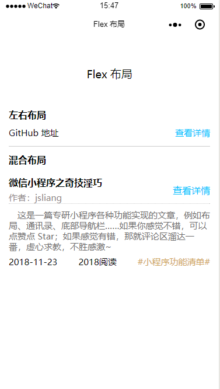
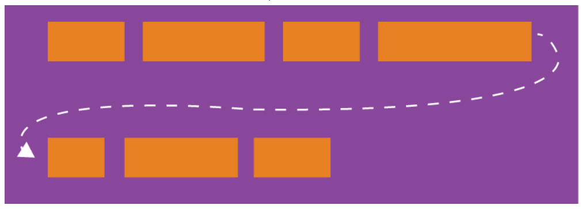
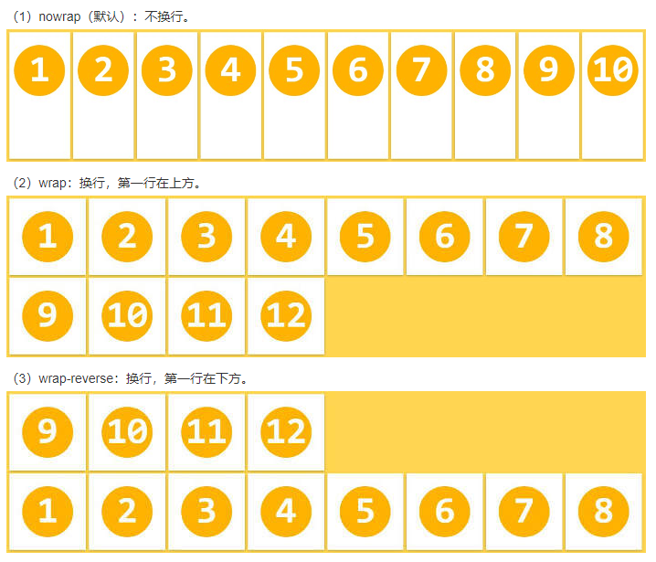
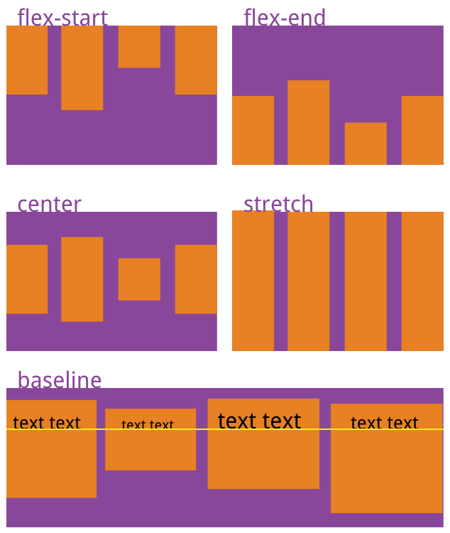
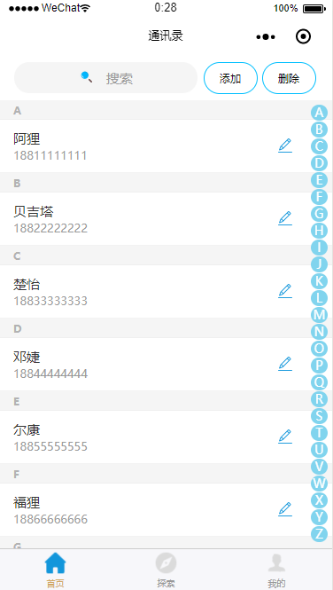
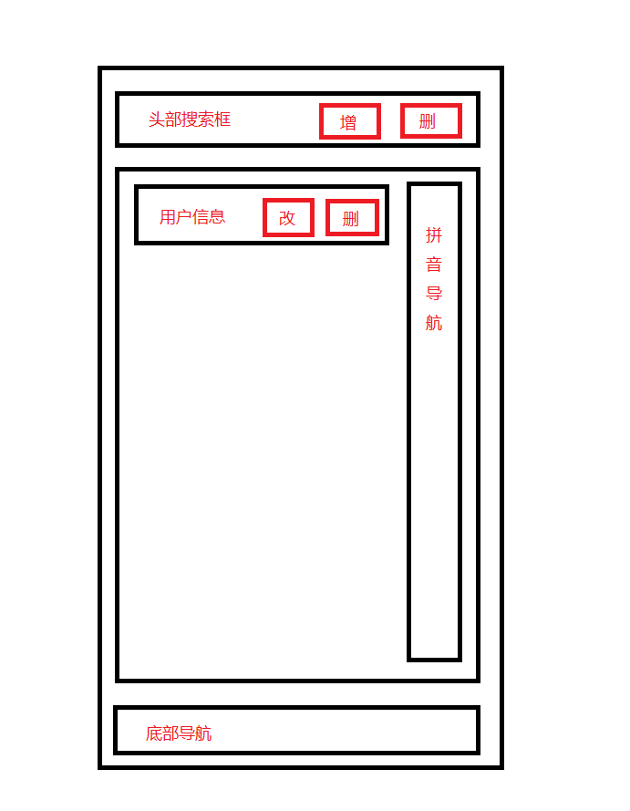

微信小程序之奇技淫巧
===

> Create by **jsliang** on **2018-11-21 20:46:36**  
> Recently revised in **2018-11-24 08:39:49**

<br>

&emsp;**Hello 小伙伴们，如果觉得本文还不错，记得给个 **star** ， 你们的 **star** 是我学习的动力！[GitHub 地址](https://github.com/LiangJunrong/document-library/blob/master/other-library/WeChatApplet/WeChatAppletFunctionList.md)**

<br>

&emsp;**开篇点题**：  
&emsp;这是一篇专研小程序各种功能实现的文章，例如布局、通讯录、底部导航栏……  
&emsp;感觉不错的小伙伴，点赞点 Star走一波；感觉文章有误的小伙伴，评论区、[QQ群](https://jq.qq.com/?_wv=1027&k=5qu79al) 溜达一番。  
&emsp;虚心求教，不胜感激~ 

<br>

&emsp;**成品图**：


<br>

# <a name="chapter-one" id="chapter-one">一 目录</a>

&emsp;**不折腾的前端，和咸鱼有什么区别**

| 目录 |                                                                             
| --- | 
| [一 目录](#chapter-one) | 
| <a name="catalog-chapter-two" id="catalog-chapter-two"></a>[二 前言](#chapter-two) |
| <a name="catalog-chapter-three" id="catalog-chapter-three"></a>[三 功能列表](#chapter-three) |
| &emsp;<a name="catalog-chapter-three-one" id="catalog-chapter-three-one"></a>[3.1 排兵布阵 - Flex布局](#chapter-three-one) |
| &emsp;&emsp;[3.1.1 楼起平地 - 基础概念](#chapter-three-one-one) |
| &emsp;&emsp;[3.1.2 搭砖建瓦 - 左右布局](#chapter-three-one-two) |
| &emsp;&emsp;[3.1.3 层台累榭 - 混合布局](#chapter-three-one-three) |
| &emsp;<a name="catalog-chapter-three-two" id="catalog-chapter-three-two"></a>[3.2 沙场点兵 - 通讯录](#chapter-three-two) |
| &emsp;&emsp;[3.2.1 谋定苍生 - 整体布局](#chapter-three-two-one) |
| &emsp;&emsp;[3.2.2 千里寻敌 - 搜索功能](#chapter-three-two-two) |
| &emsp;&emsp;[3.2.3 遥控追踪 - 底部导航](#chapter-three-two-three) |
| &emsp;&emsp;[3.2.4 拒敌长城 - 弹窗实现](#chapter-three-two-four) |
| &emsp;&emsp;[3.2.5 卧薪尝胆 - 思路整理](#chapter-three-two-five) |
| &emsp;&emsp;[3.2.6 广聚民心 - 新增功能](#chapter-three-two-six) |
| &emsp;&emsp;[3.2.7 化繁为简 - 修改功能](#chapter-three-two-seven) |
| &emsp;&emsp;[3.2.8 革新去旧 - 删除功能](#chapter-three-two-eight) |
| &emsp;&emsp;[3.2.9 兵分一路 - 正常加载](#chapter-three-two-night) |
| &emsp;&emsp;[3.2.10 兵分二路 - 拼音导航](#chapter-three-two-ten) |
| &emsp;&emsp;[3.2.11 一统天下 - 归纳总结](#chapter-three-two-ten) |
| <a name="catalog-chapter-four" id="catalog-chapter-four"></a>[四 项目地址](#chapter-four) |

<br>

# <a name="chapter-two" id="chapter-two">二 前言</a>

> [返回目录](#catalog-chapter-two)

<br>

&emsp;写文章无形中也会磨炼自己的表达能力。  
&emsp;这周 (`2018-11-19`) 在开发微信小程序的定制 **通讯录** 时，突然发现 **[微信小程序 bug 集中营](https://github.com/LiangJunrong/document-library/blob/master/other-library/WeChatApplet/WeChatAppletBug.md)** 这篇文章不能再继续写了，因为它变得 **臃肿**、**丑陋** 且 **难维护**，就连我这个写作人都感慨：如果没有 `Ctrl + F` ，以及我的 **目录** 写得还不错，我真心不想再翻这篇文章。  
&emsp;为此，**jsliang** 单独开了一篇文章：**微信小程序功能清单**。用来记录小程序各种功能的实现，例如布局、通讯录、底部导航栏……  
&emsp;然后嘛，为了能吸引小伙伴点进来瞅瞅，起个标新立异的标题吧：**微信小程序之奇技淫巧**。

<br>

# <a name="chapter-three" id="chapter-three">三 功能列表</a>

> [返回目录](#catalog-chapter-three)

<br>

&emsp;为了小伙伴能快速了解代码中的意思，小伙伴可以去该 [项目地址](https://github.com/LiangJunrong/WeChatApplet) 下载代码到本地运行查看。

&emsp;**敲了再说**  

&emsp;**敲&emsp;&emsp;看**  
&emsp;**一&emsp;&emsp;一**  
&emsp;**遍&emsp;&emsp;遍**  
&emsp;**？&emsp;&emsp;？**  
&emsp;**天&emsp;&emsp;谁**  
&emsp;**差&emsp;&emsp;都**  
&emsp;**地&emsp;&emsp;可**  
&emsp;**别&emsp;&emsp;以**  
&emsp;**！&emsp;&emsp;！**

&emsp;顺带附上一些资源网站：

* [Iconfont - 阿里巴巴矢量图标库](http://www.iconfont.cn/home/index)
* [图片压缩 - TinyPNG](https://tinypng.com/)

<br>

## <a name="chapter-three-one" id="chapter-three-one">3.1 排兵布阵 - Flex布局</a>

> [返回目录](#catalog-chapter-three-one)

<br>

&emsp;如果你发现你的 `CSS` 水平还处于 `float` 布局，你会发现在小程序中你举步维艰，因为单单只用浮动布局，在小程序中它不好用。  
&emsp;所以，`Flex` 布局，是你的不二选择：布局的传统解决方案，基于盒状模型，依赖 `display` 属性 + `position` 属性 + `float` 属性。它对于那些特殊布局非常不方便，比如，垂直居中就不容易实现。而 `Flex` 布局。又称弹性布局，可以简便、完整、响应式地实现各种页面布局。  
&emsp;网上较好的教程有：

* [Flex 布局语法教程 | 菜鸟教程](https://www.runoob.com/w3cnote/flex-grammar.html)
* [Flex 布局教程：实例篇 | 阮一峰](http://www.techug.com/post/flex-examples.html)  

&emsp;如果你想全面了解 `Flex`，推荐去看上面的文章。  
&emsp;如果你已经了解 `Flex` 布局，点击 [返回目录](#chapter-one) 寻找更多精彩！  
&emsp;如果你想快速复习浏览 `Flex` 布局，那么，`Here we go`~

&emsp;`Flex` 最终实现效果：



<br>

### <a name="chapter-three-one-one" id="chapter-three-one-one">3.1.1 楼起平地 - 基础概念</a>

> [返回目录](#catalog-chapter-three-one)

<br>

&emsp;万丈高楼平地起，熟悉 `Flex` 需要先了解下面这 `7` 个 `CSS` 属性：

```
/* 设置 Flex 模式 */
display: flex;

/* 决定元素是横排还是竖着排，要不要倒序 */
flex-direction: column;

/* 决定元素换行格式，一行排不下的时候如何排 */
flex-wrap: wrap;

/* flex-flow = flex-direction + flex-wrap */
flex-flow: column wrap;

/* 同一排下对齐方式，空格如何隔开各个元素 */
justify-content: space-between;

/* 同一排下元素如何对齐，顶部对齐、中部对齐还是其他 */
align-items: center;

/* 多行对齐方式 */
align-content: space-between;
```

<br>

&emsp;下面我们详细分析这些元素的情况：

1. `flex-direction`：决定主轴的方向
  
* `row` - （默认）水平方向，起点在左端
* `row-reverse` - 水平方向，起点在右端 
* `column` - 垂直方向，起点在上沿 
* `column-reverse` - 垂直方向，起点在下沿

```
display: flex;

flex-direction: row | row-reverse | column | column-reverse;
```


<br>

2. `flex-wrap`：一条轴线（一行）排不下时如何解决

* `nowrap` - （默认）不换行
* `warp` - 换行，第一行在上方
* `wrap-reverse` - 换行，第一行在下方

```
display: flex;

flex-wrap: nowrap | wrap | wrap-reverse;  
```





<br>

3. `flex-flow`：flex-flow = flex-direction + flex-wrap。即 flex-flow 是这两个属性的合集

* `row nowrap` - （默认）水平方向，起点在左端，不换行

```
display: flex;

flex-flow: <flex-direction> || <flex-wrap>;
```

&emsp;详解参考 `1` 和 `2`

<br>

4. `ustify-content`：定义项目在主轴上的对齐方式

* `flex-start` - 左边对齐
* `flex-end` - 右边对齐
* `center` - 居中对齐
* `space-between` - 两端对齐，空格在中间
* `space-around` - 空格环绕

```
display: flex;

justify-content: flex-start | flex-end | center | space-between | space-around;
```


<br>

5. `align-items`：定义项目在交叉轴上如何对齐

* `flex-start` - 顶部对齐，即文字图片等顶部同一条线上
* `flex-end` - 底部对其，即文字图片等底部在同一条线上
* `center` - 中间对其，即文字图片不管多高，都拿它们的中间放在同一条线上
* `stretch` - 将文字图片充满整个容器的高度，强制统一
* `baseline` - 将每项的第一行文字做统一在一条线上对齐

```
display: flex;

align-items: flex-start | flex-end | center | stretch | baseline;
```



<br>

6. `align-content`：定义多根轴线的对齐方式。如果只有一根轴线（只有一行），该属性不起作用

* `flex-start` - 这几行顶部对齐
* `flex-end` - 这几行底部对齐
* `center` - 这几行居中对齐
* `stretch` - 这几行进行扩展或者缩放，从而填满容器高
* `space-between` - 这几行中间使用空格进行填充
* `space-around` - 这几行两边及中间进行填充

```
display: flex;

align-content: flex-start | flex-end | center | space-between | space-around | stretch;
```


<br>

### <a name="chapter-three-one-two" id="chapter-three-one-two">3.1.2 搭砖建瓦 - 左右布局</a>

> [返回目录](#catalog-chapter-three-one)

&emsp;实现效果如下：


&emsp;如图，这是我们要实现的左右布局效果。那么，在微信小程序要怎么做呢？

> *.wxml
```
<view class="left-and-right-layout">
  <view class="left-and-right-layout-floor-one">
    <text>左右布局</text>
  </view>
  <view class="left-and-right-layout-floor-two">
    <text class="left-and-right-layout-floor-two-left">GitHub 地址</text>
    <navigator class="left-and-right-layout-floor-two-right" url="https://github.com/LiangJunrong/document-library/blob/master/other-library/WeChatApplet/WeChatAppletFunctionList.md">查看详情</navigator>
  </view>
</view>
```

<br>

> *.wxss
```
.left-and-right-layout {
  padding: 0 30rpx;
}

.left-and-right-layout-floor-one {
  font-size: 32rpx;
  line-height: 32rpx;
  font-weight: bold;
}

.left-and-right-layout-floor-two {
  /* Flex 左右布局关键点 */
  display: flex;
  justify-content: space-between;

  padding: 30rpx 0;
  font-size: 30rpx;
  line-height: 30rpx;
  border-bottom: 1rpx solid #ccc;
}

.left-and-right-layout-floor-two-right {
  color: deepskyblue;
}
```

<br>

### <a name="chapter-three-one-three" id="chapter-three-one-three">3.1.3 层台累榭 - 混合布局</a>

> [返回目录](#catalog-chapter-three-one)

&emsp;实现效果如下：


&emsp;如图，这是我们要实现的混合布局效果，那么在微信小程序中要如何编程呢？

> *.wxml
```
<view class="mixed-layout">
  <view class="mixed-layout-floor-one">
    <text>混合布局</text>
  </view>
  <view class="mixed-layout-floor-two">
    <view class="mixed-layout-floor-two-left">
      <text class="mixed-layout-floor-two-left-title">微信小程序之奇技淫巧</text>
      <text class="mixed-layout-floor-two-left-author" url="https://github.com/LiangJunrong/document-library/blob/master/other-library/WeChatApplet/WeChatAppletFunctionList.md">作者：jsliang</text>
    </view>
    <view class="mixed-layout-floor-two-right">
      <navigator>查看详情</navigator>
    </view>
  </view>
  <view class="mixed-layout-floor-three">
    <text>这是一篇专研小程序各种功能实现的文章，例如布局、通讯录、底部导航栏……如果你感觉不错，可以点赞点 Star；如果感觉有错，那就评论区溜达一番，虚心求教，不胜感激~ </text>
  </view>
  <view class="mixed-layout-floor-four">
    <text>2018-11-23</text>
    <text>2018阅读</text>
    <text class="mixed-layout-floor-four-classification">#小程序功能清单#</text>
  </view>
</view>
```

<br>

> *.wxss
```

/* 混合布局 */

/* 混合布局包裹层 */
.mixed-layout {
  margin-top: 30rpx;
  padding: 0 30rpx 30rpx;
}

/* 混合布局第一层 */
.mixed-layout-floor-one {
  font-size: 32rpx;
  line-height: 32rpx;
  font-weight: bold;
}

/* 混合布局第二层 */
.mixed-layout-floor-two {
  /* 关键 Flex 布局 */
  display: flex;
  justify-content: space-between;
  align-items: center;

  margin-top: 40rpx;
  font-size: 32rpx;
  border-bottom: 1rpx dotted #ccc;
}
.mixed-layout-floor-two-left {
  /* 左侧竖行排序 */
  display: flex;
  flex-direction: column;
}
.mixed-layout-floor-two-left-title {
  font-weight: bold;
}
.mixed-layout-floor-two-left-author {
  margin-top: 10rpx;
  color: rgb(146, 138, 138);
  font-size: 30rpx;
}
.mixed-layout-floor-two-right {
  color: deepskyblue;
}

/* 混合布局第三层 */
.mixed-layout-floor-three {
  margin-top: 20rpx;
  font-size: 30rpx;
  line-height: 36rpx;
  color: rgb(110, 108, 108);
  text-indent: 1em;
}

/* 混合布局第四层 */
.mixed-layout-floor-four {
  /* 关键 Flex 布局 */
  display: flex;
  justify-content: space-between;

  margin-top: 20rpx;
  font-size: 30rpx;
  line-height: 30rpx;
}
.mixed-layout-floor-four-classification {
  color: #d0a763;
}
```

<br>

## <a name="chapter-three-two" id="chapter-three-two">3.2 沙场点兵 - 通讯录</a>

> [返回目录](#catalog-chapter-three-two)

<br>

&emsp;不知道小伙伴们在日常开发中，有没有碰到各种稀奇古怪的功能效果，我们觉得不可思议，但是在项目经理的眼中它却是能 “**满足客户需求**” 的。  
&emsp;所以，拿到 “**奇怪的**” 需求清单的时候不要恐慌，我们仔细分析，总能找到它的破绽，从而完成我们的任务。  

&emsp;通讯录功能的开发如下：  
&emsp;开发时间：4 天  
&emsp;实现效果：



<br>

### <a name="chapter-three-two-one" id="chapter-three-two-one">3.2.1 谋定苍生 - 整体布局</a>

> [返回目录](#catalog-chapter-three-two)

<br>

&emsp;工欲善其事，必先利其器。  

&emsp;**首先**，我们先将该页面命名为：`addressList`，并编写它的 `json` 门面：

> addressList.json

```
{
  "backgroundTextStyle": "light",
  "navigationBarBackgroundColor": "#fff",
  "navigationBarTitleText": "通讯录",
  "navigationBarTextStyle": "black"
}
```

&emsp;**接着**，我们明确需要实现的功能点：

* 搜索功能
* 弹窗新增功能
* 弹窗修改功能
* 删除功能
* 拼音导航功能
* 底部导航栏

&emsp;**然后**，我们明确下页面布局：



&emsp;如上图，它主要分三大块：头部、内容区、底部。  
&emsp;**最后**，我们根据功能实现及页面布局编写 `wxml` 的布局：

> wxml 骨架

```
<!-- part1 - 搜索区域 -->
<view class="search"></view>

<!-- part2 - 搜索结果 -->
<view class="search-result"></view>

<!-- part3 - 内容区域 -->
<view class="contacts-list"></view>

<!-- part4 - 拼音导航 -->
<view class="pinyin-nav"></view>

<!-- part5 - 底部导航 -->
<view class="bottom-nav"></view>

<!-- part6 - 新增弹窗 -->
<view class="add-prompt"></view>

<!-- part7 - 修改弹窗 -->
<view class="edit-prompt"></view>
```

&emsp;如上，我们将页面分为 7 种情况，其中：

* 搜索功能 - **`part1`**、**`part2`**、`part4`、`part5`
* 弹窗新增功能 - `part1`、`part3`、`part4`、`part5`、**`part6`**
* 弹窗修改功能 - `part1`、`part3`、`part4`、`part5`、**`part7`**
* 删除功能 - `part1`、`part3`、`part4`、`part5`
* 拼音导航功能 - `part1`、`part3`、`part4`、`part5`
* 底部导航栏 - `part1`、`part3`、`part4`、`part5`

&emsp;请注意，出现的 `part` 部分表明在这种模式下，页面要显示的 `part` 都有哪些，其他的则暂时隐藏，而加粗的意味着这是这个功能特有的部分。为此，我们应该在 `js` 的 `data` 中定义好这些模式：

> js 代码片段

```
Page({
  data: {
    /**
     * 功能模式
     * normalModel - 正常模式
     * addModel - 新增模式
     * editModel - 修改模式
     * deleteModel - 删除模式
     * searchModel - 搜索模式
     * pinyinNavModel - 拼音导航模式
     */
    normalModel: false,
    addModel: false,
    editModel: false,
    deleteModel: false,
    searchModel: true,
    pinyinNavModel: false,
  }
})
```

<br>

&emsp;这样，我们除了底部导航栏外，为其他功能定义了一个模式，正常情况下我们开启 `normalModel`，其他暂时关闭。  
&emsp;在下文中，我们将根据模式的开启与关闭，显示/隐藏某些内容，并进行数据的管理，请小伙伴们稍微理解下这种思路。

<br>

### <a name="chapter-three-two-two" id="chapter-three-two-two">3.2.2 千里寻敌 - 搜索功能</a>

> [返回目录](#catalog-chapter-three-two)

<br>

* 查看 `wxml` 代码：[Go to wxml](#chapter-three-two-two-wxml)
* 查看 `wxss` 代码：[Go to wxss](#chapter-three-two-two-wxss)
* 查看 `js`代码`：[Go to js](#chapter-three-two-two-js)

&emsp;本章节实现效果：


<br>

&emsp;实现思路、编码及代码讲解：

> <a name="chapter-three-two-two-wxml" id="chapter-three-two-two-wxml">addressList.wxml</a>

1. 在 `wxml` 与 `wxss` 结构上。  

&emsp;**首先**，我们通过 `fixed` 定位，将 `search-form` 固定在顶部。  
&emsp;**然后**，我们将 `search-form` 其内部分为 **搜索区** `search` 与 **功能区** `action`。  
&emsp;**接着**，我们将 `search` 分为 **假的搜索区** `search-model-one` 与 **真的搜索区** `search-model-two`。为什么要分两种情况呢？因为这样我们就不用烦恼 `input` 的 `placeholder` 一会居中一会靠边要怎么区分，思路不容易乱。  
&emsp;**最后**，根据功能，我们逐步完善 `wxml` 与 `wxss`代码。

> [返回本节开头](#chapter-three-two-two)

```
<!-- part1 - 搜索区域 -->
<view class="search-form">
  <!-- 搜索区 -->
  <view class="search">
    <!-- 假的搜索框 -->
    <view wx:if="{{!searchModel}}" class="search-model search-model-one" bindtap="showSearch">
      <image class="icon" src="../../public/img/icon_search.png"></image>
      <text class="search-model-one-text">搜索</text>
    </view>
    <!-- 真的搜索框 -->
    <view wx:if="{{searchModel}}" class="search-model search-model-two">
      <image class="icon search-model-two-icon" src="../../public/img/icon_search.png"></image>
      <!-- 多加层 view 的作用是做到 × 的定位作用 -->
      <view class="search-model-two-form">
        <input type="text" class="search-model-two-input" placeholder="搜索" focus="{{inputFocus}}" value="{{searchVal}}" bindinput="monitorInputVal"></input>
        <text wx:if="{{searchVal.length > 0}}" class="clear-input" bindtap="clearInput">×</text>
      </view>
      <text wx:if="{{searchVal.length <= 0}}" class="search-model-two-button search-model-two-button-cancel" bindtap="showSearch">取消</text>
      <text wx:if="{{searchVal.length > 0}}" class="search-model-two-button search-model-two-button-submit" bindtap="searchSubmit">搜索</text>
    </view>
  </view>
  <!-- 功能区 -->
  <view class="action">
    <text class="action-button action-add" bindtap="showAdd">添加</text>
    <text wx:if="{{!deleteModel}}" class="action-button action-delete" bindtap="showDelete">删除</text>
    <text wx:if="{{deleteModel}}" class="action-button action-delete-comfirm" bindtap="showDelete">完成</text>
  </view>
</view>

<!-- part2 - 搜索结果 -->
<view wx:if="{{searchModel}}" class="search-result">
  <view class="search-result-item" wx:for="{{searchData}}" wx:key="{{searchData.index}}">
    <view class="search-result-item-left">
      <text class="search-result-item-left-name">{{item.userName}}</text>
      <text class="search-result-item-left-phone">{{item.userPhone}}</text>
    </view>
    <view class="search-result-item-right">
      <image class="icon search-result-item-right-edit" src="../../public/img/icon_edit.png"></image>
      <image wx:if="{{deleteModel}}" class="icon search-result-item-right-delete" src="../../public/img/icon_delete.png"></image>
    </view>
  </view>
</view>
```

<br>

> <a name="chapter-three-two-two-wxss" id="chapter-three-two-two-wxss">addressList.wxss</a>

> [返回本节开头](#chapter-three-two-two)

```
/* 全局样式 */
view {
  box-sizing: border-box;
}
.icon {
  width: 32rpx;
  height: 32rpx;
}

/* 搜索区域 */
.search-form {
  display: flex;
  justify-content: space-around;
  width: 100%;
  height: 100rpx;
  font-size: 32rpx;
  padding: 0 30rpx;
  /* 绝对定位 - 固定搜索部分 */
  position: fixed;
  top: 0;
  left: 0;
  background: #fff;
}

/* 搜索区域 - 结构 1 */
.search {
 width: 60%; 
}
.search-model {
  height: 70rpx;
  line-height: 50rpx;
  padding: 10rpx 0;
}
.search-model-one {
  margin: 15rpx 0;
  background: #f5f5f5;
  text-align: center;
  border-radius: 50rpx;
}
.search-model-one-text {
  margin-left: 30rpx;
  color: #9b9b9b;
  font-size: 30rpx;
}
.search-model-two {
  position: relative;
  display: flex;
  margin-top: 6rpx;
}
.search-model-two-icon {
  position: absolute;
  left: 20rpx;
  top: 30rpx;
  z-index: 10;
}
.search-model-two-form {
  width: 69%;
  height: 70rpx;
  background: #f5f5f5;
  position: relative;
}
.search-model-two-input {
  padding: 0 65rpx 0 65rpx;
  height: 70rpx;
  font-size: 30rpx;
}
.clear-input {
  position: absolute;
  right: 10rpx;
  top: 15rpx;
  display: inline-block;
  width: 30rpx;
  height: 30rpx;
  line-height: 30rpx;
  text-align: center;
  padding: 5rpx;
  color: #fff;
  background: #ccc;
  border-radius: 20rpx;
  z-index: 10;
}
.search-model-two-button {
  display: inline-block;
  text-align: center;
  width: 90rpx;
  height: 60rpx;
  line-height: 60rpx;
  font-size: 24rpx;
  padding: 5rpx 15rpx;
  margin-left: 10rpx;
  color: #fff;
}
.search-model-two-button-cancel {
  background: rgb(8, 202, 186);
}
.search-model-two-button-submit {
  background: rgb(8, 200, 248);
}

/* 搜索区域 - 结构2 */
.action {
  width: 39%;
}
.action-button {
  display: inline-block;
  text-align: center;
  width: 90rpx;
  height: 60rpx;
  line-height: 60rpx;
  font-size: 24rpx;
  margin-top: 15rpx;
  padding: 5rpx 15rpx;
  border: 1rpx solid deepskyblue;
  border-radius: 40rpx;
}
.action-add, .action-delete, .action-delete-comfirm {
  margin-left: 10rpx;
}
.action-delete-comfirm {
  color: #d0a763;
  border: 1rpx solid #d0a763;
}

/* 搜索结果 */
.search-result {
  margin-top: 100rpx;
}
.search-result-item {
  box-sizing: border-box;
  height: 120rpx;
  display: flex;
  justify-content: space-between;
  align-items: center;
  padding: 27rpx 60rpx 27rpx 30rpx;
  border-bottom: 1rpx solid #f3f3f3;
}
.search-result-item-left {
  display: flex;
  flex-direction: column;
}
.search-result-item-left-name {
  font-size: 30rpx;
  color: #333333;
}
.search-result-item-left-phone {
  font-size: 26rpx;
  color: #999999;
}
.search-result-item-right image {
  width: 32rpx;
  height: 32rpx;
}
.search-result-item-right-edit {
  margin-right: 30rpx;
}
.search-result-item-right-delete {
  margin-right: 30rpx;
}
```

<br>

> <a name="chapter-three-two-two-js" id="chapter-three-two-two-js">addressList.js</a>

2. 在 `js`上。

&emsp;我们仔细观察本节开头的 `GIF` 图，发现它有这几个特点：

* 点击假的搜索区，进入真的搜索区
* 输入内容，按钮由【取消】变为【搜索】
* 点击【搜索】按钮，页面显示搜索内容
* 上拉加载更多数据
* 点击 `×` 按钮，输入内容消失
* 点击【取消】按钮，关闭搜索页面

> [返回本节开头](#chapter-three-two-two)

```
Page({

  /**
   * 页面的初始数据
   */
  data: {
    /**
     * 功能模式
     * normalModel - 正常模式
     * addModel - 新增模式
     * editModel - 修改模式
     * deleteModel - 删除模式
     * searchModel - 搜索模式
     * pinyinNavModel - 拼音导航模式
     */
    normalModel: true,
    addModel: false,
    editModel: false,
    deleteModel: false,
    searchModel: false,
    pinyinNavModel: false,

    /**
     * 搜索功能
     * inputFocus - 搜索框聚焦
     * searchVal - 搜索内容
     * searchData - 搜索结果
     */
    inputFocus: false,
    searchVal: '',
    searchData: [],
  },

  /**
   * 搜索功能
   * showSearch - 显示搜索框
   * monitorInputVal - 监听搜索框的值
   * searchSubmit - 提交搜索
   * clearInput - 清除搜索
   */
  showSearch(e) {
    this.setData({
      normalModel: !this.data.normalModel,
      searchModel: !this.data.searchModel,
      searchData: [],
      inputFocus: true
    })
  },
  monitorInputVal(e) {
    this.setData({
      searchVal: e.detail.value
    })
  },
  searchSubmit(e) {
    console.log("\n【API - 确认搜索】");
    console.log("搜素字段：" + this.data.searchVal);
    
    // 原数据
    let searchData = this.data.searchData;

    // 搜索数据 - 假设搜索数据是这个，实际应该是接口返回数据
    let newSearchData = [
      {
        userName: '阿狸',
        userPhone: '18811111111',
        pinyin: 'ali'
      },
      {
        userName: '贝吉塔',
        userPhone: '18822222222',
        pinyin: 'beijita'
      },
      {
        userName: '楚怡',
        userPhone: '18833333333',
        pinyin: 'chuyi'
      },
      {
        userName: '邓婕',
        userPhone: '18844444444',
        pinyin: 'dengjie'
      },
      {
        userName: '尔康',
        userPhone: '18855555555',
        pinyin: 'erkang'
      },
      {
        userName: '福狸',
        userPhone: '18866666666',
        pinyin: 'fuli'
      },
      {
        userName: '古狸',
        userPhone: '18877777777',
        pinyin: 'guli'
      },
      {
        userName: '哈狸',
        userPhone: '18888888888',
        pinyin: 'hali'
      },
      {
        userName: 'i狸',
        userPhone: '18899999999',
        pinyin: 'ili'
      },
      {
        userName: '激狸',
        userPhone: '18800000000',
        pinyin: 'jli'
      },
    ]

    // 拼接新旧数据
    searchData.push(...newSearchData);

    console.log("\搜索后数据：");
    console.log(searchData);

    this.setData({
      searchData: searchData
    })

  },
  clearInput(e) {
    console.log("\n清除搜索");
    this.setData({
      searchVal: ''
    })
  },

  /**
   * 删除功能
   */
  showDelete(e) {
    this.setData({
      deleteModel: !this.data.deleteModel
    })
  },

  /**
   * 生命周期函数--监听页面加载
   */
  onLoad: function (options) {
    console.log("\n通讯录");
  },

  /**
   * 页面上拉触底事件的处理函数
   */
  onReachBottom: function () {
    if (this.data.normalModel) { // 正常模式上拉
      console.log("\n正常模式上拉")
    } else if (this.data.searchModel) { // 搜索模式上拉

      console.log("\n搜索模式上拉：");

      // 新数据
      let newSearchData = [
        {
          userName: '克狸',
          userPhone: '18811121112',
          pinyin: 'keli'
        },
      ]

      // 原数据
      let searchData = this.data.searchData;

      // 拼接新旧数据
      searchData.push(...newSearchData);

      console.log("\上拉加载后数据：");
      console.log(searchData);

      this.setData({
        searchData: searchData
      })

    } else if (this.data.pinyinNavModel) { // 拼音模式上拉
      console.log("\n拼音模式上拉");
    }
  },
})
```

&emsp;到此，我们就实现了搜索功能。尽管它还有点小 `bug`，就是不停上拉的时候，它会重复地加载一条数据。  
&emsp;在实际项目中，**jsliang** 会定义一个 `searchNoData` 来判断接口是否还在返回数据，如果它不再返回数据，那么通过判断 `searchNoData == true` 来禁止继续加载。  
&emsp;这样，我们就完美搞定了搜索功能的实现。

<br>

### <a name="chapter-three-two-three" id="chapter-three-two-three">3.2.3 遥控追踪 - 底部导航</a>

> [返回目录](#catalog-chapter-three-two)

<br>

&emsp;本章节实现效果：


&emsp;众所周知，微信小程序的子页面（除了设置 `tabBar` 的页面）是没有底部导航栏的。那么，我们要如何设计，才能编写一个 **自定义的底部导航栏** 呢？  
&emsp;在日常开发中，我们通过 `fixed` 布局，在页面实现一个 **自定义的底部导航栏** 是很容易的。  
&emsp;但是，考虑到其他页面可能也需要使用这个底部导航栏，我们就需要想办法将其封装成组件了：

&emsp;微信小程序 - [自定义组件](https://developers.weixin.qq.com/miniprogram/dev/framework/custom-component/)

&emsp;是的，微信小程序官方文档中是存在这个东西的。当然，仅有官方文档，是满足不了我的，至于过程中我百度了几篇文章来辅助写出下面的代码，你猜？  

&emsp;下面贴出实现代码及如何使用：

1. 建立目录。  

&emsp;**首先**，在根目录中新建 `component` 目录，用来存放我们项目的组件。  
&emsp;**然后**，我们新建 `navBar` 目录，用来存放我们的组件 `navBar`。  
&emsp;**最后**，我们新建 `Component` 为 `navBar`。


<br>

2. 进行组件代码编写。

> navBar.wxml

> [返回本节开头](#chapter-three-two-three)

```
<!-- 底部导航条 -->
<view class="navBar">
  <!-- 首页 -->
  <view class="navBar-item navBar-home" bindtap='goHome'>
    <image wx:if="{{homeActive}}" src="../../public/img/tabBar_home.png"></image>
    <image wx:if="{{!homeActive}}" src="../../public/img/tabBar_home_nor.png"></image>
    <text class="{{homeActive ? 'active-text' : 'nor-active-text'}}">首页</text>
  </view>
  <!-- 探索 -->
  <view class="navBar-item navBar-explore" bindtap='goExplore'>
    <image wx:if="{{exploreActive}}" src="../../public/img/tabBar_explore.png"></image>
    <image wx:if="{{!exploreActive}}" src="../../public/img/tabBar_explore_nor.png"></image>
    <text class="{{exploreActive ? 'active-text' : 'nor-active-text'}}">探索</text>
  </view>
  <!-- 我的 -->
  <view class="navBar-item navBar-user" bindtap='goUser'>
    <image wx:if="{{userActive}}" src="../../public/img/tabBar_user.png"></image>
    <image wx:if="{{!userActive}}" src="../../public/img/tabBar_user_nor.png"></image>
    <text class="{{userActive ? 'active-text' : 'nor-active-text'}}">我的</text>
  </view>
</view>
```

<br>

> navBar.wxss

> [返回本节开头](#chapter-three-two-three)

```
/* 底部导航条 */
.navBar {
  display: flex;
  justify-content: space-around;
  box-sizing: border-box;
  width: 100%;
  height: 97rpx;
  padding: 5rpx 0;
  border-top: 1rpx solid #cccccc;
  position: fixed;
  bottom: 0;
  background: #F7F7FA;
}
.navBar image {
  width: 55rpx;
  height: 55rpx;
}
.navBar-item {
  display: flex;
  flex-direction: column;
  align-items: center;
  font-size: 20rpx;
  color: #999999;
}
.nor-active-text {
  padding-top: 5rpx;
}
.active-text {
  padding-top: 5rpx;
  color: #d0a763;
}
```

<br>

> navBar.js

> [返回本节开头](#chapter-three-two-three)

```
Component({
  /**
   * 组件的属性列表
   */
  properties: {
    homeActive: {
      type: Boolean,
      value: false
    },
    exploreActive: {
      type: Boolean,
      value: false
    },
    userActive: {
      type: Boolean,
      value: false
    }
  },

  /**
   * 组件的初始数据
   */
  data: {

  },

  /**
   * 组件的方法列表
   */
  methods: {
    // 返回首页
    goHome: function (e) {
      wx.switchTab({
        url: '../index/index',
      })
    },
    // 返回探索页
    goExplore: function (e) {
      wx.switchTab({
        url: '../explore/explore',
      })
    },
    // 返回我的
    goUser: function (e) {
      wx.switchTab({
        url: '../user/user',
      })
    }
  }
})
```

<br>

> navBar.json

> [返回本节开头](#chapter-three-two-three)

```
{
  "component": true,
  "usingComponents": {}
}
```

<br>

3. 在需要引用的界面引用该组件

> addressList.wxml

```
<!-- part5 - 底部导航 -->
<view class="bottom-nav">
  <navBar homeActive="{{homeActive}}"></navBar>
</view>
```

> addressList.json

```
{
  "backgroundTextStyle": "light",
  "navigationBarBackgroundColor": "#fff",
  "navigationBarTitleText": "通讯录",
  "navigationBarTextStyle": "black",
  "usingComponents": {
    "navBar": "../../component/navBar/navBar"
  }
}
```

> addressList.js

```
Page({
  data: {
    // 引用底部导航
    homeActive: true,
  }
})
```
 
&emsp;下次我们还需使用该底部导航栏的时候，我们只需要重复在 `addressList` 的步骤就行了。  
&emsp;当然，我们需要根据需要活跃的位置，进行 `homeActive`、`exploreActive`、`userActive` 这三个活跃状态与否的设置。  
&emsp;这样，我们就实现了底部导航栏组件的开发及引用。 

<br>

### <a name="chapter-three-two-four" id="chapter-three-two-four">3.2.4 拒敌长城 - 弹窗实现</a>

> [返回目录](#catalog-chapter-three-two)

<br>

&emsp;本章节实现效果：


<br>

&emsp;弹窗？微信小程序就有啊，为啥不用它的呢？

| 类型      | 说明                                                                                                              | 地址                                                                                                                           |
| --------- | ----------------------------------------------------------------------------------------------------------------- | ------------------------------------------------------------------------------------------------------------------------------ |
| 模态弹窗  | wx.showModal(Object) - 模态弹窗可以给你选择【取消】或者【确定】                           | [链接](https://developers.weixin.qq.com/miniprogram/dev/api/ui/interaction/wx.showToast.html?search-key=wx.showModal)          |
| \<modal\> | \<modal\>是可以提供用户填写                                                                     | [链接](https://blog.csdn.net/qq_35181466/article/details/80405248)                                                             |
| 消息弹窗  | wx.showToast(Object) - 消息弹窗就是操作成功或者操作失败的那一刻，系统的提示弹窗，无需用户操作，可设定几秒自动关闭 | [链接](https://developers.weixin.qq.com/miniprogram/dev/api/ui/interaction/wx.showToast.html?search-key=wx.showToast)          |
| 操作菜单  | wx.showActionSheet(Object) - 操作菜单类似于弹出的下拉菜单，提供你选择其中某项或者【取消】                         | [链接](https://developers.weixin.qq.com/miniprogram/dev/api/ui/interaction/wx.showActionSheet.html?search-key=showActionSheet) |

&emsp;然而，逐一尝试，你会发现，上面辣么多弹窗，没有一种符合你的需求的！所以，咱要画一个属于自己的弹窗：

&emsp;**首先**，咱在 `part6` 中新增两个层：遮罩层 `jsliang-mask` 和弹窗内容 `jsliang-alert`。  
&emsp;**然后**，往弹窗内容中编写我们需要的标题、 `input` 输入框以及 `text` 按钮。  
&emsp;**最后**，我们逐一细化编写代码。

> addressList.wxml

> [返回本节开头](#chapter-three-two-four)

```
<!-- part6 - 新增弹窗 -->
<view wx:if="{{addModel}}" class="add-prompt">
  <!-- 遮罩层 -->
  <view class="jsliang-mask" bindtap='showAdd'></view>
  <!-- 弹窗内容 -->
  <view class="jsliang-alert">
    <!-- 标题 -->
    <view class="jsliang-alert-title">
      <text>添加成员</text>
      <text class="jsliang-alert-title-close" bindtap='showAdd'>×</text>
    </view>
    <!-- 输入内容 -->
    <view class="jsliang-alert-content">
      <input type="text" placeholder='请输入姓名' placeholder-class='jsliang-alert-content-user-name-placeholder'></input>
      <input type="text" placeholder='请输入电话号码' placeholder-class='jsliang-alert-content-user-phone-placeholder'></input>
    </view>
    <!-- 确定 -->
    <view class="jsliang-alert-submit">
      <text bindtap='addConfirm'>添加</text>
    </view>
  </view>
</view>
```

<br>

> addressList.wxss

> [返回本节开头](#chapter-three-two-four)

```
/* 弹窗-添加成员 */
.jsliang-mask {
  z-index: 998;
  position: fixed;
  top: 0;
  left: 0;
  width: 100%;
  height: 100%;
  background: #404040;
  filter: alpha(opacity=90);
  -ms-filter: "alpha(opacity=90)";
  opacity: 0.9;
}
.jsliang-alert {
  z-index: 999;
  position: fixed;
  top: 15%;
  left: 9%;
  width: 620rpx;
  height: 580rpx;
  box-shadow: 2rpx 2rpx 4rpx #A0A0A0, -2rpx -2rpx 4rpx #A0A0A0;
  background-color: #fff;
  border-radius: 15rpx;
}

/* 弹窗标题 */
.jsliang-alert-title {
  height: 120rpx;
  line-height: 120rpx;
  color: #333333;
  background: #f8f0e3;
  font-size: 40rpx;
  font-weight: bold;
  text-align: center;
  position: relative;
  border-radius: 15rpx;
}
.jsliang-alert-title-close {
  display: inline-block;
  color: #999999;
  position: absolute;
  font-size: 50rpx;
  right: 40rpx;
}
/* 弹窗内容 */
.jsliang-alert-content {
  padding: 0 70rpx;
}
.jsliang-alert-content input {
  height: 120rpx;
  line-height: 120rpx;
  font-size: 30rpx;
  border-bottom: 1rpx solid #e6e6e6;
}
.jsliang-alert-content-user-name-placeholder, .jsliang-alert-content-user-phone-placeholder {
  font-size: 30rpx;
  color: #b6b6b6;
}
.jsliang-alert-content-user-phone {
  color: rgb(238, 227, 227);
}
.jsliang-alert-submit {
  font-size: 30rpx;
  margin: 60rpx auto;
  text-align: center;
  width: 400rpx;
  height: 90rpx;
  line-height: 90rpx;
  color: #fff;
  background: deepskyblue;
  border-radius: 50rpx;
}
```

<br>

&emsp;这样，我们就可以通过控制 `addModel` 的 `true` 或者 `false`，来显示隐藏新增弹窗。  
&emsp;同理，我们可以依法炮制通过 `editModel` 控制修改弹窗。

<br>

### <a name="chapter-three-two-five" id="chapter-three-two-five">3.2.5 卧薪尝胆 - 思路整理</a>

> [返回目录](#catalog-chapter-three-two)

<br>

&emsp;文章写到这里，我们需要整理下我们都完成了什么，还缺什么？


<br>

&emsp;如上，我们实现了：

* 搜索功能
* 底部导航
* 弹窗显示

&emsp;那么，我们还缺少：

* 新增成员功能
* 修改成员功能
* 删除成员功能
* 拼音导航功能

&emsp;很好！我们实现了一半功能了！但是，小伙伴有没有发现，我们的主内容区是空白的。  
&emsp;所以，为了剩下的功能实现，我们应该编写下 **内容区域**，并进行页面的数据加载：

> addressList.wxml

> [返回本节开头](#chapter-three-two-five)

```
<!-- part3 - 内容区域 -->
<view class="contacts-list">
  <!-- 每组字母数据 -->
  <view class="contacts-item" wx:for="{{contactsData}}" wx:for-item="contactsDataItem" wx:key="{{contactsDataItem.index}}">
    <!-- 字母标题 -->
    <view wx:if="{{!contactsDataItem.users.length < 1}}" class="contacts-list-title">
      <text>{{contactsDataItem.groupName}}</text>
    </view>
    <!-- 该组字母的成员 -->
    <view class="contacts-list-user" wx:for="{{contactsDataItem.users}}" wx:for-item="usersItem" wx:key="{{usersItem.index}}">
      <!-- 成员信息展示 -->
      <view class="contacts-list-user-left">
        <text class="contacts-list-user-left-name">{{usersItem.userName}}</text>
        <text class="contacts-list-user-left-phone">{{usersItem.userPhone}}</text>
      </view>
      <!-- 成员操作 -->
      <view class="contacts-list-user-right">
        <image class="icon contacts-list-user-right-edit" src="../../public/img/icon_edit.png"></image>
        <image wx:if="{{deleteModel}}" class="icon contacts-list-user-right-delete" src="../../public/img/icon_delete.png"></image>
      </view>
    </view>
  </view>
</view>
```

<br>

> addressList.wxss

> [返回本节开头](#chapter-three-two-five)

```
/* 联系人列表 */
.contacts-list {
  margin-top: 100rpx;
  margin-bottom: 120rpx;
}
.contacts-list-title {
  box-sizing: border-box;
  font-size: 24rpx;
  font-weight: bold;
  height: 44rpx;
  line-height: 44rpx;
  color: #b2b2b2;
  background: #f5f5f5;
  border-bottom: 1rpx solid #efefef;
  padding-left: 30rpx;
}
.contacts-list-user {
  box-sizing: border-box;
  height: 120rpx;
  display: flex;
  justify-content: space-between;
  align-items: center;
  padding: 27rpx 60rpx 27rpx 30rpx;
  border-bottom: 1rpx solid #f3f3f3;
}
.contacts-list-user-left {
  display: flex;
  flex-direction: column;
}
.contacts-list-user-left-name {
  font-size: 30rpx;
  color: #333333;
}
.contacts-list-user-left-phone {
  font-size: 26rpx;
  color: #999999;
}
.contacts-list-user-right image {
  width: 32rpx;
  height: 32rpx;
}
.contacts-list-user-right-edit {
  margin-right: 30rpx;
}
.contacts-list-user-right-delete {
  margin-right: 30rpx;
}
```

<br>

> addressList.js

> [返回本节开头](#chapter-three-two-five)

```
Page({
  data: {
    // 数据定义
    contactsData: [
      { groupName: 'A', users: [] },
      { groupName: 'B', users: [] },
      { groupName: 'C', users: [] },
      { groupName: 'D', users: [] },
      { groupName: 'E', users: [] },
      { groupName: 'F', users: [] },
      { groupName: 'G', users: [] },
      { groupName: 'H', users: [] },
      { groupName: 'I', users: [] },
      { groupName: 'J', users: [] },
      { groupName: 'K', users: [] },
      { groupName: 'L', users: [] },
      { groupName: 'M', users: [] },
      { groupName: 'N', users: [] },
      { groupName: 'O', users: [] },
      { groupName: 'P', users: [] },
      { groupName: 'Q', users: [] },
      { groupName: 'R', users: [] },
      { groupName: 'S', users: [] },
      { groupName: 'T', users: [] },
      { groupName: 'U', users: [] },
      { groupName: 'V', users: [] },
      { groupName: 'W', users: [] },
      { groupName: 'X', users: [] },
      { groupName: 'Y', users: [] },
      { groupName: 'Z', users: [] }
    ],
  },
  
  /**
   * 生命周期函数--监听页面加载
   */
  onLoad: function (options) {
    
    console.log("\n通讯录");

    let that = this;

    // 原数据
    let oldData = that.data.contactsData;

    // 第一页数据
    let newData = [
      {
        userName: '阿狸',
        userPhone: '18811111111',
        pinyin: 'ali'
      },
      {
        userName: '贝吉塔',
        userPhone: '18822222222',
        pinyin: 'beijita'
      },
      {
        userName: '楚怡',
        userPhone: '18833333333',
        pinyin: 'chuyi'
      },
      {
        userName: '邓婕',
        userPhone: '18844444444',
        pinyin: 'dengjie'
      },
      {
        userName: '尔康',
        userPhone: '18855555555',
        pinyin: 'erkang'
      },
      {
        userName: '福狸',
        userPhone: '18866666666',
        pinyin: 'fuli'
      },
      {
        userName: '古狸',
        userPhone: '18877777777',
        pinyin: 'guli'
      },
      {
        userName: '哈狸',
        userPhone: '18888888888',
        pinyin: 'hali'
      },
      {
        userName: 'i狸',
        userPhone: '18899999999',
        pinyin: 'ili'
      },
      {
        userName: '激狸',
        userPhone: '18800000000',
        pinyin: 'jli'
      },
    ]

    // 循环新数据
    for (let newDataItem in newData) {
      // 转换新数据拼音首字母为大写
      let initials = newData[newDataItem].pinyin.substr(0, 1).toUpperCase();
      // 循环旧数据
      for (let oldDataItem in oldData) {
        // 获取旧数据字母分组
        let groupName = oldData[oldDataItem].groupName;

        // 判断两个字母是否相同
        if (initials == groupName) {
          // 使用 array[array.length] 将数据加入到该组中
          oldData[oldDataItem].users[oldData[oldDataItem].users.length] = newData[newDataItem];
        }
      }
    }

    console.log("\页面初始加载数据：");
    console.log(oldData);

    that.setData({
      contactsData: oldData
    })

  }
})
```

<br>

&emsp;如上，我们在前几章节代码的前提下，将 `part3` 部分进行定义，并在 `onLoad()` 这个内置的页面加载函数中，虚拟了接口返回的第一页数据，最后将它循环判断，放在不同的字母中，从而实现了首页的加载。  
&emsp;所以，我们可以开始实现我们其他的功能咯~

<br>

### <a name="chapter-three-two-six" id="chapter-three-two-six">3.2.6 广聚民心 - 新增功能</a>

> [返回目录](#catalog-chapter-three-two)

<br>

&emsp;本章节实现效果：


<br>

&emsp;如上图，我们实现了新增的功能。那么，它在代码中是如何实现的呢？

&emsp;**首先**，我们要知道弹窗效果是如何出来的：

> addressList.wxml 代码片段

```
<!-- part1 - 搜索区域 -->
<view class="search-form">
  <!-- 搜索区 -->
  <!-- ...... 该部分代码并无修改，故省略 -->
  <!-- 功能区 -->
  <view class="action">
    <text class="action-button action-add" bindtap="showAdd">添加</text>
    <text wx:if="{{!deleteModel}}" class="action-button action-delete" bindtap="showDelete">删除</text>
    <text wx:if="{{deleteModel}}" class="action-button action-delete-comfirm" bindtap="showDelete">完成</text>
  </view>
</view>
```

<br>

&emsp;**然后**，我们在 `js` 中设置弹窗事件：

> addressList.js 代码片段

```
showAdd(e) {
  this.setData({
    addModel: !this.data.addModel
  })
},
```

&emsp;是的，在这里，我们通过 `addModel` 的模式来控制弹窗，那么，弹窗要怎么编写呢？相信小伙伴在前一章了解过弹窗效果的实现，在这里我们为了连贯，再贴下实现新增弹窗的代码：

> addressList.wxml 代码片段

> [返回本节开头](#chapter-three-two-six)

```
<!-- part6 - 新增弹窗 -->
<view wx:if="{{addModel}}" class="add-prompt">
  <!-- 遮罩层 -->
  <view class="jsliang-mask" bindtap='showAdd'></view>
  <!-- 弹窗内容 -->
  <view class="jsliang-alert">
    <!-- 标题 -->
    <view class="jsliang-alert-title">
      <text>添加成员</text>
      <text class="jsliang-alert-title-close" bindtap='showAdd'>×</text>
    </view>
    <!-- 输入内容 -->
    <view class="jsliang-alert-content">
      <input type="text" placeholder='请输入姓名' placeholder-class='jsliang-alert-content-user-name-placeholder' name="addUserName" bindinput='getAddUserName' maxlength='11' value="{{addUserName}}"></input>
      <input type="text" placeholder='请输入电话号码' placeholder-class='jsliang-alert-content-user-phone-placeholder' name="addUserPhone" bindinput='getAddUserPhone' maxlength='11' value="{{addUserPhone}}"></input>
    </view>
    <!-- 确定 -->
    <view class="jsliang-alert-submit" bindtap='addConfirm'>
      <text>添加</text>
    </view>
  </view>
</view>
```

<br>

> addressList.wxss 代码片段

> [返回本节开头](#chapter-three-two-six)

```
/* 弹窗-添加成员 */
.jsliang-mask {
  z-index: 998;
  position: fixed;
  top: 0;
  left: 0;
  width: 100%;
  height: 100%;
  background: #404040;
  filter: alpha(opacity=90);
  -ms-filter: "alpha(opacity=90)";
  opacity: 0.9;
}
.jsliang-alert {
  z-index: 999;
  position: fixed;
  top: 15%;
  left: 9%;
  width: 620rpx;
  height: 580rpx;
  box-shadow: 2rpx 2rpx 4rpx #A0A0A0, -2rpx -2rpx 4rpx #A0A0A0;
  background-color: #fff;
  border-radius: 15rpx;
}

/* 弹窗标题 */
.jsliang-alert-title {
  height: 120rpx;
  line-height: 120rpx;
  color: #333333;
  background: #f8f0e3;
  font-size: 40rpx;
  font-weight: bold;
  text-align: center;
  position: relative;
  border-radius: 15rpx;
}
.jsliang-alert-title-close {
  display: inline-block;
  color: #999999;
  position: absolute;
  font-size: 50rpx;
  right: 40rpx;
}
/* 弹窗内容 */
.jsliang-alert-content {
  padding: 0 70rpx;
}
.jsliang-alert-content input {
  height: 120rpx;
  line-height: 120rpx;
  font-size: 30rpx;
  border-bottom: 1rpx solid #e6e6e6;
}
.jsliang-alert-content-user-name-placeholder, .jsliang-alert-content-user-phone-placeholder {
  font-size: 30rpx;
  color: #b6b6b6;
}
.jsliang-alert-content-user-phone {
  color: rgb(238, 227, 227);
}
.jsliang-alert-submit {
  font-size: 30rpx;
  margin: 60rpx auto;
  text-align: center;
  width: 400rpx;
  height: 90rpx;
  line-height: 90rpx;
  color: #fff;
  background: deepskyblue;
  border-radius: 50rpx;
}
```

&emsp;**最后**，我们完善 `js` 代码，获取 `input` 的值，动态新增到原数据中：

> addressList.js

> [返回本节开头](#chapter-three-two-six)

```
Page({

  /**
   * 页面的初始数据
   */
  data: {
    /**
     * 新增功能
     * addUserName - 新增的用户名
     * addUserPhone - 新增的电话号码
     */
    addUserName: '',
    addUserPhone: '',
  },

  /**
   * 添加功能
   * showAdd - 显示/隐藏 新增弹窗
   * getAddUserName - 双向绑定成员姓名
   * getAddUserPhone - 双向绑定成员电话
   * addConfirm - 确认添加
   */
  showAdd(e) {
    this.setData({
      addModel: !this.data.addModel
    })
  },
  getAddUserName(e) {
    this.setData({
      addUserName: e.detail.value
    })
  },
  getAddUserPhone(e) {
    this.setData({
      addUserPhone: e.detail.value
    })
  },
  addConfirm(e) {
    console.log("\n【API -添加成员】");

    let userName = this.data.addUserName;
    let userPhone = this.data.addUserPhone;

    if (userName == "") { // 不允许姓名为空
      wx.showModal({
        title: '添加失败',
        content: '姓名不能为空~',
        showCancel: false
      })
    } else if (!(/^[\u4e00-\u9fa5a-zA-Z]{1,11}$/.test(userName))) { // 不允许非中文或者大小写英文
      wx.showModal({
        title: '添加失败',
        content: '请用中文或者大小写英文命名~',
        showCancel: false
      })
    } else if (userPhone == "") { // 不允许电话号码为空
      wx.showModal({
        title: '添加失败',
        content: '电话号码不能为空~',
        showCancel: false
      })
    } else if (!(/^1[345789]\d{9}$/.test(userPhone))) { // 不允许电话号码不是 13/4/5/7/8/9 开头的 11 位数字
      wx.showModal({
        title: '添加失败',
        content: '请输入正确的 11 位电话号码~',
        showCancel: false
      })
    } else { // 添加成功
      
      // 新数据。假设后端接口返回的数据为 newData
      let newData = {
        userName: this.data.addUserName,
        userPhone: this.data.addUserPhone,
        pinyin: 'ali'
      }

      // 旧数据
      let oldData = this.data.contactsData;

      // 获取新数据的首字母并转换为大写
      let initials = newData.pinyin.substr(0, 1).toUpperCase();

      // 循环旧数据
      for (let oldDataItem in oldData) {
        // 获取旧数据字母
        let groupName = oldData[oldDataItem].groupName;
        // 判断这两者字母是否相同
        if (initials === groupName) {
          // 往该字母最后一位数据添加新数据
          oldData[oldDataItem].users[oldData[oldDataItem].users.length] = newData;
        }
      }

      console.log("新增后数据：");
      console.log(oldData);
      
      this.setData({
        contactsData: oldData,
        normalModel: true,
        addModel: false,
        addUserName: '',
        addUserPhone: ''
      })
    }
  }
})
```

&emsp;到此，我们就实现了新增的功能！

<br>

### <a name="chapter-three-two-seven" id="chapter-three-two-seven">3.2.7 化繁为简 - 修改功能</a>

> [返回目录](#catalog-chapter-three-two)

<br>

&emsp;本章节实现效果：


<br>

&emsp;在新增功能的开发后，我们的修改功能就显得比较容易了。  
&emsp;首先，我们整理下修改的思路：

* 用户点击按钮，传递数据给窗口：用户姓名、用户电话。
* 用户点击修改，循环遍历原数据，找到要修改的字母组下要修改的名字再进行修改，所以，单单是上面的两个字段还不够，应该有：用户所在组、用户原姓名、用户新姓名、用户电话。

&emsp;所以，在 `wxml` 中我们应该这么写：

> addressList.wxml 代码片段

> [返回本节开头](#chapter-three-two-seven)

```
<!-- part3 - 内容区域 -->
<view class="contacts-list">
  <!-- 每组字母数据 -->
  <view class="contacts-item" wx:for="{{contactsData}}" wx:for-item="contactsDataItem" wx:key="{{contactsDataItem.index}}">
    <!-- 字母标题 -->
    <!-- ... 代码省略 ... -->
    <!-- 该组字母的成员 -->
    <view class="contacts-list-user" wx:for="{{contactsDataItem.users}}" wx:for-item="usersItem" wx:key="{{usersItem.index}}">
      <!-- 成员信息展示 -->
      <!-- ... 代码省略 ... -->
      <!-- 成员操作 -->
      <view class="contacts-list-user-right">
        <image class="icon contacts-list-user-right-edit" src="../../public/img/icon_edit.png" bindtap="showEdit" data-username="{{usersItem.userName}}" data-userphone="{{usersItem.userPhone}}" data-groupname="{{contactsDataItem.groupName}}"></image>
        <image wx:if="{{deleteModel}}" class="icon contacts-list-user-right-delete" src="../../public/img/icon_delete.png"></image>
      </view>
    </view>
  </view>
</view>
```

<br>

&emsp;然后，我们将新增的弹窗照搬过来并加入电话无法修改的效果：

> addressList.wxml 代码片段

> [返回本节开头](#chapter-three-two-seven)

```
<!-- part7 - 修改弹窗 -->
<view wx:if="{{editModel}}" class="edit-prompt">
  <!-- 遮罩层 -->
  <view class="jsliang-mask" bindtap='showEdit'></view>
  <!-- 弹窗内容 -->
  <view class="jsliang-alert">
    <!-- 标题 -->
    <view class="jsliang-alert-title">
      <text>修改成员</text>
      <text class="jsliang-alert-title-close" bindtap='showEdit'>×</text>
    </view>
    <!-- 输入内容 -->
    <view class="jsliang-alert-content">
      <input type="text" placeholder='请输入姓名' placeholder-class='jsliang-alert-content-user-name-placeholder' name="editUserName" bindinput='getEditUserName' maxlength='11' value="{{editNewUserName}}"></input>
      <input type="text" class="input-forbid" placeholder='请输入电话号码' placeholder-class='jsliang-alert-content-user-phone-placeholder' name="editUserPhone" bindinput='getEditUserPhone' maxlength='11' value="{{editUserPhone}}" disabled="disabled"></input>
    </view>
    <!-- 确定 -->
    <view class="jsliang-alert-submit" bindtap='editConfirm'>
      <text>修改</text>
    </view>
  </view>
</view>
```

<br>

> addressList.wxss 代码片段

> [返回本节开头](#chapter-three-two-seven)

```
/* 弹窗-添加成员 */
.jsliang-mask {
  z-index: 998;
  position: fixed;
  top: 0;
  left: 0;
  width: 100%;
  height: 100%;
  background: #404040;
  filter: alpha(opacity=90);
  -ms-filter: "alpha(opacity=90)";
  opacity: 0.9;
}
.jsliang-alert {
  z-index: 999;
  position: fixed;
  top: 15%;
  left: 9%;
  width: 620rpx;
  height: 580rpx;
  box-shadow: 2rpx 2rpx 4rpx #A0A0A0, -2rpx -2rpx 4rpx #A0A0A0;
  background-color: #fff;
  border-radius: 15rpx;
}

/* 弹窗标题 */
.jsliang-alert-title {
  height: 120rpx;
  line-height: 120rpx;
  color: #333333;
  background: #f8f0e3;
  font-size: 40rpx;
  font-weight: bold;
  text-align: center;
  position: relative;
  border-radius: 15rpx;
}
.jsliang-alert-title-close {
  display: inline-block;
  color: #999999;
  position: absolute;
  font-size: 50rpx;
  right: 40rpx;
}
/* 弹窗内容 */
.jsliang-alert-content {
  padding: 0 70rpx;
}
.jsliang-alert-content input {
  height: 120rpx;
  line-height: 120rpx;
  font-size: 30rpx;
  border-bottom: 1rpx solid #e6e6e6;
}
.jsliang-alert-content-user-name-placeholder, .jsliang-alert-content-user-phone-placeholder {
  font-size: 30rpx;
  color: #b6b6b6;
}
.jsliang-alert-content-user-phone {
  color: rgb(238, 227, 227);
}
.jsliang-alert-submit {
  font-size: 30rpx;
  margin: 60rpx auto;
  text-align: center;
  width: 400rpx;
  height: 90rpx;
  line-height: 90rpx;
  color: #fff;
  background: deepskyblue;
  border-radius: 50rpx;
}

/* 弹窗-修改成员 */
.input-forbid {
  color: rgb(202, 196, 196);
}
```

<br>

&emsp;最后，我们在 `js` 中实现修改的功能：

> addressList.js 代码片段

> [返回本节开头](#chapter-three-two-seven)

```
// pages/addressList/addressList.js
Page({

  /**
   * 页面的初始数据
   */
  data: {
    /**
     * 修改功能
     * editOldUserName - 在哪组改动
     * editOldUserName - 原名字
     * editNewUserName - 新名字
     * editUserPhone - 电话
     */
    editGroupName: '',
    editOldUserName: '',
    editNewUserName: '',
    editUserPhone: '',
  },

  /**
   * 修改功能
   * showEdit - 显示修改框
   * getEditUserName - 双向绑定成员名
   * getEditUserPhone - 双向绑定成员电话
   * editConfirm - 确认修改
   */
  showEdit(e) {
    if (!this.data.editModel) { // 显示弹窗则传递数据
      this.setData({
        editModel: true,
        editGroupName: e.currentTarget.dataset.groupname,
        editOldUserName: e.currentTarget.dataset.username,
        editNewUserName: e.currentTarget.dataset.username,
        editUserPhone: e.currentTarget.dataset.userphone,
      })
    } else { // 否则只控制弹窗隐藏
      this.setData({
        editModel: false
      })
    }
  },
  getEditUserName(e) {
    this.setData({
      editNewUserName: e.detail.value
    })
  },
  editUserPhone(e) {
    this.setData({
      editUserPhone: e.detail.value
    })
  },
  editConfirm(e) {

    console.log("\n【API - 修改成员】");

    let userName = this.data.editNewUserName;
    let userPhone = this.data.editUserPhone;

    if (userName == "") { // 不允许姓名为空
      wx.showModal({
        title: '修改失败',
        content: '姓名不能为空~',
        showCancel: false
      })
    } else if (!(/^[\u4e00-\u9fa5a-zA-Z]{1,11}$/.test(userName))) { // 不允许非中文或者大小写英文
      wx.showModal({
        title: '修改失败',
        content: '请用中文或者大小写英文命名~',
        showCancel: false
      })
    } else {

      let contactsData = this.data.contactsData;

      // 循环遍历原数据
      for (let groupInfo in contactsData) {
        // 找到原数据中的该字母组
        if (this.data.editGroupName == contactsData[groupInfo].groupName) {
          // 遍历该组的用户名
          for (let userInfo in contactsData[groupInfo].users) {
            // 找到原数据中相同的姓名
            if (this.data.editOldUserName == contactsData[groupInfo].users[userInfo].userName) {
              // 修改它的姓名
              contactsData[groupInfo].users[userInfo].userName = this.data.editNewUserName;

              console.log("新增后数据：");
              console.log(contactsData);

              this.setData({
                contactsData: contactsData,
                editModel: false,
                normalModel: true
              })

              wx.showToast({
                title: '修改成功~',
              })

              break;

            }
          }
        }
      }
    }
  }
})
```

&emsp;这样，我们就实现了**弹窗修改功能**！

<br>

### <a name="chapter-three-two-eight" id="chapter-three-two-eight">3.2.8 革新去旧 - 删除功能</a>

> [返回目录](#catalog-chapter-three-two)

<br>

&emsp;本章节实现效果：


<br>

&emsp;如果有小伙伴是跟着前面章节一步一步走下来的，会发现我在写 **搜索功能** 的时候，写上了删除模式 `deleteModel`，可以唤出删除按钮：

> addressList.wxml 代码片段

> [返回本节开头](#chapter-three-two-eight)

```
<!-- part1 - 搜索区域 -->
<view class="search-form">
  <!-- 搜索区 -->
  <!-- ... 代码省略 ... -->
  <!-- 功能区 -->
  <view class="action">
    <text class="action-button action-add" bindtap="showAdd">添加</text>
    <text wx:if="{{!deleteModel}}" class="action-button action-delete" bindtap="showDelete">删除</text>
    <text wx:if="{{deleteModel}}" class="action-button action-delete-comfirm" bindtap="showDelete">完成</text>
  </view>
</view>
```

<br>

&emsp;它绑定了个 `showDelete` 的事件，来控制删除按钮的显示隐藏：

> addressList.js 代码片段

> [返回本节开头](#chapter-three-two-eight)

```
showDelete(e) {
  this.setData({
    deleteModel: !this.data.deleteModel
  })
},
```

<br>

> addressList.wxml 代码片段

> [返回本节开头](#chapter-three-two-eight)

```
<!-- part3 - 内容区域 -->
<view class="contacts-list">
  <!-- 每组字母数据 -->
  <view class="contacts-item" wx:for="{{contactsData}}" wx:for-item="contactsDataItem" wx:key="{{contactsDataItem.index}}">
    <!-- 字母标题 -->
    <!-- ... 代码省略 ... -->
    <!-- 该组字母的成员 -->
    <view class="contacts-list-user" wx:for="{{contactsDataItem.users}}" wx:for-item="usersItem" wx:for-index="userIndex" wx:key="{{usersItem.index}}">
      <!-- 成员信息展示 -->
      <!-- ... 代码省略 ... -->
      <!-- 成员操作 -->
      <view class="contacts-list-user-right">
        <image class="icon contacts-list-user-right-edit" src="../../public/img/icon_edit.png" bindtap="showEdit" data-groupname="{{contactsDataItem.groupName}}" data-username="{{usersItem.userName}}" data-userphone="{{usersItem.userPhone}}"></image>
        <image wx:if="{{deleteModel}}" class="icon contacts-list-user-right-delete" src="../../public/img/icon_delete.png" bindtap="showConfirm" data-groupname="{{contactsDataItem.groupName}}" data-username="{{usersItem.userName}}" data-index="{{userIndex}}"></image>
      </view>
    </view>
  </view>
</view>
```

<br>

&emsp;然后，如何实现删除功能呢？我们需要传递什么数据给 `js`？  

* 字母组名
* 该项所在索引

&emsp;我们只需要遍历原数据，找到对应的组，并根据传递过来的索引，删除该组中对应索引的值，我们就完成了删除的功能：

> addressList.js 代码片段

> [返回本节开头](#chapter-three-two-eight)

```
Page({
  /**
   * 删除功能
   * showDelete - 显示/隐藏 删除图标
   * showConfirm - 确认删除
   */
  showDelete(e) {
    this.setData({
      deleteModel: !this.data.deleteModel
    })
  },
  deleteConfirm(e) {

    console.log("\n【API - 删除用户");

    let userName = e.currentTarget.dataset.username;
    let groupName = e.currentTarget.dataset.groupname;
    let index = e.currentTarget.dataset.index;

    wx.showModal({
      title: '删除确认',
      content: '是否删除成员【' + e.currentTarget.dataset.username + "】?",
      success: (e) => {
        
        if (e.confirm) { // 如果确认删除

          console.log("删除成功!");

          // 原数据
          let contactsData = this.data.contactsData;

          // 遍历原数据
          for (let groupInfo in contactsData) {
            // 找到要删除成员所在的组
            if (groupName == contactsData[groupInfo].groupName) {
              // 根据索引删除该条记录
              contactsData[groupInfo].users.splice(index, 1);
            }
          }

          this.setData({
            contactsData: contactsData
          })

          wx.showToast({
            title: '删除成功~',
          })

        } else if (e.cancel) { // 如果取消
          console.log("取消删除!");
        }

      }
    })
  }
})
```

<br>

### <a name="chapter-three-two-night" id="chapter-three-two-night">3.2.9 兵分一路 - 正常加载</a>

> [返回目录](#catalog-chapter-three-two)

<br>

&emsp;本章节实现效果：


<br>

&emsp;写到这里，**jsliang** 终于可以松一口气了，咱离胜利不远了~  
&emsp;现在，我们实现正常情况下的不断下拉加载：

&emsp;正如我们在 **搜索功能** 实现章节中提及到的，我们分三种上拉模式：**正常模式上拉**、**搜索模式上拉**、**拼音模式上拉**：

> addressList.js 代码片段

```
page({
  /**
   * 页面上拉触底事件的处理函数
   */
  onReachBottom: function () {
    
    if (this.data.normalModel) { // 正常模式上拉
      console.log("\n正常模式上拉");
    } else if (this.data.searchModel) { // 搜索模式上拉
      console.log("\n搜索模式上拉");
    } else if (this.data.pinyinNavModel) { // 拼音模式上拉
      console.log("\n拼音模式上拉");
    }
  }
})
```

&emsp;那么，我们只需要参考 `onLoad` 中的正常加载方式，往正常模式中模拟数据，实现上拉效果，就 OK 了：

> addressList.js 代码片段

```
Page({

  /**
   * 页面的初始数据
   */
  data: {
    /**
     * 上拉触底
     * normalModelNoData - 正常模式没数据加载了
     */
    normalModelNoData: false,
  },

  /**
   * 页面上拉触底事件的处理函数
   */
  onReachBottom: function () {
    if (this.data.normalModel) { // 正常模式上拉
      
      console.log("\n正常模式上拉");

      if (!this.data.normalModelNoData) { // 如果还有数据
        
        // 新数据
        let newData = [
          {
            userName: '克狸',
            userPhone: '18811121112',
            pinyin: 'keli'
          },
          {
            userName: '拉狸',
            userPhone: '18811131113',
            pinyin: 'lali'
          },
          {
            userName: '磨狸',
            userPhone: '18811141114',
            pinyin: 'moli'
          },
          {
            userName: '尼狸',
            userPhone: '18811151115',
            pinyin: 'nili'
          },
          {
            userName: '噢狸',
            userPhone: '18811161116',
            pinyin: 'oli'
          },
          {
            userName: '皮皮狸',
            userPhone: '18811171117',
            pinyin: 'pipili'
          },
          {
            userName: '曲狸',
            userPhone: '18811181118',
            pinyin: 'quli'
          },
          {
            userName: '任狸',
            userPhone: '18811191119',
            pinyin: 'renli'
          },
          {
            userName: '司马狸',
            userPhone: '18811211121',
            pinyin: 'simali'
          },
          {
            userName: '提狸',
            userPhone: '18811221122',
            pinyin: 'tili'
          }
        ]

        // 原数据
        let oldData = this.data.contactsData;

        // 循环新数据
        for (let newDataItem in newData) {
          // 转换新数据拼音首字母为大写
          let initials = newData[newDataItem].pinyin.substr(0, 1).toUpperCase();
          // 循环旧数据
          for (let oldDataItem in oldData) {
            // 获取旧数据字母分组
            let groupName = oldData[oldDataItem].groupName;

            // 判断两个字母是否相同
            if (initials == groupName) {
              // 使用 array[array.length] 将数据加入到该组中
              oldData[oldDataItem].users[oldData[oldDataItem].users.length] = newData[newDataItem];
            }
          }
        }

        console.log("\上拉加载后数据：");
        console.log(oldData);

        this.setData({
          contactsData: oldData,
          normalModelNoData: true
        })
        
      } else { // 如果没数据了
        console.log("正常模式没数据");
      }

    } else if (this.data.searchModel) { // 搜索模式上拉
      console.log("\n搜索模式上拉：");
    } else if (this.data.pinyinNavModel) { // 拼音模式上拉
      console.log("\n拼音模式上拉");
    }
  }
})
```

<br>

### <a name="chapter-three-two-ten" id="chapter-three-two-ten">3.2.10 兵分二路 - 拼音导航</a>

> [返回目录](#catalog-chapter-three-two)

<br>


&emsp;本章节实现效果：


<br>

&emsp;现在，我们完成最后且最重要的一步，实现 **拼音导航** 功能。

&emsp;**首先**，我们先实现拼音导航的布局：

> addressList.wxml 代码片段

> [返回本节开头](#chapter-three-two-ten)

```
<!-- part4 - 拼音导航 -->
<view class="pinyin-nav">
  <view wx:for="{{letters}}" wx:key="{{letters.index}}">
    <text class="pinyin-nav-byte" data-byte="{{item}}" bindtap="pingyinNav">{{item}}</text>
  </view>
</view>
```

<br>

> addressList.wxss 代码片段

> [返回本节开头](#chapter-three-two-ten)

```
/* 拼音导航 */
.pinyin-nav {
  font-size: 28rpx;
  line-height: 28rpx;
  position: fixed;
  right: 10rpx;
  top: 9%;
  height: 80%;
  text-align: center;
}
.pinyin-nav-byte {
  display: inline-block;
  width: 30rpx;
  border-radius: 20rpx;
  padding: 5rpx 5rpx;
  margin-top: 3rpx;
  color: #fff;
  background: rgb(129, 212, 238);
}
```

<br>

> addressList.js 代码片段

> [返回本节开头](#chapter-three-two-ten)

```
Page({

  /**
   * 页面的初始数据
   */
  data: {
    /**
     * 拼音导航功能
     * letters - 导航字母
     */
    letters: ['A', 'B', 'C', 'D', 'E', 'F', 'G', 'H', 'I', 'J', 'K', 'L', 'M', 'N', 'O', 'P', 'Q', 'R', 'S', 'T', 'U', 'V', 'W', 'X', 'Y', 'Z'],
  },
  /**
   * 拼音导航功能
   * pininNav - 点击字母
   */
  pingyinNav(e) {
    console.log(e.currentTarget.dataset.byte);
  },
})
```

<br>

&emsp;**然后**，布局有了，我们要如何实现滚动效果呢？  

* [参考资料 - 根据设备宽高动态设置元素宽高](https://blog.csdn.net/qq_41080490/article/details/80268298)

&emsp;考虑到设备的不同，它的高度也不同，所以我们是需要获取到样式的动态高度的。先看看我们在 `wxss` 中定义的高度吧：

> addressList.wxss 代码片段

```
.contacts-list-title {
  height: 44rpx;
}
.contacts-list-user {
  height: 120rpx;
}
```

&emsp;因此，我们的一个字母的高度，为 `44rpx`；而一个用户的高度，为 `120rpx`，即我们要滚动的高度 = 44 * 字母个数 + 120 * 用户条数。

&emsp;**最后**，我们先在正常模式下模拟实现一遍拼音导航：

```
Page({

  /**
   * 页面的初始数据
   */
  data: {
    /**
     * 拼音导航功能
     * letters - 导航字母
     * equipmentOneRpx - 设备中 1rpx 为多少 px
     */
    letters: ['A', 'B', 'C', 'D', 'E', 'F', 'G', 'H', 'I', 'J', 'K', 'L', 'M', 'N', 'O', 'P', 'Q', 'R', 'S', 'T', 'U', 'V', 'W', 'X', 'Y', 'Z'],
    equipmentOneRpx: '',
  },

  /**
   * 拼音导航功能
   * pininNav - 点击字母
   */
  pingyinNav(e) {
        
    console.log("\n【API - 拼音导航】");

    let byte = e.currentTarget.dataset.byte;

    let dataLength = 0;
    let byteLength = 0;

    let data = this.data.contactsData;

    for (let item in data) {
      // 如果该字母比点击的字母小，则添加数据长度
      if (data[item].groupName < byte) {
        dataLength = dataLength + data[item].users.length;
      }
      // 如果该字母有内容，则加上它的字母长度
      if (data[item].users.length >= 1 && data[item].groupName != byte) {
        byteLength = byteLength + 1;
      }
      // 如果该字母等于点击的字母，则中断循环
      if (data[item].groupName == byte) {
        break;
      }
    }

    console.log("title 长度为：" + byteLength);
    console.log("data 条数为：" + dataLength);

    console.log("\n现在数组为：");
    console.log(data);

    wx.pageScrollTo({
      // 滚动高度
      scrollTop: byteLength * (44 / this.data.equipmentOneRpx) + dataLength * (120 / this.data.equipmentOneRpx)
    })
  },

  /**
   * 生命周期函数--监听页面加载
   */
  onLoad: function (options) {

    console.log("\n通讯录");

    // 设备信息
    wx.getSystemInfo({
      success: res => {
        console.log("\n设备信息为：");
        console.log(res);

        let equipmentOneRpx = 750 / res.windowWidth;
        console.log("换算信息：1rpx = " + equipmentOneRpx + "px");
        this.setData({
          equipmentOneRpx: equipmentOneRpx
        })
      },
    })
  }
})
```

&emsp;我们在 `onLoad` 中获取到用户设备的信息，然后计算出 `1rpx` 等于多少 `px`。在 `iphone6` 中，`1rpx = 2px`。我们只需要将 `css` 中写的样式高度 / 比例，就能动态计算我们的高度，从而实现滚动到目标位置的效果。

<br>

&emsp;—————— 分割线 ——————

<br>

&emsp;现在，我们开始 **真拼音导航** 功能的实现。

<br>

### <a name="chapter-three-two-eleven" id="chapter-three-two-eleven">3.2.11 一统天下 - 归纳总结</a>

> [返回目录](#catalog-chapter-three-two)

<br>

&emsp;

<br>

# <a name="chapter-four" id="chapter-four">四 项目地址</a>

> [返回目录](#catalog-chapter-four)

<br>

&emsp;不定期更新，详情可关注 **jsliang** 的 [GitHub 地址](https://github.com/LiangJunrong/document-library/blob/master/other-library/WeChatApplet/WeChatAppletFunctionList.md)  
&emsp;最后的最后，奉上上面实例中的地址：  

&emsp;[项目地址](https://github.com/LiangJunrong/WeChatApplet)

&emsp;撰文不易，如果文章对小伙伴有帮助，谢谢小伙伴们的微信打赏~


<br>

> <a rel="license" href="http://creativecommons.org/licenses/by-nc-sa/4.0/"></a><br /><a xmlns:dct="http://purl.org/dc/terms/" property="dct:title">**jsliang** 的文档库</a> 由 <a xmlns:cc="http://creativecommons.org/ns#" href="https://github.com/LiangJunrong/document-library" property="cc:attributionName" rel="cc:attributionURL">梁峻荣</a> 采用 <a rel="license" href="http://creativecommons.org/licenses/by-nc-sa/4.0/">知识共享 署名-非商业性使用-相同方式共享 4.0 国际 许可协议</a>进行许可。<br />基于<a xmlns:dct="http://purl.org/dc/terms/" href="https://github.com/LiangJunrong/document-library" rel="dct:source">https://github.om/LiangJunrong/document-library</a>上的作品创作。<br />本许可协议授权之外的使用权限可以从 <a xmlns:cc="http://creativecommons.org/ns#" href="https://creativecommons.org/licenses/by-nc-sa/2.5/cn/" rel="cc:morePermissions">https://creativecommons.org/licenses/by-nc-sa/2.5/cn/</a> 处获得。