云服务器建站
===

> Create by **jsliang** on **2018-12-21 13:34:13**  
> Recently revised in **2018-12-23 09:48:57**

<br>

&emsp;**Hello 小伙伴们，如果觉得本文还不错，记得点个赞或者给个 star，你们的赞和 star 是我编写更多更精彩文章的动力！[GitHub 地址](https://github.com/LiangJunrong/document-library/blob/master/other-library/Website/BuildStation/README.md)**

<br>

&emsp;**本篇文章重点**：

* 云服务器购买及使用
* 域名购买、备案及解析
* Nginx 配置多个二级域名及解析网页
* Node 服务端的部署及 MySQL 的安装

<br>

# <a name="chapter-one" id="chapter-one">一 目录</a>

&emsp;**不折腾的前端，和咸鱼有什么区别**

| 目录 |                                                                             
| --- | 
| [一 目录](#chapter-one) | 
| <a name="catalog-chapter-two" id="catalog-chapter-two"></a>[二 前言](#chapter-two) |
| <a name="catalog-chapter-three" id="catalog-chapter-three"></a>[三 云服务器及域名](#chapter-three) |
| &emsp;[3.1 云服务器](#chapter-three-one) |
| &emsp;[3.2 域名](#chapter-three-two) |
| <a name="catalog-chapter-four" id="catalog-chapter-four"></a>[四 Nginx 代理前端页面](#chapter-four) |
| <a name="catalog-chapter-five" id="catalog-chapter-five"></a>[五 MySQL 安装及部署](#chapter-five) |
| <a name="catalog-chapter-six" id="catalog-chapter-six"></a>[六 Node 提供接口服务](#chapter-six) |
| <a name="catalog-chapter-seven" id="catalog-chapter-seven"></a>[七 总结](#chapter-seven) |

<br>

# <a name="chapter-two" id="chapter-two">二 前言</a>

> [返回目录](#catalog-chapter-two)

<br>

&emsp;作为一枚程序猿，  
&emsp;第一句编程必须是 `Hello World!`，  
&emsp;第一个愿望必须是 `My Blog`，  
&emsp;如果不是，当我没说。

&emsp;**关于云服务器**：  
&emsp;作为一枚能 “折腾” (能作死) 的人，**jsliang** 玩过腾讯云服务器和阿里云服务器。  
* 腾讯云服务器。如果你是大学生，那么腾讯云不可错过，[\[云+校园\]学生云服务器体验套餐 10 元/月](https://cloud.tencent.com/act/campus?fromSource=gwzcw.596698.596698.596698)。这个活动，其实一开始的价格是 1元/月，1 年也就 12 元，一餐饭的价格都不到，**jsliang** 用了两年，直至 **jsliang** 毕业。后来，enm... 你知道的，变成了 10 元/月，腾讯云的意图我就不猜了，一年就是 120 元，云服务器配置是 1 核 2 G + 1 M带宽，对于初学者来说，完全够用了。
* 阿里云服务器。**jsliang** 目前正在使用的服务器就是云服务器。也许有的小伙伴们应该了解过云服务器，也知道在双 11 双 12 的时候，不仅有疯狂的淘宝购物，还有阿里云服务器的推送，说不定小伙伴已经买了一台给自己了，但是一直没用上。  

> 如果小伙伴需要订购云服务器，但却不知道怎么选择，可以加 **jsliang** QQ：`1741020489` 联系我，下面是一些优惠推广：  
> 
> 如果小伙伴们第一次接触过阿里云，可以点击下面链接，领最高 1888 的云产品通用代金券：  
> * [阿里云新用户推广](https://promotion.aliyun.com/ntms/yunparter/invite.html?userCode=w7hismrh)（领完新用户优惠券记得回头点击下面的链接，领云服务器优惠）  
> 
> 如果小伙伴想买一台云服务器，推荐使用 **jsliang** 的推广链接：  
> * [高性能云服务器 - 低至 293元/年](https://promotion.aliyun.com/ntms/act/qwbk.html?userCode=w7hismrh)  
> 
> 
> 如果小伙伴想给自己的企业/公司买一台，推荐企业级高性能服务器：  
> * [企业级高性能云服务器](https://promotion.aliyun.com/ntms/act/enterprise-discount.html?userCode=w7hismrh)

<br>

# <a name="chapter-three" id="chapter-three">三 云服务器及域名</a>

> [返回目录](#catalog-chapter-three)

<br>

&emsp;云服务器和域名都是需要备案的：[阿里云备案管理](https://bsn.console.aliyun.com/?spm=5176.100251.aliyun_topbar.16.188a4f15763rAj#/bsnApply?_k=bai4u6)  
&emsp;小伙伴可以通过上面链接了解下备案相关知识。

<br>

# <a name="chapter-three-one" id="chapter-three-one">3.1 云服务器</a>

> [返回目录](#catalog-chapter-three)

<br>

&emsp;如果你已经通过上面推送购买了云服务器，或者你本身就有云服务器，那么我们开始讲解下 **jsliang** 对云服务器的使用：

&emsp;我们了解下在哪里可以看到自己的云服务器：

1. 在阿里云首页点击控制台。


<br>

2. 点击左侧展开侧边栏，点击云服务器 ECS。

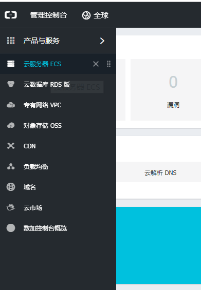

<br>

3. 点击实例，选择云服务器所在地区，便出现了自己买的云服务器实例。

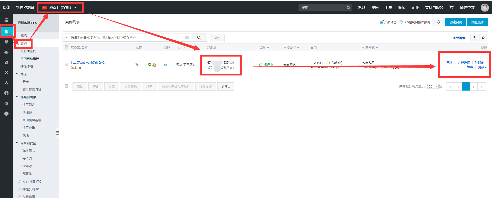

<br>

&emsp;我们需要记住有五大块：

* **IP 地址**。**IP 地址** 可以让你通过 Win + R，输入 mstsc 后，在远程桌面中，通过输入公网地址以及密码，访问你的云服务器，[方法详情](https://yq.aliyun.com/articles/224155)。
* **远程连接**。**远程连接** 可以直接通过网页的形式连接云服务器，对它进行操作。
* **实例状态**。**更多 -> 实例状态** 可以停止、开启、重启云服务器。
* **磁盘和镜像**。
  * 如果你感觉 Windows 云服务器满足不了你了，或者你想更换 Windows 系统的其他版本，那么你可以通过 **更多 -> 磁盘和镜像 -> 更换系统盘** 来更换系统（请先在实例状态中停止云服务器）。[方法详情](https://yq.aliyun.com/articles/225397)
  * 如果你觉得你的云服务器爆满了，想重新折腾过，那么可以通过 **更多 -> 磁盘和镜像 -> 重新初始化磁盘** 进行服务器的重置。[方法详情](https://jingyan.baidu.com/article/d3b74d64c5af051f76e60955.html)
* **网路和安全组**。点击 **更多 -> 网路和安全组 -> 安全组配置 -> 配置规则 -> 添加安全组规则**，从而添加 80 端口的安全组。[方法详情](https://help.aliyun.com/document_detail/25471.html?spm=a2c4g.11186623.6.727.ea541f6cm2tsLh)

> 这里我们讲解的是 Windows 系统对 Windows 云服务器的操作，因为 Windows 系统方便操作，所以有着其他系统的云服务器的小伙伴，可以考虑将云服务器改成 Windows 系统或者百度、google 查找其他云服务器的部署方式。

&emsp;现在，我们讲解了云服务器的基本操作，我们暂且将云服务器这块内容先放一边，讲解下域名部分。

<br>

# <a name="chapter-three-two" id="chapter-three-two">3.2 域名</a>

> [返回目录](#catalog-chapter-three)

<br>

&emsp;在你使用域名之前，记得给域名备个案；[阿里云备案管理](https://beian.aliyun.com/)  
&emsp;如果你没有域名，可自行购买：[万网域名注册](https://wanwang.aliyun.com/?spm=5176.8142029.digitalization.9.69a26d3envis4t)

&emsp;现在我们进入[域名控制台](https://dc.console.aliyun.com/next/index?spm=5176.2020520101.aliyun_sidebar.aliyun_sidebar_domain.1a344df5h27HR0#/domain/list/all-domain)：


&emsp;除了备案，其他的都不用理会了，我们直接点击解析

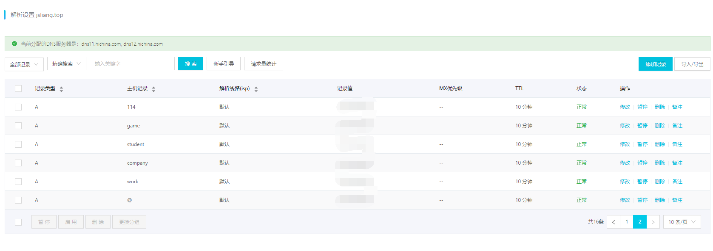

&emsp;上面的图片中显示的，都是 **jsliang** 在 **jsliang.top** 进行的解析记录。其中：

* **主机记录**：二级域名开头，例如 `company` 对应的就是 `http://company.jsliang.top` 这个二级域名。
* **记录值**：就是小伙伴云服务器的公网地址，在上面章节中提到过云服务器的 IP 地址。这是个很重要的玩意，请勿泄露。

&emsp;很好，现在我们点击 **添加记录**：

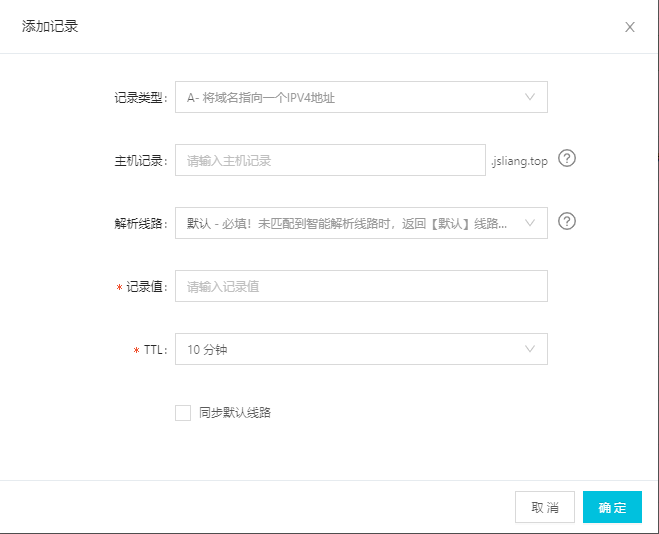

&emsp;我们只需要填上 **主机记录** 以及 **记录值**，然后点击 **确定** 就可以完成一条二级域名的添加了。

> 下面会讲解到如何通过云服务器的 Nginx 配置，使二级域名导向服务器中的指定目录。

<br>

# <a name="chapter-four" id="chapter-four">四 Nginx 代理前端页面</a>

> [返回目录](#catalog-chapter-four)

<br>

> 为了保证小伙伴们尽可能地实施顺利，**jsliang** 对自己的云服务器进行了 **重新磁盘化磁盘** 的操作，从而减少中间出篓子的可能。

&emsp;现在我们开始配置 Nginx。  
&emsp;**首先**，远程连接我们的云服务器。[操作方法](https://yq.aliyun.com/articles/224155)  
> 云服务器操作系统：Windows Server 2008 R2 企业版 64位中文版  
> 开放端口：80、-1、22、3389

&emsp;**然后**，我们打开 C 盘，创建这几个目录：

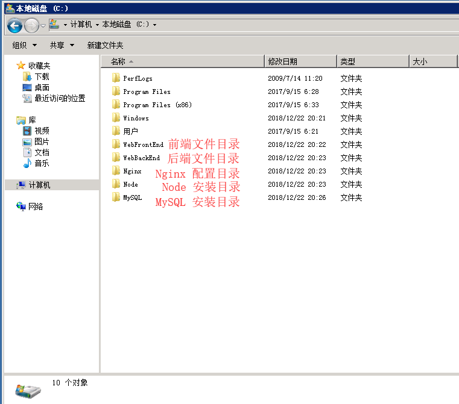

* **WebFrontEnd**：存放前端文件位置
* **WebBackEnd**：存放后端文件位置
* **Nginx**：存放 Nginx 安装目录以及配置
* **Node**：存放 Node 安装位置
* **MySQL**：存放 MySQL 安装位置

&emsp;**然后**，我们进行 Nginx 的安装及配置：

* [Nginx 下载](http://nginx.org/en/download.html)

> 由于云服务器浏览器时 IE，enm...所以我们本地直接下载吧！  
> PS：可能这也是我为什么用 Windows 的原因，因为方便复制本机内容粘贴到云服务器上去。

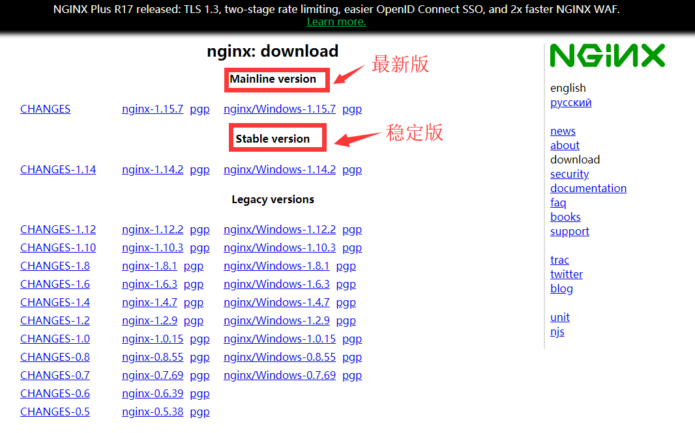

<br>

&emsp;我们下载稳定版本，即 `nginx/Windows-1.42.2`，它会弹窗让你下载 `zip` 包，我们先在本机解压配置好，最后再复制到云服务器上的 Nginx 文件目录中。

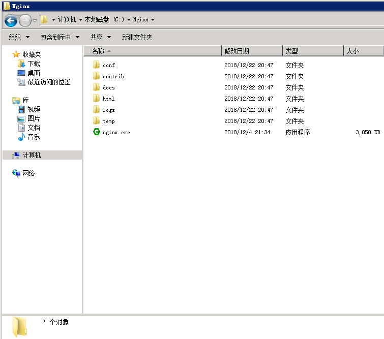

<br>

&emsp;**接着**，我们进行 Nginx 的配置解析，先在本地熟悉下目录。

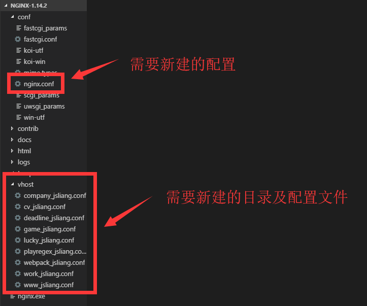

<br>

&emsp;在这里，我们要先了解到：Nginx/conf/nginx.conf 是我们要修改的配置，而 vhost 是我们要新建的目录，目录下就是我们二级域名配置文件，例如 `compony.jsliang.top` 对应的就是 `company_jsliang.conf` 文件。

&emsp;**然后**，我们打开文件 Nginx/conf/nginx.conf 进行配置，配置的文件已有注释，故这里不再哆嗦：

> Nginx/conf/nginx.conf

```
#user nobody;

# 跟 CPU 有关，不用修改
worker_processes 1;
events {
  # nginx 最大负载量
  worker_connections 1024;
}
http {
  
  # mime type 映射
  include mime.types;
  default_type application/octet-stream;
  
  # 启动高效传输文件的模式
  sendfile on;
  
  # 长连接 timeout
  keepalive_timeout 65;
  
  # http 结构下可以有多个 server。请求进来后，确定哪一个 server 由server_name 决定，这里我们通过 include **文件 来进行多网址配置
  server {
    
    # 监听端口
    listen 80 default_server;
    
    # 识别的域名
    server_name localhost default_server;
    
    # 一个关键配置，与 URL 参数乱码问题有关
    #charset utf-8;
    root html;
    
    # 监听的文件
    location / {
      index index.html index.htm;
    }
    
    # 404页面
    # error_page 404 /404.html;
    # 重定向端口错误页面到50*.html页面
    error_page 500 502 503 504 /50x.html;
    location = /50x.html {
      root html;
    }
  }
  
  # 把其他 server 配置写到其他文件，方便管理
  include ../vhost/*.conf;
}
```

<br>

&emsp;在上面，我们通过最后一句话 `include ../vhost/*.conf` 可以知道，我们将配置文件放到了 vhost 目录中，从而方便我们下次新增二级域名。

&emsp;如果小伙伴希望多了解点 Nginx 的知识，可以看下下面的文章。  
&emsp;如果小伙伴们单纯就想快点部署完，请跳过这段话。

* [Nginx 多域名配置](http://www.jb51.net/article/119047.htm)
* [worker_processes：进程数（1）](https://www.cnblogs.com/aaron-agu/p/8003831.html)
* [worker_connections：最大负载量（1024）](https://segmentfault.com/q/1010000009620656)
* [sendfile：启动高效传输文件的模式（on）](https://blog.csdn.net/u011363729/article/details/70808585)
* [keepalive_timeout：长连接（65）](https://blog.csdn.net/senlin1202/article/details/54617635)
* [include：（mime.types）](https://my.oschina.net/plutonji/blog/527797)
* [proxy_pass：要转发的地址（http://www.a.com:3000）](https://blog.csdn.net/zhongzh86/article/details/70173174)

&emsp;**再接着**，我们在 Nginx 目录下新建 vhost 目录，然后新增 `company_jsliang.conf`、`work_jsliang.conf` ……等目录，命名不重要，好记且它是 `*.conf` 就行。

> *.conf

```
server {
  # 监听的端口，80 即可
  listen 80;
  
  # 监听的网址，这里填写你的网址，我的就有 company.jsliang.top 等……请确保该域名已经在阿里云、腾讯云、百度云等进行了域名解析。
  server_name company.jsliang.top;
  
  # 监听的目录
  root C:\WebFrontEnd\company;
  
  # 监听的文件
  location / {
    index index.html index.htm;
  }
}
```

<br>

&emsp;看到这个，小伙伴们可能就明白了：当我们访问 `company.jsliang.top` 时，Nginx 就会监听我们在 C 盘下 `C:\WebFrontEnd\company` 目录下的 `index` 或者 `index.html` 或者 `index.htm`。  
&emsp;当小伙伴们回想起我们在域名解析时的操作时，会更加清晰：

* 域名解析到公网 IP -> Nginx 监听到了来自浏览器的请求 -> Nginx 查找关于这个请求的配置 -> Nginx 找到这个配置，发现应该定位到 ** 目录 -> Nginx 将信息返回给浏览器。

&emsp;配置完成后，我们将文件复制并替换到云服务器上去。

> 记得在 WebFrontEnd 上存放你的前端网页文件喔，要不然最后运行 Nginx 你会发现好像没成功一样~

&emsp;**再然后**，我们进入目录 `C:\Windows\System32\drivers\etc`，修改下 `hosts` 配置并保存：

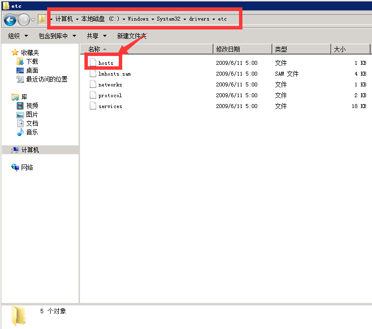

<br>

> hosts

```
# Copyright (c) 1993-2009 Microsoft Corp.
#
# This is a sample HOSTS file used by Microsoft TCP/IP for Windows.
#
# This file contains the mappings of IP addresses to host names. Each
# entry should be kept on an individual line. The IP address should
# be placed in the first column followed by the corresponding host name.
# The IP address and the host name should be separated by at least one
# space.
#
# Additionally, comments (such as these) may be inserted on individual
# lines or following the machine name denoted by a '#' symbol.
#
# For example:
#
#      102.54.94.97     rhino.acme.com          # source server
#       38.25.63.10     x.acme.com              # x client host

# localhost name resolution is handled within DNS itself.
#	127.0.0.1       localhost
#	::1             localhost

127.0.0.1  jsliang.top
127.0.0.1  company.jsliang.top
127.0.0.1  cv.jsliang.top
127.0.0.1  deadline.jsliang.top
127.0.0.1  game.jsliang.top
127.0.0.1  lucky.jsliang.top
127.0.0.1  playregex.top
127.0.0.1  webpack.jsliang.top
127.0.0.1  work.jsliang.top
```

<br>

&emsp;最后，我们再双击 Nginx 目录中的 nginx.exe，运行 Nginx。  
&emsp;这时候，有的小伙伴可能发现有一个小框一闪而过，然后以为没打开成功？别急，打开 Windows 任务管理器你会发现它已成功运行了。

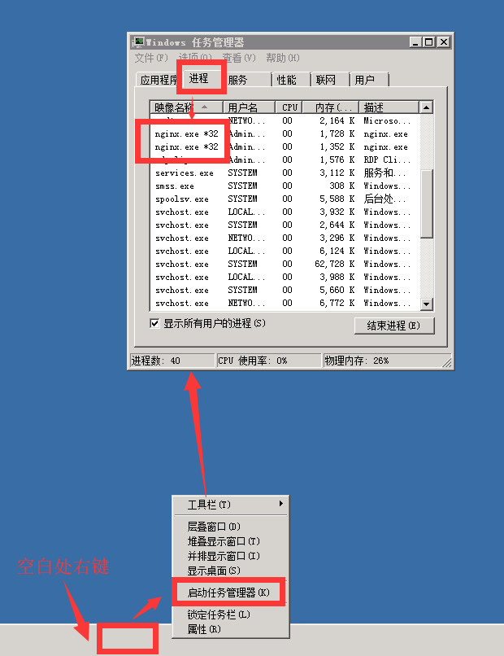

<br>

> 如果小伙伴要新增一个二级域名，那就需要去 Windows 任务管理器将 Nginx 的两个进程结束，新增完毕后再重启 Nginx。

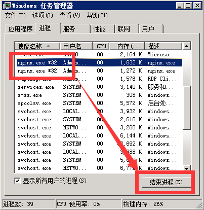

<br>

&emsp;这时候，我们打开 `company.jsliang.top` 进行查看，发现它已成功部署啦：


<br>

&emsp;**后记**，附上我学习 Nginx 的时候的其他参考：

* [Nginx中文文档](http://www.nginx.cn/doc/)
* [Nginx 在 Windows 上安装及 Nginx 的配置及优化](https://www.cnblogs.com/Chiler/p/8027167.html)
* [Nginx 基本配置与参数说明](http://www.nginx.cn/76.html)

<br>

# <a name="chapter-five" id="chapter-five">五 MySQL 安装及部署</a>

> [返回目录](#catalog-chapter-five)

<br>

&emsp;关于 MySQL 的安装，我在另一篇文章中有记录：

* [MySQL 的安装及配置](https://github.com/LiangJunrong/document-library/blob/master/other-library/SQL/MySQL.md)

&emsp;现在，我们直接在本地[下载安装包](http://cdn.mysql.com//Downloads/MySQLInstaller/mysql-installer-community-5.7.16.0.msi)，下载完后直接复制到云服务器上，按照教程一步一步配置即可。

<br>

# <a name="chapter-six" id="chapter-six">六 Node 提供接口服务</a>

> [返回目录](#catalog-chapter-six)

<br>

&emsp;我们先下载 Node 的 msi 安装包，并复制到云服务器上：[下载地址](http://nodejs.cn/download/)

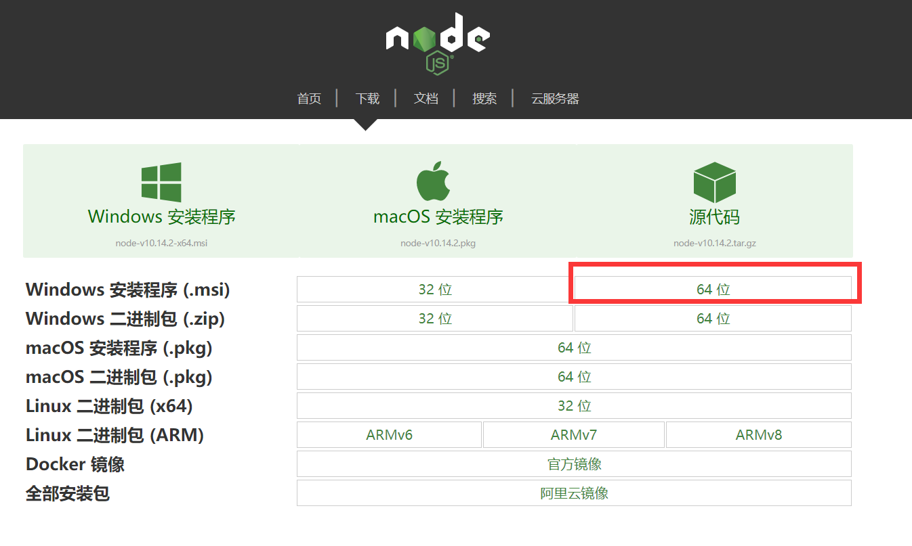

<br>

&emsp;在这里要注意的是，我们下载的是 64 位的 msi 安装包，因为在上面的 Nginx 配置的时候，我们讲过我们的云服务器是 `Windows Server 2008 R2 企业版 64位中文版`。

&emsp;我们只需要一路 Next，在配置安装位置的时候，将位置放在我们建好的 Node 目录中即可。

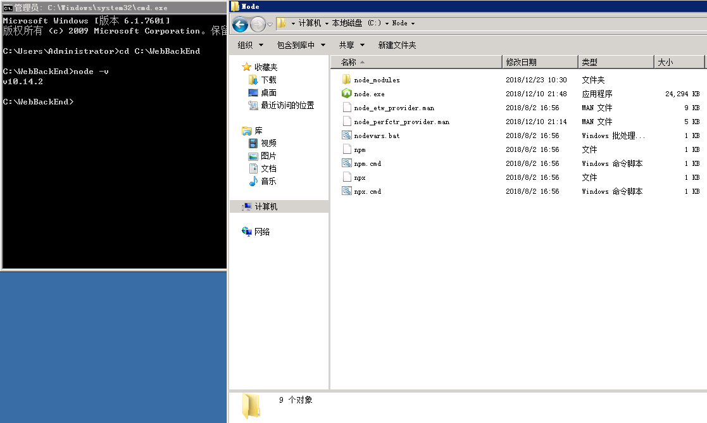

<br>

&emsp;安装完毕之后，我们查看 Node 目录，发现它已经有文件了。  
&emsp;然后，我们通过 `win + r -> cmd -> cd C:\WebBackEnd -> node -v` 查看我们的 Node 版本，**jsliang** 这里显示的是 `v10.14.2`。

&emsp;至此，我们的 Node 配置完毕，如果小伙伴们想知道 Node 如何连接 MySQL，Node 如何使用，请查看 [Node 基础](https://github.com/LiangJunrong/document-library/blob/master/other-library/Node/NodeBase.md)。

> 记得 `npm i` 安装项目依赖包以及配置云服务器中相关的端口喔~

<br>

# <a name="chapter-seven" id="chapter-seven">七 总结</a>

> [返回目录](#catalog-chapter-seven)

<br>

&emsp;经过一系列的折腾，我们的云服务器终于配置完毕了，接下来就可以愉快玩耍啦~  
&emsp;当然，如果小伙伴嫌自己配置麻烦，可以去阿里云的云服务器市场看看有没有装好的 Node + MySQL 环境喔~

<br>

> <a rel="license" href="http://creativecommons.org/licenses/by-nc-sa/4.0/"></a><br /><a xmlns:dct="http://purl.org/dc/terms/" property="dct:title">**jsliang** 的文档库</a> 由 <a xmlns:cc="http://creativecommons.org/ns#" href="https://github.com/LiangJunrong/document-library" property="cc:attributionName" rel="cc:attributionURL">梁峻荣</a> 采用 <a rel="license" href="http://creativecommons.org/licenses/by-nc-sa/4.0/">知识共享 署名-非商业性使用-相同方式共享 4.0 国际 许可协议</a>进行许可。<br />基于<a xmlns:dct="http://purl.org/dc/terms/" href="https://github.com/LiangJunrong/document-library" rel="dct:source">https://github.om/LiangJunrong/document-library</a>上的作品创作。<br />本许可协议授权之外的使用权限可以从 <a xmlns:cc="http://creativecommons.org/ns#" href="https://creativecommons.org/licenses/by-nc-sa/2.5/cn/" rel="cc:morePermissions">https://creativecommons.org/licenses/by-nc-sa/2.5/cn/</a> 处获得。