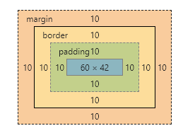

盒子模型
===

> Create by **jsliang** on **2020-09-25 10:04:37**  
> Recently revised in **2020-09-25 10:05:44**

## <a name="chapter-one" id="chapter-one"></a>一 目录

**不折腾的前端，和咸鱼有什么区别**

| 目录 |
| --- |
| [一 目录](#chapter-one) |
| <a name="catalog-chapter-two" id="catalog-chapter-two"></a>[二 前言](#chapter-two) |
| <a name="catalog-chapter-three" id="catalog-chapter-three"></a>[三 举例](#chapter-three) |
| <a name="catalog-chapter-four" id="catalog-chapter-four"></a>[四 总结](#chapter-four) |

## <a name="chapter-two" id="chapter-two"></a>二 前言

> [返回目录](#chapter-one)

简单描述下盒子模型：

1. CSS 盒子模型分为标准盒子和怪异盒子。
2. 标准盒子的 `contentWidth` 等于设置的 `width`，它的`总宽度 = width + padding + border + margin`。（高度也一样）
3. 怪异盒子的 `contentWidth` 等于设置的 `width + padding + border`，它的`总宽度 = width`。（高度也一样）
4. 建议在页面初始化的时候，设置全局 CSS 属性 `box-sizing` 为盒子模型，统一标准。
   * `inherit` - 继承父元素的值
   * `content-box` - 指定盒子为 W3C（标准盒子）
   * `border-box` - 指定为 IE（怪异盒子）。

## <a name="chapter-three" id="chapter-three"></a>三 举例

> [返回目录](#chapter-one)

已知有代码：

```html
<!DOCTYPE html>
<html lang="en">
<head>
  <meta charset="UTF-8">
  <meta name="viewport" content="width=device-width">
  <meta http-equiv="X-UA-Compatible" content="ie=edge">
  <title>盒子模型</title>
  <style>
    div {
      background: deepskyblue;

      /* 怪异盒子：100 */
      /* box-sizing: border-box;  */

      /* 标准盒子：140 */
      box-sizing: content-box;

      width: 100px;
      padding: 10px;
      border: 10px solid #ccc;
      margin: 10px;
    }
  </style>
</head>
<body>
  <div>盒子模型</div>
</body>
</html>
```

此刻它在W3C 标准（标准盒子）下展示为：


在 IE（怪异盒子）下展示为：



假设我们编写 JS 脚本如下：

```js
const div = document.querySelector('div');

// 如果写在行内，可以获取 100px，当前打印为空
// （标准盒子和怪异盒子相同，注意带单位的）
console.log(div.style.width); // 100px || ''

// 标准盒子：140；怪异盒子：100;（不带单位的）
console.log(div.offsetWidth); // 100 || 140
```

JavaScript 获取 HTML 元素的实际宽度高度：

1. `#div.style.width`：这种方法只有在样式写在行内的时候，才能获取到宽度，并且是带单位的：`100px`。如果不是行内样式，那么获取到的是空的。
2. `#div.offsetWidth`：这种看盒子模式，如果是 IE 模式的怪异盒子，那么获取到 `100`（`border-box`）；如果是 W3C 的标准盒子（`content-box`），那么获取到 `140`。注意是不带单位的。

## <a name="chapter-four" id="chapter-four"></a>四 总结

> [返回目录](#chapter-one)

标准盒子：`box-sizing: content-box`

* `contentWidth = width`
* `offsetWidth = width + padding + border + margin`。

怪异盒子：`box-sizing: border-box`

* `contentWidth = width + padding + padding`
* `offsetWidth = width`

所以建议在全局下，统一设置为标准盒子。

---

> <a rel="license" href="http://creativecommons.org/licenses/by-nc-sa/4.0/"></a><br /><span xmlns:dct="http://purl.org/dc/terms/" property="dct:title">jsliang 的文档库</span> 由 <a xmlns:cc="http://creativecommons.org/ns#" href="https://github.com/LiangJunrong/document-library" property="cc:attributionName" rel="cc:attributionURL">梁峻荣</a> 采用 <a rel="license" href="http://creativecommons.org/licenses/by-nc-sa/4.0/">知识共享 署名-非商业性使用-相同方式共享 4.0 国际 许可协议</a>进行许可。<br />基于<a xmlns:dct="http://purl.org/dc/terms/" href="https://github.com/LiangJunrong/document-library" rel="dct:source">https://github.com/LiangJunrong/document-library</a>上的作品创作。<br />本许可协议授权之外的使用权限可以从 <a xmlns:cc="http://creativecommons.org/ns#" href="https://creativecommons.org/licenses/by-nc-sa/2.5/cn/" rel="cc:morePermissions">https://creativecommons.org/licenses/by-nc-sa/2.5/cn/</a> 处获得。