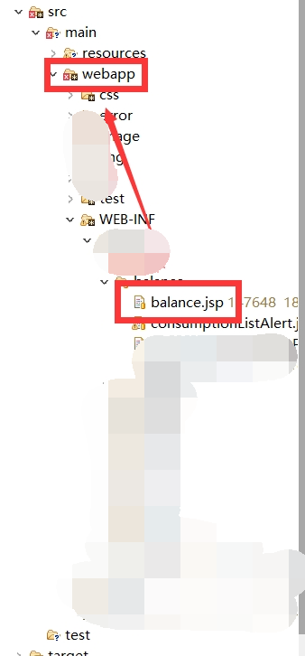

# Java Server Pages
> create by **jsliang** on **2018-9-12 11:37:01**  
> Recently revised in **2018年9月12日15:38:40**

<br>

## 序
&emsp;JSP全名为Java Server Pages，中文名叫java服务器页面，其根本是一个简化的Servlet设计，它 [1]  是由Sun Microsystems公司倡导、许多公司参与一起建立的一种动态网页技术标准。JSP技术有点类似ASP技术，它是在传统的网页HTML（标准通用标记语言的子集）文件(*.htm,*.html)中插入Java程序段(Scriptlet)和JSP标记(tag)，从而形成JSP文件，后缀名为(*.jsp)。 用JSP开发的Web应用是跨平台的，既能在Linux下运行，也能在其他操作系统上运行。  
&emsp;由于最近工作可能涉及到 JSP 编写的页面，故在此简要学习下 JSP 语法。  
&emsp;本次学习主要参考有： [菜鸟教程 JSP ](http://www.runoob.com/jsp)

<br>

### 一、JSP 运行流程
1. 浏览器发送 HTTP 请求给服务器
2. 服务器根据请求调动 JSP 引擎，查找对应的 JSP 文件
3. JSP 引擎载入 JSP 文件，将其转为 Servlet (将 JSP 元素转化为 Java 代码)。
> Servlet（Server Applet）是Java Servlet的简称，称为小服务程序或服务连接器，用Java编写的服务器端程序，主要功能在于交互式地浏览和修改数据，生成动态Web内容。  
> 狭义的Servlet是指Java语言实现的一个接口，广义的Servlet是指任何实现了这个Servlet接口的类，一般情况下，人们将Servlet理解为后者。Servlet运行于支持Java的应用服务器中。从原理上讲，Servlet可以响应任何类型的请求，但绝大多数情况下Servlet只用来扩展基于HTTP协议的Web服务器。
4. JSP 引擎将 Servlet 编译成可执行类，将原始请求传递给 Servlet 引擎。
5. 服务器的对应组件会调用 Servlet 引擎，然后载入并执行 Servlet 类。在执行过程中， Servlet 产生 HTML 格式输出并将其内嵌于 HTTP response 中上交给 Web 服务器。
6. Web 服务器以 HTML 网页形式将 HTTP response 返回到浏览器中。

<br>

### 二、生命周期
* **编译阶段** ：servlet容器编译servlet源文件，生成servlet类

* **初始化阶段** ：加载与JSP对应的servlet类，创建其实例，并调用它的初始化方法

* **执行阶段** ：调用与JSP对应的servlet实例的服务方法

* **销毁阶段** ：调用与JSP对应的servlet实例的销毁方法，然后销毁servlet实例

<br>

### 三、初试 JSP
* 输出：
```
<% 代码片段 %>
```
&emsp;例如：
```
<html>
<head><title>Hello World</title></head>
<body>
    Hello World!<br/>
    <%
    out.println("Your IP address is " + request.getRemoteAddr());
    %>
</body>
</html>
```


<br>

### 四、JSP 语法

#### 4.1 声明
```
<%! 代码片段 %>
```
&emsp;示例：
```
<%! int i = 0; %> 
<%! int a, b, c; %> 
<%! Circle a = new Circle(2.0); %> 
```

<br>

#### 4.2 表达式
```
<%= 表达式 %>
```
&emsp;示例：
```
<%= (new java.util.Date()).toLocaleString()%>
```

<br>

#### 4.3 注释
```
<%-- 注释 --%>
<!-- 注释 -->
```
&emsp;上面两种注释中，一种是 JSP 注释，一种是 HTML 注释。

<br>

#### 4.4 指令
```
<%@ page ... %>
<%@ include ... %>
<%@ taglib ... %>
```
&emsp;@ page... 定义页面依赖属性，例如脚本、error页面，缓存需求等  
&emsp;@ include... 包含其他文件
&emsp;@ taglib... 引入标签库的定义

<br>

#### 4.5 行为
```
<jsp:action_name attribute="value" />
```
&emsp;JSP 行为标签使用 XML 语法结构来控制 Servlet 引擎。它能够动态插入一个文件，重用 JavaBean 组件，引导用户去另一个页面，为 Java 插件产生相关的 HTML 等等。

| 语法            | 描述                                                       |
| --------------- | ---------------------------------------------------------- |
| jsp:include     | 用于在当前页面中包含静态或动态资源                         |
| jsp:useBean     | 寻找和初始化一个 JavaBean 组件                             |
| jsp:include     | 用于在当前页面中包含静态或动态资源                         |
| jsp:setProperty | 设置 JavaBean 组件的值                                     |
| jsp:getProperty | 将 JavaBean 组件的值插入到 output中                        |
| jsp:forward     | 从一个JSP文件向另一个文件传递一个包含用户请求的request对象 |
| jsp:plugin      | 用于在生成的HTML页面中包含Applet和JavaBean对象             |
| jsp:element     | 动态创建一个XML元素                                        |
| jsp:attribute   | 定义动态创建的XML元素的属性                                |
| jsp:body        | 定义动态创建的XML元素的主体                                |
| jsp:text        | 用于封装模板数据                                           |
<br>

#### 4.6 隐含对象

| 语法        | 描述                                                            |
| ----------- | --------------------------------------------------------------- |
| request     | HttpServletRequest 类的实例                                     |
| response    | HttpServletResponse 类的实例                                    |
| out         | PrintWriter 类的实例，用于把结果输出至网页上                    |
| session     | HttpSession 类的实例                                            |
| application | ServletContext 类的实例，与应用上下文有关                       |
| config      | ServletConfig 类的实例                                          |
| pageContext | PageContext类 的实例，提供对 JSP 页面所有对象以及命名空间的访问 |
| page        | 类似于 Java 类中的 this 关键字                                  |
| Exception   | Exception 类的对象，代表发生错误的 JSP 页面中对应的异常对象     |

<br>

#### 4.7 控制流语句
> if...else...
```
<% if (day == 1 | day == 7) { %>
      <p>今天是周末</p>
<% } else { %>
      <p>今天不是周末</p>
<% } %>
```

> switch...case...
```
<% 
switch(day) {
case 0:
   out.println("星期天");
   break;
case 1:
   out.println("星期一");
   break;
case 2:
   out.println("星期二");
   break;
case 3:
   out.println("星期三");
   break;
case 4:
   out.println("星期四");
   break;
case 5:
   out.println("星期五");
   break;
default:
   out.println("星期六");
}
%>
```

> for...
```
<%for ( fontSize = 1; fontSize <= 3; fontSize++){ %>
   <font color="green" size="<%= fontSize %>">
    菜鸟教程
   </font><br />
<%}%>
```
> 至于while、do...while这些，在此就不提示了。

<br>

### 五、Study For Work
#### 5.1 中文编码问题
```
<%-- 解决页面中出现的中文乱码 --%>
<%@ page language="java" contentType="text/html; charset=UTF-8"
    pageEncoding="UTF-8"%>

<%-- 引用 jstl 核心标签库 -->
<%@ taglib prefix="c" uri="http://java.sun.com/jsp/jstl/core"%>
<c:set var="ctx" value="${pageContext.request.contextPath}"/>
<script src="${ctx}/js/jquery.min.js"></script>
```
&emsp;在这里，`${ctx}` 有两种解读，一种是寻找文件：



&emsp;另一种就是寻找对应的方法，这些是由后端管理的，例如：
```
<li>
    <a href="${ctx}/user/userList" data-value=1 title="成员管理">成员管理</a>
</li>
```

<br>

#### 5.2 HTML 模板
> data.jsp
```
<%@ page language="java" contentType="text/html; charset=UTF-8"
    pageEncoding="UTF-8"%>
<p>
   今天的日期是: <%= (new java.util.Date()).toLocaleString()%>
</p>
```
> main.jsp
```
<%@ page language="java" contentType="text/html; charset=UTF-8"
    pageEncoding="UTF-8"%>
<!DOCTYPE html>
<html>
<head>
<meta charset="utf-8">
<title>菜鸟教程(runoob.com)</title>
</head>
<body>
    <h2>include 动作实例</h2>
    <jsp:include page="date.jsp" flush="true" />
</body>
</html>
```

#### 5.3 JSTL 标准标签库
&emsp;什么是JSTL：[JSTL](https://www.runoob.com/jsp/jsp-jstl.html)  
&emsp;JSP 标准标签库（JSTL）是一个 JSP 标签集合，它封装了 JSP 应用的通用核心功能。  
&emsp;JSTL 支持通用的、结构化的任务，比如迭代，条件判断，XML 文档操作，国际化标签，SQL 标签。 除了这些，它还提供了一个框架来使用集成 JSTL 的自定义标签。  
&emsp;由于工作的代码中引用了 JSTL 核心标签库，所以接下来新开一篇文章，专门讲解 JSTL ： [Go!](../jstl/readMe.md)

<br>

> <a rel="license" href="http://creativecommons.org/licenses/by-nc-sa/4.0/"></a><br /><span xmlns:dct="http://purl.org/dc/terms/" property="dct:title">jsliang的文档库</span> 由 <a xmlns:cc="http://creativecommons.org/ns#" href="https://github.com/LiangJunrong/document-library" property="cc:attributionName" rel="cc:attributionURL">梁峻荣</a> 采用 <a rel="license" href="http://creativecommons.org/licenses/by-nc-sa/4.0/">知识共享 署名-非商业性使用-相同方式共享 4.0 国际 许可协议</a>进行许可。<br />基于<a xmlns:dct="http://purl.org/dc/terms/" href="https://github.com/LiangJunrong/document-library" rel="dct:source">https://github.com/LiangJunrong/document-library</a>上的作品创作。<br />本许可协议授权之外的使用权限可以从 <a xmlns:cc="http://creativecommons.org/ns#" href="https://creativecommons.org/licenses/by-nc-sa/2.5/cn/" rel="cc:morePermissions">https://creativecommons.org/licenses/by-nc-sa/2.5/cn/</a> 处获得。