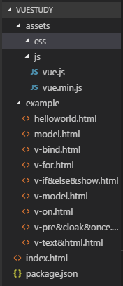
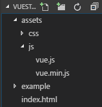
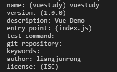

# Vue 基础

> create by **jsliang** on **2017-06-12**  
> Recently revised in **2019-05-21 09:55:168**

<br>

## 第一季 vue基础

&emsp;前提：安装VSCode、下载vue.js、vue.min.js  
&emsp;推荐：Vue教程：https://cn.vuejs.org/v2/guide/  
&emsp;参考：技术胖博客：http://jspang.com  

<br>



<br>

### 第一节 Hello World 
1. 拖拽文件作为项目目录
2. 项目目录为：



3. 安装live-server：npm install -g live-server（终端安装，下同）
4. 启动项目：live-server（cd到该项目，输入命令行并启动）
5. 初始化项目，获取package.json：npm init



6.代码

> index.html

```html
<!DOCTYPE html>
<html lang="en">
  <head>
    <meta charset="UTF-8">
    <meta name="viewport" content="width=device-width, initial-scale=1.0">
    <title>Vue.js实例</title>
    <script type="text/javascript" src="../assets/js/vue.js"></script>
  </head>
  <body>
    <h1>Vue2.0实例</h1>
    <hr>
    <ol>
      <li><a href="./example/helloworld.html">Hello World实例</a></li>
      <li><a href="./example/v-if&else&show.html">v-if&else&show</a></li>
      <li><a href="./example/v-for.html">v-for</a></li>
      <li><a href="./example/v-text&html.html">v-text&v-html</a></li>
      <li><a href="./example/v-on.html">v-on</a></li>
      <li><a href="./example/v-model.html">v-model</a></li>
      <li><a href="./example/v-bind.html">v-bind</a></li>
      <li><a href="./example/v-pre&cloak&once.html">v-pre & v-cloak & v-once</a></li>
    </ol>
  </body>
</html>
```

<br>

### 第二节 v-if、v-else、v-show 
&emsp;讲解：v-if与v-else经常搭配，v-show是另一种显示隐藏的手段：  
&emsp;v-if：判断是否加载，可以减轻服务器的压力，在需要时加载。  
&emsp;v-show：调整css display属性，可以使客户端操作更加流畅。  

<br>

> v-if&else&show.html

```html
<!DOCTYPE html>
<html lang="en">
  <head>
    <meta charset="UTF-8">
    <meta name="viewport" content="width=device-width, initial-scale=1.0">
    <title>v-if</title>
    <script type="text/javascript" src="../assets/js/vue.js"></script>
  </head>
  <body>
    <h1>HelloWorld</h1>
    <hr/>
    <div id="app">
      <div v-if="isLogin">你登录了！</div>
      <div v-else>抱歉，还没有登录！</div>
      <div v-show="isRegister">你注册了！</div>
    </div>
 
    <script type="text/javascript">
      var app = new Vue({
        el:'#app',
        data:{
          isLogin:true,
          isRegister:true
        }
      })
    </script>
  </body>
</html>
```

<br>

### 第三节 v-for 

> v-for.html
&emsp;第一部分

```html
<!DOCTYPE html>
<html lang="en">
  <head>
    <meta charset="UTF-8">
    <meta name="viewport" content="width=device-width, initial-scale=1.0">
    <meta http-equiv="X-UA-Compatible" content="ie=edge">
    <title>v-for 实例</title>
    <script src="../assets/js/vue.js" type="text/javascript"></script>
  </head>
  <body>
    <h1>v-for 实例</h1>
    <hr>
    <div id="app">
      <ul>
        <!--2、哪个标签需要循环，就写在哪个标签上-->
        <li v-for="item in items">
           {{item}}
        </li>
      </ul>
    </div>

   <script>
      var app = new Vue({
        el:"#app",
        data:{
          ///1、需要循环的数据
          items:[1, 33, 22, 55, 44, 6, 8]
        }
      })
    </script>
  </body>
</html>
```

<br>

&emsp;第二部分

```html
<!DOCTYPE html>
<html lang="en">
  <head>
    <meta charset="UTF-8">
    <meta name="viewport" content="width=device-width, initial-scale=1.0">
    <meta http-equiv="X-UA-Compatible" content="ie=edge">
    <title>v-for 实例</title>
    <script src="../assets/js/vue.js" type="text/javascript"></script>
  </head>
  <body>
    <h1>v-for 实例</h1>
    <hr>
    <div id="app">
      <ul>
        <!--2、哪个标签需要循环，就写在哪个标签上-->
        <li v-for="item in newItems">
          {{item}}
        </li>
      </ul>
    </div>

    <script>
      var app = new Vue({
        el:"#app",
        data:{
          // 1、需要循环的数据
          items:[1, 33, 22, 55, 44, 6, 8]
        },
        computed:{
          // 3、重新定义一个数组，接收items并对其进行排序
          newItems:function(){
          return this.items.sort(sortNumber);
          }
        }
      });
      function sortNumber(a, b){
        return a-b;
      }
    </script>
  </body>
</html>
```

<br>

&emsp;第三部分

```html
<!DOCTYPE html>
<html lang="en">
  <head>
    <meta charset="UTF-8">
    <meta name="viewport" content="width=device-width, initial-scale=1.0">
    <meta http-equiv="X-UA-Compatible" content="ie=edge">
    <title>v-for 实例</title>
    <script src="../assets/js/vue.js" type="text/javascript"></script>
  </head>
  <body>
    <h1>v-for 实例</h1>
    <hr>
    <div id="app">
      <ul>
        <!--2、哪个标签需要循环，就写在哪个标签上-->
        <li v-for="item in newItems">
          {{item}}
        </li>
      </ul>
      <hr>
      <ul>
        <!--
          5、传值，item为项，index为索引。
          输出：index索引，item.name姓名，item.age年龄
        -->
        <li v-for="(item, index) in newStudents">
          {{index+1}}:{{item.name}}--{{item.age}}
        </li>
      </ul>
    </div>

    <script>
      var app = new Vue({
        el:"#app",
        data:{
          // 1、需要循环的数据
          items:[1, 33, 22, 55, 44, 6, 8],
          // 4、数组中存放对象
          students:[
            {name:"梁峻荣", age:11},
            {name:"梁渣渣", age:33},
            {name:"梁^_^飘", age:22},
          ]
        },
        computed:{
          // 3、重新定义一个数组，接收items并对其进行排序
          newItems:function(){
            return this.items.sort(sortNumber);
          },
          newStudents:function(){
            return sortByKey(this.students, 'age');
          }
        }
      });

      function sortNumber(a, b){
        return a-b;
      };

      // 6、数组对象方法排序
      function sortByKey(array,key){
        return array.sort(function(a, b){
          var x = a[key];
          var y = b[key];
          return ((x<y) ? -1: ((x>y) ? 1 : 0));
        });
      };
    </script>
  </body>
</html>
```

<br>

### 第四节 v-text、v-html （见第一季 vue基础（二））
> v-text&html.html

```html
<!DOCTYPE html>
<html lang="en">
  <head>
    <meta charset="UTF-8">
    <meta name="viewport" content="width=device-width, initial-scale=1.0">
    <meta http-equiv="X-UA-Compatible" content="ie=edge">
    <title>v-text&html 实例</title>
    <script src="../assets/js/vue.js" type="text/javascript"></script>
  </head>
  <body>
    <h1>v-text&html 实例</h1>
    <hr>
    <div id="app">
      <!--v-text及其优点-->
      <p>v-text比{{message}}更友好在于，没加载出来时不显示乱码给客户看</p>
      <span>{{message}}</span> = <span v-text="message"></span>
 
      <!--v-html及其缺点-->
      <p>3、请注意尽量别用<>标签输出，因为黑客可以利用xss攻击</p>
      <div v-html="htmlMessage"></div>
    </div>

    <script>
      var app = new Vue({
        el:"#app",
        data:{
          message: "Hello World!",
          htmlMessage: '<h2>Hello World!</h2>'
        }
      })
    </script>
  </body>
</html>
```

<br>

### 第五节 v-on （见第一季 vue基础（二））

> v-on.html

```html
<!DOCTYPE html>
<html lang="en">
  <head>
    <meta charset="UTF-8">
    <meta name="viewport" content="width=device-width, initial-scale=1.0">
    <meta http-equiv="X-UA-Compatible" content="ie=edge">
    <title>v-on 实例</title>
    <script src="../assets/js/vue.js" type="text/javascript"></script>
  </head>

  <body>
    <h1>v-on 实例</h1>
    <hr>
    <div id="app">
      <p v-text="score"></p>
      <div>
        <button v-on:click="addScore">加分</button>
        <button @:click="reduceScore">减分</button>
        <input type="text" v-on:keyup.enter="onEnter" v-model="score2" />
      </div>
    </div>

    <script>
      var app = new Vue({
        el:"#app",
        data:{
          score:0,
          score2:1
        },
        methods:{
          addScore:function(){
          this.score++;
        },
        reduceScore:function(){
          this.score--;
        },
        onEnter:function(){
          this.score = this.score + parseInt(this.score2);
        }
      }
    })
    </script>
  </body>
</html>
```

<br>

### 第六节 v-model （见第一季 vue基础（二））

> v-model.html

```html
<!DOCTYPE html>
<html lang="en">
  <head>
    <meta charset="UTF-8">
    <meta name="viewport" content="width=device-width, initial-scale=1.0">
    <meta http-equiv="X-UA-Compatible" content="ie=edge">
    <title>v-model 实例</title>
    <script src="../assets/js/vue.js" type="text/javascript"></script>
  </head>

  <body>
    <h1>v-model 实例</h1>
    <hr>
    <div id="app">
      <div>
         <h4>一、双向数据绑定</h4>
         <p v-text="message"></p>
         <input type="text" v-model="message" />
       </div>
      <div>
        <h4>一、双向数据绑定-懒加载</h4>
        <p v-text="message2"></p>
        <input type="text" v-model.lazy="message2" />
      </div>
      <div>
        <h4>一、双向数据绑定-前数字去尾部非数字</h4>
        <p v-text="message3"></p>
        <input type="text" v-model.number="message3" />
      </div>
      <div>
        <h4>一、双向数据绑定-去尾部空格</h4>
        <p v-text="message4"></p>
        <input type="text" v-model.trim="message4" />
      </div>
      <div>
        <h4>二、双向数据绑定-文本域</h4>
        <textarea name="" id="" cols="30" rows="10" v-model="message5"></textarea>
      </div>
      <div>
        <h4>三、多选框</h4>
        <input type="checkbox" id="isTrue" v-model="isTrue" />
        <label for="isTrue" v-text="isTrue"></label>
      </div>
      <div>
        <h4>三、多选框-数组绑定</h4>
        <input type="checkbox" id="isTrue" value="梁峻荣" v-model="webName" />
        <label for="isTrue">梁峻荣</label>
        <input type="checkbox" id="isTrue" value="梁渣渣" v-model="webName" />
        <label for="isTrue">梁渣渣</label>
        <input type="checkbox" id="isTrue" value="梁大傻" v-model="webName" />
        <label for="isTrue">梁大傻</label>
        <p v-text="webName"></p>
      </div>
      <div>
        <h4>四、单选框</h4>
        <input type="radio" id="radioMan" value="男" v-model="sex" /> 
        <label for="radioMan">男</label>
        <input type="radio" id="radioWoman" value="女" v-model="sex" />
        <label for="radioWoman">女</label>
        <p>你选择的是：{{sex}}</p>
      </div>
    </div>

    <script>
      var app = new Vue({
        el:"#app",
        data:{
          message: '我会跟着你输入的数据变喔~',
          message2: '完成输入数据并失去焦点时改变',
          message3: '我只搞数字，其他别放我这',
          message4: 'Hello World!',
          message5: '文本域双向数据绑定',
          isTrue: true,
          webName: [],
          sex: '',
        }
      })
    </script>
  </body>
</html>
```

<br>

### 第七节 v-bind （见第一季 vue基础（二））

> v-bind:

```html
<!DOCTYPE html>
<html lang="en">
  <head>
    <meta charset="UTF-8">
    <meta name="viewport" content="width=device-width, initial-scale=1.0">
    <meta http-equiv="X-UA-Compatible" content="ie=edge">
    <title>v-bind 实例</title>
    <script src="../assets/js/vue.js" type="text/javascript"></script>
    <style>
      .bg_red{
        background: red;
      }
      .font_big{
        font-size: 150%;
      }
    </style>
  </head>

  <body>
    <h1>v-bind 实例</h1>
    <hr>
    <div id="app">
    
    <p><a :href="webSrc">梁峻荣的网站</a></p>
      <div>
        <p :class="{bg_red:isOK}">我是要被改变的文本。</p>
        <input type="checkbox" id="isChecked" v-model="isOK" />
        <label for="isChecked">选中状态：{{isOK}}</label>
      </div>
      <div>
        <p :class="[bgRed, fontBig]">绑定数组</p>
        <p :class="isOK?bgRed:fontBig">绑定class的三元运算符</p>
        <p :style="styleObject">绑定class对象</p>
      </div>
    </div>

    <script>
      var app = new Vue({
        el:"#app",
        data:{
          imgSrc: 'http://img3.imgtn.bdimg.com/it/u=1504668356,1647420697&fm=26&gp=0.jpg',
          webSrc: 'http://www.liangjunrong.com',
          isOK: false,
          bgRed: 'bg_red',
          fontBig: 'font_big',
          styleObject:{
            color: 'green',
            fontSize: '20px'
          }
        }
      })
    </script>
  </body>
</html>
```

<br>

> <a rel="license" href="http://creativecommons.org/licenses/by-nc-sa/4.0/"></a><br /><span xmlns:dct="http://purl.org/dc/terms/" property="dct:title">jsliang的文档库</span> 由 <a xmlns:cc="http://creativecommons.org/ns#" href="https://github.com/LiangJunrong/document-library" property="cc:attributionName" rel="cc:attributionURL">梁峻荣</a> 采用 <a rel="license" href="http://creativecommons.org/licenses/by-nc-sa/4.0/">知识共享 署名-非商业性使用-相同方式共享 4.0 国际 许可协议</a>进行许可。<br />基于<a xmlns:dct="http://purl.org/dc/terms/" href="https://github.com/LiangJunrong/document-library" rel="dct:source">https://github.com/LiangJunrong/document-library</a>上的作品创作。<br />本许可协议授权之外的使用权限可以从 <a xmlns:cc="http://creativecommons.org/ns#" href="https://creativecommons.org/licenses/by-nc-sa/2.5/cn/" rel="cc:morePermissions">https://creativecommons.org/licenses/by-nc-sa/2.5/cn/</a> 处获得。