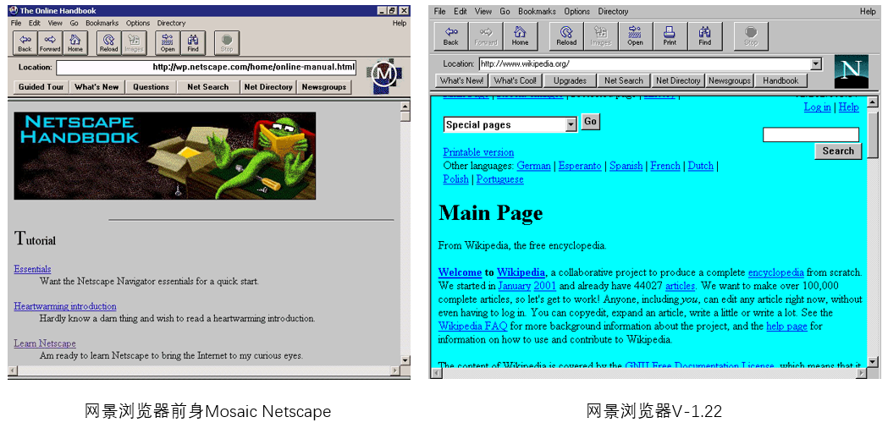
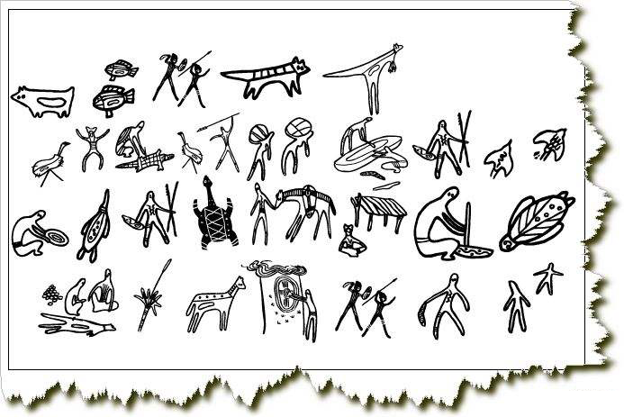
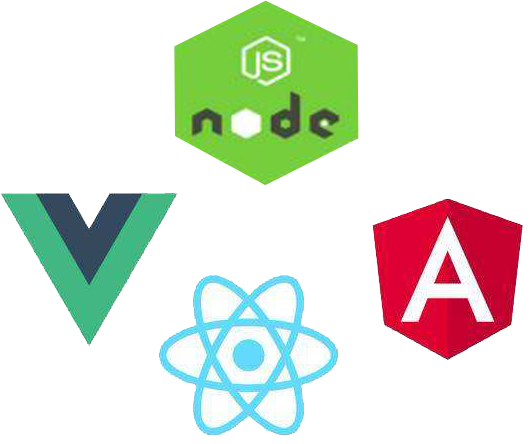
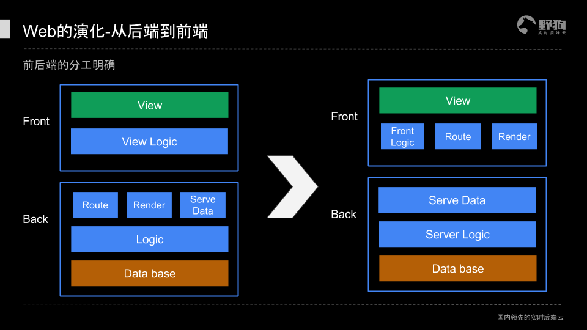
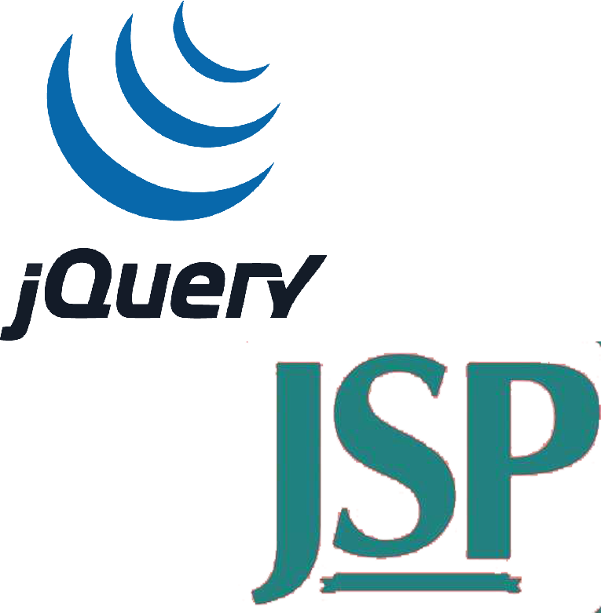

2018 前端开发分享
===

> Create by **jsliang** on **2018-11-26 08:10:27**  
> Recently revised in **2018-11-29 11:06:26**

<br>

# <a name="chapter-one" id="chapter-one">一 目录</a>

&emsp;**不折腾的前端，和咸鱼有什么区别**

| 目录 |                                                                             
| --- | 
| [一 目录](#chapter-one) | 
| <a name="catalog-chapter-two" id="catalog-chapter-two"></a>[二 前言](#chapter-two) |
| <a name="catalog-chapter-three" id="catalog-chapter-three"></a>[三 发展历史](#chapter-three) |
| &emsp;[3.1 原始社会](#chapter-three-one) |
| &emsp;[3.2 石器时代](#chapter-three-two) |
| &emsp;[3.3 铁器时代](#chapter-three-three) |
| &emsp;[3.4 工业时代](#chapter-three-four) |
| <a name="catalog-chapter-four" id="catalog-chapter-four"></a>[四 技术比较](#chapter-four) |
| &emsp;[4.1 JSP 与 jQuery](#chapter-four-one) |
| &emsp;[4.2 jQuery 与 Vue](#chapter-four-two) |
| &emsp;[4.3 Vue 与 小程序](#chapter-four-three) |
| <a name="catalog-chapter-five" id="catalog-chapter-five"></a>[五 思考总结](#chapter-five) |

<br>

# <a name="chapter-two" id="chapter-two">二 前言</a>

> [返回目录](#catalog-chapter-two)

<br>

&emsp;于 **2018年12月** 做个小小的前端技术分享，分享包括但不限于：Web 前端发展史、JQuery 与 Vue 的比较、Vue/React/Angular 的比较、前端开发经验的分享与总结等……

&emsp;参考文献：

* [前端发展史 | 博客园 - kidney](https://www.cnblogs.com/kidney/p/6079530.html)
* [前端发展史 | 简书 - 迷缘火叶](https://www.jianshu.com/p/8dc5c6aa01fc)
* [前端开发的历史和趋势 | CSDN - 红豆灬](https://blog.csdn.net/doulinxu/article/details/64906673?locationNum=2&fps=1)
* [前端基础历史 | 百度前端技术学院 - 刘文超](http://ife.baidu.com/note/detail/id/1266)
* [JSP、JavaScript、jQuery、jQuery Easy UI、Ajax、JSON各自是什么、区别、联系 | CSDN - 南下Debugging](https://blog.csdn.net/u012369153/article/details/53465379)
* [jquery 和 jsp常用功能点汇总 | CSDN - toMatser](https://blog.csdn.net/tomcat_2014/article/details/50392422)
* [jquery 和 vue对比 | 博客园 - 绿茶/](https://www.cnblogs.com/MR-YY/p/6898464.html)
* [浅析 Vue 和微信小程序的区别、比较 | 脚本之家 - 卖女孩的小火柴](https://www.jb51.net/article/144972.htm)
* [怎样在 vue，angular，react 快速选择一个合适的框架 | CSDN - 猛码象](https://blog.csdn.net/weixin_41879988/article/details/81638474)
* [前端工程师的未来在哪里？ | 微信公众号 - 阿里技术](https://baijiahao.baidu.com/s?id=1590342694937942541&wfr=spider&for=pc)

&emsp;参与协助：

* **[深圳大学](https://baike.baidu.com/item/%E6%B7%B1%E5%9C%B3%E5%A4%A7%E5%AD%A6/423814?fr=aladdin)** - **[陈建光](https://github.com/jgchenu)**
* **[杭州店家科技 智慧财务线](https://www.lagou.com/gongsi/73675.html)** - **靳宗楠**

<br>

# <a name="chapter-three" id="chapter-three">三 发展历史</a>

> [返回目录](#catalog-chapter-three)

<br>


&emsp;以铜为镜，可以正衣冠；  
&emsp;以古为镜，可以知兴替；  
&emsp;以人为镜，可以明得失。  

&emsp;了解一门技术的历史，可以帮助我们更清晰地了解这个行业的动态。

<br>

## <a name="chapter-three-one" id="chapter-three-one">3.1 原始社会</a>

> [返回目录](#catalog-chapter-three)

<br>

&emsp;很久很久很久以前，在 **jsliang** 出生的前一年，即 1994 年的时候，网景公司 (Netscape Communications) 推出了第一款浏览器：NCSAMosaic，但是它只有少数的幸运儿才能使用。



&emsp;它的初始作用，是为了方便科学家看文档、传论文。所以，到今天为止，学习前端的人在接触 HTML 的时候，都会记得它的第一句有个词是 `Document`。  
&emsp;这时候的互联网，无疑是处于原始社会的文明初创时期。  




&emsp;你的标点符号变了？OK，浏览器下载过一个新的页面；  
&emsp;你提交了一个表单？OK，浏览器白屏等待许久，最后返回给你个 “用户名错误”；  
&emsp;你电商网站有一千种商品？OK，那你写一千个页面吧……  

&emsp;这时候的互联网，它的开发者统称为程序员。因为前后端开发是一体的，前端代码是后端代码的一部分：后端收到浏览器的请求 ---> 发送静态页面 ---> 发送到浏览器。

<br>

## <a name="chapter-three-two" id="chapter-three-two">3.2 石器时代</a>

> [返回目录](#catalog-chapter-three)

<br>

&emsp;就在同一年(1994 年)，PHP 出现了，有了将数据嵌入到 HTML 中的形式，这意味着互联网行业出现了钻木取火，不断朝石器时代发展。


&emsp;这时候的互联网，兴起了数据嵌入模板，模板直接写样式的开发模式，例如 MVC 模式：

* Model（模型层）：提供/保存数据。
* Controller（控制层）：数据处理，实现业务逻辑。
* View（视图层）：展示数据，提供用户界面。

&emsp;在此时，前端只是后端 MVC 中的 V，所以那时候的所谓 “前端工程师” 还没有对应的概念，前端开发人员都喜欢自称 “切图仔”。  
&emsp;后来，因为后端太忙，没空写页面样式让它长得更好看些，于是才有了前端编写页面模板后，让后端代码读取模板，替换变量，渲染出页面。

&emsp;以 PHP 框架的 Laravel 为例：


1. 用户提交请求
2. 根据路由不同请求对应的 Laravel 控制器
3. 控制器与模型交互
4. 控制器调用结果页面
5. 在用户浏览器上渲染页面

&emsp;代码片段：

```
<html>
  <head><title>Car {{ $car->id }}</title></head>
  <body>
    <h1>Car {{ $car->id }}</h1>
    <ul>
      <li style="color:red">>Make: {{ $car->make }}</li>
      <li style="color:blue">Model: {{ $car->model }}</li>
      <li style="color:yellow">Produced on: {{ $car->produced_on }}</li>
    </ul>
  </body>
</html>
```

> 相似的：  
> PHP 直接将数据内嵌到 HTML 中。  
> ASP 的 ASPX，在 HTML 中嵌入 C# 代码。  
> Java 的 JSP 直接将数据嵌入到网页中。

<br>

## <a name="chapter-three-three" id="chapter-three-three">3.3 铁器时代</a>

> [返回目录](#catalog-chapter-three)

<br>

&emsp;1995 年，网景推出了 JavaScript，形成了前端的雏形：**HTML 为骨架，CSS 为外貌，JavaScript 为交互**。  
&emsp;而到了 1998 年前后，Ajax（Asynchronous Javascript And XML：异步的 JavaScript 和 XML）得到了相对的应用，并且在之后逐渐被使用到各个页面上，从而促进了 Web 从 1.0 的静态网页，纯内容展示向 Web 2.0 模式迈进：  

&emsp;**Web 2.0 时代：动态网页，富交互，前端数据处理**  

&emsp;在 Ajax 的普及中，有三件事是值得一提的：

* 2004 年：Gmail
* 2005 年：Google 地图
* 2006 年：Ajax 被 W3C 正式纳入标准

&emsp;这时候，前端不再是后端的模板，它可以独立得到各种数据。相对于 Web 1.0 的时代，Web 2.0 由石器时代迈向了铁器时代！


&emsp;在 Web 2.0 的时代中，在 2006 年的时候，用于操作 DOM 的 jQuery 出现了，它快速地风靡了全球。大量的基于 jQuery 的插件构成了一个庞大的生态系统，从而稳固了 jQuery 作为 JS 库一哥的地位。  
&emsp;jQuery 的影响是源远流长的。即时到了今天，还是会有用 jQuery 一把梭、jQuery + gulp 的前端工程化的项目等……无它，唯方便而。

<br>

## <a name="chapter-three-four" id="chapter-three-four">3.4 工业时代</a>

> [返回目录](#catalog-chapter-three)

<br>

&emsp;伴随着信息时代、大数据时代的到来，jQuery 在大量的数据操作中的弊端体现出来了，它在对 DOM 进行大量的操作中，会导致页面的加载缓慢等问题，这时，有些前端开发人员逐渐觉得力不从心了……  

* 2008 年，谷歌 V8 引擎发布，终结微软 IE 时代。
* 2009 年 AngularJS 诞生、Node诞生。
* 2011 年 React 诞生。
* 2014 年 Vue.js 诞生。

> 

&emsp;如果说，Angular、React、Vue 等 MVVM 模式的出现，以及 Webpack 的前端工程化构建，加速了数据驱动前端工程化的发展。那么，Node 这个基于 V8 引擎的服务端 JavaScript 运行环境的诞生，可媲美 Ajax 对于前端的贡献。  

&emsp;Node 是前端的第二次飞跃，它使 JS 在服务端语言中也有了一席之地。  

> 何为 MVVM 模式？
> * Model：提供/保存数据。
> * View：视图
> * View-Model：简化的 Controller，唯一的作用就是为 View 提供处理好的数据，不含其它逻辑。
> 

&emsp;如今，后端负责数据，前端负责其余工作越发明显化。它们之间的通讯，只需要后端暴露 RESTful 接口，前端通过 Ajax，以 HTTP 协议与后端通信即可：



&emsp;在这个前端的工业时代中，Vue、React、Angular 三大框架并驾齐驱。其他框架虽然也有在陆续发布，但是脱离不了这三大框架的魔爪。而这三大框架的 UI 框架来说，也涌现了不少地技术，例如桌面端的 ElementUI、NW.js；移动端的React Native、Weex 等。  

&emsp;以此同时，手机端的发展也是不可小觑的：

* 2007 年第一代 iPhone 发布。
* 2008 年第一台安卓手机发布。
* ......
* 2018 年 iPhone Xs Max 发布。

&emsp;虽然，一开始的手机应用，是基于手机本地系统如 IOS、Android、WP，使用其原生程序进行编写的第三方应用程序 —— Native App 的天下。但是，随着 React Native、微信小程序等这类技术的发展，以及网速等的不断提升，Native App 逐渐被 Web App 所取代。

&emsp;如今，多元化的前端框架使这门行业兴起了其独特的工业时代，诸多科技百花争放、百家争鸣。

<br>

# <a name="chapter-four" id="chapter-four">四 技术比较</a>

> [返回目录](#catalog-chapter-four)

<br>

&emsp;没有最好的框架，只有最合适的应用场景。  
&emsp;在前端的开发工作开始之前，我们应该就不同的前端技术进行分析比较，从而更好、更流畅地进行编程开发。

<br>

## <a name="chapter-four-one" id="chapter-four-one">4.1 JSP 与 jQuery</a>

> [返回目录](#catalog-chapter-four)

<br>

&emsp;关于 JSP 与 jQuery 的学习记录：

* [Java Server Pages](https://github.com/LiangJunrong/document-library/blob/master/other-library/JavaAbout/JSP/README.md)
* [jQuery](https://github.com/LiangJunrong/document-library/blob/master/JavaScript-library/jQuery/jQueryBase.md)

&emsp;何为 JSP？  
&emsp;JSP 全称 Java Server Page，是 Java 企业应用的一种动态技术。Java 和 JSP 是运行在服务器端的，也就是说他两运行的结果生成 HTML，HTML 是静态页面，而 JSP 是动态页面。  

&emsp;何为 jQuery？  
&emsp;jQuery 是一个轻量级的 JavaScript 库。jQuery 能够使用户的 HTML 页面 和 JS 内容分离，也就是说，jQuery 的使用，更有利于 HTML、CSS、JavaScript 三者的分离，使得前端代码得到更好的维护。



&emsp;现在就相同功能进行 JSP 与 jQuery 代码比较：

> JSP 代码片段

```
<ul>  
  <c:forEach items="${list}">  
    <li>${user.userName}</li>
  </c:forEach>
</ul>  
```

<br>

> jQuery 代码片段

```
<!-- HTML 内容填充 -->

<script src="https://cdn.bootcss.com/jquery/3.3.1/jquery.js"></script>
<script>
  
  $(function() {
    // 通过 ajax 从 Java 接口获取数据
    var data;
    $.ajax({
      // ...请求地址、请求头及传参等
      success: function(res){
        data = res.data;

        // 拼接字符串，并渲染页面
        var html = '';
        $.each(data, function(index, item) {
          var html='<li>' + item.userName + '</li>';
          html += html;
        })
        html = '<ul>' + html + '</ul>';
      }
    })
  })
</script> 
```

&emsp;咋看之下，你会觉得：“啊，JSP 那么简单，用 JSP 好啊！”  
&emsp;是的，JSP 几行代码就能解决 jQuery 十几行代码才能解决的事，而且运行速度也快过 jQuery，为啥不一直用它呢？  
&emsp;就项目发展而言。公司初创的时候，项目初期结构不繁杂的情况下，使用 JSP 无可厚非，因为它快、省事，而且还能节省人力（前后端让一个 Java 写就可以搞定了）。  
&emsp;但是，在项目越来越繁杂、庞大的情况下，一个 Java 已经维护不过来了，企业必须不停地增加 Java 开发人手，而 Java 人员也深陷技术债中……


&emsp;然而，就好比喜欢锻炼的不全都喜欢跑步一样，并不是所有操作数据的 Java 都喜欢写页面的，这时候就凸显了几个问题：

1. 项目越来越大，模块越来越多，需要投入的人手也越来越多，这时候需要分模块分人手地去维护。而且这些 Java 开发人员必须喜欢操作数据也喜欢编写页面，要不然企业将面临员工频繁流动的困扰。  
2. 用户开始对界面操作提更高的要求，需要增加更多的 JavaScript 互动和特效，无形中增加 Java 开发人员的工作量。
3. 当有员工辞职后，下一名员工接手熟悉项目的时间将逐渐增加，由 1 天增长为 1 周甚至 1 个月。因为他不仅要熟悉数据的操作部分，更需要去维护 JavaScript 的页面互动。而这段时间，辞职员工的工作将施压到其他 Java 开发人员身上。

&emsp;综上，这时候企业不得不考虑了：能不能帮 Java 开发人员减轻负担，更好地维护发展项目。  
&emsp;以此同时，JavaScript 经过时间的沉淀，越发凸显了它的强大。所以，在诸多因素之下，就有了前后端的分离：  


&emsp;后端人员提供接口，前端人员使用 jQuery 中封装好的 Ajax 调取接口获取数据，渲染到页面上。

<br>

## <a name="chapter-four-two" id="chapter-four-two">4.2 jQuery 与 Vue</a>

> [返回目录](#catalog-chapter-four)

<br>

&emsp;在上面的 JSP 与 jQuery 的比较中，我们会发现一个问题，就是 jQuery 在数据操作上，它需要操作的步骤太多了。而且，频繁地操作 DOM。在数据量比较大的情况下，还会造成页面卡慢。  
&emsp;而这时候，就有了 MVVM 等 MV* 概念的提出：

> 何为 MVVM 模式？
> * Model：提供/保存数据。
> * View：视图。
> * View-Model：简化的 Controller，唯一的作用就是为 View 提供处理好的数据，不含其它逻辑。
> 

<br>

&emsp;简单来说，就是 MV* 模式，将对数据的操作提升上去了。在 Vue、React、Angular 等 MV* 框架中，可以通过对数据的操作，从而完成对页面数据的渲染。这里我们挑选简单、快速、紧凑而强大的 Vue，与 jQuery 进行比较。

> index.html - jQuery

```
<!DOCTYPE html>
<html lang="en">

<head>
  <meta charset="UTF-8">
  <meta name="viewport" content="width=device-width,initial-scale=1.0,maximum-scale=1.0,user-scalable=no">
  <meta http-equiv="X-UA-Compatible" content="ie=edge">
  <title>jQuery 代码演示</title>
</head>

<body>
  <div id="app">
    <ul id="list">
      <li>第1条数据</li>
      <li>第2条数据</li>
    </ul>
    <button id="add">添加数据</button>
  </div>

  <script src="https://cdn.bootcss.com/jquery/3.2.1/jquery.min.js"></script>
  <script>
    $(document).ready(function() {  
      var i = 2;
      $('#add').click(function() { 
        i++; 
        //通过 DOM 操作在最后一个li元素后手动添加一个标签
        $("#list").children("li").last().append("<li>第" + i + "条数据</li>");
      });  
    }); 
  </script>
</body>

</html>
```

<br>

> index.html - Vue

```
<!DOCTYPE html>
<html lang="en">

<head>
  <meta charset="UTF-8">
  <meta name="viewport" content="width=device-width,initial-scale=1.0,maximum-scale=1.0,user-scalable=no">
  <meta http-equiv="X-UA-Compatible" content="ie=edge">
  <title>Vue 代码演示</title>
</head>

<body>
  <div id="app">
    <ul>
      <!--根据数组数据自动渲染页面-->
      <li v-for="item in message">{{item}}</li>
    </ul>
    <button @click="add">添加数据</button>
  </div>

  <script src="https://cdn.jsdelivr.net/npm/vue/dist/vue.js"></script>
  <script>
    new Vue({
      el: "#app",
      data: {
        message: ["第1条数据", "第2条数据"],
        i: 2
      },
      methods:{
        //向数组添加一条数据即可
        add:function(){
          this.i++;
          this.message.push("第" + this.i + "条数据");
        }
      }
    })
  </script>
</body>

</html>
```


<br>

&emsp;上面的例子，对这两者进行了简单的比较与区分。虽然只是一个简单的说明，但是在实际中，Vue 能解决的问题远比上面的要多的多，复杂的多。  
&emsp;但是，对 jQuery 与 Vue 进行比较，是推崇 Vue，建议全面废弃 jQuery 吗？并不是。  

* Vue 适用的场景：复杂数据操作的后台页面，表单填写页面。
* jQuery 适用的场景：比如说一些 HTML5 的动画页面，一些需要 JavaScript 来操作页面样式的页面。

&emsp;正应了那句话：“没有最好的框架，只有更适合的应用”。  
&emsp;我们应该根据项目的需求，对技术进行不同的选取。就好比在公众号的 H5 页面上，**jsliang** 就很喜欢用 jQuery 进行操作，因为它简单粗暴好操作，在动画效果的编写上也不错；而在使用 Echarts 进行报表演示的开发中，我更喜欢使用 Vue，因为它能很简易地对后端传回的大量数据进行操作。

<br>

## <a name="chapter-four-three" id="chapter-four-three">4.3 Vue 与 小程序</a>

> [返回目录](#catalog-chapter-four)

<br>

&emsp;开篇点题；**深入学习过 Vue 开发的，那么在微信小程序、React、Angular 等框架的开发上也不会太差**。  

&emsp;为什么这么说呢？因为它们都是基于 MV* 模式的一些现代前端框架。拿其中的 Vue 与 微信小程序 进行一些简单区别：  

1. 生命周期/钩子函数不同，微信小程序的钩子函数要简单地多。
2. 请求数据方面，Vue 会在 `created` 或者 `mounted` 中请求数据，而微信小程序会在 `onLoad` 和 `onSow` 中请求数据。
3. 等等……

&emsp;往往很多时候，我们会觉得它们是有很多地方是相同的。  
&emsp;所以，对于 Vue、React、Angular、微信小程序等 MV* 模式的前端框架，如果非得进行区分比较的话，我们应该就框架的使用场景、团队技术能力、框架优劣势、生态系统等方面去分析它们，并区分它们的适用场景：  

* **Vue**：简单易学，灵活轻便。相对于 React 和 Angular 来说，它的学习成本低，易上手，且性能好，适用于开发小型应用。缺点是在开发中大型应用上比不上 React 和 Angular。
* **React**：灵活性很高，生态圈强大。相对于 Vue 来说，React 在数据操作方面更灵动；相对于 Angular 来说，它的学习成本更低。缺点是相对于 Vue 来说，React 比较难上手，并且于 Angular 对比来看，React 在开发大型应用上需配合第三方库。
* **Angular**：完整的框架体系。相对于 React 和 Vue，它是一个成熟完善的框架，适用于大型项目。缺点就是体积较大、学习成本高、使用代价较大。
* **微信小程序**：简单轻便。相对于 Vue 来说，它更加便捷了，而且微信小程序有上传的代码大小限制，使得微信小程序是真的 “小”。而且微信小程序结合微信，提供了很多 API 供开发人员使用。缺点是它依附微信平台，受众有限。微信用户有多少，小程序的用户就有多少。

&emsp;因此：

* 假如你想快速开发一个成本低的小应用，可以考虑 Vue。
* 假如你想开发一个大型应用，可以考虑 Angular。
* 假如你想开发一个跨平台应用，可以考虑 React。

> 就 **jsliang** 本人的开发体验来说：2018 年 4 月份的毕业设计使用了 Vue 进行开发，然后相隔半年进行了微信小程序开发，发觉小程序开发比起 Vue 而言是更轻松便捷的，因为它封装了很多 API 供开发人员使用，并且它有专门的提 Bug 社区。

<br>

# <a name="chapter-five" id="chapter-five">五 思考总结</a>

> [返回目录](#catalog-chapter-five)

<br>

&emsp;**没有最好的框架，只有最合适的应用场景。**  

&emsp;希望小伙伴们在面临不同的项目时，可以选择到最合适的框架，从而减少开发工作量，降低开发难度。  

&emsp;最后的最后，我们再谈谈前端的未来发展及前端职业未来：

1. 前端会继续分化。例如，喜欢 CSS 图形化的，将更深入地学习 UI 与 CSS 3D 等，进行更炫酷的布局；喜欢 JavaScript 的，将更深入地学习数据的操作，实现更复杂地业务、更有趣的用户体验。
2. 前端会继续融合。例如，Vue、React、Angular 合并，实现大一统，结束三分天下的局面。
3. 前端将更加丰富。例如，PC、Mobile、IPad 等的体验更加丰富，不同的平台实现不同的功能。

&emsp;所以，抓住机遇，不断折腾，创造更好的前端吧！

<br>

> <a rel="license" href="http://creativecommons.org/licenses/by-nc-sa/4.0/"></a><br /><a xmlns:dct="http://purl.org/dc/terms/" property="dct:title">**jsliang** 的文档库</a> 由 <a xmlns:cc="http://creativecommons.org/ns#" href="https://github.com/LiangJunrong/document-library" property="cc:attributionName" rel="cc:attributionURL">梁峻荣</a> 采用 <a rel="license" href="http://creativecommons.org/licenses/by-nc-sa/4.0/">知识共享 署名-非商业性使用-相同方式共享 4.0 国际 许可协议</a>进行许可。<br />基于<a xmlns:dct="http://purl.org/dc/terms/" href="https://github.com/LiangJunrong/document-library" rel="dct:source">https://github.om/LiangJunrong/document-library</a>上的作品创作。<br />本许可协议授权之外的使用权限可以从 <a xmlns:cc="http://creativecommons.org/ns#" href="https://creativecommons.org/licenses/by-nc-sa/2.5/cn/" rel="cc:morePermissions">https://creativecommons.org/licenses/by-nc-sa/2.5/cn/</a> 处获得。