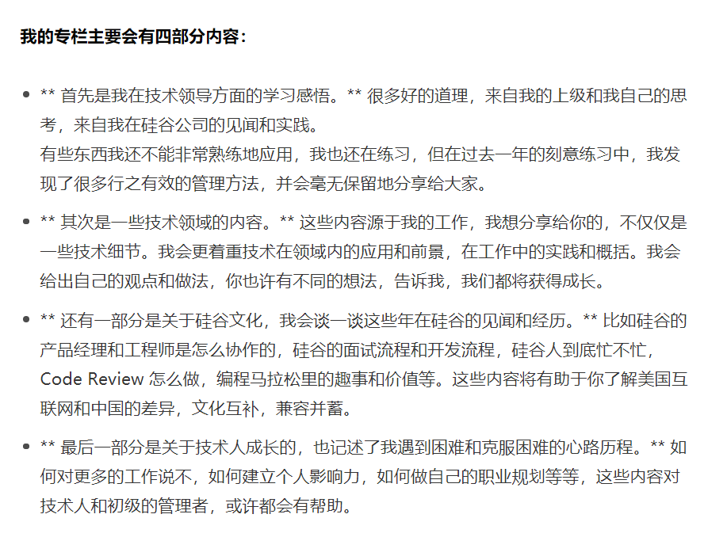

Markdown
===

> Create by **jsliang** on **2022-03-19 15:05:18**  
> Recently revised in **2022-03-19 15:22:00**

Markdown 的使用非常简单，新人入手的时候只需要通过新建 `xxx.md` 格式的文档，即可开始 Markdown 之旅。

这里列举下 **jsliang** 常用的 Markdown 书写方式。

## 一、标题

标题分为 1 - 6 级标题。

标题以 `# 一级标题` 到 `###### 六级标题` 为主。

一般推荐编写文章的时候，建议只使用一级标题，用以 SEO 优化，剩下的从二级标题起，至四级标题止，因为太高层次的标题并不适合文章的阅读。

你的 Markdown 文章内容应该为：

```markdown
一级标题
===

## 一、这是第 1 章

内容……

## 二、这是第 2 章

内容……

### 2.1 这是第 2 章第 1 小节

因为内容太大，所以我们拆分为几个小节，来描述这一章内容。

注意，如无必要，不需要再添加四级标题了。

如果出现四级标题，请思考你的文章架构是否合理。

## 三、这是第 3 章

内容……
```

## 二、表格

表格的应用非常广泛，当你使用有序列表和无序列表，不能很好的表述你的文章内容的时候，推荐使用表格记录：

| 姓名 | 喜好 |
| --- | --- |
| 张三 | 吃饭 |
| 李四 | 睡觉 |
| 王五 | 打豆豆 |

当然，表格的编写形式很多，但是这种比较好记忆，写多几次也就清楚了。

## 三、链接

如何向别人展示你需要引用的文章呢？大概像这样：[jsliang 的文档库](https://github.com/LiangJunrong/document-library)

## 四、列表

列表分为有序列表和无序列表：

**无序列表**：

* 无序列表 1
* 无序列表 2
* 无序列表 3

**有序列表**：

1. 有序列表 1
2. 有序列表 2
3. 有序列表 3

## 五、图片

图片的引用比链接的引用多了个感叹号 ``：


> 当然，使用网络上图片的时候，如不知道版权，请注明：**图片为网络查找，如有侵权，联系必删**，当然，当你被关注后，被告还是会有概率的，所以记得前往专业图库进行查找~

## 六、引用

> 注意：区块引用的左边，有个竖线！
>> 注意：引用还可以嵌套使用，这是二级的引用，二级以上相信你也懂了
>>> 注意：这是三级嵌套，相信你知道怎么用了

## 七、分割线

分割线只需要使用 `---` 即可：

---

## 八、代码块

代码块分为行内代码块和多行代码块：

**行内代码块**：`hello jsliang`

**多行代码块**：

> js

```js
const jsliang = {
  name: 'jsliang',
  age: 25,
};
```

> html

```html
<!DOCTYPE html>
<html lang="en">
<head>
  <meta charset="UTF-8">
  <meta name="viewport" content="width=device-width,initial-scale=1.0,maximum-scale=1.0,user-scalable=no">
  <meta http-equiv="X-UA-Compatible" content="ie=edge">
  <title>HTML</title>
</head>
<body>
  <h1>Hello jsliang</h1>
</body>
</html>
```

> css

```css
body {
  color: red,
}
.jsliang {
  color: deepskyblue,
}
```

> diff

```diff
+ 新增了内容
- 删除了内容
```

## 九、字体

* 倾斜：*倾斜字体*
* 加粗：**加粗字体**
* 删除：~~删除~~

## 十、任务清单

* [ ] 未完成
* [x] 完成

## 十一、HTML

<!-- 注释 -->

<details>
  <summary>基础知识</summary>
  被缩略
  你还需要指定其他的吗？
</details>

## 十二、小结

Markdown 的世界应当是简洁的，明了的，因为这可以让观众第一时间了解你的表述。

如果你探索更丰富的内容，也是无可厚非的。

知识库应当是完善、丰富的，所以让我们利用起来编写更多更有意思的内容吧！

### 12.1 为什么加粗字体无效

* **解析有误。**
* **解析无误**。

这种写法上，在 VS Code 上可能显示是正常的，但是如果在某些部位，那么它就是有问题的，例如：

* https://time.geekbang.org/column/article/780?utm_source=website&utm_medium=infoq&utm_content=yanzhengma

在这个课程地址上，就有个位置：



这是因为不同解析器对中文的解析不同，所以在编写的时候尤其注意，碰到 `：` 或者 `。` 等中文标点符号之类的内容，谨慎改变加粗、斜体的位置。

---

**不折腾的前端，和咸鱼有什么区别！**

觉得文章不错的小伙伴欢迎点赞/点 Star。

如果小伙伴需要联系 **jsliang**：

* [Github](https://github.com/LiangJunrong/document-library)

个人联系方式存放在 Github 首页，欢迎一起折腾~

争取打造自己成为一个充满探索欲，喜欢折腾，乐于扩展自己知识面的终身学习斜杠程序员。

> jsliang 的文档库由 [梁峻荣](https://github.com/LiangJunrong) 采用 [知识共享 署名-非商业性使用-相同方式共享 4.0 国际 许可协议](http://creativecommons.org/licenses/by-nc-sa/4.0/) 进行许可。<br/>基于 [https://github.com/LiangJunrong/document-library](https://github.com/LiangJunrong/document-library) 上的作品创作。<br/>本许可协议授权之外的使用权限可以从 [https://creativecommons.org/licenses/by-nc-sa/2.5/cn/](https://creativecommons.org/licenses/by-nc-sa/2.5/cn/) 处获得。
