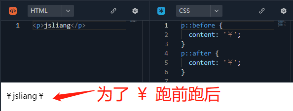
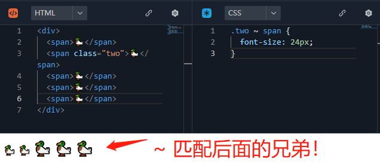
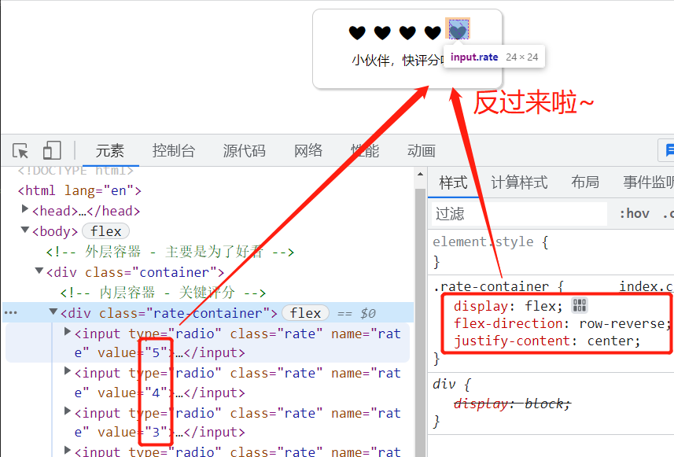

CSS 实例系列 - 03 - Rate 爱心评分
===

> Create by **jsliang** on **2023-01-16 20:48:35**  
> Recently revised in **2023-01-16 22:44:16**

Hello 小伙伴们早上、中午、下午、晚上和深夜好，这里是 **jsliang**~

今儿要实现的是：**Rate 评分**


本期将和小伙伴们探讨：

* √ 通过 CSS，配合简单的 HTML + JS 完成评分组件

本实例的代码地址：

* [Github - all for one](https://github.com/LiangJunrong/all-for-one/tree/master/038-CSS%20系列)
* [码上掘金 - 03 - Rate 爱心评分](https://code.juejin.cn/pen/7189251131267088441)

## 一 前言

本 CSS 系列文章：

1. **主推学以致用**。结合面试题和工作实例，让小伙伴们深入体验 61 个工作常见的 CSS 属性和各种 CSS 知识。
2. **主推纯 CSS**。尽可能使用 HTML + CSS 完成学习目的，但仍然有 “一小部分” 功能需要用到 JavaScript 知识，**适合新人学习 + 大佬复习**。

如果文章在一些细节上没写清楚或者误导读者，欢迎评论/吐槽/批判，**你的点赞、收藏和关注是我更新的动力 ❤**

* 更多知识分享文章可见：[jsliang 的文档库](https://github.com/LiangJunrong/document-library)

## 本期知识点

### ::before 和 ::after

关于伪元素 [::before](https://developer.mozilla.org/zh-CN/docs/Web/CSS/::before) 和 [::after](https://developer.mozilla.org/zh-CN/docs/Web/CSS/::after) 以及 [content](https://developer.mozilla.org/zh-CN/docs/Web/CSS/content)，我们要简单化理解：



那就是 Web 版的 **jsliang**，为了钱（`content`）瞻前（`::before`）顾后（`::after`）。

其实就是 `content` 一般配合 `::before` 和 `::after`，来实现内容的填充，`content: ''` 配合 `width/height` 可以完成矩形的绘制（就跟正常 `div` 一样了）

### 选择器 ~

关于 [选择器 ~](https://developer.mozilla.org/zh-CN/docs/Web/CSS/CSS_Selectors)，也很容易理解：

门前大桥下，有着 5 只鸭，数到 2 时用上 `~`，那就匹配 3、4、5。



## 实现步骤

OK，小知识点讲完，下面我们开始写这个 Demo 吧~

**第一步**，HTML 结构非常简单：

```html
<!-- 外层容器 - 主要是为了好看 -->
<div class="container">
  <!-- 内层容器 - 关键评分 -->
  <div class="rate-container">
    <input type="radio" class="rate" name="rate" value="5">
    <input type="radio" class="rate" name="rate" value="4">
    <input type="radio" class="rate" name="rate" value="3">
    <input type="radio" class="rate" name="rate" value="2">
    <input type="radio" class="rate" name="rate" value="1">
  </div>
  <!-- 评分提示 -->
  <p class="scoring">小伙伴，快评分呀~</p>
</div>
```

它的显示效果如下：


**第二步**，我们施加 CSS 魔法：

```css
/* 关键样式 - Flex 布局 */
.rate-container {
  /* 这里 Flex 是关键 */
  /* 如果用正常顺序的话，使用兄弟元素选择器 ~ */
  /* 会导致 ❤ 的选择反过来 */
  /* 所以需要 flex-direction 再翻转一遍 */
  display: flex;
  flex-direction: row-reverse;
  justify-content: center;
}
/* 去掉默认样式 */
.rate {
  position: relative;
  -webkit-appearance: none;
  border: none;
  outline: none;
  cursor: pointer;
  width: 24px;
  height: 24px;
}
```



这里我们可以看到，我们原本按照 `5 -> 1` 排序的 `input:radio` 组件，通过 `display:flex` 属性调转过来了。

然后我们在 `.rate` 上移除了默认样式，所以现在看不到边框了。

下面我们绘制爱心，并让它有 hover 上去点亮的效果：

```css
/* 描绘爱心组件 */
.rate::after {
  position: absolute;
  content: '❤';
  font-size: 24px;
}
/* 元素 hover 效果 */
.rate:hover,
/* 元素 hover 后，兄弟元素跟着变 */
/* 这里用 ~ 可以直接让后面所有元素跟着变 */
/* 如果用 + 只会让后面一个元素跟着变 */
.rate:hover ~ .rate,
/* 元素选中后，变化同上 */
.rate:checked,
.rate:checked ~ .rate {
  color: deeppink;
}
```

此时我们可以看到：


是不是简简单单~

> 此时看不懂 `~ .rate` 的意思，可以回顾下开局的 CSS 属性讲解

**第三步**，我们完成 JavaScript 代码编写，让它的交互更加有意思：

```js
window.onload = () => {
  const scoring = document.querySelector('.scoring');
  const checkboxList = document.querySelectorAll('.rate');
  // 上一次打的分数
  let prevScore = 0;
  checkboxList.forEach((item) => {

    // 改变评分的时候，设置文本效果
    item.onchange = (e) => {
      const score = Number(e.target.value);
      switch (score) {
        case 1: scoring.innerText = '-_- 谢谢你这么不看好我 -_-'; break;
        case 2: scoring.innerText = '哇塞，我比更低更胜一筹！'; break;
        case 3: scoring.innerText = '中规中矩啦，麻麻嘚~'; break;
        case 4: scoring.innerText = '哇塞，我比更高差了一步！'; break;
        case 5: scoring.innerText = '^_^ 谢谢你这么看好我 ^_^'; break;
        default: scoring.innerText = '小伙伴，快评分呀~'; break;
      }
    };

    // 点击的时候，判断是选中还是反选
    item.onclick = (e) => {
      const score = Number(e.target.value);
      // 评分相同，则反选，且清空评分
      if (score === prevScore) {
        item.checked = false;
        prevScore = 0;
        scoring.innerText = '小伙伴，快评分呀~'
      } else {
        // 否则设置上一次评分
        prevScore = score;
      }
    };
  });
};
```

这样，我们就完成了评分效果：


## 参考文献

* [掘金 - 聪明的汤姆 - 讲道理，仅3行核心css代码的rate评分组件，我被自己秀到头皮发麻🙆‍♂️](https://juejin.cn/post/6844903919106129934)
* [GitHub - jawil/blog - 纯CSS实现网站常用的五角星评分和分数展示交互效果](https://github.com/jawil/blog/issues/8)
* [codepen - 纯CSS 评分](https://codepen.io/main2018/pen/oNgYgXv)

---

**不折腾的前端，和咸鱼有什么区别！**

觉得文章不错的小伙伴欢迎点赞/点 Star。

如果小伙伴需要联系 **jsliang**：

* [Github](https://github.com/LiangJunrong/document-library)
* [掘金](https://juejin.im/user/3403743728515246)

个人联系方式存放在 Github 首页，欢迎一起折腾~

争取打造自己成为一个充满探索欲，喜欢折腾，乐于扩展自己知识面的终身学习斜杠程序员。

> jsliang 的文档库由 [梁峻荣](https://github.com/LiangJunrong) 采用 [知识共享 署名-非商业性使用-相同方式共享 4.0 国际 许可协议](http://creativecommons.org/licenses/by-nc-sa/4.0/) 进行许可。<br/>基于 [https://github.com/LiangJunrong/document-library](https://github.com/LiangJunrong/document-library) 上的作品创作。<br/>本许可协议授权之外的使用权限可以从 [https://creativecommons.org/licenses/by-nc-sa/2.5/cn/](https://creativecommons.org/licenses/by-nc-sa/2.5/cn/) 处获得。
