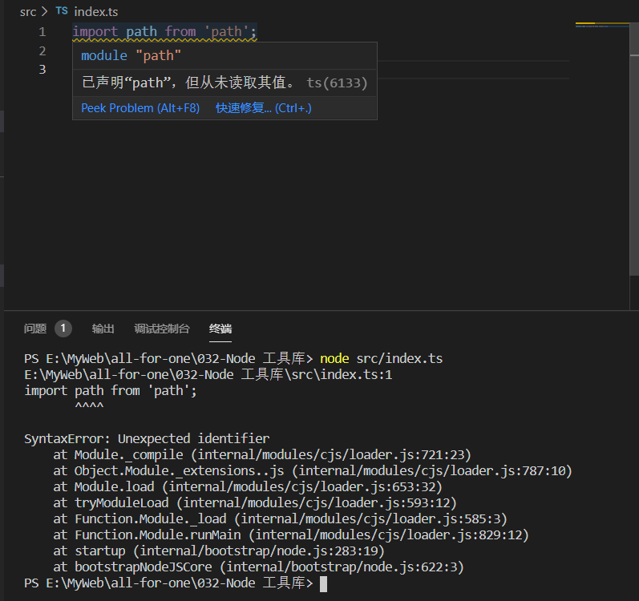
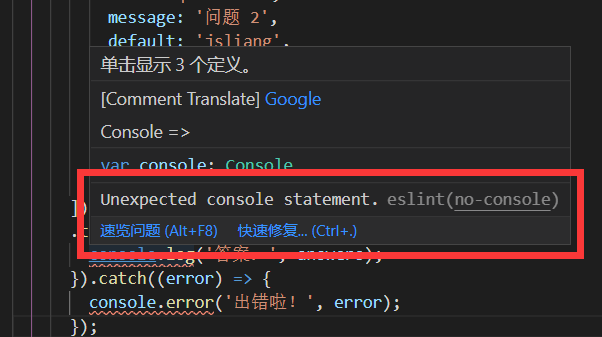

002 - TypeScript
===

> Create by **jsliang** on **2021-05-12 11:00:03**  
> Recently revised in **2021-06-15 13:01:02**

——————————☆☆☆——————————

Node 系列相应地址：

* 代码仓库：https://github.com/LiangJunrong/all-for-one
* 文章仓库：https://github.com/LiangJunrong/document-library/tree/master/系列-前端资料/Node

——————————☆☆☆——————————

TypeScript 是 JavaScript 的超集，为语言增加了新的功能（下面简称 TS）。

**jsliang** 羡慕 TypeScript 很久了，一直没有自己去搭建过，都是用别人搭建好的，恰好这次要尝试，那就折腾个痛快。

这篇文章通过配置 `Node.js` 集成 TS，来快速讲解 TS 的使用。

<!-- 目录开始 -->
## <a name="chapter-one" id="chapter-one"></a>一 目录

**不折腾的前端，和咸鱼有什么区别**

| 目录 |
| --- |
| [一 目录](#chapter-one) |
| <a name="catalog-chapter-two" id="catalog-chapter-two"></a>[二 Node.js 快速集成 TS](#chapter-two) |
| &emsp;[2.1 目录结构](#chapter-two-one) |
| &emsp;[2.2 初始化步骤](#chapter-two-two) |
| <a name="catalog-chapter-three" id="catalog-chapter-three"></a>[三 tsconfig.json 讲解](#chapter-three) |
| &emsp;[3.1 compilerOptions 可配置项](#chapter-three-one) |
| &emsp;[3.2 files 可配置项](#chapter-three-two) |
| &emsp;[3.3 include 和 exclude 可配置项](#chapter-three-three) |
| <a name="catalog-chapter-four" id="catalog-chapter-four"></a>[四 ESLint](#chapter-four) |
| <a name="catalog-chapter-five" id="catalog-chapter-five"></a>[五 总结](#chapter-five) |
| <a name="catalog-chapter-six" id="catalog-chapter-six"></a>[六 参考文献](#chapter-six) |
<!-- 目录结束 -->

## <a name="chapter-two" id="chapter-two"></a>二 Node.js 快速集成 TS

> [返回目录](#chapter-one)

### <a name="chapter-two-one" id="chapter-two-one"></a>2.1 目录结构

> [返回目录](#chapter-one)

在这之前，我们先明白即将构建的目录：

```
util
 - src
  - index.ts
 - tsconfig.json
 - package.json
```

> util 就是仓库名称（文件夹名称），可以随意换个其他文件夹

> 除了 `index.ts` 是人工添加的，其他文件均有命令行生成，可以不理会

那么，Here We go~

### <a name="chapter-two-two" id="chapter-two-two"></a>2.2 初始化步骤

> [返回目录](#chapter-one)

**首先**，初始化 `package.json`：

* `npm init --yes`

> 如果仓库名为中文名，需要 `npm init` 逐项填写

**然后**，如果在 `index.ts` 中，编写了以下代码：

> index.ts

```js
const path = require('path');

console.log(path);
```

此时执行 `node src/index.ts`，会看到报错：

```
internal/modules/cjs/loader.js:883
  throw err;
  ^

Error: Cannot find module 'F:\jsliang\index.ts'
    at Function.Module._resolveFilename (internal/modules/cjs/loader.js:880:15)
    at Function.Module._load (internal/modules/cjs/loader.js:725:27)
    at Function.executeUserEntryPoint [as runMain] (internal/modules/run_main.js:72:12)   
    at internal/main/run_main_module.js:17:47 {
  code: 'MODULE_NOT_FOUND',
  requireStack: []
}
```

> 也有可能不报错！

如果你使用的是 VS Code 开发软件，会看到提示：

```
找不到名称 "require"。是否需要为节点安装类型定义? 请尝试使用 `npm i --save-dev @types/node`。ts(2580)
```

意思就是 `path` 和 `require` 模块都是 Node.js 的东西，使用它需要安装 Node.js 的声明文件，即安装 `@types/node` 这个包。

**接着**，如果单单安装 `@types/node`，是还不够的，因为 `@types/node` 仅仅是 `TS` 文件做声明作用的，即 `xxx.d.ts`，所以还需要其他内容：

* 安装 `@types/node`：`npm i @types/node -D`
* 安装 `typescript`：`npm i typescript -D`
* 安装 `ts-node`：`npm i ts-node -D`

> 合在一块执行：`npm i @types/node typescript ts-node -D`

> 【2021-06-12 16:42:05】发现一个漏点，照着自己这篇文章，安装这几个包之后，如果执行 `node src/index.ts` 还是会报：`SyntaxError: Unexpected identifier`，所以应该安装 `npm i ts-node -g`，然后再执行 `ts-node src/index.ts`

此时再执行 `node src/index.ts`，会发现 `path` 的信息打印出来了，可行，计划通~

> 此时会生成 `node_modules` 和 `package-lock.json`，这 2 个详细不介绍，请自行 Google

**最后**，还可以深度配置 TS 内容：

* 创建 `tsconfig.json`：`tsc --init`

> tsc 需要全局安装 `typescript`，所以需要先执行 `npm i typescript -g`

执行完命令之后，会自动创建 `tsconfig.json`，内容如下：

> **jsliang** 于 `2021-05-11` 通过 `tsc --init` 获取到的 `tsconfig.json`，并通过机器翻译后开通了限制的几条（毕竟 **jsliang** 4 级都没过，想啥呢~）

```js
{
  "compilerOptions": {
    /* 访问 https://aka.ms/tsconfig.json 查看更多 */

    /* 基本选项 */
    // "incremental": true,                         /* 启用增量编译 */
    "target": "es5",                                /* 指定 ECMAScript 目标版本: 'ES3' (default), 'ES5', 'ES2015', 'ES2016', 'ES2017', 'ES2018', 'ES2019', 'ES2020', 或者 'ESNEXT'. */
    "module": "commonjs",                           /* 指定使用模块: 'none', 'commonjs', 'amd', 'system', 'umd', 'es2015', 'es2020', 或者 'ESNext'. */
    // "lib": [],                                   /* 指定要包含在编译中的库文件 */
    // "allowJs": true,                             /* 允许编译 javascript 文件 */
    // "checkJs": true,                             /* 报告 javascript 文件中的错误 */
    // "jsx": "preserve",                           /* 指定 jsx 代码的生成: 'preserve', 'react-native', 'react', 'react-jsx' 或者 'react-jsxdev'. */
    // "declaration": true,                         /* 生成相应的 '.d.ts' 文件 */
    // "declarationMap": true,                      /* 对每个 '.d.ts' 文件进行遍历 */
    // "sourceMap": true,                           /* 生成相应的 '.map' 文件 */
    // "outFile": "./",                             /* 将输出文件合并为一个文件 */
    "outDir": "./dist",                             /* 指定输出目录 */
    // "rootDir": "./",                             /* 用来控制输出目录结构 --outDir */
    // "composite": true,                           /* 启用项目编译 */
    // "tsBuildInfoFile": "./",                     /* 指定文件来存储增量编译信息 */
    "removeComments": true,                         /* 删除编译后的所有的注释 */
    // "noEmit": true,                              /* 不生成输出文件 */
    // "importHelpers": true,                       /* 从 tslib 导入辅助工具函数 */
    // "downlevelIteration": true,                  /* 在 ES5 和 ES3 中全面支持 for-of */
    // "isolatedModules": true,                     /* 将每个文件作为单独的模块 （与 'ts.transpileModule' 类似） */

    /* 严格的类型检查选项 */
    "strict": true,                                 /* 启用所有严格类型检查选项 */
    // "noImplicitAny": true,                       /* 在表达式和声明上有隐含的 any 类型时报错 */
    // "strictNullChecks": true,                    /* 启用严格的 null 检查 */
    // "strictFunctionTypes": true,                 /* 启用严格的 function 类型检查 */
    // "strictBindCallApply": true,                 /* 启用严格的 bind、call、apply 方法参数检查 */
    // "strictPropertyInitialization": true,        /* 启用严格的类的属性初始化检查  */
    // "noImplicitThis": true,                      /* 当 this 表达式值为 any 类型的时候，生成一个错误 */
    // "alwaysStrict": true,                        /* 以严格模式检查每个模块，并在每个文件里加入 'use strict' */

    /* 额外的检查 */
    "noUnusedLocals": true,                         /* 有未使用的变量时，抛出错误 */
    "noUnusedParameters": true,                     /* 有未使用的参数时，抛出错误 */
    // "noImplicitReturns": true,                   /* 并不是所有函数里的代码都有返回值时，抛出错误 */
    // "noFallthroughCasesInSwitch": true,          /* 报告 switch 语句的 fallthrough 错误。（即，不允许 switch 的 case 语句贯穿） */
    // "noUncheckedIndexedAccess": true,            /* 在索引签名结果中包含 undefined */
    // "noPropertyAccessFromIndexSignature": true,  /* 需要索引签名中未声明的属性才能使用元素访问 */

    /* Module Resolution Options */
    // "moduleResolution": "node",                  /* 选择模块解析策略： 'node' (Node.js) or 'classic' (TypeScript pre-1.6) */
    // "baseUrl": "./",                             /* 用于解析非相对模块名称的基目录 */
    // "paths": {},                                 /* 模块名到基于 baseUrl 的路径映射的列表 */
    // "rootDirs": [],                              /* 根文件夹列表，其组合内容表示项目运行时的结构内容 */
    // "typeRoots": [],                             /* 包含类型声明的文件列表 */
    // "types": [],                                 /* 需要包含的类型声明文件名列表 */
    // "allowSyntheticDefaultImports": true,        /* 允许从没有设置默认导出的模块中默认导入 */
    "esModuleInterop": true,                        /* 通过为所有导入创建名称空间对象，启用 CommonJS 和 ES 模块之间的的互动性 */
    // "preserveSymlinks": true,                    /* 不解析符号链接的真实路径 */
    // "allowUmdGlobalAccess": true,                /* 允许从模块访问 UMD 全局变量 */

    /* Source Map Options */
    // "sourceRoot": "",                            /* 指定调试器应该找到 TypeScript 文件而不是源文件的位置 */
    // "mapRoot": "",                               /* 指定调试器应该找到映射文件而不是生成文件的位置 */
    // "inlineSourceMap": true,                     /* 生成单个 soucemaps 文件，而不是将 sourcemaps 生成不同的文件 */
    // "inlineSources": true,                       /* E将代码与 sourcemaps 生成到一个文件中，要求同时设置了 --inlineSourceMap 或 --sourceMap 属性 */

    /* Experimental Options */
    // "experimentalDecorators": true,              /* 启用装饰器 */
    // "emitDecoratorMetadata": true,               /* 为装饰器提供元数据的支持 */

    /* Advanced Options */
    "skipLibCheck": true,                           /* 跳过声明文件的类型检查 */
    "forceConsistentCasingInFileNames": true        /* 进制对同一文件使用大小写不一致的引用 */
  }
}

```

这个文件的作用，是让 TypeScript 将此目录和子目录下的 `.ts` 文件作为编译上下文的一部分，并且包含一部分默认的编译选项。

另外还有一些配置项可以查看下面的讲解内容。

## <a name="chapter-three" id="chapter-three"></a>三 tsconfig.json 讲解

> [返回目录](#chapter-one)

`tsconfig.json` 文件主要是为了养成一些良好的习惯，例如遵循不要通篇代码写 `any` 类型，不要 `import` 一些没用的包。

如果需要检验这个配置项，小伙伴们可以往 `index.ts` 写入下面代码：

```js
import path from 'path';

console.log('jsliang 的 Node 工具库');
```

执行 `node src/index.ts` 就会报错：



这样就起到约束的作用。

下面讲解下一些配置项。

### <a name="chapter-three-one" id="chapter-three-one"></a>3.1 compilerOptions 可配置项

> [返回目录](#chapter-one)

用来配置 TS 中的一些项：

```js
{
  "compilerOptions": {

    /* 基本选项 */
  }
}
```

### <a name="chapter-three-two" id="chapter-three-two"></a>3.2 files 可配置项

> [返回目录](#chapter-one)

通过 `files` 指定需要编译的文件：

```js
{
  "files": [
    "./some/file.ts"
  ]
}
```

### <a name="chapter-three-three" id="chapter-three-three"></a>3.3 include 和 exclude 可配置项

> [返回目录](#chapter-one)

通过 `include` 和 `exclude` 指定需要包含的文件和排除的文件：

```js
{
  "include": [
    "./folder"
  ],
  "exclude": [
    "./folder/**/*.spec.ts",
    "./folder/someSubFolder"
  ]
}
```

## <a name="chapter-four" id="chapter-four"></a>四 ESLint

> [返回目录](#chapter-one)

你可以通过 TSLint 或者 ESLint 来约束代码规范。

但是 TSLint 官网表示 2019 及以后它被抛弃了，改用 ESLint，所以这里咱们安装 ESLint 吧。

> 参考文献：https://palantir.github.io/tslint/

执行命令：

* `npm i eslint @typescript-eslint/parser @typescript-eslint/eslint-plugin -D`

然后创建 `.eslintrc.js` 来存放下面内容：

```js
module.exports = {
  // 解析器
  parser: "@typescript-eslint/parser", // 把 TS 转换成 ESTree 兼容格式的解析器，这样就可以在 eslint 中使用了
  
  // 拓展：用来继承已有的 ESLint 配置
  extends: ["plugin:@typescript-eslint/recommended"],

  // 插件
  plugins: ["@typescript-eslint"],

  // 环境：设置代码环境，eslint 能够自动识别对应环境所有的全局变量
  env: {
    node: true,
    commonjs: true,
    amd: true,
    es6: true,
  },

  /**
   * "off" 或 0 - 关闭规则
   * "warn" 或 1 - 开启规则，使用警告级别的错误：warn (不会导致程序退出),
   * "error" 或 2 - 开启规则，使用错误级别的错误：error (当被触发的时候，程序会退出)
   */
  rules: {
    /* Possible Errors - 这些规则与 JavaScript 可能的错误或者逻辑错误有关 */
    "no-dupe-args":            2, // 禁止 function 定义中出现重名参数
    "no-dupe-keys":            2, // 禁止对象字面量中出现重复的 key
    "no-empty":                2, // 禁止出现空语句块
    "no-func-assign":          2, // 禁止对 function 声明重新赋值
    "no-irregular-whitespace": 2, // 禁止不规则的空白
    "no-unreachable":          2, // 禁止在 return、throw、continue 和 break 语句之后出现不可达代码

    /* Best Practices - 这些规则是关于最佳实践的，帮助避免一些问题 */
    "eqeqeq":                  2, // 要求使用 === 和 !==
    "curly":                   2, // 强制所有控制语句使用一致的括号风格

    /* Variables - 这些规则与变量有关 */
    "no-delete-var":           2, // 禁止删除变量
    "no-unused-vars":          2, // 进制出现未使用过的变量

    /* Node.js and CommonJS - 关于 Node.js 相关的规则 */
    "global-require":          2, // 要求 require() 出现在顶层模块作用域中
    "handle-callback-err":     2, // 要求回调函数中有容错处理
  },
};

```

配置成功之后，我们可以在 `index.ts` 上看到：



> 图中这个配置项被关闭了，不能 `console` 也太奇葩了

> 小 Tips：配合 VS Code 的【ESlint】插件食用更香

## <a name="chapter-five" id="chapter-five"></a>五 总结

> [返回目录](#chapter-one)

当前目录结构如下：

```
+ src
  - index.ts
- .eslintrc.js
- package.json
- tsconfig.json
```

相应的内容在上面我们也讲解过了，当前执行 `node src/index.ts` 也可以运行起来，TS 构造完毕。

最后贴一下 `package.json` 当前内容，避免小伙伴们走错路：

```js
{
  "name": "jsliang",
  "version": "1.0.0",
  "description": "Fe-util, Node 工具库",
  "main": "index.js",
  "scripts": {
    "test": "echo \"Error: no test specified\" && exit 1"
  },
  "keywords": [
    "jsliang",
    "Node 工具库",
    "Node"
  ],
  "author": "jsliang",
  "license": "ISC",
  "devDependencies": {
    "@types/node": "^15.12.2",
    "@typescript-eslint/eslint-plugin": "^4.26.1",
    "@typescript-eslint/parser": "^4.26.1",
    "eslint": "^7.28.0",
    "ts-node": "^10.0.0",
    "typescript": "^4.3.2"
  }
}

```

那么我们下期见~

## <a name="chapter-six" id="chapter-six"></a>六 参考文献

> [返回目录](#chapter-one)

* [TSLint](https://palantir.github.io/tslint/)
* [ESLint](https://eslint.org/docs/user-guide/getting-started)
* [ESLint 中文网](https://cn.eslint.org/docs/user-guide/getting-started)
* [ESLint: 配置规则](https://cn.eslint.org/docs/rules/)
* [CSDN: eslint 简单配置](https://blog.csdn.net/sxm666666/article/details/108064890)
* [snowdream: ESLint配置参数](https://note.xiexuefeng.cc/post/eslint-config/)

---

> jsliang 的文档库由 [梁峻荣](https://github.com/LiangJunrong) 采用 [知识共享 署名-非商业性使用-相同方式共享 4.0 国际 许可协议](http://creativecommons.org/licenses/by-nc-sa/4.0/) 进行许可。<br/>基于 [https://github.com/LiangJunrong/document-library](https://github.com/LiangJunrong/document-library) 上的作品创作。<br/>本许可协议授权之外的使用权限可以从 [https://creativecommons.org/licenses/by-nc-sa/2.5/cn/](https://creativecommons.org/licenses/by-nc-sa/2.5/cn/) 处获得。
