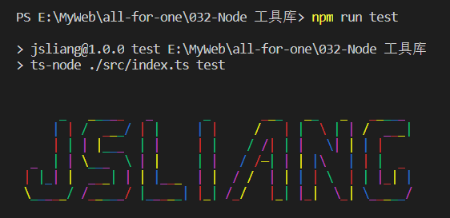
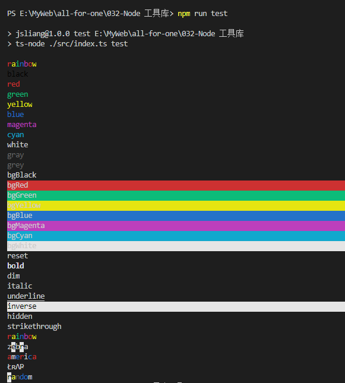
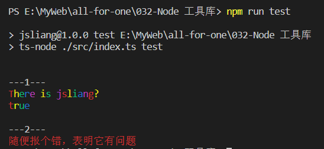

005 - colors.js
===

> Create by **jsliang** on **2021-06-03 17:55:25**  
> Recently revised in **2021-06-16 21:54:56**

——————————☆☆☆——————————

Node 系列相应地址：

* 代码仓库：https://github.com/LiangJunrong/all-for-one
* 文章仓库：https://github.com/LiangJunrong/document-library/tree/master/系列-前端资料/Node

——————————☆☆☆——————————

接入 `commander.js` 和 `Inquirer.js` 之后，本应该直接接上 `colors.js`，毕竟我们现在是控制台输出，控制台不搞得飘飘亮亮（花里胡哨的）。

但是上篇 `Inquires.js` 太给力了，直接上了 1.7w 字，所以相对而言，这篇就简短点呗。

> 阅读提示：本篇文章略短，易读，下一篇再搞大的，不接受吐槽~

<!-- 目录开始 -->
## <a name="chapter-one" id="chapter-one"></a>一 目录

**不折腾的前端，和咸鱼有什么区别**

| 目录 |
| --- |
| [一 目录](#chapter-one) |
| <a name="catalog-chapter-two" id="catalog-chapter-two"></a>[二 前言](#chapter-two) |
| <a name="catalog-chapter-three" id="catalog-chapter-three"></a>[三 colors.js](#chapter-three) |
| <a name="catalog-chapter-four" id="catalog-chapter-four"></a>[四 重写 console.log](#chapter-four) |
| <a name="catalog-chapter-five" id="catalog-chapter-five"></a>[五 参考文献](#chapter-five) |
<!-- 目录结束 -->

## <a name="chapter-two" id="chapter-two"></a>二 前言

> [返回目录](#chapter-one)

`colors.js` 是 Marak 做的一个 4.1k star（2021-06-16）的仓库。

接入 `colors.js` 后可以让你的控制台更爆炸更有美感。

* 安装：`npm i colors`
* 输入代码：

> src/index.ts

```js
import program from 'commander';
import common from './common';
import colors from 'colors';

program
  .version('0.0.1')
  .description('工具库')

program
  .command('jsliang')
  .description('jsliang 帮助指令')
  .action(() => {
    common();
  });

program
  .command('test')
  .description('测试频道')
  .action(() => {
    const text = `
      _   _____   _       _       ___   __   _   _____  
     | | /  ___/ | |     | |     /   | |  \\ | | /  ___| 
     | | | |___  | |     | |    / /| | |   \\| | | |     
  _  | | \\___  \\ | |     | |   / /—| | | |\\   | | |  _  
 | |_| |  ___| | | |___  | |  / /  | | | | \\  | | |_| |
 \\_____/ /_____/ |_____| |_| /_/   |_| |_|  \\_| \\_____/
    `;
    console.log(colors.rainbow(text));
  });

program.parse(process.argv);
```

> package.json

```json
{
  "name": "jsliang",
  "version": "1.0.0",
  "description": "Fe-util, Node 工具库",
  "main": "index.js",
  "scripts": {
    "jsliang": "ts-node ./src/index.ts jsliang",
    "test": "ts-node ./src/index.ts test"
  },
  "keywords": [
    "jsliang",
    "Node 工具库",
    "Node"
  ],
  "author": "jsliang",
  "license": "ISC",
  "devDependencies": {
    "@types/inquirer": "^7.3.1",
    "@types/node": "^15.12.2",
    "@typescript-eslint/eslint-plugin": "^4.26.1",
    "@typescript-eslint/parser": "^4.26.1",
    "eslint": "^7.28.0",
    "ts-node": "^10.0.0",
    "typescript": "^4.3.2"
  },
  "dependencies": {
    "colors": "^1.4.0",
    "commander": "^7.2.0",
    "inquirer": "^8.1.0",
    "rxjs": "^5.5.12"
  }
}

```

* 执行 `npm run test`

发现控制台老漂亮了：



在上面代码中，添加了 `test` 相关指令（后续我们测试内容就塞到这里，可以不用加，但是 **jsliang** 会拿来做示例用）

至于这个好看的字体，就是通过 ASCII 艺术字转换器转换过来的。

* [Kalvin 在线工具](https://tools.kalvinbg.cn/txt/ascii)
* [ASCII 字形生成器](https://www.wncx.cn/ascii/)

这边随意推荐 2 个，更多的小伙伴可以自行挖掘。

## <a name="chapter-three" id="chapter-three"></a>三 colors.js

> [返回目录](#chapter-one)

工欲善其事，必先利其器。

在上面我们展示了 `colors.js` 中的一种彩虹色 `colors.rainbow`，那么肯定会有其他颜色。

```js
import colors from 'colors';

console.log(colors.rainbow('rainbow'));
console.log(colors.black('black'));
console.log(colors.red('red'));
console.log(colors.green('green'));
console.log(colors.yellow('yellow'));
console.log(colors.blue('blue'));
console.log(colors.magenta('magenta'));
console.log(colors.cyan('cyan'));
console.log(colors.white('white'));
console.log(colors.gray('gray'));
console.log(colors.grey('grey'));
console.log(colors.bgBlack('bgBlack'));
console.log(colors.bgRed('bgRed'));
console.log(colors.bgGreen('bgGreen'));
console.log(colors.bgYellow('bgYellow'));
console.log(colors.bgBlue('bgBlue'));
console.log(colors.bgMagenta('bgMagenta'));
console.log(colors.bgCyan('bgCyan'));
console.log(colors.bgWhite('bgWhite'));
console.log(colors.bgGrey('bgGrey'));
console.log(colors.reset('reset'));
console.log(colors.bold('bold'));
console.log(colors.dim('dim'));
console.log(colors.italic('italic'));
console.log(colors.underline('underline'));
console.log(colors.inverse('inverse'));
console.log(colors.hidden('hidden'));
console.log(colors.strikethrough('strikethrough'));
console.log(colors.rainbow('rainbow'));
console.log(colors.zebra('zebra'));
console.log(colors.america('america'));
console.log(colors.trap('trap'));
console.log(colors.random('random'));
```

将它们丢到 `test` 中，执行 `npm run test`，得到花里花哨的打印：



## <a name="chapter-four" id="chapter-four"></a>四 重写 console.log

> [返回目录](#chapter-one)

OK，在上面我们已经华丽呼哨了，每次打印如果都要引用一遍 `colors` 那就有点说不过去啦。

所以咱们重写 `console.log`，这样只要有地方用到它了我们就有彩虹色了！

> base/getType.ts

```js
/**
 * @name getType
 * @description 获取类型
 * @param {string|object} param 传入的变量
 */
export const getType = (param: string): string => {
  return Object.prototype.toString.call(param).slice(8, -1);
};
```

> base/console.ts

```js
import colors from 'colors';
import { getType } from './getType';

// 打印索引
let consoleIndex = 1;

// 重写 console.log
const log = console.log;
console.log = (...args: any) => {
  log(`\n---${consoleIndex++}---`);
  for (let i = 0; i < args.length; i++) {
    const arg = args[i];
    if (['String', 'Number', 'Boolean'].includes(getType(arg))) {
      log(colors.rainbow(String(arg)));
    } else {
      log(arg);
    }
  }
};

// 重写 console.error
const error = console.error;
console.error = (...args: any) => {
  log(`\n---${consoleIndex++}---`);
  for (let i = 0; i < args.length; i++) {
    const arg = args[i];
    if (['String', 'Number', 'Boolean'].includes(getType(arg))) {
      error(colors.red(String(arg)));
    } else {
      error(arg);
    }
  }
};
```

然后在 `src/index.ts` 中引用这个重写的 `console.ts`，这样全局就可以使用到了：

> src/index.ts

```js
import program from 'commander';
import common from './common';
import './base/console';

program
  .version('0.0.1')
  .description('工具库')

program
  .command('jsliang')
  .description('jsliang 帮助指令')
  .action(() => {
    common();
  });

program
  .command('test')
  .description('测试频道')
  .action(() => {
    console.log('There is jsliang?', true);
    console.error('随便报个错，表明它有问题');
  });

program.parse(process.argv);
```

这时候运行 `npm run test` 打印效果为：



> 其实彩虹色看起来太花里胡哨了，但是暂时这边不更改吧，小伙伴们可以自行更换颜色

那么，花里花哨的接入就完毕了，虽然都是 API 复制粘贴工程师，但是做下装饰搞好看一点还是可以有的~

下一篇见！

## <a name="chapter-five" id="chapter-five"></a>五 参考文献

> [返回目录](#chapter-one)

* [GitHub：Marak/colors.js](https://github.com/Marak/colors.js)
* [Kalvin 在线工具](https://tools.kalvinbg.cn/txt/ascii)
* [ASCII 字形生成器](https://www.wncx.cn/ascii/)

---

**不折腾的前端，和咸鱼有什么区别！**

> jsliang 的文档库由 [梁峻荣](https://github.com/LiangJunrong) 采用 [知识共享 署名-非商业性使用-相同方式共享 4.0 国际 许可协议](http://creativecommons.org/licenses/by-nc-sa/4.0/) 进行许可。<br/>基于 [https://github.com/LiangJunrong/document-library](https://github.com/LiangJunrong/document-library) 上的作品创作。<br/>本许可协议授权之外的使用权限可以从 [https://creativecommons.org/licenses/by-nc-sa/2.5/cn/](https://creativecommons.org/licenses/by-nc-sa/2.5/cn/) 处获得。
