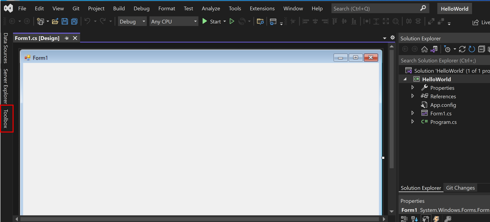
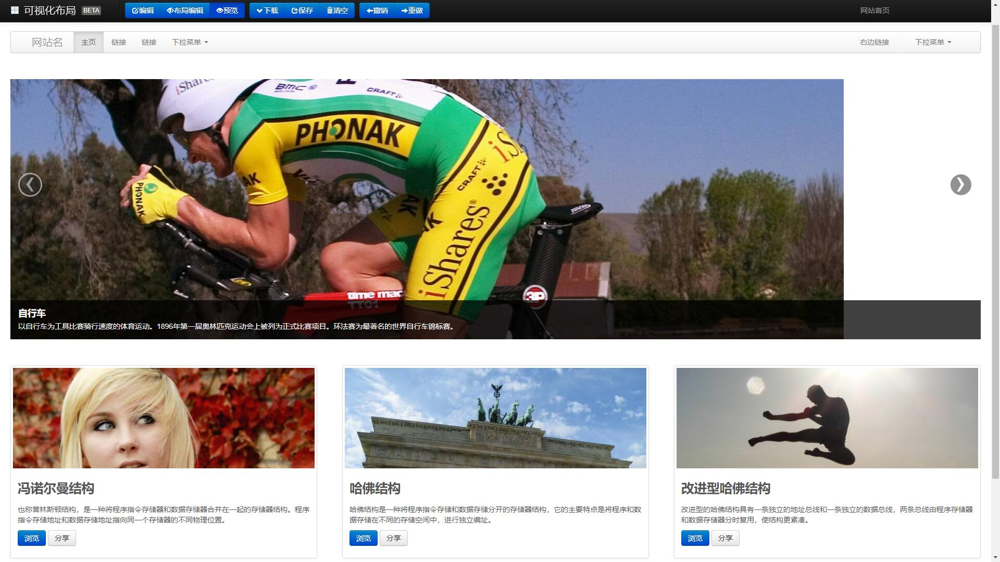
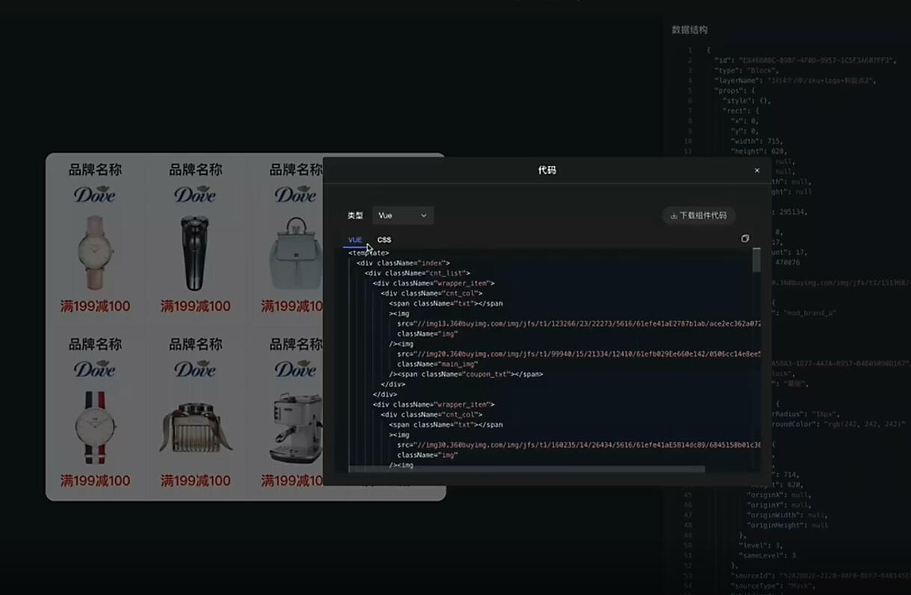
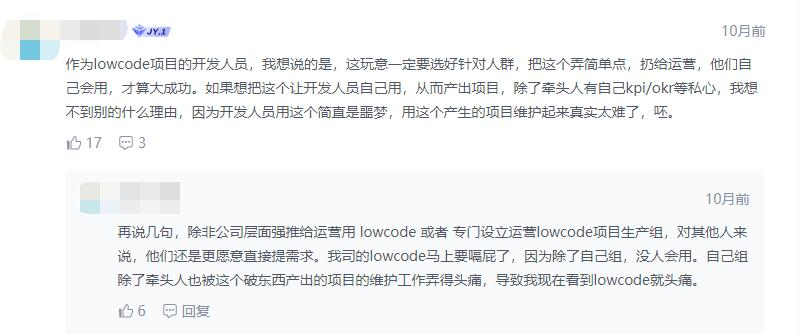

低代码
===

> Create by **jsliang** on **2022-11-16 12:59:04**  
> Recently revised in **2022-11-30 00:02:19**

Hello 小伙伴们早上、中午、下午、晚上、深夜好，这边是 @jsliang ，本次分享的主题是：

* 低代码

## 一、前言

### 1.1 低代码历史

低代码是通过可视化方式创建应用的一种概念，特点是代码量比传统开发少得多，甚至无代码，能显著提升开发效率。

OutSystems 在 2001 成立于葡萄牙，在 2018-2021 年相继完成了数论过亿元美金的融资，成为国外低代码领域的独角兽。

> [一文看懂什么是 OutSystems](https://zhuanlan.zhihu.com/p/544629596)

随着时间流逝，低代码行业越发繁荣：

低代码融资金额情况：

> 材料来源于 iResearch，摘抄自 [凹凸实验室 - 低代码行业现状简析](https://juejin.cn/post/7043977419207737375)

### 1.1 首次接触可视化

还记得 @jsliang 第一次接触可视化，可以追溯到大学时期，当时接触了 C# 的 Windows 窗体应用：

相对于前面学过枯燥无味的 C 以及 C#，窗体应用让爱整活的小伙伴们眼前一亮：

1. 通过反复批量弹窗，让电脑卡死
2. 通过调整弹窗位置，让对方永远关闭不了弹窗

奔着说话要有证据的思路，看到我电脑上还有 Visio Studio 2017，本来想试试能不能场景再现。

但是经过时间的洗礼，代码也忘记怎么使唤了，连新建都麻烦，遂放弃~

当然，这里为什么提到 C# 的可视化，因为低代码开发是一种可视化应用开发方法，而 C 端的低代码，相对于 B 端来说，出现更早，且没有比较高的动画和界面要求。

### 1.2 浏览器可视化低代码

2016 年左右，随着开始学习前端，逐渐接触到 Bootstrap 可视化搭建：

* https://www.bootcss.com/p/layoutit/

这种搭建对于当时的我来说无疑是 “神兵利器”：

1. 界面干净。几乎没有任何包袱
2. 操作简单。拖拽界面，然后生成代码，最后替换到本地代码

这让一大堆没有很深的代码基础的小伙伴，直接一键上手，非常通人性。

> 演示下随手搭建的场景，拖拽可生成 PC/Mobile 一套代码，细节微调即可。

### 1.3 背景 & 利益分析

万事皆有个源头。

在讨论我在查阅几十篇文档，使用 N+ 可视化平台得出的结论之前，我们小心翼翼先探讨下，为什么会出现可视化需求背景。

**论点**：*资本，是逐利的*。

从个人在 2018 做的第一份外包工作来看：

* 当时在给电信做外包，日常工作是拿电信给到的 PSD，然后复制粘贴旧代码，一套 H5 代码吃遍天。每天换个图片，又是一个新的活动页

对于这种 “简单 & 高复用” 的需求场景，你能想象它会有多廉价：

* [「Deco」设计稿一键生成多端代码](https://deco-preview.jd.com/)

> 视频演示

是的，从 “想象” 中的角度来说，老板只要购买设备（Mac），然后找一个懂一点前端的产品，就可以减少一个研发的薪酬，根据 PSD 自动生成代码并让服务端部署即可。

那么，假设有一天，老板看到外面流行低代码，甚至无代码。

于是要求产品以后提的需求，不得超出低代码平台支持的能力范围。

因为高可复用性，这一块只需要快速生成即可，可以缩减一些不必要的 “人工”。

虽然不排除有高定制化的需求，但是客户的需求标准化/模块化，让运营变得更为简单。

所以，不要觉得低代码叫「low code」，你就觉得它很 low，说不定哪一天就夺取了你的工作。

低代码平台能力还没有足够完善成熟，但是低代码的宗旨，对于降低门槛，提升效率来说，它的意义是肯定的。

什么时候能感受低代码带来的切确红利，时间能给我们答案。

也许明天，一个人就可以很快完成前后端应用、完成运营监控，随手拿出一套可运行的程序。

### 1.4 利弊

当然，上面说了那么多，可能有点 “危言耸听”，并且在很多文章的评论上，我们也可以看一些有使用低代码的小伙伴说法：

> 卑微的我，在写这篇分享的时候也在瑟瑟发抖，低代码在使用方这边好像都不怎么看好哦~

所以，尝试性根据个人了解，对低代码在利弊方面做下判断：

利：

1. **企业节省人力资源**。招聘 10 个 ￥5000 的前端，和招聘 3 个 ￥10000 的前端干活，都做出一样的效果，无疑选择后者。
2. **更快地效率**。随便一个人员即可操作，更快让客户看到效果。

弊：

1. **失业危机**。企业好了，新时代农民工肯定就要失业，虽然不至于大范围，但是总会有那么些的。
2. **无法满足高定制需求**。在项目初建的时候，需要衡量是否可启用低代码，如果用户的需求有变更，再更换为定制化，是否会浪费无谓的开发时间
3. **前后端数据交互问题**。无法做更好的数据联动，除非这个模式一开始就有预期。

针对低代码吹的快起飞了的情况，我们还是需要明确：

1. **对于企业，低代码创业不可取**。当前低代码还有技术壁垒，且 B 端的低代码技术不是特别成熟，容易翻车。
2. **对于员工，尽可能提供硬实力**。增加自己的不可替代性，让自己在新时代更替洪潮下活下来，是当前不可避免的一件事。

那么，对于低代码的利弊，以及自身想法，你有要说的吗？

## 二、体验

说得再多，不如体验一番！

针对这么 “繁荣” 的低代码景象，我们挑了一些平台去体验一番。

### 2.1 独角兽 OutSystems

[「OutSystems」](https://www.outsystems.com/)

好玩的点：

1. 程序的开发都是自动化的，程序会自动生成标准的 HTML、CSS、JS、.net 代码

不好玩的点：

1. 官方英文版。
2. 具有详细复杂流程（不够灵活）。需要装包，运行，熟悉这一套流程，了解前后端，入手门槛大。

看到「OutSystems」的教程，其实我已经迷糊了，它这一套下来，不低于重学编程的感觉了~（当然，可能因为我比较懒，没有下载软件亲自尝试一番）

> 看写中文教程的老哥，他公司也准备抛弃这套系统了  
> [知乎 - 朱家俊 - outsystems从入门到精通](https://zhuanlan.zhihu.com/p/322582052)

### 2.2 Deco

[「Deco」设计稿一键生成多端代码](https://deco-preview.jd.com/)

好玩的点：支持设计稿转换代码

不好玩的点：

1. 设备局限。适用 Mac，需通过 Sketch 工具拓展。
2. UI 约束。虽然 Deco 说是对视觉稿没有严格约束，但是它的使用文档有提到设计稿基本规范，对 UI 有所要求。

> 附带：[官网](https://deco-preview.jd.com/help?key=design-guide) 小 bug

### 2.3 鲁班 H5

[「鲁班 H5」](https://ly525.gitee.io/luban-h5/zh/)

好玩的点：

1. 界面驱动。可以通过拖拽/点击，快速生成界面
2. 生成链接地址。点击发布后，可以直接生成界面，可直接预览

* [操作地址](https://h5.luban-h5.com/#/work-manager/list)
* [代码仓库](https://github.com/ly525/luban-h5)

### 2.4 其他

当然，除此之外有很多是可企业应用的，为了避免广告嫌疑，这里就不一一举例了。

## 三、实操

在实操之前，我们需要对低代码平台的设定进行一番剖析。

低代码平台形态划分：

* 表单/数据模型驱动

> 图片地址摘抄自 [凹凸实验室 - 低代码行业现状简析](https://juejin.cn/post/7043977419207737375)

* 界面驱动

> 图片地址摘抄自 [凹凸实验室 - 低代码行业现状简析](https://juejin.cn/post/7043977419207737375)

所以，在设计低代码平台之前，你需要开发的是怎样的一款平台。

低代码基本功能模块：

* **页面搭建**。这个页面操作，是可以直接浏览器操作，还是需要下载软件操作。
* **数据逻辑**。你的数据是如何进行存储的，数据如何进行渲染操作，以及如何与服务端/数据库交互。
* **在线部署**。你的界面如何直接部署上线，如何保证它运行正常。
* **管理系统**。对于你已有的界面，如何管理他们。

假设我需要搭建一个可视化拖拽的低代码平台，它可以一键生成 H5 代码，那么它的简易实现思路：

1. 左侧组件思路：点击/拖拽，可以让中间画布新增一个组件
2. 中间画布思路：

* 记忆数据
* 画布重现
* 画布支持调整

3. 右侧思路：点击显示属性

当然，针对上面这些想法，还有一个必须要先确认的：

* **这个低代码平台，主要是为了实现什么类型需求，它存在价值在哪？**

其实到这一步，我就卡壳了：“日常生活、工作上，我能针对什么场景，进行低代码化，从而优化它的步骤/流程？”

如果小伙伴有想法思路，可以说一下，说不定咱们就整起来了~

> 本来想搭建一个简易请帖/贺卡 H5 低代码/无代码 生成器，但是网上一搜一大把，不明白这么整有没有意义

## 参考文献

* [关于前端低代码的一些个人观点](https://juejin.cn/post/7131801252500865055)
* [推荐一个 yyds 的低代码开源项目](https://juejin.cn/post/7054186640868130830)
* [低代码 火火火！](https://mp.weixin.qq.com/s?__biz=MzUxNjg4NDEzNA==&mid=2247506645&idx=1&sn=7638eee635c1c7df89acf9431e092c3f&chksm=f9a2091cced5800a0a0d9ab253ebdf8557b74cb64ddbc76694cb5c05ecbf0312f9659b9578c4&scene=21#wechat_redirect)
* [解放双手！推荐一款阿里开源的低代码工具，YYDS！](https://juejin.cn/post/7088121411981541390)
* [低代码 yyds](https://juejin.cn/post/6984053870121091103)
* [掘金 - 凹凸实验室 - 低代码行业现状简析](https://juejin.cn/post/7043977419207737375)
* [掘金 - 小天师 - 低代码可视化编辑平台](https://juejin.cn/post/6930506113553006599)
* [掘金 - 三月风997 - 因为懒，我把公司的后管定制成了低代码中台](https://juejin.cn/post/7028069543951990821)
* [GitHub - woai3c - 一个低代码平台的前端部分，靠拖拉拽生成页面。](https://github.com/woai3c/visual-drag-demo)
* [掘金 - 何遇er - 低代码跨 iframe 拖拽](https://juejin.cn/post/7170845236078313486)
* [GitHub - imcuttle - mometa](https://github.com/imcuttle/mometa)

---

**不折腾的前端，和咸鱼有什么区别！**

觉得文章不错的小伙伴欢迎点赞/点 Star。

如果小伙伴需要联系 **jsliang**：

* [Github](https://github.com/LiangJunrong/document-library)
* [掘金](https://juejin.im/user/3403743728515246)

个人联系方式存放在 Github 首页，欢迎一起折腾~

争取打造自己成为一个充满探索欲，喜欢折腾，乐于扩展自己知识面的终身学习斜杠程序员。

> jsliang 的文档库由 [梁峻荣](https://github.com/LiangJunrong) 采用 [知识共享 署名-非商业性使用-相同方式共享 4.0 国际 许可协议](http://creativecommons.org/licenses/by-nc-sa/4.0/) 进行许可。 基于 [https://github.com/LiangJunrong/document-library](https://github.com/LiangJunrong/document-library) 上的作品创作。 本许可协议授权之外的使用权限可以从 [https://creativecommons.org/licenses/by-nc-sa/2.5/cn/](https://creativecommons.org/licenses/by-nc-sa/2.5/cn/) 处获得。
