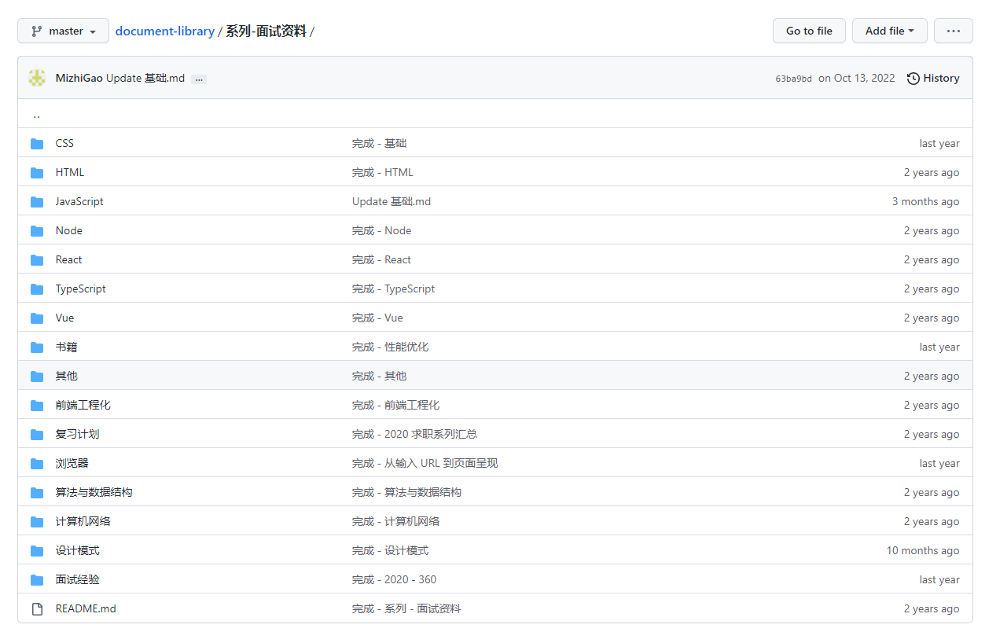
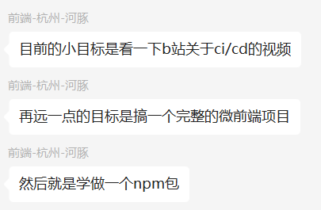
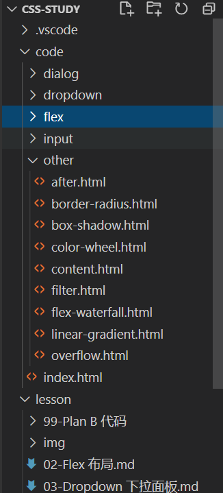
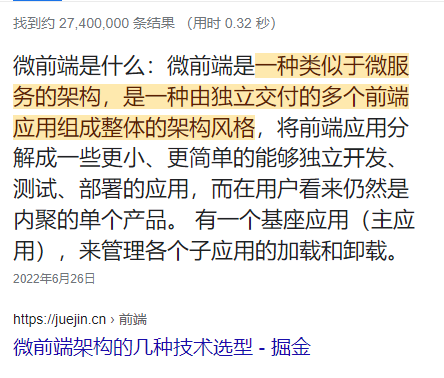

前端都在聊什么 - 第 2 期
===

> Create by **jsliang** on **February 19th, 2023 3:05pm**  
> Recently revised in **February 19th, 2023 4:14pm**

Hello 小伙伴们早上、中午、下午、晚上、深夜好，我是爱折腾的 **jsliang**~

「**前端都在聊什么**」是 **jsliang** 日常写文章/做视频/玩直播过程中，小伙伴们的提问以及我的解疑整理。

* 视频同步：https://www.bilibili.com/video/BV1BD4y1A76P/

本期对应 2023 年的 `01.16-01.31` 这个时间段。

本期针对「规划」「工作」「学习」「闲谈」这 4 个板块进行了讨论，看看有没有能解决你心里疑惑的。

你的 **关注** 和 **点赞** 是我持续更新的动力💖，谢谢大家~


## 一 规划

对于未来规划，这边大声吼一下小伙伴们：

准备转行的、准备裸辞的注意了，千万不要冲动，今年可能不存在金三银四！

外面市场不稳定，能先找到 base offer 再跳槽最好。

没有保底 offer 的不要冲动，先观察观察再下水。


### 1.1 Question：前端还行不，还能找工作不？

看城市，看具体企业需求，暂时没有具体的表现。

有些小伙伴会说行情不好，其实 **jsliang** 感觉从 2020 年开始，行情就没好过。

不止前端这一行，随着涌入的新人越来越多，行业市场缩口，这些问题暴露，导致越发难做了。

> 比如人尽皆知的房地产

那么，对于各种情况，我的建议是这样的：

**首先**，对于一个熟练工来说，找工作还是可以找的。

只是找工作的薪资问题，「而已」~


**然后**，如果小伙伴是想转行，转前端的。

那么，要衡量下前端和旧职业的区别。

是非互联网行业转互联网行业，还是说服务端转前端/产品转前端。

对比下 2 者的薪酬和前景，好好衡量下这里面差别。

我们最重要的是：拿最少的时间，做最有价值，最让自己心动的事~

**接着**，如果小伙伴是大学生，想学前端。

那么，就有比较充裕的时候，考虑下如何实习，以及升更高职级，拿更高薪资的问题。

**再来**，如果小伙伴是应届毕业生，之前大学没学好，想尝试看看前端。

那么小伙伴可以考虑下先就职中小公司，先搞定自己出来混的问题，再看看如何挑战更高的目标。

**最后**，这里面，如果有工作的，千万不要裸辞转行和跳槽，一定一定要有基础 offer，避免辞职后找不到工作的尴尬场景。


### 1.2 Question：学前端还是后端？

> 目前在非互联网行业，在考虑是学前端还是服务端（Java）

对于现在的互联网行业来说。

1、**兴趣**

你是比较对数据感兴趣，还是对界面交互感兴趣。

前端对用户交互、界面及其动画等内容比较多打交道。

Java 它比较偏数据，你可能要跟服务器、数据库打交道，提供接口给前端。

（Java 你可能不太会接触到用户，不需要知道用户有什么交互需求，一般会提供数据接口，进行优化和保障安全等）


2、**前景**

如果是应届生，或者急用钱。

为了尽快找到工作，建议你先找自己熟悉的职业，先进入舒适领域，减少你的烦躁，再慢慢发展。

如果想多考虑下前景，那你就对比下前端和服务端。

其实 **jsliang** 个人感官，服务端更容易升职一点（小组长之类的）

因为数据是掌握在服务端、运营手中的，对于数据消费和数据统计比较清楚。

在一些公司上，前端可能因为没法接触数据，不知道用户一些行为是有怎样的效果，就比较难升小组长。

### 1.3 Question：前端学习方向？

这里大概讲讲 **jsliang** 对于前端学习和复习上，怎么做准备的 **个人想法**。


1、**关于学习**

**首先**，我们需要明白自己对哪一块比较敏感。

是数据吗？是图形吗？还是交互呢？

* 数据：`Node.js` 做中间层，进行数据转换之类的（偏服务端）
* 图形：`ECharts` 等大数据报表，亦或者可视化
* 交互：`CSS3`/`JavaScript` 制作动画等，让用户感受更加好的体验
* 性能优化、项目构建等……

**然后**，我们都知道，支持我们走下来的：

* 要么是钱
* 要么是兴趣

如果上面的兴趣，你都不考虑，只想赚钱，那么你可以看看哪些岗位赚钱。

有个 **残酷的话题**，叫做技术好，不一定能有更高的工资。

我们要理解的是，只有当技术能创造更高价值的时候，才能有更高报酬。

所以，有些时候，你能干青春活，拿高薪酬。

但是，等你的价格，比价值高很多的时候，公司优化事项就盯上你了。

**最后**，不要吃后悔药。

如果你真要做，那就做到更好，做好这个心理准备：

* 做不好，就滚蛋

要么不做，要么就做到更好。

没有后悔药，只有撞南墙。

2、**关于复习**

复习方向我跟很多小伙伴都聊过，这里讲讲自己的一些简单了解：

* 八股文（一面）
* 项目经验（二面/三面）

**关于八股文**，可以看 **jsliang** 之前为自己准备的，今年估计要补充一点内容，小伙伴自行查找资料吧~

https://github.com/LiangJunrong/document-library/tree/master/%E7%B3%BB%E5%88%97-%E9%9D%A2%E8%AF%95%E8%B5%84%E6%96%99




**关于项目经验**，抱歉，爱莫能助。

项目经验一般会询问你自己工作项目上，一些亮点，一些重难点。

这就需要你对自己的工作，有一定的挖掘，能凸显出工作的难度和你的能力。

如果你感觉不知道从哪方向着手，可以看看其他大佬都在聊什么：

* [知乎 - 作为前端，工作中处理过什么复杂的需求，如何解决的?](https://www.zhihu.com/question/362103682)

### 1.4 Question：担心自己能力不能胜任？

**首先**，有的小伙伴觉得自己很菜，看到有 XX 公司的招聘，却不敢投递。

这里统一说下，菜不菜是一码事，试不试是另一码事，梁峻荣给你的勇气，踏出第一步吧！

> **jsliang** 现实名字叫 **梁峻荣**


**然后**，还有的小伙伴觉得自己不聪明，怕做不好。

其实，我们可以不用很聪明。

在日常工作/学习中，能给自己定好目标，然后去做、去实践下来，就已经成功，就是聪明的做法了。

像 **jsliang** 这种从小到大很少有技术指引的，看到别人能有名师，能有好资源，也羡慕啊。

但是从定目标和落实这一块，能干过我的没几个！

所以就要多尝试，多去接触更多有趣的小伙伴，来提升自己~

> 加个好友，聊个 5 毛钱的天？可以 WeiXin：Liang123Gogo


**接着**，还有小伙伴担心学历让你拿着高薪资不安。

其实这块完全不慌，我认识的，有个小伙伴大专 3/4 年经验，月薪比我高，技术也比我牛逼。

有些刚出来的研究生，现在薪资拿着比我低。

**最后**，有些小伙伴担心自己工作经验不够。

其实大多时候，别看 **jsliang** 做了 3-5 年，实际上我自己有时候都觉得，只是前几年有增长，后面基本都在吃老本。

所以完全不要慌，你可以的！

### 1.5 Question：想自己创业？

工作几年，至今没有创业的想法，这里说下自己「浅显」观点。

如果你是技术创业，那么你可能需要学深透一点，搞明白一些技术卡点在哪。

要不然会出现招了个大佬过来，然后出现下面人说啥就是啥，被大佬拿捏的情况。

另外，希望你能对你创业的这条产业链，有自己思路想法，知道里面的一些关键细节。

如果 2023 开始考虑，那就从上面 2 点着力，开始准备，等 2023 年下半年准备发力吧。


## 二 学习

### 2.1 Question：平时应该如何学习？

1、**最重要的事**

关于学习，需要强调的一点，就是 **自律**。

唯有自律，才能拯救自己。

习惯是慢慢养成的，我们平时不自律，大概率在于我们工作忙、生活忙，回头发现自己一天没有属于自己的时间。

于是乎，你就放不下手机，你就刷手机到 1/2 点，这样下来你的自律直接爆炸，学习也就难以为继了。

**jsliang** 的作息表：

```
* 起床：07:40
* 学习（早上）：08:20-08:50
* 午休：12:00-14:00
* 学习（中午）：12:50-13:20
* 跑步：18:00-19:00
* 学习（晚上）：21:00-23:00
* 睡觉：23:10
```

所以，不要尝试给自己找借口，有些人不能早起，有些人午休时间短，那就调整好节奏来学习。

2、**最清晰步骤**

**首先**，确定好你的目标。

我们即将要做的事情，应该是 **最重要的事**，就是这个事，能提供我们很大的价值和帮助。

看看别的小伙伴是怎么定计划的：



就好比，我发现自己 CSS 这块比较差，于是打算做一个 CSS 学习系列：

* [CSS 实例系列](https://github.com/LiangJunrong/document-library/tree/master/%E7%B3%BB%E5%88%97-%E5%89%8D%E7%AB%AF%E8%B5%84%E6%96%99/CSS/CSS%20%E5%AE%9E%E4%BE%8B%E7%B3%BB%E5%88%97)

OK，我们很容易就可以确定一个目标。

**然后**，我们开始收集材料，判断我要写哪些内容：



OK，咋看我们还挺多素材可以做的，那就开始整下来。

**最后**，就是如何保持输入和输出的问题。

很多时候，我们都在做输入，其实这是一个很差的感官，因为别人不知道你做了啥，你不和别人分享，纯粹学习会少了很多乐趣。

所以，你还需要将自己学习到的，做一个好的输出。

**jsliang** 的输出，一般保持【文章】+【视频】的方式，这样就可以跟很多小伙伴打交道，让大家跟我聊其中一些问题。

> 加个好友，聊个 5 毛钱的天？可以 WeiXin：Liang123Gogo


### 2.2 Question：学习 Vite 的路线是怎样的？

其实 **jsliang** 这边学习 Vite，一开始的目的，是在一大堆代码中，抽取单独的 2 个模块出来。

然后想了下，拍脑袋直接将旧项目的 Vue Cli + Webpack 改造为 Vite + Vue。

我这边学习是带着目的 的，就是要做到某种程度。

学习的几种目的：

1. 没有目的，纯粹学习。对着官网，一个一个看 https://cn.vitejs.dev/guide ，就好比我之前学 Webpack，也是这样纯粹的学（时间多的做法）
2. 抱有强烈目的。这种一般都是因为时间比较少，所以你就学习去整，带目的去整理 迁移 Vue v2.x 版本到 Vite

## 三 工作

### 3.1 Question：工作写代码太慢了？

其实有些东西，自己写真的慢，这点是毋庸置疑的。

如果老板急着用，那就满世界找仓库吧，能复用就复用；

如果有时间总结，并且你善于总结，那就边总结边写吧。

自己写的好处，其实就是后续维护的时候，能有更多时间去思考怎么来修改，而不是受限于第三方的约束。

没啥要求的话，能用框架就框架，重复造轮子的时间能省就省。

## 四 闲谈

### 4.1 Question：微前端是什么？



微前端，简单来说，就是多个项目的组合使用，如何更流畅的凑合在一块。

就好比有多个项目，分别用 jQuery、Vue 和 React 做的，技术栈不统一，放一块也矛盾。

这时候，就想法子让多个产品聚合在一块。

Iframe -> 一种组合


Shadow DOM -> 另一种组合


### 4.2 Question：为什么用脚手架？

我们平时写代码的时候，用的语法，可能在各个浏览器是不兼容的。

为了让它兼容，或者让它最终能在服务器上运行，用户能在各个浏览器正常访问页面。

如果没有脚手架，我们就需要一步一步去整理，比较浪费时间。

而有了脚手架之后，就可以提升我们工作效率，让它帮忙将打包过程中一些问题直接处理掉。

---

**不折腾的前端，和咸鱼有什么区别！**

觉得文章不错的小伙伴欢迎点赞/点 Star。

如果小伙伴需要联系 **jsliang**：

* [Github](https://github.com/LiangJunrong/document-library)
* [掘金](https://juejin.im/user/3403743728515246)

个人联系方式存放在 Github 首页，欢迎一起折腾~

争取打造自己成为一个充满探索欲，喜欢折腾，乐于扩展自己知识面的终身学习斜杠程序员。

> jsliang 的文档库由 [梁峻荣](https://github.com/LiangJunrong) 采用 [知识共享 署名-非商业性使用-相同方式共享 4.0 国际 许可协议](http://creativecommons.org/licenses/by-nc-sa/4.0/) 进行许可。<br/>基于 [https://github.com/LiangJunrong/document-library](https://github.com/LiangJunrong/document-library) 上的作品创作。<br/>本许可协议授权之外的使用权限可以从 [https://creativecommons.org/licenses/by-nc-sa/2.5/cn/](https://creativecommons.org/licenses/by-nc-sa/2.5/cn/) 处获得。
