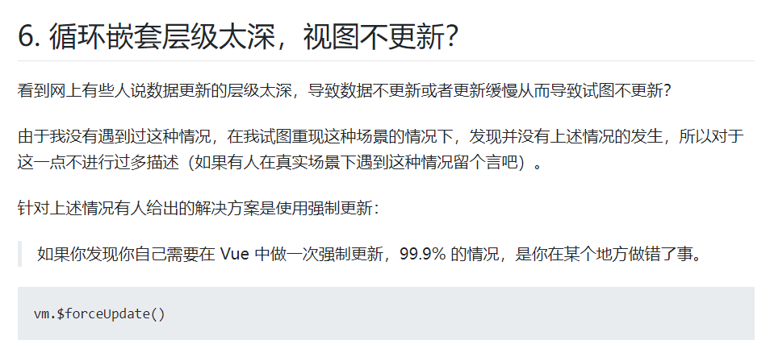
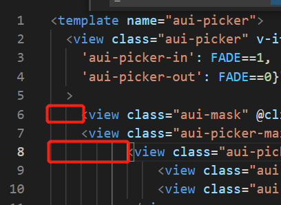
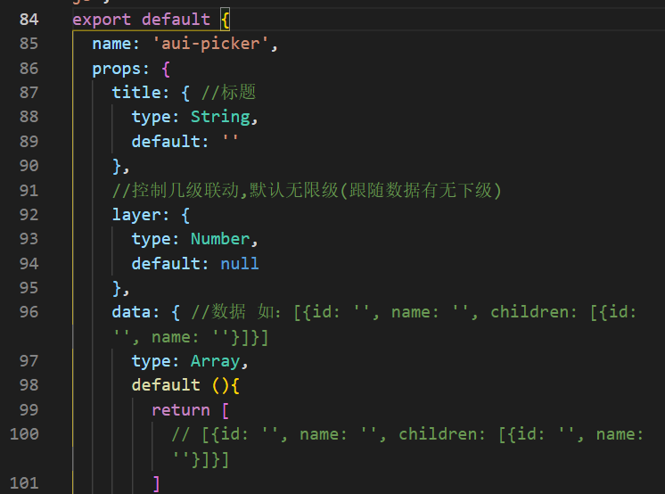
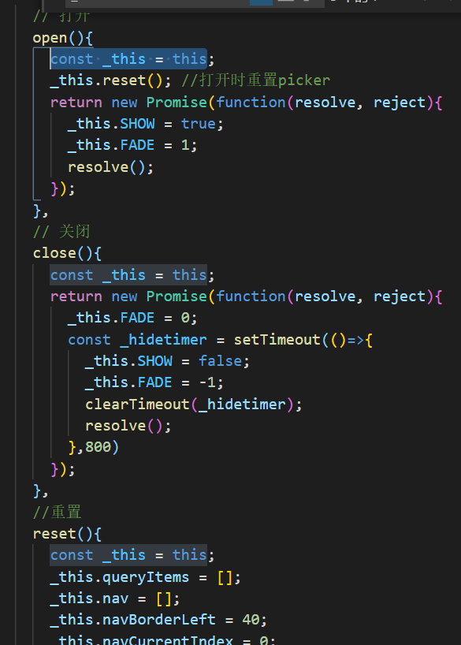
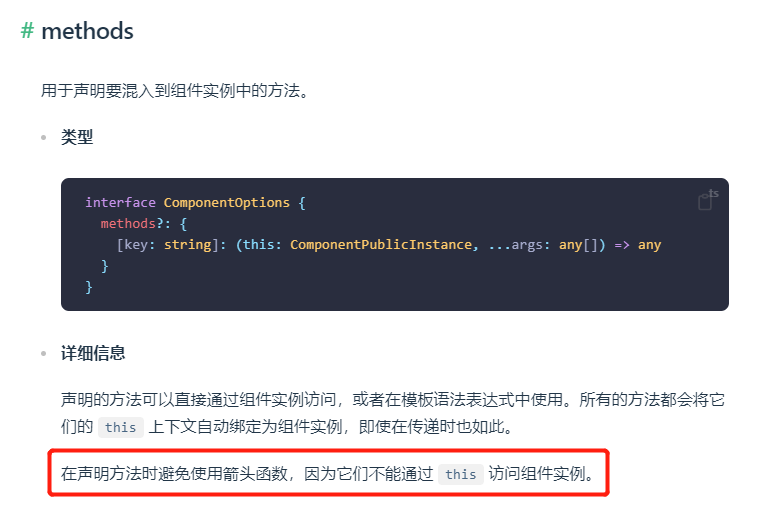
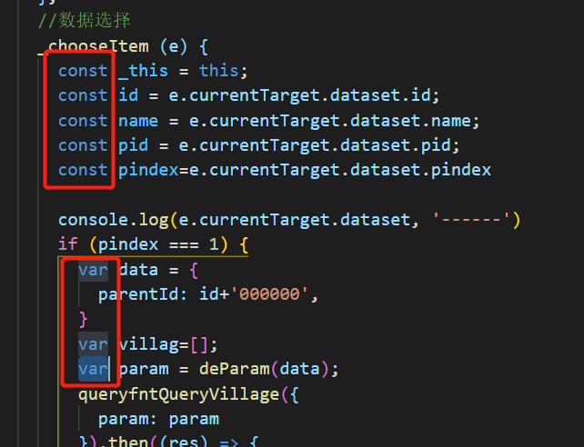
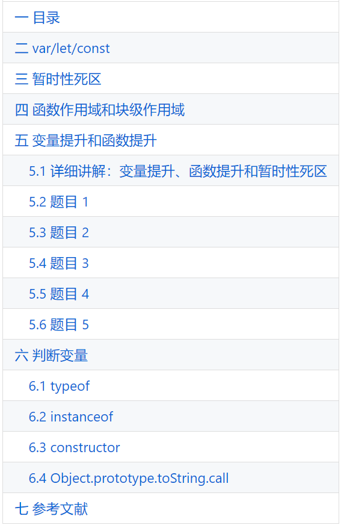
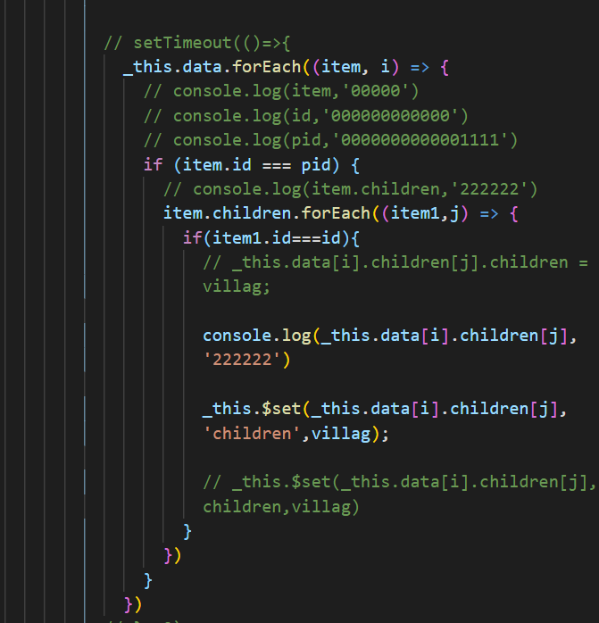
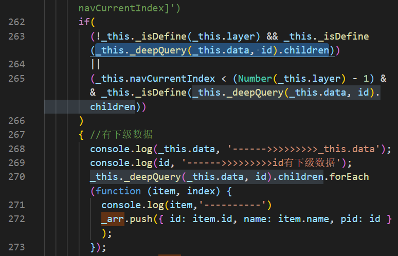
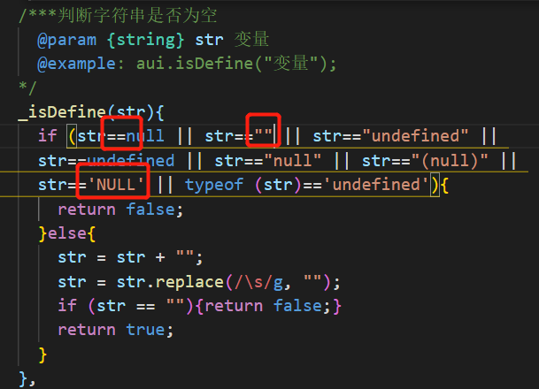

前端都在聊什么 - 第 3 期
===

> Create by **jsliang** on **2023-02-20 08:45:07**  
> Recently revised in **2023-02-20 08:45:07**

Hello 小伙伴们早上、中午、下午、晚上、深夜好，我是爱折腾的 **jsliang**~

「**前端都在聊什么**」是 **jsliang** 日常写文章/做视频/玩直播过程中，小伙伴们的提问以及我的解疑整理。

本文章视频同步：TODO:

本期对应 2023 年的 **01.24** 当天直播间的粉丝互动。

主要讲 **jsliang** 这个 React 菜鸡，帮忙分析 Vue 多层嵌套时界面不渲染问题，以及对代码风格的一些见解。

你的 **关注** 和 **点赞** 是我持续更新的动力💖，谢谢大家~


## 一 嗨！界面咋不出来

**首先**，那天小伙伴求助过来，我是很懵的。

因为我这 React 小菜鸡，没法确认是否能帮忙解决到问题。

没帮忙解决问题，想必会被打得很惨吧~


**然后**，想着大过年的小伙伴还在惦记这个问题，能帮一个是一个吧~

那就问清楚问题，帮忙分析分析！

小伙伴描述说：

```
用 Vue 耍级联操作组件
一开始一级联动没问题，能获取到数据并渲染
但是多级嵌套出问题了，数据获取到了，但是渲染失败
尝试过用 `setTimeout`，效果不好
```

**于是**，听完描述后，我开始反复看 ta 代码，并开始 Google 之旅。


大概花了 40 分钟后，尝试用自己知识但发现没卵用后，终于找到一个貌似可行的解释：



最终通过 `vm.$forceUpdate()` 解决了这次「脸面」危机~

同样碰到数据渲染问题的小伙伴，可以看看这篇文章 [Vue 数据更新了但页面没有更新的 7 种情况汇总及延伸总结](https://segmentfault.com/a/1190000022772025)

## 二 唠嗑！代码风格争议

解决完小伙伴问题后，俺也是理直气壮了一回，于是跟小伙伴讨论下他们代码风格问题。

**当然**，小伙伴也说明了，他们的代码由多个成员参与，没有统一的 Lint，所以才会出现这个问题。

所以全程沟通氛围 “非常友好”，切勿瞎想妄议~

### 2.1 层级缩进 - 2 空格 4 空格之争



像上面代码贴图，一会 2 空格，一会 4 空格的，团队规范很是问题。

JavaScript 有个很奇怪的争论：**用 2 空格还是 4 空格比较合适**。

第一次了解到这个区分的，还是因为工作中写 2 空格被大佬吐槽。

后面跟大佬混熟后，我搞懂了：

* 屏幕比较「大」的，都喜欢 4 空格
* 屏幕比较「小」的，都喜欢 2 空格


震惊我一整年！！

这让我这个用笔记本电脑，然后外接显示器的情何以堪~

变身，直接成为中间党！你强任你强，能跑就成王。

### 2.2 注释位置 - 前置还是后置



关于注释位置放到行尾还是上方，其实是较有争议的：

* 行尾

```js
const name = 'jsliang'; // 这是我的网名
```

* 上方

```js
// 这是我的网名
const name = 'jsliang';
```

在公司团队合作的时候，也会碰到这种冲突。

因为项目构建问题，注释可能会被单独一行，所以会导致出现下面的情况：

```js
const name = 'jsliang';
// 这是我的网名
```

所以在工作中养成了习惯，代码注释在上方单独一行。

不过感觉如果是一些比较简短的注释，放在行尾也是 OK 的，例如：

```js
const name = 'jsliang'; // 网名
const age  = 28;
const like = 'play'; // 爱好

// ?这个常量做什么的，如果没有注释怎么理解
const TODO = [];
```

> 糟糕！现在看行尾注释有点不习惯了~

个人觉得主要还是变量名问题。

因为有些变量名，英文翻译出来有多个意思，所以才需要我们通过注释来加强解释。

所以工作中，不太容易理解的变量名和方法函数，最好加上注释。

感兴趣的小伙伴可以关注下 JSDoc：https://www.jsdoc.com.cn/

### 2.3 _this = this? 令人抓狂

下面是 Vue 中，一个我现在也没想明白的操作：



**jsliang** 查了下，Vue 上这么写是因为有 `this` 指向问题，所以才需要：

```js
const _this = this;
```

可参考：[Vue 中 的 var that=this 语句是什么意思？](https://www.zhihu.com/question/537915835)

虽然上面帖子讨论可以使用箭头函数，但是我还是顺带查询了下 Vue 官网。

里面也说明清楚，声明方法时应当避免使用箭头函数：



仁者见仁，如果有 Vue 比较熟练的小伙伴，可以评论区下留言关于自己对这块的见解~

### 2.4 var/let 和 const



在文章 [document-library/系列-面试资料/JavaScript/变量](https://github.com/LiangJunrong/document-library/blob/master/%E7%B3%BB%E5%88%97-%E9%9D%A2%E8%AF%95%E8%B5%84%E6%96%99/JavaScript/%E5%8F%98%E9%87%8F.md) 中，我们探讨过。

对于 `var`，因为存在不可控因素：

* `var` 声明的变量会预解析，提升到全局变量上，影响整个 JS 脚本

举个栗子：

```js
var temp = new Date();

function f(){
  console.log(temp);
  if(false){
    var temp = "hello";
  }
}

f(); // undefined
```

在这个代码块执行的时候，`temp` 被预解析了，提升上去了，于是成为：

```diff
var temp = new Date();

function f(){
+  var temp;
  console.log(temp);
  if(false){
-    var temp = "hello";
+    temp = "hello";
  }
}

f(); // undefined
```

所以 ES6 出来了 `let` 和 `const`。

在变量类型和值不确认的情况，使用 `let`，在操作常量以及固定类型的时候，使用 `const`：

```js
let age = 28;
const name = 'jsliang';

const info = {
  name,
  age,
};
// name: 'jsliang', age: 28
console.log(info);

// 一年后
const after1Year = () => {
  age++;
};
after1Year();

const newInfo = {
  name,
  age,
};
// name: 'jsliang', age: 29
console.log(newInfo);
```

更多可以前往 [document-library/系列-面试资料/JavaScript/变量](https://github.com/LiangJunrong/document-library/blob/master/%E7%B3%BB%E5%88%97-%E9%9D%A2%E8%AF%95%E8%B5%84%E6%96%99/JavaScript/%E5%8F%98%E9%87%8F.md) 了解。



### 2.5 数据解构 - a.b.c.d

这个问题在工作中非常常见：


在反复调用的时候，尤其是 `window.xxx` 形式比较多，需要查找里面属性的时候。

这样子写代码比较难阅读。

可以尝试这么优化

```js
// 1. 就是获取，并且兼容
const dataset = e.currentTarget.dataset || {}。
// 2. 解构获取
const { id, name, pid, pindex } = dataset;
// 3. 做其他操作
// 注意确保是否需判断 id/name 的兼容性
// 如果可能为 undefined，那应该 if (id) {}
```

### 2.6 对象中 key 和 value 命名相同

下面有 2 个可以尝试提升阅读体验的操作。


尝试优化：

```js
queryfntQueryVillage({
  // param: param
  param
}).then((res) => {
  // ...todo
});
```


尝试优化：

```js
// _this.result[_this.navCurrentIndex] = { id: id, name: name, pid: pid };
_this.result[xxx] = { id, name, pid };
```

这 2 个操作，可以让代码看起来更精简。

### 2.7 `forEach` 和 `for` 的使用



时至今日，看到上面代码，隐隐约约还是会有点头皮发麻的感觉。

我们应该理解，`forEach` 并不会中止后续的循环。

所以当数据过多的时候，对性能来说是个高挑战。

当你有 1w 条数据，虽然我第 1 条就找到了，但是它仍然会遍历 1w 遍。

所以这种情况下，使用 `for` 可以及时止损。

```js
const data = _this.data;
for (let i = 0; i < data.length; i++) {
  const item = data[i];
  if (item.id === pid) {
    // ...
    // 中止后续循环，因为我已经找到了
    break;
  }
}
```

虽然 ES6 新增了 `forEach`、`map` 等实用函数，但是编写代码的时候，可以稍微注意下性能问题。

### 2.8 冗余代码问题

下面我们看一份代码：



很明显，我们通过 VS Code 区选代码的时候，直接在同一排发现有多个重复调用代码。

```js
const children = _this._deepQuery(_this.data, id).children;
const isDefineChildren = _this.isDefine(children);
if (
  (!_this.isDefine(_this.layer) && isDefineChildren)
  || (_this.navCurrentIndex < (Number(_this.layer) - 1) && isDefineChildren)
) {
  children.forEach((item, index) => {
    const { id, name } = item;
    _arr.push({ id, name, pid: id});
  });
}
```

这样，我们就让代码看起来更容易理解了。

### 2.9 \`\` 和 `''` 以及 `""` 的使用

很多时候，我们会纠结这 3 种符号的使用，例如：


为了让 **jsliang** 自己工作不在纠结：

1. 在 HTML 上，统一使用双引号，例如 `class=""`，又或者 `data-value=""`
2. 在 JavaScript 上，定义变量等一律使用 `''`，例如 `const name = 'jsliang'`
3. 在拼接字符上，统一使用 \`\`，例如：

```js
const name = 'jsliang';
const info = `你好 ${name}
欢迎来到 2077 地球~
`;
```

### 2.10 `==` 和 `===`

这一点想必很多小伙伴也了解：



像上面这种判断的时候，很容易出篓子。

举个栗子：

```js
const d = 1；
const e = '1';
console.log(d == e);
console.log(d === e);
```

像这里，`1` 等于 `'1'` 吗？

如果你是使用 `==`，那么它只会判断值是否相等，才不管你类型长啥样。

而使用 `===`，它还会判断类型是否一样。

## 三 参考文献

* [Vue 数据更新了但页面没有更新的 7 种情况汇总及延伸总结](https://segmentfault.com/a/1190000022772025)
* [JSDoc](https://www.jsdoc.com.cn/)
[Vue 中 的 var that=this 语句是什么意思？](https://www.zhihu.com/question/537915835)

---

**不折腾的前端，和咸鱼有什么区别！**

觉得文章不错的小伙伴欢迎点赞/点 Star。

如果小伙伴需要联系 **jsliang**：

* [Github](https://github.com/LiangJunrong/document-library)
* [掘金](https://juejin.im/user/3403743728515246)

个人联系方式存放在 Github 首页，欢迎一起折腾~

争取打造自己成为一个充满探索欲，喜欢折腾，乐于扩展自己知识面的终身学习斜杠程序员。

> jsliang 的文档库由 [梁峻荣](https://github.com/LiangJunrong) 采用 [知识共享 署名-非商业性使用-相同方式共享 4.0 国际 许可协议](http://creativecommons.org/licenses/by-nc-sa/4.0/) 进行许可。<br/>基于 [https://github.com/LiangJunrong/document-library](https://github.com/LiangJunrong/document-library) 上的作品创作。<br/>本许可协议授权之外的使用权限可以从 [https://creativecommons.org/licenses/by-nc-sa/2.5/cn/](https://creativecommons.org/licenses/by-nc-sa/2.5/cn/) 处获得。
