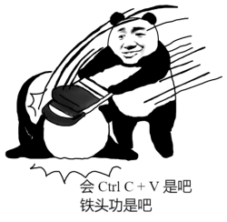

前端都在聊什么 - 第 4 期
===

> Create by **jsliang** on **2023-02-26 21:12:08**  
> Recently revised in **2023-03-05 16:32:27**

Hello 小伙伴们早上、中午、下午、晚上、深夜好，我是爱折腾的 **jsliang**~

「**前端都在聊什么**」是 **jsliang** 日常写文章/做视频/玩直播过程中，小伙伴们的提问以及我的解疑整理。

本文章视频同步：https://www.bilibili.com/video/BV1KM411s7RP/

本期对应 **2023.01.28** 当天直播间的粉丝互动。

主要内容是跟大三的小伙伴沟通他的前端实习规划。

对制定规划和初入职场这 2 点内容，提出自己的「浅薄」见解，希望对小伙伴们有所帮助。

你的 **关注** 和 **点赞** 是我持续更新的动力💖，谢谢大家~


```md
「2023-03-05 补充」

我终于知道为什么我这篇破文章迟迟写不下去了！

因为我怕文章内容没有实质，没啥作用，让人嫌弃。

这 2 天静下心来仔细想了下：

正如 2018 年和 2020 年迷茫的我，找不到工作时候的恍惚。

最近很多小伙伴咨询我找工作相关迷茫点，希望能给到帮助。

所以我的初衷，仍是通过唠嗑，能开解小伙伴们。

相信有人和你唠嗑与无唠嗑，是不同的 2 码事。
```

## 一 背景分析

小伙伴 **大三在校**，希望找一份 **比较好的前端实习**。

当前就读于湖南，所以 **优先考虑长沙**，不行的话可能去 **江浙和广深**。

长沙预期薪资是 **5-7k**，江浙预期是 **7-9k**。


小伙伴计划是通过 React 写前台系统，Vue 写管理后台，配合工具类小程序，服务端用 Node.js 写。

最终在 7 月份（即大三下学期左右找到工作）

小伙伴的问题点在于：

1. 不知道该做什么样的项目
2. 如何编写项目经历中重难点亮点

聆听完小伙伴的想法，我也陷入沉思，怎样才能更好地帮助小伙伴定计划。


## 二 薪酬分析

**jsliang** 的大学是失败的，毕业季那会也是被迫去找了个工作应付学校任务。

所以那天在招聘网站上查找，也是才知道实习生的工资是算日薪的。

小伙伴的日薪，大概要求是 ￥250-350 之间。

* 长沙方面，小伙伴希望日薪 ￥250+，但是这边薪酬 ￥100-200 居多
* 江浙这边，小伙伴希望日薪 ￥350+，但是这边薪酬 ￥200-300 居多

所以这种情况下，小伙伴可能就要做到比其他实习生优秀，要不然找不到高薪酬的实习岗位。


## 三 竞争分析

面对这种可能会存在时间不够的问题，我们应当有所节俭，做一个精挑细选的人。

所以，在学历、学龄相仿的情况下，我们如何打败同届小伙伴。

这种情况下，**jsliang** 有自己的「小歪理」：当我们打败 70% 的小伙伴，我们就可以心安了。

* **打败 30% 的小伙伴**：当我们有意识去提升自己的时候，其实已经甩掉一部分沉迷游戏以及学业和生活的小伙伴了。
* **打败 70% 的小伙伴**：当我们针对一项技能去制持之以恒地提升自我地时候，我们已经开始逐步超越一批又一批的小伙伴，并且随着时间沉淀，我们的优势越发明显。


> 不要想着打败剩下 30% 的人，我们的目标仅仅是比普通人更好一点

所以，对于同届小伙伴来说，我们要打造自己的优势，那么光只靠熟悉各种语言的 Hello World 是不够的。

对此，我们应该有侧重点。

### 3.1 起步：立项

**天才第一步，立项起好步**。

很多小伙伴在关于「不做立项」和「不懂做立项」这边，把自己卡死了。

上面我们说过，小伙伴的想法是好的：

* 计划是通过 React 写前台系统，Vue 写管理后台，配合工具类小程序，服务端用 Node.js 写。

但是这样，只能让我们成为普通大众中，只会写 Ctrl C + V 的，并没有比较好的优势。



所以，我们可以尝试，就大佬们工作中碰到困难的项目开头，去尝试复刻和解决问题。

这边建议去看看知乎一个比较热门的话题，叫：

* [作为前端，工作中处理过什么复杂的需求，如何解决的？](https://www.zhihu.com/question/362103682)

在认知和了解自己倾向于挑战哪个项目之后，我们就可以准备立项，编写一份适合自己的 README.md 了。

因为代码大家都会写，但是到和别人表达的时候，如果你给别人的感觉是思路乱糟糟的，那也是不行的。

> 写好 README 算不算一个小亮点呢？

下面是和小伙伴沟通的时候，现场写的一份「简陋」README。

```md
XXX 项目开发
===

## 一、立项

* 为什么要选这个项目
* 其中的重难点会有哪些
* TODO: 我在开发这个项目中的亮点
  * 比如：对自己的处理能力的提升
  * 比如：项目带来的惊喜

## 二、开发

### 2.1 前端界面如何开发

先实现项目初始化部署：

* 创建项目步骤
* 为什么对一些代码做了处理
* 代码构建流程这块做了什么优化
* 代码业务方面做了什么优化

当然，这里不需要对细节讲清楚

而是说对于一些内容处理有备注，尤其是个人认为的 “关键点”

只有对问题进行记录，才有可能在回顾中，进一步挖掘项目重难点

这样我们在讲项目的时候，我们有内容可以讲

而不是说，在面试的之前，才想起去看代码

这时候就是年三十回家养猪 —— 晚了

在第一份经验上，一定要记录，一定要认真对待

### 2.2 服务如何开发

同上。

## 三、反思

### 3.1 做这个项目的评估反思

对于不同模块，不同知识点，如何做恰当的评估

### 3.2 做这个项目中的前端反思

1. 我发现的问题是哪些（在第二步的时候，就记录到这里）
2. 我的处理方式，后续弥补

### 3.3 做这个项目的服务端反思

同上。

### 3.4 其他

随便写写

## 四、总结

对于项目整体，我的思考，以及庆祝。
```

### 3.2 深研：优化

**矮个子里拔将军**

当学历一致、阅历一致，如何让「尊贵的面试官」认为你适合来和他们一起共事？

很多时候，写代码的能力大家都有，但是解决问题的能力，不一定所有人都有。

同样一个积木，大家都会搭建，但是当缺少了一个积木零件，或者这个积木中有零件坏掉的时候。

谁能把它搞定，你应该怎么去搞定它？

1. 自己造一个积木零件（自己去解决这个问题，从 0 开始） —— 100 分
2. 要么自己偷一个积木零件（Ctrl C + V，然后修改，从 0.5 开始） —— 50 分
3. 要么自己找回来这个积木零件（从 1 开始，但是靠运气） —— 0 分

相当于大家都在项目中碰到这个问题，你是怎么解决的，为什么这么解决。

你一定要有一个亮点，让面试官真的眼前一亮。


而这个亮点，就体现在你解决问题当中，而不是你写项目过程中。

通俗一点：

同样的 HTML5、CSS3 和 JavaScript，那么你拿什么来超越同届？

这时候你说你懂前端工程化，有玩过 Webpack、Vite（Rollup） 这些，你可能同其他小伙伴等同了。

但是当你知道怎么这些自动化工具，对于处理 React、Vue 流程是怎样的，他们打包构建流程是怎样的，怎么去编写插件等，那你的优势「又」提升了一点点。

最后，你通过工程化，将打包 1 M 左右的代码，压缩到 100 k 左右……

这时候，你的优势，是不是就起来了~

### 3.3 扩展：Node.js

**压倒其他小伙伴的最后一根稻草**。


其实现在大部分培训班都会讲解 Node.js 等相关内容。

所以小伙伴们，不仅仅要去学习了解这块。

更应该拓宽下视野，通过计算机网络、算法以及数据结构和设计模式等方面，来帮助自己提升 Node.js 服务相关技能。

小结，通过这 3 步，我们扩大了相关优势，这样被录用的概率会大大提升。

同时，我们项目有比较好的重难点以及亮点来跟面试官沟通。

所以，我们的项目，要 **能用上**，而不单单只是一个 Demo。

### 3.4 扩展：需求评估

假设有这么个需求：

* 在某宝上，商家上传了图片，突然发现图片有点小瑕疵，手头没 PS 等工具，想直接处理，希望浏览器能提供处理工具。

领导将这个任务丢给你，你的想法是怎样的，预估多久完成？


—— 说到排期这一步，**jsliang** 确实比不上一些大佬，但是它切切实实是个有用的技能，也是工作中的一个亮点。

举例：

你刚开始对接工作的时候，在 A 模块，花了 3 天时间完成了。

那么对于尚未开始的 B 模块，你是否可以套用 A 模块的耗时以及经验积累，来评估出 B 模块的时间。

领导安排一个任务下来：

* 假设，你还 **没接触过**：“那我先花 1-2 天看看总体细节规划，然后和领导说一下我的排期想法。”
* 假设，如果 **你接触过**：“那我直接给到排期，它参考了 XX 模块的开发时间，所以才会定这么一个排期。”

当我们有意识的积累这块经验，那么你在后续开发的时候，就能有所启发。

如果一个任务出现问题：

* 预期：A 模块 -> B 模块，经验直接同步过来，这叫预期
* 意外：A 模块 -> B 模块，发现排期漏了一个点，这叫意外

针对这种意外，你的临场发挥能力是怎样的？

你是加班加点搞定，还是说和产品、测试商量，将排期往后推？

这些点，在我们对自己立项的 Demo 开发工程中，我们如果有所积累，那么就是一种良好的拓展。

这，也是你实习面试时候的一个亮点。

---

**不折腾的前端，和咸鱼有什么区别！**

觉得文章不错的小伙伴欢迎点赞/点 Star。

如果小伙伴需要联系 **jsliang**：

* [Github](https://github.com/LiangJunrong/document-library)
* [掘金](https://juejin.im/user/3403743728515246)

个人联系方式存放在 Github 首页，欢迎一起折腾~

争取打造自己成为一个充满探索欲，喜欢折腾，乐于扩展自己知识面的终身学习斜杠程序员。

> jsliang 的文档库由 [梁峻荣](https://github.com/LiangJunrong) 采用 [知识共享 署名-非商业性使用-相同方式共享 4.0 国际 许可协议](http://creativecommons.org/licenses/by-nc-sa/4.0/) 进行许可。<br/>基于 [https://github.com/LiangJunrong/document-library](https://github.com/LiangJunrong/document-library) 上的作品创作。<br/>本许可协议授权之外的使用权限可以从 [https://creativecommons.org/licenses/by-nc-sa/2.5/cn/](https://creativecommons.org/licenses/by-nc-sa/2.5/cn/) 处获得。
