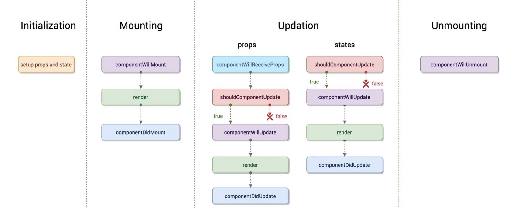
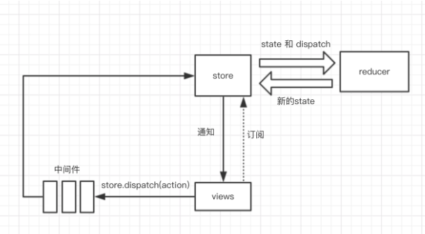
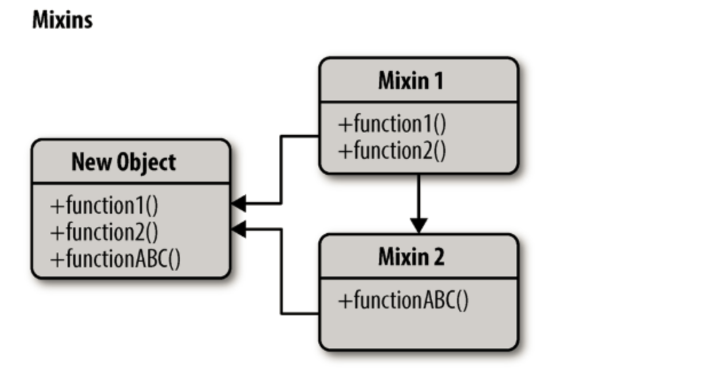

React
===

> Create by **jsliang** on **2020-09-02 15:28:53**  
> Recently revised in **2020-10-25 22:45:51**

<!-- 目录开始 -->
## <a name="chapter-one" id="chapter-one"></a>一 目录

**不折腾的前端，和咸鱼有什么区别**

| 目录 |
| --- |
| [一 目录](#chapter-one) |
| <a name="catalog-chapter-two" id="catalog-chapter-two"></a>[二 前言](#chapter-two) |
| <a name="catalog-chapter-three" id="catalog-chapter-three"></a>[三 知识点](#chapter-three) |
| <a name="catalog-chapter-four" id="catalog-chapter-four"></a>[四 前端历史演进](#chapter-four) |
| <a name="catalog-chapter-five" id="catalog-chapter-five"></a>[五 React 相比原生的好处](#chapter-five) |
| <a name="catalog-chapter-six" id="catalog-chapter-six"></a>[六 React 和 Vue 比对](#chapter-six) |
| &emsp;[6.1 相同之处](#chapter-six-one) |
| &emsp;[6.2 不同之处](#chapter-six-two) |
| <a name="catalog-chapter-seven" id="catalog-chapter-seven"></a>[七 React Fiber](#chapter-seven) |
| <a name="catalog-chapter-eight" id="catalog-chapter-eight"></a>[八 React 生命周期](#chapter-eight) |
| &emsp;[8.1 版本 之前](#chapter-eight-one) |
| &emsp;[8.2 版本 之后](#chapter-eight-two) |
| &emsp;&emsp;[8.2.1 挂载阶段](#chapter-eight-two-one) |
| &emsp;&emsp;[8.2.2 更新阶段](#chapter-eight-two-two) |
| &emsp;&emsp;[8.2.3 卸载阶段](#chapter-eight-two-three) |
| <a name="catalog-chapter-night" id="catalog-chapter-night"></a>[九 setState](#chapter-night) |
| &emsp;[9.1 调用 setState 之后发生了什么？](#chapter-night-one) |
| &emsp;[9.2 setState 是同步还是异步？](#chapter-night-two) |
| <a name="catalog-chapter-ten" id="catalog-chapter-ten"></a>[十 React this 问题](#chapter-ten) |
| <a name="catalog-chapter-eleven" id="catalog-chapter-eleven"></a>[十一 受控组件和非受控组件](#chapter-eleven) |
| <a name="catalog-chapter-twelve" id="catalog-chapter-twelve"></a>[十二 组件通讯](#chapter-twelve) |
| <a name="catalog-chapter-thirteen" id="catalog-chapter-thirteen"></a>[十三 Redux](#chapter-thirteen) |
| <a name="catalog-chapter-fourteen" id="catalog-chapter-fourteen"></a>[十四 Mixin、HOC 和 Hook](#chapter-fourteen) |
| &emsp;[14.1 Mixin](#chapter-fourteen-one) |
| &emsp;[14.2 高阶组件（HOC）](#chapter-fourteen-two) |
| &emsp;[14.3 Hook](#chapter-fourteen-three) |
| <a name="catalog-chapter-fifteen" id="catalog-chapter-fifteen"></a>[十五 性能优化](#chapter-fifteen) |
| <a name="catalog-chapter-sixteen" id="catalog-chapter-sixteen"></a>[十六 参看文献](#chapter-sixteen) |
| &emsp;[16.1 面试知识点](#chapter-sixteen-one) |
| &emsp;[16.2 系统](#chapter-sixteen-two) |
| &emsp;[16.3 React 和 Vue 比对](#chapter-sixteen-three) |
| &emsp;[16.4 生命周期](#chapter-sixteen-four) |
| &emsp;[16.5 受控组件和非受控组件](#chapter-sixteen-five) |
| &emsp;[16.6 Diff 和 虚拟 DOM](#chapter-sixteen-six) |
| &emsp;[16.7 React 源码](#chapter-sixteen-seven) |
| &emsp;[16.8 React Mixin](#chapter-sixteen-eight) |
| &emsp;[16.9 React Hoc](#chapter-sixteen-night) |
| &emsp;[16.10 React Hooks](#chapter-sixteen-ten) |
| &emsp;[16.11 React Fiber](#chapter-sixteen-eleven) |
| &emsp;[16.12 服务端渲染（SSR）](#chapter-sixteen-twelve) |
| &emsp;[16.13 性能优化](#chapter-sixteen-thirteen) |
| &emsp;[16.14 其他](#chapter-sixteen-fourteen) |
<!-- 目录结束 -->

## <a name="chapter-two" id="chapter-two"></a>二 前言

> [返回目录](#chapter-one)

React 也是现如今最流行的前端框架，也是很多大厂面试必备。

React 与 Vue 虽有不同，但同样作为一款 `MV*` 框架，虽然实现可能不一样，但在一些理念上还是有相似的，例如数据驱动、组件化、虚拟 DOM 等。

当然，还有一些问题，可能最近都没法搞清楚的了，毕竟罗马不是一天能建成的：

* [ ] React 的实现原理？有什么优缺点？

## <a name="chapter-three" id="chapter-three"></a>三 知识点

> [返回目录](#chapter-one)

* [x] 前端历史演进
* [x] React 和原生对比
  * [x] 组件化
  * [x] 天然分层
  * [x] 生态好
  * [x] 开发效率
* [x] React 和 Vue 对比
  * [x] 相同之处：虚拟 DOM、组件化、构建工具、配套框架、Chrome 开发工具
  * [x] 不同之处：模板 和 JSX、监听数据变化方式不同、Diff 不同
* [x] React Fiber
* [x] React 生命周期
  * [x] 挂载阶段：`constructor`、`getDerivedStateFromProps`、`render`、`componentDidMount`
  * [x] 更新阶段：`getDerivedStateFromProps`、`shouldComponentUpdate`、`render`、`getSnapshotBeforeUpdate`、`componentDidUpdate`
  * [x] 卸载阶段：`componentWillUnmount`
* [x] `setState`
  * [x] 调用之后发生什么
  * [x] 同步还是异步
* [x] this 指向问题
  * [x] 通过 `bind` 修正
  * [x] 通过箭头函数修正
  * [x] `bind` 和箭头函数的区别
* [x] 受控组件和非受控组件：`value` 和 `defaultValue`
* [x] 组件通讯
  * [x] `props`
  * [x] `Context`
  * [x] `Redux`
* [x] `Redux`：`Redux`、`React-Redux` 以及 `Redux-Saga` 工作流
* [x] `Mixin`、`HOC` 和 `Hook`
* [x] 性能优化
  * [x] 首屏渲染优化 `prerender-spa-plugin`
  * [x] 页面占位 `react-placeholder`
  * [x] 页面切换优化 `html-webpack-plugin`
  * [x] 减少业务体积代码 `Tree Shaking`
  * [x] 提取公共代码 `SplitChunkPlugin`
  * [x] 切分代码 `Code Splitting`
  * [x] 懒加载 `react-lazyload`

## <a name="chapter-four" id="chapter-four"></a>四 前端历史演进

> [返回目录](#chapter-one)

* **jQuery 时代**

通过 `Ajax` 从后端获取数据，然后通过 jQuery 生成 DOM 结果更新到页面中。

但是随着业务发展，项目越来越复杂，交互性越来越强，往往用户在某个时刻可能操作好几块内容，从而 DOM 的操作越来越频繁，页面性能逐步降低，用户也不满意这样卡慢的现状了。

* **MVVM**

这时候有了 MVVM，双向数据绑定让数据在修改的时候同步 DOM 的更新，反之亦可。

这个设定大大降低手动维护 DOM 的成本，而 MVVM 为 React 的特性之一，虽然 React 属于单项数据流，需要我们手动实现双向数据绑定。

* **虚拟 DOM**

光靠绑定是不够的，这样没法解决频繁操作 DOM 的问题。

所以 React 内部实现了一套虚拟 DOM 的更新，它将真实 DOM 在 JS 中做一套缓存，每次有数据更新的时候，先内部通过 `Diff` 算法进行比对，然后收集一箩筐更新后，才对 DOM 进行更新，这样就大大降低了 DOM 的操作次数。

* **Diff 运作**

那么，`Diff` 怎么运作呢？

`Diff` 获取虚拟 DOM 节点变更的 4 种情况比较：节点类型变了、节点类型一样，仅仅属性或者属性值变了、文本变了、增加、删除或者移动了子节点。

* **setState**

React 不同于 Vue，可以通过 `v-model` 的形式，让用户的操作和 JavaScript 存储的数据同步更新，它需要通过 `setState` 来更新组件内容。

* **Redux**

但是，如果想通过一个组件来渲染它兄弟组件，React 一开始在这块做得并不是那么好，所以就需要引入一个状态管理中心，来帮助我们管理状态（`state`），因而就有了 `Redux`。

在 `Redux` 中，当 `state` 有变化的时候，依赖这个 `state` 的组件就会重新渲染，这样就解决了组件间数据传递的问题。

* **Mobx**

`Redux` 有个问题，就是修改某个 `state` 的时候，需要经过 `action.js`、`types.js`、`reducers.js` 这一系列文件，这样子 `Redux` 的数据流虽然非常正规，但是写起来复杂啊。

所以，社区又出现了另一套解决方案，也就是 `Mobx`。

`Mobx` 推崇代码简约移动，只需要定义一个可贯彻的对象，然后在哪个组件中使用到了这个可观察对象，并且这个对象的数据有更改，那就会重新渲染，这使得 `Mobx` 开发项目的时候可以简单快速地完成很多功能。

但是 `Mobx` 也有缺点，就是数据流太过随意，出了 Bug 不好定位。

* **End**

所以，针对于小项目来说，社区推荐使用 MobX，对大项目推荐使用 Redux。


## <a name="chapter-five" id="chapter-five"></a>五 React 相比原生的好处

> [返回目录](#chapter-one)

* **组件化**: 其中以 React 的组件化最为彻底，甚至可以到函数级别的原子组件，高度的组件化可以是我们的工程易于维护、易于组合拓展。
* **天然分层**: JQuery 时代的代码大部分情况下是面条代码，耦合严重，现代框架不管是 MVC、MVP 还是 MVVM 模式都能帮助我们进行分层，代码解耦更易于读写。
* **生态**: 现在主流前端框架都自带生态，不管是数据流管理架构还是 UI 库都有成熟的解决方案。
* **开发效率**: 现代前端框架都默认自动更新 DOM，而非我们手动操作，解放了开发者的手动 DOM 成本，提高开发效率，从根本上解决了 UI 与状态同步问题.

## <a name="chapter-six" id="chapter-six"></a>六 React 和 Vue 比对

> [返回目录](#chapter-one)

### <a name="chapter-six-one" id="chapter-six-one"></a>6.1 相同之处

> [返回目录](#chapter-one)

1. **虚拟 DOM**。映射真实 DOM，通过新旧 DOM 的 diff 对比，更好的跟踪渲染页面。
2. **组件化**。将应用拆分成一个个功能明确的模块，每个模块之间可以通过合适的方式互相联系。
3. **构建工具**。都有自己的构建工具，通过 `Webpack` + `Babel` 去搭建脚手架。
4. **Chrome 开发工具**。两者都有很好的 Chrome 扩展去帮助查找 Bug。
5. **配套框架**。Vue 有 `Vue-router` 和 `Vuex`，而 React 有 `React-router` 和 `React-Redux`。

### <a name="chapter-six-two" id="chapter-six-two"></a>6.2 不同之处

> [返回目录](#chapter-one)

1. **模板 VS JSX**。Vue 推荐编写近似常规 `HTML` 的模板进行渲染，而 React 推荐 JSX 的书写方式。
2. **监听数据变化的不同**。Vue 使用的是可变数据，而 React 更强调数据的不可变。在 Vue 中通过 `v-model` 绑定的数据，用户改变输入值后对应的值也相应改变。而 React 需要通过 `setState` 进行设置变化。
3. **Diff 不同**。Vue 通过双向链表实现边对比边更新 DOM，而 React 通过 `Diff` 队列保存需要更新的 DOM，得到 `patch` 树，再统一批量更新 DOM。
4. **开发团队**。Vue 一开始核心就是 Evan You，后面再招了其他人组成团队；React 的话是一开始就是 Facebook 团队搞的。所以网上的人比对源码情况的话，Vue 的比 React 的简单易懂点。

## <a name="chapter-seven" id="chapter-seven"></a>七 React Fiber

> [返回目录](#chapter-one)

React 的核心流程可以分为两个部分:

* `reconciliation` (调度算法，也可称为 `render`):
  * 更新 `state` 与 `props`
  * 调用生命周期钩子
  * 生成虚拟 DOM
  * 通过新旧 VDOM 进行 `diff` 算法，获取 VDOM `change`
  * 确定是否需要重新渲染
* `commit`
  * 如需要，则操作 DOM 节点更新；

为什么需要 `Fiber`？

随着应用变得越来越庞大，整个更新渲染的过程开始变得吃力，大量的组件渲染会导致主进程长时间被占用，导致一些动画或高频操作出现卡顿和掉帧的情况。

而关键点，便是 **同步阻塞**。

在之前的调度算法中，React 需要实例化每个类组件，生成一颗组件树，使用 **同步递归** 的方式进行遍历渲染，而这个过程最大的问题就是无法 **暂停和恢复**。

所以，为了解决这个问题（同步阻塞），通常有两种方法: **异步** 与 **任务分割**。

而 `React Fiber` 便是为了实现任务分割而诞生的。

`React Fiber` 简述:

* 在 React 16 版本中将调度算法进行了重构， 将之前的 `stack reconciler` 重构成新版的 `fiber reconciler`，变成了具有链表和指针的 **单链表树遍历算法**。通过指针映射，每个单元都记录着遍历当下的上一步与下一步，从而使遍历变得可以被暂停和重启。
* 可以理解为是一种 任务分割调度算法，主要是将原先同步更新渲染的任务分割成一个个独立的 **小任务单位**，根据不同的优先级，将小任务分散到浏览器的空闲时间执行，充分利用主进程的事件循环机制。

`React Fiber` 核心：

* 可以具象为一个数据结构
* 链表树遍历算法
* 任务分割
* 分散执行
* 优先级策略

## <a name="chapter-eight" id="chapter-eight"></a>八 React 生命周期

> [返回目录](#chapter-one)

React 逐渐废弃的生命周期方法：

* `componentWillMount`
* `componentWillReceiveProps`
* `componentWillUpdate`

### <a name="chapter-eight-one" id="chapter-eight-one"></a>8.1 版本 之前

> [返回目录](#chapter-one)



### <a name="chapter-eight-two" id="chapter-eight-two"></a>8.2 版本 之后

> [返回目录](#chapter-one)


#### <a name="chapter-eight-two-one" id="chapter-eight-two-one"></a>8.2.1 挂载阶段

> [返回目录](#chapter-one)

* `constructor`：构造函数，最先被执行，通常在构造函数中初始化 `state` 对象或者给自定义方法绑定 `this`
* `getDerivedStateFromProps`：`static getDerivedStateFromProps(nextProps, prevState)`，这是个静态方法，当我们接收到新的属性想去修改我们 `state`，可以使用 `getDerivedStateFromProps`。
* `render`：`render` 函数是个纯函数，只返回需要渲染的东西，不应该包含其他的业务逻辑，可以返回原生 DOM、React 组件、`Fragment`、`Portals`、字符串和数字等内容。
* `componentDidMount`：组件装载之后调用，此时我们可以获取到 DOM 节点并操作，比如对 `Canvas`、`SVG` 等操作。服务器请求、订阅都可以写这个里面，但是记得在 `componentWillUnmount` 中取消订阅。

React 的接口请求是放在 `componentDidMount` 里面比较合适，旧版本有人放在 `componentWillMount` 里面，从而导致多次请求，现在 `componentWillMount` 不推荐使用了，所以转 `componentDidMount` 就非常科学了。

存在以下问题：

* 为什么 `getDerivedStateFromProps` 是静态的？

当它设置为静态函数，表明这个函数不能通过 `this` 访问到 `class` 的属性，也并不推荐直接访问属性。

* 哪些生命周期可以 `setState`？

可以在 `componentDidMount` 和 `componentDidUpdate` 中使用，此时 DOM 已经稳定下来了，可以进行数据的操作了。

#### <a name="chapter-eight-two-two" id="chapter-eight-two-two"></a>8.2.2 更新阶段

> [返回目录](#chapter-one)

* `getDerivedStateFromProps`：此方法在更新阶段也会被调用。
* `shouldComponentUpdate`：`shouldComponentUpdate(nextProps, nextState)`，有两个参数，表示新的属性和变化之后的 `state`，返回一个布尔值。如果是 `true` 表示会触发重新渲染，`false` 表示不会触发重新渲染，默认返回 `true`。可以利用这个生命周期来优化 React 程序性能。
* `render`：同挂载阶段 `render`。
* `getSnapshotBeforeUpdate`：`getSnapshotBeforeUpdate(prevProps, prevState)`，这个方法会在 `render` 之后，`componentDidUpdate` 之前调用，有两个参数，表示之前属性和之前的 `state`。这个函数有一个返回值，会作为第三个参数传给 `componentDidUpdate`，如果不需要返回值，可以返回 `null`，这个方法必须和 `componentDidUpdate` 配合使用。
* `componentDidUpdate`：`componentDidUpdate(prevProps, prevState, snapshot)`，在 `getSnapshotBeforeUpdate`
 之后调用，有三个参数，表示之前的 `props`，之前的 `state`，以及 `snapshot`。参数 `snapshot` 是 `getSnapshotBeforeUpdate` 返回的，如果触发某些回调函数时需要用到 `DOM` 元素的状态，则将对比或者计算过程迁移到 `getSnapshotBeforeUpdate`，然后在 `componentDidUpdate` 中统一触发回调或者更新状态。

#### <a name="chapter-eight-two-three" id="chapter-eight-two-three"></a>8.2.3 卸载阶段

> [返回目录](#chapter-one)

* `componentWillUnmount`：当组件被卸载或者销毁时会被调用，在这里清除定时器，或者取消网络请求，用来清理无效的 DOM 元素等垃圾回收工作。

## <a name="chapter-night" id="chapter-night"></a>九 setState

> [返回目录](#chapter-one)

`setState` 是 React 中用于修改状态，更新视图的方法。

### <a name="chapter-night-one" id="chapter-night-one"></a>9.1 调用 setState 之后发生了什么？

> [返回目录](#chapter-one)

在代码中调用 `setState` 之后，React 会将传入的参数对象与组件当前的状态合并，触发所谓的调和过程（`Reconciliation`）。

经过调和过程，React 会以相对高效的方式根据新的状态构建 React 元素树并且着手重新渲染整个 UI 界面。

在 React 得到元素树之后，React 会自动计算新树和老树之间的节点差异，然后根据差异对界面进行最小化重新渲染。

在差异计算算法（`Diff`）中，React 能够相对精确地知道哪些位置发生了改变以及英国如何改变，保证了按需更新，而不是全部重新渲染。

简单来说：

1. 合并参数对象，触发调和过程
2. 计算新树和老树差异（`Diff`）
3. 根据差异进行最小化重新渲染

### <a name="chapter-night-two" id="chapter-night-two"></a>9.2 setState 是同步还是异步？

> [返回目录](#chapter-one)

回答：有时候同步，有时候异步。

1. `setState` 在合成事件和钩子函数中是异步的，在原生事件和 `setTimeout` 是同步的。
2. `setState` 的异步，并不是说内部由异步代码实现，它本身执行的过程和代码是同步的，只是合成事件和钩子函数的调用顺序在更新之前，导致在合成事件和钩子函数中没法立马拿到更新后的值，从而形成了所谓的异步。
3. `setState` 可以通过第二个参数 `setState(partialState, callback)`，在回调方法中拿到更新后的结果。

## <a name="chapter-ten" id="chapter-ten"></a>十 React this 问题

> [返回目录](#chapter-one)

在 React 中有几种方法可以修正 `this` 的指向，这里例举 4 种方法：

```js
import React, { Component } from 'react'

class App extends Component {
  constructor (props) {
    super(props);
    this.handleClick = this.handleClick.bind(this);
  }
  handleClick () {
    console.log('jsliang 2020');
  }
  handleClick2 = () => {
    console.log('jsliang 2021');
  }
  render () {
    // 四种绑定方法
    return (
      <div className='App'>
        {/* 方法一：通过 constructor 中进行 bind 绑定 */}
        <button onClick={this.handleClick}>btn 1</button>

        {/* 方法二：在里边绑定 this */}
        <button onClick={this.handleClick.bind(this)}>btn 2</button>

        {/* 方法三：通过箭头函数返回事件 */}
        <button onClick={() => this.handleClick()}>btn 3</button>
        
        {/* 方法四：让方法变成箭头函数 */}
        <button onClick={this.handleClick2}>btn 4</button>
        
        {/* 额外：直接调用不需要绑定 this */}
        {this.handleClick()}
      </div>
    )
  }
}

export default App;
```

那么，使用 `bind` 和箭头函数有什么区别吗？

箭头函数除了代码少，与普通函数最大的不同就是：`this` 是由声明该函数时候定义的，一般是隐性定义为声明该函数时的作用域 `this`。

通过 `bind` 的话，相当于：`Foo.prototype.a = function() {}`，是通过原型链的一个指正绑定。

而通过箭头函数的话，就相当于：

```js
class Foo {
  constructor() {
    this.a = () => {};
  }
}
```

## <a name="chapter-eleven" id="chapter-eleven"></a>十一 受控组件和非受控组件

> [返回目录](#chapter-one)

在 `Ant Design` 中，对 `Input` 输入框进行操作，如果是改变 `defaultValue` 会发现毫无作用。

这是因为 React 的 `form` 表单组件中的 `defaultValue` 一经传递值后，后续改变 `defaultValue` 都将不起作用，被忽略了。

具体来说这是一种 React 非受控组件，其状态是在 `input` 的 React 内部控制，不受调用者控制。

所以受控组件就是可以被 React 状态控制的组件。双向数据绑定就是受控组件，你可以为 `form` 中某个输入框添加 `value` 属性，然后控制它的一个改变。而非受控组件就是没有添加 `value` 属性的组件，你并不能对它的固定值进行操作。

## <a name="chapter-twelve" id="chapter-twelve"></a>十二 组件通讯

> [返回目录](#chapter-one)

* **父组件向子组件通讯**：父组件向子组件传 `props` 方式，向子组件进行通讯。
* **子组件向父组件通讯**：父组件在 `props` 中传递方法，然后子组件调用这个方法，将自身需要传递的信息，传递到父组件的作用域中。
* **复杂点的通讯**：借助 React 的 `Context`，或者 `Redux` 进行数据通讯。

## <a name="chapter-thirteen" id="chapter-thirteen"></a>十三 Redux

> [返回目录](#chapter-one)

网上有挺多关于 `Redux`、`React-Redux`、`Redux-Saga` 的使用，这里就不废话介绍了，还是讲讲 **jsliang** 在工作中的一个使用吧。

> 工作目录

```
- 某个页面文件夹
   - View.jsx     当前页面主入口
   - Child.jsx    子组件
   - Brother.jsx  兄弟组件
   - action.js    动作
   - types.js     类型
   - saga.js      调用接口
   - reducers.js  处理数据
```

正常的一个工作目录如上所示，我们工作中是怎么个使用方式呢？

**首先**，在 `View.jsx` 中通过 `React-Redux` 连接 `React` 和 `Redux`

**然后**，假设现在 `Child.jsx` 需要调用接口（异步处理），那么会：

1. 在 `action.js` 中定义这个方法，会传递什么参数。
2. 其中 `types.js` 是辅助 `action.js` 的一个内容，为了防止方法体的重复，我们会在 `types.js` 中定义大写的 `action` 名字。
3. 这时候就可以在 `View.jsx` 中通过 `dispatch` 触发方法，例如 `dispatch(getPage(page, perPage))`。
4. 这时候，在 `reducers.js` 中和 `sage.js` 中都能监听到这个方法，但是我们是在 `sage.js` 中调用接口并处理数据。
5. 处理完毕之后，再将 `sage.js` 中的传递给 `reducers.js` 中，让它去处理数据。

**接着**，如果 `Brother.jsx` 只是单纯地想处理数据并在 `Child.jsx` 中使用，那么我们处理方式是跟上面一样的，只是直接在 `reducers.js` 中处理，而不需要再在 `sage.js` 中调用接口而已。

**最后**，我们再看看 `redux` 和 `react-reduxt` 的工作流程加深印象：

> Redux



> React-Redux


## <a name="chapter-fourteen" id="chapter-fourteen"></a>十四 Mixin、HOC 和 Hook

> [返回目录](#chapter-one)

前端发展速度非常之快，页面和组件变得越来越复杂，如何更好的实现 **状态逻辑复用** 一直都是应用程序中重要的一部分，这直接关系着应用程序的质量以及维护的难易程度。

`Mixin`、`HOC` 和 `Hook` 是 React 采用的 3 种 **状态逻辑复用** 的技术，`Mixin` 已被抛弃，`HOC` 正当壮年，`Hook` 初露锋芒，掌握它迭代因素和规律非常重要。

### <a name="chapter-fourteen-one" id="chapter-fourteen-one"></a>14.1 Mixin

> [返回目录](#chapter-one)

`Mixin`（混入）是一种通过扩展收集功能的方式，它本质上是将一个对象的属性拷贝到另一个对象上面去。

不过你可以拷贝任意多个对象的任意个方法到一个新对象上去，这是继承所不能实现的。

它的出现主要就是为了解决代码复用问题。



但是，它会带来一些危害：

* `Mixin` 相互依赖、相互耦合，不利于代码维护
* 不同的 `Mixin` 中的方法可能会互相冲突
* `Mixin` 非常多时，组件是可以感知到的，甚至还要为其做相关处理，这样给代码造成滚雪球式的复杂性。

### <a name="chapter-fourteen-two" id="chapter-fourteen-two"></a>14.2 高阶组件（HOC）

> [返回目录](#chapter-one)

基于 `Mixin` 的问题，React 推出对装饰模式的一种实现：高阶组件（`HOC`）。

高阶组件接收一个组件作为参数，并返回一个新的组件。

> 高阶组件（`HOC`）是 React 中的高级技术，用来重用组件逻辑。但高阶组件本身并不是 React API。它只是一种模式，这种模式是由 React 自身的组合性质必然产生的。

```js
function visible(WrappedComponent) {
  return class extends Component {
    render() {
      const { visible, ...props } = this.props;
      if (visible === false) return null;
      return <WrappedComponent {...props} />;
    }
  }
}
```

高阶组件可以应用于 日志打点、可用权限控制、双向绑定、表单校验等。

高阶组件解决了 `Mixin` 带来的问题：

* 低耦合。高阶组件就是一个没有副作用的纯函数，各个高阶组件不会互相依赖耦合
* 避免冲突。高阶组件也有可能造成冲突，但我们可以在遵守约定的情况下避免这些行为
* 副作用小。高阶组件并不关心数据使用的方式和原因，而被包裹的组件也不关心数据来自何处。高阶组件的增加不会为原组件增加负担

但是，有光的地方总有暗，高阶组件也存在一些缺陷：

* `HOC` 需要在原组件上进行包裹或者嵌套，如果大量使用 `HOC`，将会产生非常多的嵌套，这让调试变得非常困难。
* `HOC` 可以劫持 `props`，在不遵守约定的情况下也可能造成冲突。

### <a name="chapter-fourteen-three" id="chapter-fourteen-three"></a>14.3 Hook

> [返回目录](#chapter-one)

`Hook` 是 React `v16.7.0-alpha` 中加入的新特性。它可以让你在 `class` 以外使用 `state` 和其他 React 特性。

使用 `Hook`，你可以在将含有 `state` 的逻辑从组件中抽象出来，这将可以让这些逻辑容易被测试。

同时，`Hook` 可以帮助你在不重写组件结构的情况下复用这些逻辑。

所以，它也可以作为一种实现状态逻辑复用的方案。

`Hook` 使用带来的好处：

* **减少状态逻辑复用的风险**：`Hook` 和 `Mixin` 在用法上有一定的相似之处，但是 `Mixin` 引入的逻辑和状态是可以相互覆盖的，而多个 `Hook` 之间互不影响，这让我们不需要在把一部分精力放在防止避免逻辑复用的冲突上。
* **避免地狱式嵌套**：大量使用 `HOC` 的情况下让我们的代码变得嵌套层级非常深，使用 `Hook`，我们可以实现扁平式的状态逻辑复用，而避免了大量的组件嵌套。
* **让组件更容易理解**：在使用 `class` 组件构建我们的程序时，他们各自拥有自己的状态，业务逻辑的复杂使这些组件变得越来越庞大，各个生命周期中会调用越来越多的逻辑，越来越难以维护。使用 `Hook`，可以让你更大限度的将公用逻辑抽离，将一个组件分割成更小的函数，而不是强制基于生命周期方法进行分割。
* **使用函数代替 class**：相比函数，编写一个 `class` 可能需要掌握更多的知识，需要注意的点也越多，比如 `this` 指向、绑定事件等等。另外，计算机理解一个函数比理解一个 `class` 更快。`Hooks` 让你可以在 `class` 之外使用更多 React 的新特性。

## <a name="chapter-fifteen" id="chapter-fifteen"></a>十五 性能优化

> [返回目录](#chapter-one)

1. **首屏渲染优化**。`<div id="root"> SVG </div>`，也可以使用插件 `prerender-spa-plugin` 插件进行首屏渲染。
2. **页面切换优化**。使用 `html-webpack-plugin` 插件自动插入 `loading`，这样切换的时候，就不需要在每个页面都写一套 `loading`。
3. **减少业务代码体积**。通过 `Tree Shaking` 来减少一些代码。
4. **提取公共代码**。通过 `SplitChunkPlugin` 自动拆分业务基础库，减少大文件的存在。
5. **切分代码**。通过 `Code Splitting` 来懒加载代码，提高用户的加载体验。例如通过 `React Loadable` 来将组件改写成支持动态 `import` 的形式。
6. **懒加载**。React 可以通过 `react-lazyload` 这种成熟组件来进行懒加载的支持。
7. **页面占位**。有时候加载页面的文本、图片的时候，会出现 “闪屏” 的情况，比如图片或者文字没有加载完毕，对应位置空白，然后加载完毕，会突然撑开页面，导致闪屏。这时候使用第三方组件 `react-placeholder` 可以解决这种情况。

## <a name="chapter-sixteen" id="chapter-sixteen"></a>十六 参看文献

> [返回目录](#chapter-one)

本系列有 67 篇参考文献。

### <a name="chapter-sixteen-one" id="chapter-sixteen-one"></a>16.1 面试知识点

> [返回目录](#chapter-one)

**2019**：

* [x] [2019年17道高频React面试题及详解](https://juejin.im/post/5d5f44dae51d4561df7805b4)【阅读建议：1h】

**2018**:

* [x] [关于React面试题汇总](https://juejin.im/post/6844903620664623111)【阅读建议：5min】
* [x] [常见react面试题汇总（适合中级前端）](https://segmentfault.com/a/1190000016885832)【阅读建议：20min】

**2017**：

* [x] [React 常用面试题目与分析](https://zhuanlan.zhihu.com/p/24856035#tipjar)【阅读建议：5min】

### <a name="chapter-sixteen-two" id="chapter-sixteen-two"></a>16.2 系统

> [返回目录](#chapter-one)

* [x] [React技术揭秘](https://react.iamkasong.com/)【阅读建议：无】
* [x] [(中篇)中高级前端大厂面试秘籍，寒冬中为您保驾护航，直通大厂](https://juejin.im/post/6844903801153945608)【阅读建议：30min】

**2017**：

* [x] [从零搭建React全家桶框架教程](https://github.com/brickspert/blog/issues/1)【阅读建议：无】

### <a name="chapter-sixteen-three" id="chapter-sixteen-three"></a>16.3 React 和 Vue 比对

> [返回目录](#chapter-one)

**2020**：

* [x] [Vue和React的区别，你在用哪个呢？](https://developer.51cto.com/art/202009/626000.htm)【阅读建议：10min】
* [x] [你不知道的React 和 Vue 的20个区别【面试必备】](https://juejin.im/post/6847009771355127822)

**2017**：

* [x] [Vue与React两个框架的区别和优势对比](http://caibaojian.com/vue-vs-react.html)【阅读建议：10min】

### <a name="chapter-sixteen-four" id="chapter-sixteen-four"></a>16.4 生命周期

> [返回目录](#chapter-one)

**最新**：

* [x] [React 生命周期查看](https://projects.wojtekmaj.pl/react-lifecycle-methods-diagram/)【阅读建议：10min】

**2019**：

* [x] [React 的生命周期变化](https://juejin.im/post/6844904005152276487)【阅读建议：5min】
* [x] [React生命周期](https://juejin.im/post/6844903842430074893)【阅读建议：5min】

**2018**：

* [x] [React v16.3 版本新生命周期函数浅析及升级方案](https://juejin.im/post/6844903600309665799)【阅读建议：20min】

**2017**：

* [x] [深入React的生命周期(上)：出生阶段(Mount)](https://zhuanlan.zhihu.com/p/30757059)【阅读建议：无】
* [x] [深入React的生命周期(下)：更新(Update)](https://zhuanlan.zhihu.com/p/30971608)【阅读建议：无】

### <a name="chapter-sixteen-five" id="chapter-sixteen-five"></a>16.5 受控组件和非受控组件

> [返回目录](#chapter-one)

**2019**：

* [x] [react的受控组件和非受控组件](https://www.jianshu.com/p/c4fb11f42252)

**2016**：

* [x] [浅谈react受控组件与非受控组件](https://www.cnblogs.com/wonyun/p/6023363.html)

### <a name="chapter-sixteen-six" id="chapter-sixteen-six"></a>16.6 Diff 和 虚拟 DOM

> [返回目录](#chapter-one)

**2019**：

* [x] [让虚拟DOM和DOM-diff不再成为你的绊脚石](https://juejin.im/post/6844903806132568072)【阅读建议：20min】

**2018**：

* [x] [深入框架本源系列 —— Virtual Dom](https://juejin.im/post/6844903615652610055)【阅读建议：30min】
* [x] [浅入浅出图解 Dom Diff](https://juejin.im/post/5ad550f06fb9a028b4118d99)【阅读建议：30min】
* [x] [探索Virtual DOM的前世今生](https://zhuanlan.zhihu.com/p/35876032)【阅读建议：30min】
* [x] [你不知道的Virtual DOM系列](https://segmentfault.com/a/1190000016129036)【阅读建议：20min】

**2017**：

* [x] [React 源码剖析系列 － 不可思议的 react diff](https://zhuanlan.zhihu.com/p/20346379)【阅读建议：30min】
* [x] [你真的了解React吗（上）如何设计组件以及重要的生命周期](https://zhuanlan.zhihu.com/p/27828773)【阅读建议：无】

**2015**：

* [x] [深度剖析：如何实现一个 Virtual DOM 算法](https://github.com/livoras/blog/issues/13)【阅读建议：无】

### <a name="chapter-sixteen-seven" id="chapter-sixteen-seven"></a>16.7 React 源码

> [返回目录](#chapter-one)

**2018**：

* [x] [怎样学习React？当然是自己动手实现一个React啦](https://juejin.im/post/6844903593078685709)【阅读建议：无】
* [x] [《React源码解析》系列完结！](https://juejin.im/post/6844903568487497741?utm_medium=fe&utm_source=weixinqun)【阅读建议：无】
* [x] [精读《用160行js代码实现一个React》](https://juejin.im/post/6844903613270065159)【阅读建议：无】

**2017**：

* [x] [React 源码解析](https://zhuanlan.zhihu.com/p/28697362)【阅读建议：无】
* [x] [React源码解析(三):详解事务与更新队列](https://juejin.im/post/6844903511478697998)【阅读建议：无】
* [x] [React-Redux源码分析](https://juejin.im/post/6844903498346135565)【阅读建议：无】
* [x] [源码看React setState漫谈（一）](https://segmentfault.com/a/1190000011170740)【阅读建议：无】
* [x] [源码看React setState漫谈（二）](https://segmentfault.com/a/1190000011184268)【阅读建议：无】
* [x] [Mobx 思想的实现原理，及与 Redux 对比](https://zhuanlan.zhihu.com/p/25585910)【阅读建议：无】

**2015**：

* [x] [React 源码剖析系列 － 生命周期的管理艺术](https://zhuanlan.zhihu.com/p/20312691)【阅读建议：无】
* [x] [React 源码剖析系列 － 玩转 React Transition](https://zhuanlan.zhihu.com/p/20419592)【阅读建议：无】

### <a name="chapter-sixteen-eight" id="chapter-sixteen-eight"></a>16.8 React Mixin

> [返回目录](#chapter-one)

**2015**：

* [x] [React Mixin 的前世今生](https://zhuanlan.zhihu.com/p/20361937)【阅读建议：无】

### <a name="chapter-sixteen-night" id="chapter-sixteen-night"></a>16.9 React Hoc

> [返回目录](#chapter-one)

**2019**：

* [x] [React 中的高阶组件及其应用场景](https://juejin.im/post/6844903782355042312)【阅读建议：40min】

**2017**：

* [x] [React 高阶组件(HOC)入门指南](https://juejin.im/post/5914fb4a0ce4630069d1f3f6)【阅读建议：10min】
* [x] [深入理解 React 高阶组件](https://zhuanlan.zhihu.com/p/24776678)【阅读建议：10min】

### <a name="chapter-sixteen-ten" id="chapter-sixteen-ten"></a>16.10 React Hooks

> [返回目录](#chapter-one)

**2019**：

* [x] [【React深入】从Mixin到HOC再到Hook](https://juejin.im/post/5cad39b3f265da03502b1c0a)【阅读建议：30min】
* [x] [useEffect 完整指南](https://overreacted.io/zh-hans/a-complete-guide-to-useeffect/)【阅读建议：无】
* [x] [React Hooks 原理](https://github.com/brickspert/blog/issues/26)【阅读建议：30min】
* [x] [React Hooks 详解 【近 1W 字】+ 项目实战](https://juejin.im/post/5dbbdbd5f265da4d4b5fe57d)【阅读建议：3h】

**2018**：

* [x] [30分钟精通React今年最劲爆的新特性——React Hooks](https://segmentfault.com/a/1190000016950339)【阅读建议：30min】

### <a name="chapter-sixteen-eleven" id="chapter-sixteen-eleven"></a>16.11 React Fiber

> [返回目录](#chapter-one)

**2018**：

* [x] [完全理解React Fiber](http://www.ayqy.net/blog/dive-into-react-fiber/)【阅读建议：20min】
* [x] [React Fiber架构](https://juejin.im/entry/6844903608308236296)【阅读建议：20min】
* [x] [React Fiber 架构介绍资料汇总](https://segmentfault.com/a/1190000012834204)【阅读建议：20min】

### <a name="chapter-sixteen-twelve" id="chapter-sixteen-twelve"></a>16.12 服务端渲染（SSR）

> [返回目录](#chapter-one)

* [x] [从头开始，彻底理解服务端渲染原理(8千字汇总长文)](https://juejin.im/post/6844903881390964744)【阅读建议：2h】

### <a name="chapter-sixteen-thirteen" id="chapter-sixteen-thirteen"></a>16.13 性能优化

> [返回目录](#chapter-one)

**2019**：

* [x] [React 最佳实践](https://segmentfault.com/a/1190000018107137)【阅读建议：20min】

**2018**：

* [x] [React 16 加载性能优化指南](https://mp.weixin.qq.com/s/XSvhOF_N0VbuOKStwi0IYw)【阅读建议：20min】
* [x] [React中型项目的优化实践](https://juejin.im/post/6844903619913842696)【阅读建议：10min】

**2017**：

* [x] [如何提高你的 React 应用的性能](https://juejin.im/post/6844903518826938382)【阅读建议：10min】
* [x] [将 React 应用优化到 60fps](https://zhuanlan.zhihu.com/p/24959748)【阅读建议：5min】

### <a name="chapter-sixteen-fourteen" id="chapter-sixteen-fourteen"></a>16.14 其他

> [返回目录](#chapter-one)

**2019**：

* [x] [styled-components:前端组件拆分新思路](https://juejin.im/post/6844903878580764686)【阅读建议：5min】

**2018**：

* [x] [组件库设计实战 - 复杂组件设计](https://zhuanlan.zhihu.com/p/29034015)【阅读建议：无】
* [x] [前端数据校验从建模开始](https://juejin.im/post/6844903667414335501)【阅读建议：20min】
* [x] [React 应用设计之道 - curry 化妙用](https://zhuanlan.zhihu.com/p/35833143)【阅读建议：20min】
* [x] [如何评价React的新功能Time Slice 和Suspense？](https://www.zhihu.com/question/268028123)【阅读建议：20min】
* [x] [如何写出更好的 React 代码？](https://juejin.im/post/6844903600989143054)【阅读建议：20min】
* [x] [React ref 的前世今生](https://zhuanlan.zhihu.com/p/40462264)【阅读建议：20min】
* [x] [你真的理解setState吗？](https://zhuanlan.zhihu.com/p/39512941)【阅读建议：10min】
* [x] [【译】通过Recompose库掌握React函数组件](https://juejin.im/entry/6844903662209204237)【阅读建议：10min】
* [x] [还在用 Redux，要不要试试 GraphQL 和 Apollo](https://juejin.im/post/6844903607523868680)【阅读建议：5min】

**2017**：

* [x] [你真的了解React吗（中）组件间的通信以及React优化](https://zhuanlan.zhihu.com/p/27828866)【阅读建议：10min】

**2015**：

* [x] [React 源码剖析系列 － 解密 setState](https://zhuanlan.zhihu.com/p/20328570)【阅读建议：无】

---

> <a rel="license" href="http://creativecommons.org/licenses/by-nc-sa/4.0/"></a><br /><span xmlns:dct="http://purl.org/dc/terms/" property="dct:title">jsliang 的文档库</span> 由 <a xmlns:cc="http://creativecommons.org/ns#" href="https://github.com/LiangJunrong/document-library" property="cc:attributionName" rel="cc:attributionURL">梁峻荣</a> 采用 <a rel="license" href="http://creativecommons.org/licenses/by-nc-sa/4.0/">知识共享 署名-非商业性使用-相同方式共享 4.0 国际 许可协议</a>进行许可。<br />基于<a xmlns:dct="http://purl.org/dc/terms/" href="https://github.com/LiangJunrong/document-library" rel="dct:source">https://github.com/LiangJunrong/document-library</a>上的作品创作。<br />本许可协议授权之外的使用权限可以从 <a xmlns:cc="http://creativecommons.org/ns#" href="https://creativecommons.org/licenses/by-nc-sa/2.5/cn/" rel="cc:morePermissions">https://creativecommons.org/licenses/by-nc-sa/2.5/cn/</a> 处获得。