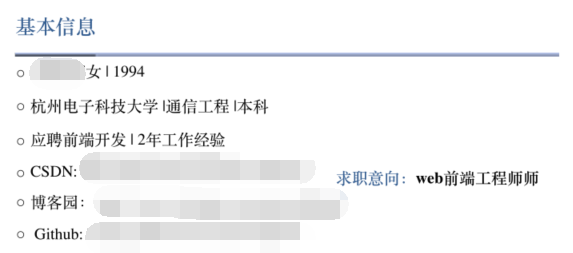
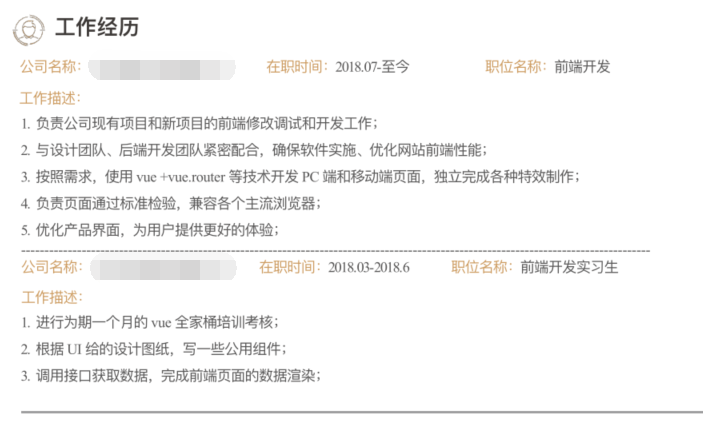
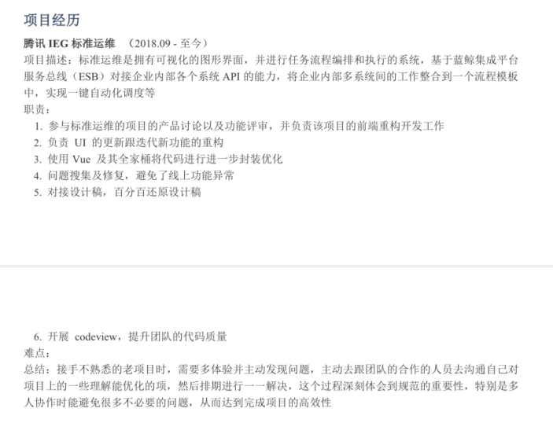
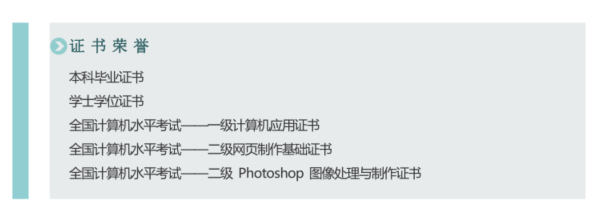
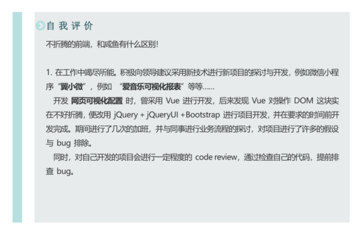
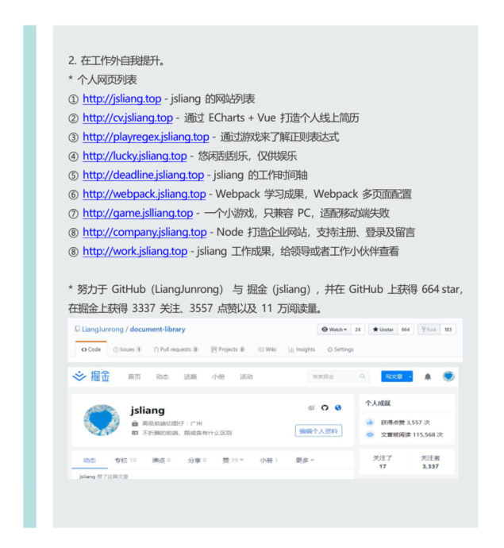

2019 简历
===

> Create by **jsliang** on **2019-6-15 07:23:40**  
> Recently revised in **2019-6-16 12:29:04**

**Hello 小伙伴们，如果觉得本文还不错，记得给个 **star**，或者关注一波公众号，每天进行折腾，保持自己的最高价值！[GitHub 地址](https://github.com/LiangJunrong/document-library)**


六月飞霜，对于现在毕业等于失业的广大应届生，或者各种原因出来了想找份 “好” 工作的大佬来说，这无疑是个尴尬的季节，大部分公司的坑位已经被占满，奈何身有丈八法威而跨不过小小门槛……

> 本文记录于 **jsliang** - [2019 面试专栏](http://document.jsliang.top/other-library/interview/personal-experience/)

## <a name="chapter-one" id="chapter-one">一 目录</a>

**不折腾的前端，和咸鱼有什么区别**

| 目录 |
| --- | 
| [一 目录](#chapter-one) | 
| <a name="catalog-chapter-two" id="catalog-chapter-two"></a>[二 前言](#chapter-two) |
| <a name="catalog-chapter-three" id="catalog-chapter-three"></a>[三 简历的编写](#chapter-three) |
| &emsp;[3.1 基本资料](#chapter-three-one) |
| &emsp;[3.2 专业技能](#chapter-three-two) |
| &emsp;[3.3 工作履历](#chapter-three-three) |
| &emsp;[3.4 实习经历/项目经历](#chapter-three-four) |
| &emsp;[3.5 教育背景](#chapter-three-five) |
| &emsp;[3.6 技能证书](#chapter-three-six) |
| &emsp;[3.7 自我评价](#chapter-three-seven) |
| <a name="catalog-chapter-four" id="catalog-chapter-four"></a>[四 简历的投递](#chapter-four) |
| <a name="catalog-chapter-five" id="catalog-chapter-five"></a>[五 面试小技巧](#chapter-five) |
| <a name="catalog-chapter-six" id="catalog-chapter-six"></a>[六 总结](#chapter-six) |

## <a name="chapter-two" id="chapter-two">二 前言</a>

> [返回目录](#chapter-one)

天才第一步，雀氏纸尿裤……

额(⊙o⊙)…不对，拿错稿子了，咱换换：

在我们的求职生涯中，第一步需要拿下的，无非是简历的投递，毕竟再牛 B 的大佬，也要简历到 HR 手中，才能发光发热。

OK，话不多说，本篇文章内容主题为：

* 简历的编写。不求 HR 小姐姐看了眼球一亮，但求看了能约你过来试试。
* 简历的投递。在智联、拉勾、Boss 直聘这些 App 上，我们如何鉴别一家公司，如何进行海投，如何明确心目所属。
* 沟通的技巧。通过沟通 HR 以及面试官，最终目标：获得 offer。

本文由 **jsliang** 结合身边前端、HR 以及个人经历编写而成，希望能帮助到在这季节毕业面临失业，或者淡季难以找到合适公司的小伙伴。

## <a name="chapter-three" id="chapter-three">三 简历的编写</a>

> [返回目录](#chapter-one)

**首先**，简历的编写，是由 **jsliang** 日常帮小伙伴改简历的过程中，从 30 多份小伙伴的简历总结出来的一套经验。

> 小伙伴需要改简历的可以在 [jsliang 文档库](https://github.com/LiangJunrong/document-library) 首页查看 **jsliang** 的最新联系方式。

**然后**，关于简历，**jsliang** 个人建议简历的内容应分为：

* 基本资料
* 专业技能
* 工作履历
* 实习经历/项目经历
* 教育背景
* 技能证书
* 自我评价

**最后**，限于个人眼界，毕竟 **jsliang** 仅仅阅读浏览并帮忙修改了 30 来篇前端小伙伴的简历，肯定比不上 HR 小姐姐每日浏览近千份的情况，所以小伙伴们可以在 **jsliang** 的建议上进行增删改，从而做到最适合自身的简历。

### <a name="chapter-three-one" id="chapter-three-one">3.1 基本资料</a>

> [返回目录](#chapter-one)

基本资料应包括：

* **姓名**。基本信息。
* **电话**。基本信息。
* **电子邮箱**。基本信息。
* **求职意向**。填 **Web 前端** 或者 **Web 前端工程师** 均可。
* **工作年限**`（选填）`：非应届/实习的小伙伴，如实填写自身的工作年限即可，例如 **jsliang** 的填写即是 **工作年限：1 年**。
* **年龄**`（选填）`。如果你足够年轻，并且足够牛 B，那么请填上这栏。例如，20 岁的高级前端工程师怎么也会让人眼前一亮！PS：25 以前的年龄都可以填写，如果你要显示你的年龄优势的话。
* **学校**`（选填）`。很多实习或者应届毕业的小伙伴喜欢填个学校。但是，如果你的学校不是特别出名，那么还是不建议你填写这个。
* **教育层次**`（选填）`。这是个非常让人纠结的事情，如果你是 **本科** 及以上，那么你可以安心填写，有些岗位还是挺看重这个的；如果你是 **专科** 及以下，建议你还是放在下面的 【教育背景】 模块中略微提及，虽然这样很对不起 HR 小姐姐，但是唯有这样才能让你的简历不是死在第一行中。
* **到职状态**`（选填）`。离职随时入职、在职看情况……按个人情况填写即可。如果嫌麻烦，那就不填写了。
* **博客/GitHub**`（选填）`。加分项。如果你有自己的 GitHub 或者博客，并且内容足够多的，获得的点赞 / star 也有，那么你可以填写上来。但是，如果你的 GitHub 是个空白的，或者博客只有寥寥几篇，那么还是不要 “献丑” 了。
* **政治面貌**`（选填）`。如果你准备面试国企，并且你是党员，那么请填写 **党员** 或者 **共产党员**。如果不是，那么没必要填写这项。

那么，我们还是参考下一个小伙伴的基本资料：



### <a name="chapter-three-two" id="chapter-three-two">3.2 专业技能</a>

> [返回目录](#chapter-one)

关于专业技能，除了常见的不要写 **精通** 某技能之外，小伙伴应尽可能地把自己的优势展示出来。

然后，越是个人想展示给 HR 小姐姐或者面试官看的技能，那么就越放在前面。比如：**熟悉 React 及其全家桶（React Redux、Saga……）的开发模式**。

那么，我们查看下其他小伙伴都是怎么写的：

* 小伙伴 A 的个人技能：

```
 熟悉 JavaScript 核心基础；掌握 ES6 常用语法；
 懂得使用 Vue.js 框架开发项目，了解 Vue.js 全家桶；
 懂得使用 Bootstrap，AntD 等前端 UI 框架，了解 Sass，Stylus 等 CSS 预处理器；
 懂得使用 Git，SVN 等工具的常用操作来进行团队合作开发；
 懂得使用 Webpack 对项目进行模块打包并了解过其原理；
 了解 Node,js，使用过 Express 和 MongoDB 并开发过小型项目；
 了解 Trao 多端开发；
 了解微信公众号开发；
 了解云服务器的基本搭建部署和运作流程。
```

* 小伙伴 B 的个人技能：

```
* 熟练掌握 HTML5 标签和 CSS 运⽤用以及新增的属性进⾏页面重构；
* 熟练掌握并会运用前端的基本框架和类库：jQuery、ECharts、Zepto 等；
* 熟练运⽤响应式布局和弹性盒布局，利⽤ rem、px 和百分比进行移动端的布局；
* 熟练运⽤ Vue 框架，擅⻓ Vue 全家桶 + ElementUI 进⾏项⽬的开发；
* 熟练运⽤ Bootstrap，Layui，AdminLTE，MUI 等前端框架的应用，能够快速实现⻚面的开发；
* 熟练使⽤ Sublime、VS Code、WebStorm 等开发工具；
* 熟练使⽤ Sass 预编译，实现 CSS 的管理和维护；
* 熟悉 ES6 语法糖；
* 了解 Webpack 前端自动化构建工具以及 Git 代码托管工具；
* 了解 React 框架，小程序开发；
```

在编写专业技能的时候，请注意大小写，例如：`CSS` 而不是 `css` 等……

如果不清楚它正确表述，请百度找到正确的。

### <a name="chapter-three-three" id="chapter-three-three">3.3 工作履历</a>

> [返回目录](#chapter-one)

工作履历不需要着重编写，但是需要基本的信息都填写好。

直接看相关例子：



当然，需要强调的是：

* **技能一定要大小写正确！**

`Vue.js` 而不是 `vuejs` 或者写个 `vue`，万一 HR 小姐姐就看中你这个大小写错误呢？！

### <a name="chapter-three-four" id="chapter-three-four">3.4 实习经历/项目经历</a>

> [返回目录](#chapter-one)

关于 **实习经历** 或者 **项目经历**，**jsliang** 给的唯一值得注意的是，尽量把你项目的 **重难点** 以及你的解决方式写出来。

**首先**，怎么说呢，好比我曾经开发过一个微信小程序：

```
+ 项目一：微信小程序 XXX。
  在只有一个人开发的情况下，将 UI 的 30 多张 PSD 转换成小程序页面。
  项目难点：在编写通讯录的时候，其中有个插入用户信息功能，需要插入到具体位置。
    通过二分法的查找，快速定位到具体位置，并将页面滚动到具体位置。
```

**然后**，小伙伴们可以再看看具体的：



当然，这里是小伙伴在 **jsliang** 的建议下，先放了个 **难点** 填坑，还没有具体写 **难点** 在哪。

**最后**，小伙伴需要注意的是，如果这个项目是 **著名公司** 领导的，那么你可以开头写一下这个公司，例如 **腾讯 XX 项目**、**阿里 ZZ 项目**……

### <a name="chapter-three-five" id="chapter-three-five">3.5 教育背景</a>

> [返回目录](#chapter-one)

非重点。

教育背景对于 **jsliang** 这种情况来说，一般不想编写，毕竟真不是很出名，虽然自身是 **本科**，但是觉得写出来就是个耻辱，可又不得不写出来。

所以还是仅推荐名牌大学，或者有考研、考博之类的情况，进行详备填写。

如果是 **jsliang** 这种情况，请一句话概括：

```
2014.09-2018.06 广州大学华软软件学院 信息管理与信息系统 本科
```

### <a name="chapter-three-six" id="chapter-three-six">3.6 技能证书</a>

> [返回目录](#chapter-one)

**jsliang** 自认为是比较渣的一个人，连四级都没过，所以只要有证书的，都填写上去，尽管不显眼，但是看起来多：



另外，只能写 **国家级** 证书，什么 **校三好学生** 之类的就算了。

并且 **结婚照**、**驾照** 这些跟你面试的工作没有半毛钱关系的证书不要写，要不然 HR 会丢你个白眼。

啊，好羞耻，下一节下一节。

### <a name="chapter-three-seven" id="chapter-three-seven">3.7 自我评价</a>

> [返回目录](#chapter-one)

关于自我评价，那就是见仁见智了，如果小伙伴还是比价喜欢折腾的，那么，把你折腾的东西 show 出来吧！





当然，这是 2019 年 3 月份的简历了，掘金 和 GitHub 的增长，好像不止这个了……

> 掘金：https://juejin.im/user/584613ba128fe10058b3cf68

> GitHub：https://github.com/LiangJunrong/document-library

## <a name="chapter-four" id="chapter-four">四 简历的投递</a>

> [返回目录](#chapter-one)

经过上面的努力，小伙伴们应该把自己的简历给编写出来了。

那么，关于简历的投递上，小伙伴们有什么需要注意的呢？

1. **内推优先**。如果你觉得自己还是 OK 的，并且有小伙伴愿意给你内推，那么，请尝试通过内推渠道把自己推上去，毕竟内部渠道还是较有优势的。
2. **专科不怂**。专科的小伙伴不要限制自己。虽然某公司标明招聘本科，但是小伙伴如果对自己有自信，并且非常想进这家公司，那么请尝试勾搭下 HR 小姐姐：“你好，刚才查看了下贵司的招聘条件，跟本人的履历非常符合，请问能不能发一份简历给你看看。”虽然，迎来的可能是 “抱歉，我司硬性要求本科学历”，但是，尝试了尽力了，才能说自己努力了，而不是抱怨社会不欢迎你。
3. **选中平台**。目前 **jsliang** 推荐的是 **Boss 直聘**，但是 **智联**、**拉勾** 等也是可以的，看个人情况。
4. **投递时间**。投递简历还有较好的时机，就是早上 8 点或者 9 点的时候，HR 小姐姐们上班了，会打开对应的网址进行查看，这时候投递会得到第一时间的回复，建立联系的机会较大。
5. **避免海投**。如果没工作经验的，建议一星期最多投 10 家；如果对技术有要求的，想找对应心仪的公司，最好去了解后，在进行简历投递。
6. **公司选取**。如果有心仪的公司，最好从 **公司规模**、**行业前景**、**技术比较**、**公司口碑**、**公司福利**，以及 **通勤距离** 等进行比较查看。

## <a name="chapter-five" id="chapter-five">五 面试小技巧</a>

> [返回目录](#chapter-one)

**jsliang** 结合自己以及小伙伴们的经验，总结了一些面试小技巧，看看对其他小伙伴有没有帮助：

1. **HR 交流**。如果你在跟 HR 交流沟通，请尽量放松心态，就好比跟一个朋友聊天一样就行了，毕竟小姐姐不会吃了你。然后你们之间会聊一些关于 “为什么辞职” 之类的话题，最好不要贬低上家公司，或者说工资低之类的，回复 “职业生涯遇到瓶颈” 之类的是 OK 的。
2. **面试官交流**。尽可能地往自身熟悉的领域引导，询问你关于 A 知识点，你没尝试过，那么你可以想想跟 A 相似的知识点 B，然后跟面试官说 B 知识点。尽管网传有些大公司会反向提问，例如你说熟悉 ES5，人家会问你 CSS。

## <a name="chapter-six" id="chapter-six">六 总结</a>

> [返回目录](#chapter-one)

成功不外乎：

* 扎实的基础
* 优异的工作经历
* 良好的沟通技巧
* 丰富的面试经验
* ……

如果小伙伴们想知道更多，可以查看 **jsliang** 的 [2019 面试专栏](http://document.jsliang.top/other-library/interview/personal-experience/)

那么，我们关于简历的经验介绍就到这里了，如果小伙伴们有其他好的建议，欢迎留言评论。

祝小伙伴们通过自己的努力获得对应的很 nice 的 offer~

记得翻到下面扫码关注 **jsliang** 的公众号，每天都能获得他的最新动态噢~

---

**不折腾的前端，和咸鱼有什么区别！**


**jsliang** 会每天在公众号发表一篇文章，从而帮助小伙伴们夯实原生 JS 基础，了解与学习算法与数据结构等等。

扫描上方二维码，关注 **jsliang** 的公众号，让我们一起折腾！

> <a rel="license" href="http://creativecommons.org/licenses/by-nc-sa/4.0/"></a><br /><span xmlns:dct="http://purl.org/dc/terms/" property="dct:title">jsliang 的文档库</span> 由 <a xmlns:cc="http://creativecommons.org/ns#" href="https://github.com/LiangJunrong/document-library" property="cc:attributionName" rel="cc:attributionURL">梁峻荣</a> 采用 <a rel="license" href="http://creativecommons.org/licenses/by-nc-sa/4.0/">知识共享 署名-非商业性使用-相同方式共享 4.0 国际 许可协议</a>进行许可。<br />基于<a xmlns:dct="http://purl.org/dc/terms/" href="https://github.com/LiangJunrong/document-library" rel="dct:source">https://github.com/LiangJunrong/document-library</a>上的作品创作。<br />本许可协议授权之外的使用权限可以从 <a xmlns:cc="http://creativecommons.org/ns#" href="https://creativecommons.org/licenses/by-nc-sa/2.5/cn/" rel="cc:morePermissions">https://creativecommons.org/licenses/by-nc-sa/2.5/cn/</a> 处获得。